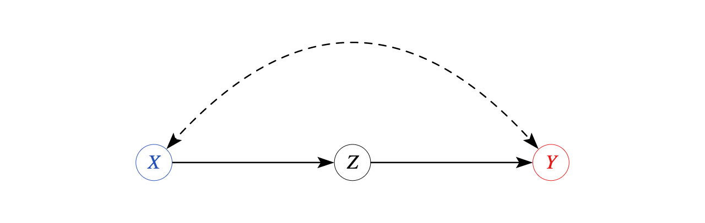

```{r,message=FALSE, warning=FALSE}
#Libraries for causal graphs
library(dagitty) #Identification
library(ggdag) #plotting
library(pcalg) #search
library(gridExtra) #Graph Display
```
```{r echo=FALSE, eval=FALSE}
- Overview: structural equations models and 1st law
- causal markov condition 
- forks, chains, colliders
  - conditioning on a collider: selection bias
  - examples: loss to follow-up
- d-separation
- do-calculus: laws and identification formulas
- backdoor criterion
  - Statement, proof
  - examples: toy (1 of each type), M-bias DAG, chain, post hoc ergo propter hoc, "post-treatment bias", table 2 fallacy
  - controlling for IVs: efficiency concerns (Henckel criterion), bias amplification
- Alternative identification strategies
  - They exist and can be found algorithmically
      - Example: frontdoor (mention sequential confounding)
  - They take your model extremely seriously: each missing edge deserves a paragraph in your paper
  - Unobserved variables 
    - Backdoor: restrict adjustment set to observed
    - Other strategies: represent explicitly using bidirected edges: MAGs, PAGs
  - Extensions that exist: adding assumptions other than independence. Selection. Linear. Discrete. etc. Mixed experimental/observational data, etc  
- Estimation
  - Linear models: Wright (1934): multiply edge weights
  - Nonlinear case: IPW principle is general: "marginal structural models". AIPW possible in many cases. Bounds analysis (Maathuis, etc)
- Building and testing your DAG
  - Imbens/Pearl/Abaluck debate: encode minimally plausible assumptions, ideally from (quasi-)experiments
  - Testable implications: can and should make sure proposed model not contradicted by data
  - Not-yet-testable implications: what does model say for real or hypothetical data you don't have
  - Taking it too far: causal discovery: prune space of DAGs by testing those implications
- Software
  - R: dagitty (identification), ggdag (plotting), pcalg (discovery)
  - Python: dowhy, ananke (identification, estimation)
  - online: dagitty, causalfusion (identification, estimation)
```

## Plans

- Structural equations models provide a complete framework for answering questions about observed, interventional, or counterfactual quantities
- Given a model definition, a characterization of distributions of variables as defined by the "solution" of that model, and characterization of causation as that distribution in a modified model, you can derive formulas for distribution of any observed or counterfactual quantity
- Given a quantity defined in terms of features of the causal model, **identification** corresponds to finding a formula in terms of observed quantities which is identical to the causal model quantity, or certifying that no such formula exists
    - E.g., causal quantity is ATE $E[Y^{X=x_1}-Y^{X=x_0}]$, identification formula is $\int (E[Y|X=x_1,Z=z]-E[Y|X=x_0,Z=z])dP(z)$
- Actually deriving the identification result may be challenging: search space can be large or infinite
  - For restricted model classes, relationships can be described by set of rules, via which search can be automated
  - This has been done comprehensively for acyclic Nonparametric Structural Equation Model with Independent Errors (NPSEM-IE)
  - Representable by a causal Directed Acyclic Graph or **DAG**
- Today: Brief summary of known identification results for DAGs
  - Model assumptions let you convert qualitative reasoning about which variables are related to which others and how into estimation formulas and observables implications
  - Will only reference extensions to models with weaker or stronger assumptions
- Most immediate payoff is a framework for reasoning about *conditional ignorability* $Y^x\perp X |Z$ called backdoor criterion
    - Highlights reasons why a regression may or may not recover a causal effect
- Secondarily, generate alternative estimation formulas and model tests
- Since methods automated, focus will be on interpreting assumptions and results, less on derivations

    <!-- - Code examples via R library `dagitty` @textor2016robust -->

## NPSEM-IE and DAGs, review  

- Endogenous variable $Y_1,Y_2,\ldots,Y_p$ described by Structural Equation Model
$$Y_1=f_1(Y_2,\ldots,Y_p,U_1)$$
$$Y_2=f_2(Y_1,Y_3,\ldots,Y_p,U_2)$$
$$\vdots$$
$$Y_p=f_p(Y_1,Y_2,\ldots,Y_{p-1},U_p)$$
- Exogenous $(U_1,\ldots,U_p)\sim\Pi_{j=1}^{p}F_j(u_j)$ mutually independent
- Variables $Y_1,\ldots,Y_j$ encoded as nodes $V$ in graph $G=(V,E)$
- Presence of $Y_j$ in $f_i$ indicates $Y_j$ *directly* affects $Y_i$
    - Encoded as edge $Y_j\to Y_i$ in $E\in V\times V$
- "Acyclic": no directed path (sequence of connected edges with common orientation) from a vertex to itself    
- "Nonparametric": graph topology encodes only presence or absence of connection  
- "Solve": Define $(Y_1,\ldots,Y_p)$ as unique values that solve system given $U$'s 
- "$do(Y_j=x)$": Replace $f_j$ by $x$, solve. New values are $(Y_1^{Y_j=x},\ldots, Y_{j-1}^{Y_j=x},x,Y_{j+1}^{Y_j=x},\ldots,Y_{p}^{Y_j=x})$


## Causal Markov Condition

- Solving an acyclic structural model gives joint distribution of endogenous variables
- What properties does the joint distribution have?
- **Causal Markov property**: A variable $Y_j$ is independent of any variable that is not a *descendant*, conditional on its parents
    - $Y_k$ is a **parent** of $Y_j$ if there is a directed edge from $Y_k$ to $Y_j$. $pa(Y_j)$ is the set of parents of $Y_j$ 
    - $Y_k$ is a **descendant** of $Y_j$ if there is a path along directed edges from $Y_j$ to $Y_k$
- Property completely defines implications of causal graph
    - Absence of an edge means conditional independence
- Implies that joint distribution *factorizes* according to topological order of graph  
  - $P(Y_1,\ldots,Y_p)=\Pi_jP(Y_j|pa(Y_j))$
- When intervening causally, $f_j$ is deleted but rest of structure, including distributions, remains the same
- Joint distribution given $do(Y_j=x)$ is $P(Y_1,\ldots,Y_p|do(Y_j=x))=(\delta_{Y_j=x})\Pi_{i\neq j}P(Y_i|pa(Y_i))$
  - $\delta_{Y_j=x}$ is point mass at $x$, every other part is unchanged 
- Ratio of $P(Y_1,\ldots,Y_p|do(Y_j=x))/P(Y_1,\ldots,Y_p)=\frac{\delta_{Y_j=x}}{P(Y_j|pa(Y_j))}$ immediately recovers Inverse Probability Weighting formula
  - IPW using parents is valid estimator for any causal effect
  
## Illustration: Adjustment Formula from Causal Markov

```{r, fig.height=3}
structuregraphs<-list()

confoundgraph<-dagify(Y~X+Z,X~Z) #create graph
#Set position of nodes 
  coords<-list(x=c(X = 0, Z = 1, Y = 2),y=c(X = 0, Z = -0.1, Y = 0)) 
  coords_df<-coords2df(coords)
  coordinates(confoundgraph)<-coords2list(coords_df)
structuregraphs[[1]]<-ggdag(confoundgraph)+theme_dag_blank()+labs(title="Confounding of effect of X on Y by Z") #Plot causal graph
perturbedgraph<-dagify(Y~x+Z) #create graph
#Set position of nodes 
  coords<-list(x=c(x = 0, Z = 1, Y = 2),y=c(x = 0, Z = -0.1, Y = 0)) 
  coords_df<-coords2df(coords)
  coordinates(perturbedgraph)<-coords2list(coords_df)
structuregraphs[[2]]<-ggdag(perturbedgraph)+theme_dag_blank()+labs(title="Perturbed Graph") #Plot causal graph
grid.arrange(grobs=structuregraphs,nrow=1,ncol=2) #Arrange In 1x2 grid
```

- Causal Markov property in perturbed graph implies
  - $Pr(Y=y,Z=z,X=x'|do(X=x))=$
  - $Pr(Y=y|Z=z,X=x',do(X=x))Pr(Z=z|do(X=x)) Pr(X=x'|do(X=x))$
- Using that conditional laws are unchanged in perturbed graph
  - $=Pr(Y=y|Z=z,X=x')Pr(Z=z)1\{x'=x\}$
- Object of interest $P(Y=y|do(X=x))=$
  - $\int\int Pr(Y=y,Z=z,X=x'|do(X=x))dzdx'$
- Substitute in to get adjustment formula: 
  - $P(Y=y|do(X=x))=\int Pr(Y=y|Z=z,X=x)Pr(Z=z)dz$

## Conditioning and d-separation

- When does conditioning on set of nodes $Z$ imply for two disjoint sets of nodes $X$, $Y$ that $X\perp Y|Z$?
- Depends on structure of *paths* between $X$, $Y$: sequence of connected edges, *not* necessarily oriented
- 3 nodes in a path can be linked in one of 3 ways: Fork, Chain, Collider

```{r, fig.height=3}
edgetypes<-list()
forkgraph<-dagify(Y~Z,X~Z) #create graph
#Set position of nodes 
  coords<-list(x=c(X = 0, Z = 1, Y = 2),y=c(X = 0, Z = 0, Y = 0)) 
  coords_df<-coords2df(coords)
  coordinates(forkgraph)<-coords2list(coords_df)
edgetypes[[1]]<-ggdag(forkgraph)+theme_dag_blank()+labs(title="Fork Structure") #Plot causal graph
chaingraph<-dagify(Y~Z,Z~X) #create graph
#Set position of nodes 
  coords<-list(x=c(X = 0, Z = 1, Y = 2),y=c(X = 0, Z = 0, Y = 0)) 
  coords_df<-coords2df(coords)
  coordinates(chaingraph)<-coords2list(coords_df)
edgetypes[[2]]<-ggdag(chaingraph)+theme_dag_blank()+labs(title="Chain Structure") #Plot causal graph
collidergraph<-dagify(Z~Y,Z~X) #create graph
#Set position of nodes 
  coords<-list(x=c(X = 0, Z = 1, Y = 2),y=c(X = 0, Z = 0, Y = 0)) 
  coords_df<-coords2df(coords)
  coordinates(collidergraph)<-coords2list(coords_df)
edgetypes[[3]]<-ggdag(collidergraph)+theme_dag_blank()+labs(title="Collider structure") #Plot causal graph
grid.arrange(grobs=edgetypes,nrow=3,ncol=1) #Arrange In 3x1 grid
```

- We say a (non-directed) path from $X_i$ to $Y_j$ is **blocked** by $Z$ if it contains either
    - A collider which is *not* in $Z$ and of which $Z$ is *not* a descendant
    - A non-collider which *is* in $Z$
- We say $X$ and $Y$ are **d-separated** (by $Z$) in graph $G$ (denoted $(X\perp Y |Z)_G$ if all paths in $G$ between $X$ and $Y$ are blocked
- **Theorem** (@pearl2009causality): $X\perp Y|Z$ (in all distributions consistent with $G$) if $X$ and $Y$ are d-separated by $Z$
  - Further, if $X$ and $Y$ are *not* d-separated, $X$ and $Y$ are dependent in at least one distribution compatible with the graph
  

## Colliders and Selection

- Conditioning on fork or chain breaks association along a path
- Having a common *consequence* (collider) does not create correlation between independent events
    - But knowing Y and common consequence Z, can infer about other causes X
- Among college students, those with rich family did not need high grades to get in.
    - Observing rich family, can infer that likelihood of high grades was lower
    - True even if in full population, grades and wealth independent 
-     
```{r,message=FALSE,warning=FALSE}
set.seed(123) #Reproduce same simulation each time
observations<-2000
grades<-rnorm(observations)
wealth<-rnorm(observations)
#Grades and wealth influence admission score
admitscore<-grades+wealth+0.3*rnorm(observations) 
#Admit top 10% of applicants by score
threshhold<-quantile(admitscore,0.9)
admission<-(admitscore > threshhold)

#Make plot of conditional and unconditional relationship
simdata<-data.frame(grades,wealth,admission)
ggplot(simdata)+geom_point(aes(x=wealth,y=grades,color=admission))+
  #Regress y on x with no controls
  #lm(grades~wealth)
  geom_smooth(aes(x=wealth,y=grades),method="lm",color="black")+
  #Regress y on x and w (with interaction)
  #lm(grades~wealth+admission+I(wealth*admission))
  geom_smooth(aes(x=wealth,y=grades,group=admission),method="lm",color="blue")+
  labs(title="Grades vs Wealth, with Admission as Collider",
          subtitle="Black Line: Unconditional. Blue Lines: Conditional on Admission")
```

##  Causal effects and their identification: do-calculus

- d-separation describes conditional independence *within* a single graph
- Relationships *between* observed and modified graphs, can apply small set of rules, called **do-calculus**
- Given a graph $G$ and disjoint sets of nodes $X$, $Z$ define:
  - $G_{\underline{X}}$: $G$ with all edges going *out of* $X$ deleted
  - $G_{\bar{X}}$: $G$ with all edges going *into* $X$ deleted
  - $G_{\underline{X}\bar{Z}}$: $G$ with all edges going out of $X$ and all edges going *into* $Z$ deleted
- For $X,Y,Z,W$ disjoint sets of nodes in DAG $G$, 3 rules of do-calculus
1. Insertion/deletion of observations: 
    - If $(Y\perp Z| X,W)_{G_{\bar{X}}}$, $P(Y|do(X=x),Z=z,W=w)=P(Y|do(X=x),W=w)$
2. Action/observation exchange
    - If $(Y\perp Z| X,W)_{G_{\bar{X}\underline{Z}}}$, $P(Y|do(X=x),do(Z=z),W=w)=P(Y|do(X=x),Z=z,W=w)$
3. Insertion/deletion of actions. 
    - Let $Z(W)$ be set of $Z$ that are not ancestors of $W$ in $G_{\bar{X}}$.
    - If $(Y\perp Z| X,W)_{G_{\bar{X}\bar{Z}(W)}}$, $P(Y|do(X=x),do(Z=z),W=w)=P(Y|do(X=x),W=w)$
- Roughly: (1) says d-separation gives conditional independence, (2) says doing $Z$ is same as seeing $Z$ if there are no unblocked "backdoor" paths into Z connecting it into $Y$, (3) says $Z$ has no effect if all paths out of $Z$ are blocked
- Repeated application of these rules to remove "do" from conditioning can fully characterize *any* identification claim based on causal graph 
  

## Backdoor Criterion

- Using d-separation, can define a complete criterion for when control recovers $P(Y|do(X=x))$
- A set of variables $Z$ satisfies **Backdoor Criterion** between $X$ and $Y$ if
    - No node in $Z$ is a descendant of $X$
    - $Z$ blocks every path between $X$ and $Y$ that contains an edge directed into $X$ (ie $(Y\perp X| Z)_{G_{\underline{X}}}$) 
- **Theorem** (@pearl2009causality): If $Z$ satisfies the backdoor criterion between $X$ and $Y$, the adjustment formula recovers the causal effect of $X$ on $Y$
$$P(Y|do(X=x))=\int P(Y|X=x,Z=z)P(Z=z)dz$$
- **Proof**: Via do-calculus
  - $P(Y|do(X=x))=\int P(Y|do(X=x),Z=z)P(Z=z|do(X=x))dz$ (L.I.E)
  - $=\int P(Y|do(X=x),Z=z)P(Z=z)dz$ (Rule 3, since $(Z\perp X)_{G_\bar{X}}$ since $Z$ contains no descendants of $X$)
  - $=\int P(Y|X=x,Z=z)P(Z=z)dz$ (Rule 2 since $(Y\perp X| Z)_{G_{\underline{X}}}$)
- For alternate proofs, see @pearl2009causality Ch 3.3 or 11.3   
  

## Backdoor criterion: intuition

- Blocking path component ensures that adjustment variables account for confounding by causes other than the cause of interest and do not introduce additional bias by inducing new correlations through colliders
- Non-descendant component avoids "bad controls" which are themselves affected by treatment
- d-separation or backdoor criterion hard to check "by hand"
- Point is that given a causal story, systematic method can recover whether control is sufficient
    - In `dagitty`, check backdoor criterion between $X$ and $Y$ by
```{r, eval=FALSE, class.source = 'fold-show'}
#Check if Z satisfies criterion
isAdjustmentSet(graphname,"Z",exposure="X",outcome="Y")
#Find variables that satisfy criterion, if they exist
adjustmentSets(graphname,exposure="X",outcome="Y") 
```


## Example: 1: Conditions for finding adjustment sets

```{r, fig.height=2.5}
examplegraph<-dagify(Y~A+C,B~X+Y,A~X,X~C,D~B) #create graph
#Set position of nodes 
  coords<-list(x=c(X = 0, A = 1, B = 1, C=1, Y=2, D=2),y=c(X = 0, A = 0.1, B=0, C=-0.1, Y = 0, D=0.1)) 
  coords_df<-coords2df(coords)
  coordinates(examplegraph)<-coords2list(coords_df)
ggdag(examplegraph)+theme_dag_blank()+labs(title="Example Graph") #Plot causal graph
```

- Education $X$ versus wages $Y$ to get intuition
- $A$ caused by $X$, causes $Y$: e.g., occupation, experience
    - Mediators: descendant of $X$, so do not adjust for it
- $B$ caused by both $X$ and $Y$: e.g., current wealth or lifestyle
    - Colliders: descendant of $X$, so do not adjust for it
- $D$ caused by $B$ only: e.g. consequences of wealth
    - Descendants of collider: still causes bias when adjusted for
- $C$, causes $X$ and $Y$: e.g. ability, background 
    - Confounder: must condition on it 
- Backdoor criterion calculates this automatically    
```{r, class.source = 'fold-show'}
adjustmentSets(examplegraph,exposure="X",outcome="Y")
```

## Example 2: Controlling for a descendant

```{r, fig.height=1.5}
mediatorgraph<-dagify(Y~Z,Z~X) #create graph
#Set position of nodes 
  coords<-list(x=c(X = 0, Z = 1, Y = 2),y=c(X = 0, Z = 0, Y = 0)) 
  coords_df<-coords2df(coords)
  coordinates(mediatorgraph)<-coords2list(coords_df)
ggdag(mediatorgraph)+theme_dag_blank()+labs(title="Mediator structure") #Plot causal graph
```

- The non-descendant part warns us that controlling for *consequences* may remove part of effect we want to measure
- Sometimes we have access to variables $Z$ called **mediators**
    - Caused by treatment $X$ and also affect outcome
    - Executioner shoots (X) Bullet hits (Z) Prisoner dies (Y)
- $P(Y|do(X=x))$ asks what is outcome when $X$ happens: $=P(Y|X=x)$
- $Z$ is correlated with $X$ and $Y$, but **don't** want to control for it
    - Adjustment formula gives 0 effect of $X$ on $Y$ if $Z$ controlled for
    - $\int P(Y|X,Z=z)P(z)dz=\int P(Y|Z=z)P(Z=z)dz=P(Y)\neq P(Y|do(X=x))$
- Conditional on being hit by a bullet, being shot at has no relationship with death
    - Changing $X$ does affect $Y$, but indirectly through $Z$
- Common example: $X$ protected attribute, $Y$ hiring/promotion/wages
    - Common to hear "the wage gap disappears if you control for..." (long list $Z_1,\ldots,Z_k$)
    - Common for that list to contain possible results of discrimination due to being in protected group $X$ (occupation, rank in company,...)

<!-- - Controlling for $Z$ will then at best measure component of discrimination      -->

## Aside: Well-defined or manipulable treatments

- Causal interpretation of discrimination controversial for another reason, that it's not always clear what it would mean to manipulate $X$
- Problem is that while recorded as categorical, group status (race, gender, religion,...) often a proxy for a *bundle* of attributes (@sen2016race)
- Different manipulations may alter some but not all parts of bundle
  - E.g. resume audit studies, per @bertrand2004emily measure effect of having name [Lakisha](https://www.youtube.com/watch?v=qdjiduJNwiY) instead of Emily on your resume, but not, say, replacing a person in one group with a (comparable?) person in another group
- Ambiguity may be reduced by including in model collection of attributes making up measured variable and relationships between them
    - Add nodes and arrows for name, accent, appearance, family history, etc
- Less fraught example: $BMI=weight/height$ can imagine changing by altering numerator or denominator. 
  - And within weight, altering number by diet, exercise, surgery, traveling to outer space, etc.
  - Each of these parts is a possible node, as are more detailed processes making them up
  - If full structure does not interact with other parts of causal graph, may be able to summarize by role of proxy node


## Example 3: M-bias: controlling for a collider

```{r,fig.height=2.5}
mgraph<-m_bias() #A common teaching example, so it has a canned command
ggdag(mgraph)+theme_dag_blank()+labs(title="Graph illustrating m-bias")
```
```{r}
adjustmentSets(mgraph,exposure="x",outcome="y",type="all")
```

- The "non-collider" qualification for d-separation shows a counterexample to claim that controlling for "pre-treatment" variables is safe
    - Conditioning on $m$ creates path between $x,y$ that are not causally linked otherwise, because their antecedents influence a shared outcome $m$ 
    - $m$ may come before or after x and y in time
- @ding2015adjust simulations show this bias is often small relative to omitting a confounder, since it is product of effects
- But useful to clarify that being "after" treatment is not only way for a control to be bad.

## Multiple causal effects: the table 2 Fallacy

- With linear adjustment, regression coefficient on $X$ interpretable as ATE
- What about other coefficients in regression?
- A coefficient is interpretable as causal effect if backdoor criterion holds with respect to all other variables
- Often, your treatment will be descendant of controls
- In that case backdoor holds for X given Z but not for Z given X 
    - $Y^x\perp X | Z$ but $Y^z \not \perp Z| X$
- Traditionally, main regression is Table 2 in paper (Table 1 is summary stats)
- Table 2 fallacy is to try to interpret every coefficient in this table as causally meaningful
    - Try to explain sign/magnitude of every coefficient with causal story
- Ubiquitous in papers 2+ decades ago, still common today
- Many papers now guard against this by only reporting main effect
    - Maybe good idea to put other coefficients in an appendix


## Example 4: Efficiency: Instrumental Variables and Nonconfounders

```{r, fig.height=3}
irrelevantgraph<-dagitty("dag{Y<-X; Y<-Z1; Y<-Z2; X<-Z2; X<-Z3; Z4}") #create graph
#Set position of nodes 
  coords<-list(x=c(X = 0, Z3 = 0, Z2 = 0.5, Z4 = 0.5, Z1=1, Y=1),y=c(X = 0, Z1 = 0.5, Z2 = 0.25, Z4=0.5, Z3=0.5, Y=0)) 
  coords_df<-coords2df(coords)
  coordinates(irrelevantgraph)<-coords2list(coords_df)
ggdag(irrelevantgraph)+theme_dag_blank()+labs(title="Graph with confounders and more",subtitle = "Z1 affects Y but not X, Z3 affects X not Y, Z2 affects both, Z4 irrelevant") #Plot causal graph
```
```{r, class.source = 'fold-show'}
adjustmentSets(irrelevantgraph,exposure="X",outcome="Y",type="all")
```

- What do we do if we have options? Here we only *need* to condition on $Z2$


## Efficiency vs robustness

- Efficiency: which controls produce low variance estimates?
  - In OLS, controlling for variables related to outcome but not treatment reduces residual variance
      - Always helps to include $Z1$
  - Controlling for variables related to treatment but not outcome reduces treatment variation, raises variance
      - Generally hurts to include $Z3$
  - Variables with no relationship ($Z4$) don't matter asymptotically but add noise in finite samples, raise dimension in nonparametric case 
  - In general graph, smallest variance described by @witte2020efficient (for regression or AIPW)
- Robustness: What happens if edge structure not right
  - In original graph safe to control for everything
  - If $Z1,Z3,Z4$ have edges added to make them confounders, not just safe but necessary
- @belloni2014inference "Double Selection": If doing variable selection (eg by Lasso) find Zs that predict $X$ and those that predict $Y$, include union in final regression
    - Sparsity: if $\#$ of irrelevant $Z$s large relative to $n$, need to get rid of them to have any hope
    - Double selection guards against missing edges in finite samples, which invalidates inference
    - R library `hdm` (@chernozhukov2016hdm)
- If some confounders are unobserved, no control strategy is consistent, but some worse than others
    - Controlling for instruments like $Z3$ may "amplify" bias
  

## Example 5: Chains

```{r, fig.height=2.5}
sequencegraph<-dagify(Y~X+Z1, Z1~Z2, Z2~Z3, X~Z3) #create graph
#Set position of nodes 
  coords<-list(x=c(X = 0, Z3 = 0, Z2 = 0.5, Z1=1, Y=1),y=c(X = 0, Z1 = 0.5, Z2 = 0.5, Z3=0.5, Y=0)) 
  coords_df<-coords2df(coords)
  coordinates(sequencegraph)<-coords2list(coords_df)
ggdag(sequencegraph)+theme_dag_blank()+labs(title="Graph with confounders in a chain") #Plot causal graph

```
```{r}
adjustmentSets(sequencegraph,exposure="X",outcome="Y",type="all")
```

- If a backdoor path is in sequential order (eg due to necessary sequencing), only need to condition on enough links to break the chain
- Which to control for?
  - If you only observe one link, just use that one: fine even if rest unobserved
  - If you observe many, choice again made based on robustness vs efficiency considerations

## Alternative identification strategies
 
- The adjustment formula and identification by backdoor are not only ways to estimate effects in a causal model   
- Alternative strategies exist and can be found algorithmically
    - do calculus gives rules for converting to a formula
- The algorithms take your model extremely seriously
    - Any missing edge implies a conditional independence relationship that can be exploited
    - Each missing edge deserves serious thought, and maybe a paragraph in your paper
    - But if believed, can use new methods
- Most formulas derived this way are bespoke to your application, often hard to interpret
- Some have simple enough form to be widely applicable
- Examples of the latter
    - Front door adjustment
    - Sequential confounding
    - Mediation formulas
- Postpone discussing last two, but illustrate concept with front door    


## Front Door criterion

{height=150px}

- Most prominent example of effect with identification formula derived algorithmically from graph
- Target is ATE of X on Y: not identified by adjustment due to latent confounder 
- Restore identification by observing *mediator* $Z$ with two properties
    - Conditional randomness: $Z$ conditionally random given $X$
    - Exclusion: $X$ has no direct effect on $Y$
- Justifying these takes work, but similar to IV criteria
  - @bellemare2020paper: $X$ opt in to share ride, $Z$ actually share (random based on Lyft availability), $Y$ Tip
- Formula is $P\left(Y|do(X)\right) = \sum_{Z}{P\left(Z \middle| X\right)\sum_{X'}{P\left(Y \middle| X',Z\right)P\left(X'\right)}}$
- Steps  
  - Regress $Y$ on $X,Z$ to get $Z$ effect (identified since X blocks backdoor) 
  - Regress $Z$ on $X$ to get $X$ effect (identified since $Z$ unconfounded)
  - Average Z effect over levels of $X$ to get $X$ effect (if linear, multiply Y on Z coefin step 1 by Z on X coef in 2)
- Derivation: Press a button at <https://causalfusion.net/> and it will even write the paper for you 
  
##  Adding assumptions to Structural Causal Models

- Researchers in this area actively working to characterize identification results for different settings
    - Adding assumptions beyond independence, like on functional forms, gives additional identifying restrictions 
- Linearity: @wright1934 originally introduced structural equations with all effects linear as "method of path analysis"
  - Causal effect along a directed path is product of edge weights
  - Total effect is sum of path specific effects
  - Additional effects become identifiable, e.g. via instrumental variables, or cases with cycles 
- Discrete: Very recently @duarte2021automated automate finding bounds on effects
- Multiple data sources, each with partially modified graph or set of observables
  - E.g., some data from experiment, some from surveys, some but not all edges or observables shared
  - @bareinboim2016causal, @hunermund2019causal characterize what's identified 

## Removing assumptions from Structural Causal Models 

- Work seeks to make setting less restrictive by eliminating assumptions
    - Partial observability, unknown edge orientation, selection
- With unobserved variables, may want identification based on DAG marginalized to only observables
    - "Mixed graph": Represent a link passing through a latent variable with *bidirected* edges $<->$
- Without experiments direction of edges (usually) not distinguishable based on observations alone
    - Additional edge types can represent equivalence classes with multiple possible directions
- We may also want to reason about conditional distribution 
    - Mainly because *selection* into our data set means we only have data conditional on selection variable
    - Medical case: effect of drug on blood pressure *conditional* on not being dead
    - Surveys/experiments: "loss to follow-up" outcome measure missing for people who can't/wont answer survey
    - Economic selection: only see grades for students who go to institution/take test, etc
    - Selection nodes encode variables determining selection into data
- Identification algorithms in these settings and more exist, and more settings every week    


```{r, fig.height=3, eval=FALSE}
confoundgraph<-dagify(Y~X+Z,X~Z) #create graph
latentconfoundedgraph<-toMAG(confoundgraph)

#Set position of nodes 
  coords<-list(x=c(X = 0, Z = 1, Y = 2),y=c(X = 0, Z = -0.1, Y = 0)) 
  coords_df<-coords2df(coords)
  coordinates(confoundgraph)<-coords2list(coords_df)
ggdag(confoundgraph)+theme_dag_blank()+labs(title="Confounding of effect of X on Y by Z") #Plot causal graph


```

## Estimation

- For adjustment, can use regression/IPW/AIPW estimators from last class
    - Backdoor tells you which variables to include in $Z$ to get conditional ignorability
- For other formulas generated by a DAG, need to come up with estimator associated with identification formula    
- Linear models: Path coefficients in linear SEM estimable by linear GMM, often OLS or 2SLS 
- IPW principle is general: estimate ratio of causal distribution to observed distribution and weight the sample average
  - "marginal structural models" minimize prediction error/maximize likelihood in inverse probability weighted sample
- AIPW type estimates are possible in many cases
  - @bhattacharya2020semiparametric derive such formulas for large class of estimands
  
##  Building and testing your DAG

- Warning: many economists are wary of or hostile to DAG approaches
    - @imbens2020potential provides clear exposition of this position
- Roughly, concern is that for credible effect estimation, you should only rely on a minimal set of plausible assumptions, ideally from (quasi-)experiments
    - DAGs make it easy to incorporate many more assumptions than are plausible in a given setting
- Solution to this: only rely on causal assumptions you believe
    - Allow hidden variables, edges of unknown direction, encode just the "credible" independence conditions in edges
    - May require using generalizations devised for exactly this: MAGs/PAGs/CPDAGs/ADMGs, etc
- Benefit of model is you can algorithmically derive testable implications
    - Can and should use these to make sure proposed model not contradicted by data
- Same machinery also lets you derive not-yet-testable implications 
    - What does model say for real or hypothetical data you don't have? (e.g., experiments)
    - Use this, along with priors to think about whether assumptions reasonable
- Systematic approach: start with fully solid assumptions, prune down space of possibilities by testing those testable implications    
    - Leads to causal discovery algorithms: PC, FCI, LiNGaM, NOTEARS, etc
    - Warning: many of these *start with* debatable assumptions like no hidden variables, linearity, or "faithfulness"
    - As a Catholic school graduate, I can point you to theology venues if you want to try to publish a paper relying on faithfulness

## Software

Library  |  Language |  Uses/features
--------------|-----------|----------------------------
[dagitty](http://www.dagitty.net/) | R, online | identification
ggdag         | R         | identification, plotting 
pcalg         | R         | discovery, estimation
[dowhy](https://microsoft.github.io/dowhy/)     | Python    | identification, estimation
[ananke](https://ananke.readthedocs.io/)        | Python    | identification, estimation
[causalfusion](https://causalfusion.net/)  | online    | identification, estimation, derivation


## Conclusion

- Structural causal models encode full descriptions of relationships between variables
- Represent by graphs, and use graphical criteria to reason about implications
  - Obtain conditional implications by d-separation
  - Derive identification formulas by *do-calculus*
- Determine whether conditioning measures causal effect by using *backdoor criterion*
  - Illustrates both when to control and when not to
- With full description, implications can be reduced to algorithms, so use software implementations
- Use model to encode assumptions that are believable, then derive implications to identify, test, and estimate
  


## References
