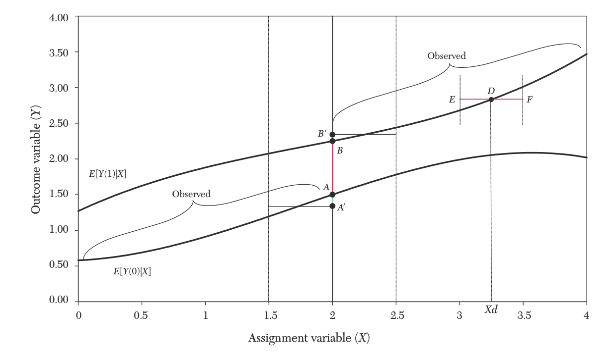
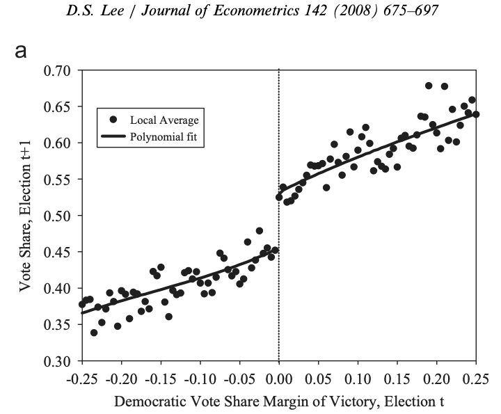
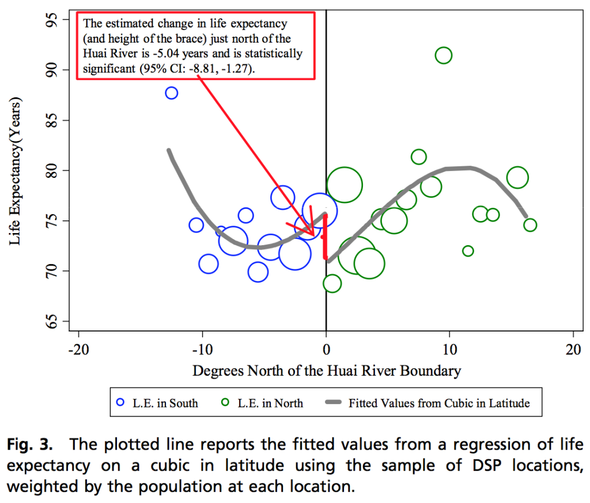
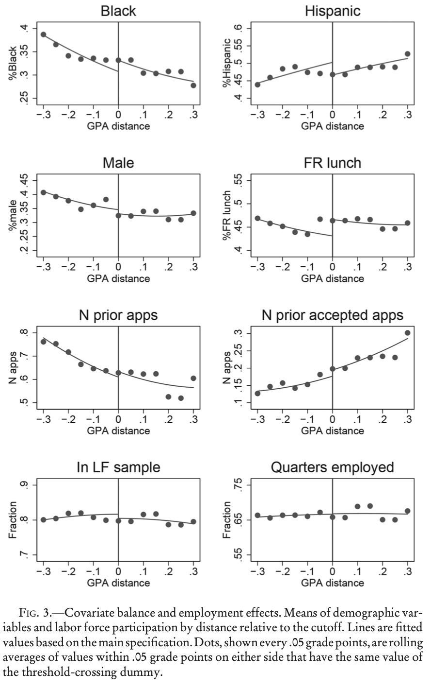
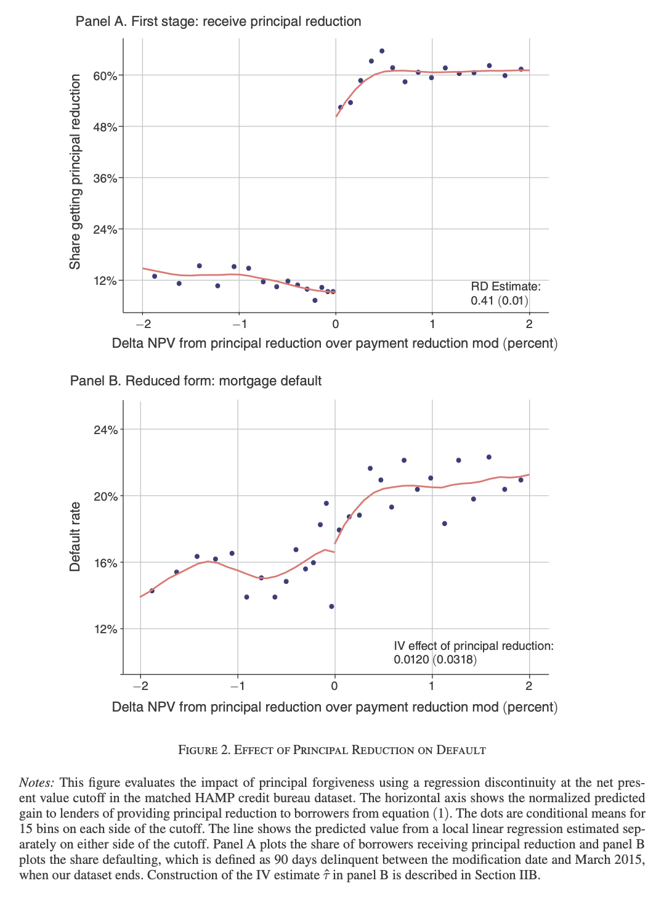
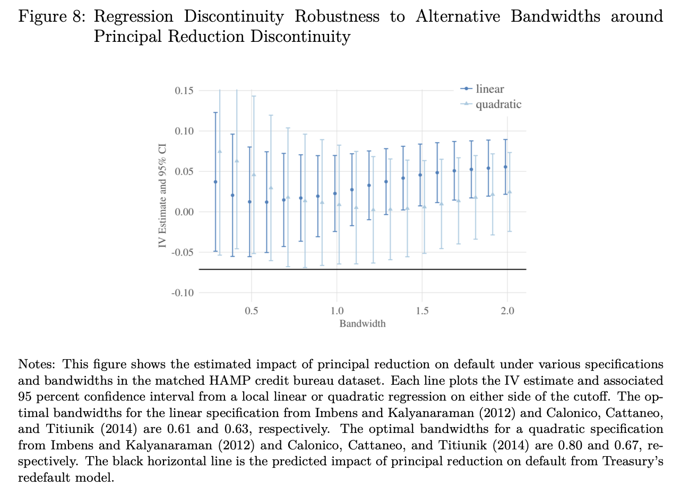

```{r,eval=FALSE,echo=FALSE}
- Setting
  - Continuity of potential outcomes functions
  - non-overlap
  - local randomization
  - Non-manipulation: examples, reasoning
- Estimators: Parametric RD, local poly, Other options: Bayesian nonparametrics, etc
- Local polynomial regression
  - Formulas,
  - tuning parameters
      - Bandwidth: optimal rates @imbens2012optimal when and why
      - Kernels
  - Choices: function spaces,  loss criteria
    - MSE and Bias Variance tradeoff
    - Inference/coverage
    - We all just decided that functions in real data have exactly 2 derivatives because that makes standard kernels optimal
    - Except Bayesians who decided $\infty$ is right because a squared exponential kernel is versatile and doesn't require knowing what a Bessel function is
- Visualization
  - RD plot
  - Binscatter as summary
  - Eyeballing it: pros and cons
      - Visual ability to distinguish slopes of curves from a scatterplot less precise than formal statistical estimates
      - But when jump is visually detectable, result is much more impactful and likely to be trusted
      - Clear visibility criterion prioritizes size over power: may "miss" results which are well-distinguished with data
      - This is arguably a feature, not a bug: to extent that statistical methods rely on manipulable choices, they may "go away" with alternate assumptions on bandwidth, order, etc, and a conservative criterion raises robustness to that
      - Visibility also allows assessing other features of data, like variability, curvature, degree of change in these features away from jump
      - Expresses visual check on tuning parameter choices (does data start to curve near or far from jump) and "placebo" check on what things look like without a jump
      - Visualization choices can impact how striking result appears: raw data very noisy, power low, parametric model very tight, doesn't provide extra checks. In between are undersmoothed methods with low bias: binscatter width interpolates.
      - Plot window including just area near cutoff (see it better) vs wider range (assess global properties)
      - "Default" is to plot parametric fit and binscatter, with some default bin width, on area wider than window, cut off only if wide X support obscures area near jump
        - may raise or lower this, but people may question your choice
      -
  - Features of an RD plot that indicate a questionable fit:
      - parametric curve deviating strongly from binscatter right near discontinuity:
        - Suggests extrapolation is doing a lot of work:
        - Especially bad with quadratic/cubic fits, which can extrapolate curvature from other part of the space to curvature even in another direction near the discontinuity
        - Part of reason why @gelman2019high suggest avoiding RD using higher order polynomials entirely
      - binscatter outliers right near the jump: suggests overfitting
- Inference
  - Generic impossibility: @bertanha2020impossible
  - Impossibility of (rate optimal) adaptivity @armstrong2018optimal
  - Minimax bound: honesty @armstrong2020simple
  - MSE vs coverage in local regression: @calonico2014robust when and why
  - Bayes: @branson2019nonparametric, warning on covariance kernel selection, Confidence vs credible, mutual singularity of GPs
- Extensions
  - Multidimensional RD: spatial discontinuity, aggregating effects
  - Covariates: additive separability
  - Discrete running variable
  - Donut hole RD
  - RD with inferred discontinuity location
  - Multiple cutoffs
  - extrapolation: via smoothness, or using covariates,
  - Fuzzy RD: This is IV, so show first stage, reduced form, infer compliers, etc
  - Difference in Discontinuity
  - Regression Kink
  - RD in abstract spaces: blind source separation
  - Calling any difference in means a regression discontinuity
- Tests
  - Covariate RDs
  - McCrary test and kernel density estimation
  - Placebo cutoffs
- Alternatives
  - Bunching @kleven2016bunching for when you do have manipulation
- Software
  - @calonicoRD rdrobust, @armstrong2020simple RDHonest
- Application
  - Use Lee (2008) as running example?
```

## Motivation

- **Regression discontinuity** (@thistlethwaite1960regression) is a conceptually simple way to leverage a common situation in real data 
- Treatment assignment is not haphazard or random but instead follows a strict and simple **rule**
- Bureaucracies, institutions, algorithms allocating a discrete resource systematically may make decision by a well-defined *threshold* 
  - Admission by standardized tests, Election by majority vote, Program eligibility by cutoff in income, assets, age, Drug recommendation by checklist (blood pressure, metabolites, etc)
- Key to using such thresholds is idea that they may be in some sense *arbitrary*
  - Criterion in rule usually based on something specifically chosen to be relevant to the outcome: blood pressure and drug effectiveness, test score and school performance, vote share and politician quality
  - But the exact *level* of threshold is less meaningful 
- Discrete nature of treatment (by simplicity or necessity) turns infinitesimal differences between units into large changes in treatment
- This contrast between *small* changes in unit attributes and *big* changes in treatment, makes units on either side "close to" comparable
- Requires assumptions on outcome process, but fairly weak ones
  - Just that "small" changes in assignment variable do not lead to "big" differences in units that would make them comparable except for treatment 
- Formalizing "small" and "big" is major practical challenge in using these methods
  - Applicability and form of analysis depends on quantifying these notions
- Statistical literature buries substantive assumptions about relative size and shape of effects in technical conditions and default behavior of easy-to-use software
  - Not their fault: need for precision requires jargon and mathematics, and defaults are sensible choices for typical social science applications 
  - But you should know what you're doing and why, and actively interrogate and test assumptions
  

## Problem Setup: (Sharp) Regression Discontinuity

- Goal is (a) causal effect of binary treatment $X$ on outcome $Y$
- Treatment assignment determined by a deterministic rule
- Continuous variable $R$ determines treatment $X$: called **running variable** or **assignment variable** 
- Units with $R\geq c$ get treatment $X=1$, units with $R<c$ don't $X=0$
    - **Assignment rule** $X=1\{R\geq c\}$
- Assume, as usual, **causal consistency**: $Y=Y^1X+Y^0(1-X)$
- By the assignment rule, $(Y^1,Y^0)\perp X|R$, trivially since conditional on $R$, $X$ is constant and so is independent of any other variable  
- But by deterministic rule, also case that $P(X=1|R=r)$ is 0 or 1 for all $w$
  - We cannot use $R$ to identify effect by adjustment: overlap fails by construction
- Additional assumption that will allow identification: **continuity** of conditional potential outcomes as functions of $R$ at $c$
  - $\underset{e\searrow 0}{\lim}E[Y^1|R=c+e]=E[Y^1|R=c]$, $\underset{e\searrow 0}{\lim}E[Y|R=c-e]$
  - Stronger versions possible, eg continuity of $F(Y^1|R=r)$, $F(Y^0|R=r)$
- **Regression discontinuity** $\tau^{RD}:=\underset{e\searrow 0}{\lim}E[Y|R=c+e]-\underset{e\searrow 0}{\lim}E[Y|R=c-e]$


## Identification

- Under consistency, assignment rule, and continuity of potential outcomes  
  - $\tau^{RD}:=E[Y^1-Y^0|R=c]$ Local Average Treatment Effect at the threshold
- **Proof**:  
  - $E[Y|R=r]=E[Y^1|R=r]1\{r\geq c\}+E[Y^0|R=r]1\{r<c\}$  (consistency and assignment rule) so
  - $\tau^{RD}=\underset{e\searrow 0}{\lim}E[Y^1|R=c+e]-\underset{e\searrow 0}{\lim}E[Y^0|R=c-e]$
  - $=E[Y^1|R=c]-E[Y^0|R=c]$ (continuity)
- @lee2010regression show visually

{width=70%}

## Intuition

- Estimated quantity is a treatment effect only conditional on being at the cutoff: marginal units only
  - May or may not be representative of effect at other levels of $R$: patients just barely sick enough to get drug, etc
  - Because conditioning group observable, can at least identify them and their attributes to see how they differ from other units
- Continuity says structural equation for $Y$ can depend on running variable, either directly or indirectly through associated confounders
  - But magnitude of effects, at least locally near the cutoff, can't jump in the way treatment does
- Bound on the degree of change in the outcome for small changes in $R$
  - Maybe biological mechanisms via which metabolite associated with disease severity involve proportionate changes 
- Especially reasonable when running variable is noisy or imperfect proxy for causally meaningful effects
  - Test scores proxy for academic ability, but 1 point difference mostly noise, and in any case "real" ability difference probably not large enough to be meaningful
- Unreasonable when other things change discontinuously at cutoff
  - Administrative borders: lots of laws, regulations, taxes change as soon as you enter an administrative unit
- A common reason for discontinuous changes at cutoff is that existence of cutoff itself influences behavior discontinuously
  - If people can control their $R$, and they care about whether they are treated, they might do so
  - To extent that preferences or ability to do this are heterogeneous, manipulation may induce differences in $Y^x$ on different sides of the jump
  - This makes discontinuities in, e.g. tax and welfare code, likely a bad fit for RD (though manipulation may itself be informative)
- If manipulation is imprecise, maybe not a problem: suppose units can only choose $r^*$ but $R=r^*+\epsilon$ for continuously distributed independent $\epsilon$
  - Then $E[Y^x|R=r]=\int\int y^xf(y^x|R=r,\epsilon=e)dy^xf_\epsilon(e)de=\int\int y^xf(y^x|r^*=u)f_\epsilon(r-u)dy^xdu$ which can be continuous in $r$ even if $f(y^x|r^*=u)$ is discontinuous
  - E.g., if people can study for a test, but not learn answers exactly, still preserve continuity (though this does affect properties of marginal group)

  

## Aside: Local randomization

- Sometimes see RD model/method analyzed and described in terms of "local randomization" (@CattaneoFrandsenTitiunik2015)
- Near cutoff, whether you are on one side or another is "effectively random" and you can treat data "as if" an experiment near the cutoff
- Formalization: $Y^{x,r}=Y^{x}$ for $r\in [\underline{c},\bar{c}]$ $\underline{c}<c<\bar{c}$  and $R\perp(Y^0,Y^1)|R\in [\underline{c},\bar{c}]$
- In this situation, **no** effect of or association of running variable with outcomes in a window
- This is *much stronger* assumption than continuity
  - Asks for potential outcomes functions to be *exactly flat* near the cutoff
  - Maybe plausible if assignment rule based on variable *not at all* important to outcome
- Aside from deliberate random assignment, I struggle to think of cases where applicable
  - But if you do have that, `rdlocrand` implements Fisher-style tests

## Estimation: Local regression

- Continuity is fairly weak notion formalizing small changes in $R$ leading to small changes in $Y^x$
  - For every $\epsilon>0$, $\exists \delta>0$ s.t. $d(r,c)<\delta\implies d(E[Y^x|R=r],E[Y^x|R=c])<\epsilon$
- So, to get $2\epsilon$-accurate estimate of $\tau^{RD}$, estimate conditional expectation functions for $r$ within $\delta$
- Simple implementation is to take window of width $\delta$ and estimate expectations by conditional means
    - $\widehat{\beta}_0^{-}=\frac{\sum_{i=1}^{n}Y_i1\{c-\delta<R_i<c\}}{\sum_{i=1}^{n}1\{c-\delta<R_i<c\}}$, $\widehat{\beta}_0^{+}=\frac{\sum_{i=1}^{n}Y_i1\{c\leq R_i<c+\delta\}}{\sum_{i=1}^{n}1\{c\leq R_i<c+\delta\}}$
    - $\widehat{\tau}^{RD}=\widehat{\beta}^{+}_0-\widehat{\beta}^{-}_0$
- By law of large numbers and continuity (so long as density in region $>0$), holding fixed $\delta$, 
  - $\widehat{\beta}_0^{-}\overset{p}{\to}\int E[Y|R=r]f(R=r|c-\delta<R<c)dr\in[E[Y^0|R=c]-\epsilon,E[Y^0|R=c]+\epsilon]$ 
  - Likewise for  $\widehat{\beta}_0^{+}$, so $\text{plim }\widehat{\tau}^{RD}$ is in $E[Y^1-Y^0|R=c]\pm2\epsilon$
- This gets called the local constant or Nadaraya-Watson estimator
- Not bad: for any $\epsilon$, we have estimator that converges to something $2\epsilon$ close to true effect
- Problem 1: continuity doesn't tell us anything about $\delta$ we need
  - Solution: need stronger conditions quantifying $\delta$: differentiability, smoothness
- Problem 2: would like to converge to exact value
  - Solution: shrink $\delta$ with sample size so that bias disappears
- Issue of what to assume about local response of conditional mean, and based on it, how much to shrink window, is main source of difficulty

## Estimation: Parametric Models

- What we actually need is an estimate of the conditional expectation function at a point
  - We can get this from any consistent estimator
- OLS consistent, unbiased estimate of a conditional expectation function if correctly specified
  - $y=\beta_0+\tau1\{R\geq c\} + \beta_1 R_i +u$: additive effect of treatment, linear in running variable
  - $y=\beta_0+\tau1\{R\geq c\} + \beta_1 (R_i-c)1\{R< c\}+\beta_2(R_i-c)1\{R\geq c\} +u$: additive effect of treatment, linear in running variable with different slopes
- Problem with this is that if incorrectly specified, all you get is best linear predictor
  - Average is with respect to integrated mean squared error over entire distribution of $R_i$
  - Goal is estimate of $\tau$, but estimator adjusts slope to get smaller errors in regions far away
  - Helpful to use this information if global shape known, as you can extrapolate from data anywhere in sample
  - But still optimizes the wrong criterion for prediction at a point
- Early attempts to solve this suggested adding polynomials to make shape more flexible and reduce bias
  - This is no longer recommended (@gelman2019high) due to potential to magnify bias
- With improved methods, parametric RD mainly relegated to situations where some nonstandard aspect of the analysis makes calculations with local methods difficult  
    
    
## A happy medium: Local Polynomials

- The tried and true estimator for nonparametric RD
  - Classical, easily interpretable, well-studied
- Idea: to estimate function near a point, use function estimation methods, but use only data near that point
- Choose a window around $x$ and run (weighted) regression in that window
- Account for slope and curvature and extrapolate locally by using polynomial of order $p$
  - $p=0$ is *local constant*, $p=1$ is *local linear*, $p=2$ is *local quadratic* 
  - $p=1$ most common choice for RD, default in a lot of software 
- Let $K(u)$ be a **kernel** function weighting points within window
  - Boxcar/Uniform: $K(u)=1\{|u|\leq1\}$, Triangular: $K(u)=\max\{0,(1-|u|)\}$, Epanechnikov: $K(u)=\max\{0,\frac{3}{4}(1-u^2)\}$
- Choose how spread out to make the average by adjusting bandwidth $h$ 
- (One-sided) local polynomial regression estimators of order $p$ with bandwidth $h$   
  - $\widehat{\beta}^{-}(r):=(\widehat{\beta}^{-}_0(r),\hat{\beta}^{-}_1(r),\ldots)=\underset{(\beta_0,\beta_1)}{\arg\min}\sum_{i=1}^{n}1\{R_i<c\}K(\frac{R_i-r}{h})(Y_i-\sum_{j=1}^{p}\beta_j(R_i-r)^j)^2$
  - $\widehat{\beta}^{+}(r):=(\widehat{\beta}^{+}_0(r),\hat{\beta}^{+}_1(r),\ldots)=\underset{(\beta_0,\beta_1)}{\arg\min}\sum_{i=1}^{n}1\{R_i\geq c\}K(\frac{R_i-r}{h})(Y_i-\sum_{j=1}^{p}\beta_j(R_i-r)^j)^2$
  - $\widehat{\tau}^{RD}=\widehat{\beta}^{+}_0(c)-\widehat{\beta}^{-}_0(c)$
- With uniform kernel, this is just regression in a window

## Tuning parameters 

- **bandwidth** $h$, **kernel** $k(.)$, polynomial **order** $p$
  - Hard part is how to pick these and why
- Various concerns, assumptions, tradeoffs make this difficult and context-dependent
- Plenty of work on "optimal" choices, all of which uses different criteria and makes different assumptions
- You have to decide which assumptions and goals are relevant to your setting
- Statistical criteria (bias, variance, coverage, interval width, robustness, etc) well-quantified
- You also want your work to be transparent, impactful, trusted, and trustworthy
- Visualization is crucial: plot should allow users to assess results and their quality
- Possibility of specification search favors methods which are conventional
  - Using "default" methods whenever possible: RD software often has fairly reasonable choices implemented, even if not exactly the ones you would have made
  - Have clear and convincing explanations for modifications to defaults based on features of your setting
  - Display results under range of plausible choices to demonstrate robustness
  
## Analysis: Rates

- An assumption under which local polynomial estimators are a good choice is differentiability
  - More specifically, the quality of approximation of a Taylor expansion of order $p$
- Heuristic argument: consider local linear regression with uniform kernel and bandwidth $h$
- Assume $E[Y|R=r]$ is twice differentiable with second derivative bounded
  - Taylor expansion is then $E[Y|R=r]=f(r)=f(c)+f^\prime(c)(r-c)+\frac{1}{2}f^{\prime\prime}(\tilde{r})(r-c)^2$ and $Y_i=f(R_i)+u_i$  
- Normalizing $c=0$ and letting $\vec{R}_i=(1,R_i,...,R_i^p)$
  - $\widehat{\beta}_0(r)=e_1^\prime(\sum_{i=1}^{n}K(\frac{R_i}{h})\vec{R}_i\vec{R}_i^\prime)^{-1}\sum_{i=1}^{n}K(\frac{R_i}{h})\vec{R}_iY_i$ $=\sum_{i=1}^{n}w(R_i,h)Y_i$ linear combination for some weight that doesn't depend on $Y$
- $E[E[\widehat{\beta}_0(0)|R]]-E[Y|R=0]=\frac{1}{2}E[\sum_{i=1}^{n}w(R_i,h)[f^{\prime\prime}(\tilde{R}_i)-f^{\prime\prime}(\tilde{r})]r^2]\leq Ch^2$
  - Because OLS is unbiased for linear functions and second derivatives and weights are bounded
- By uniform kernel and bandwidth $h$, density of $R$ bounded above and below in neighborhood of 0, number of observations given non-zero weight is proportional to $nh$ 
  - Since OLS has variance proportional to inverse of sample size, variance is proportional to $\frac{1}{nh}$   
- Mean squared error of estimate $E[\widehat{\beta}_0(0)-E[Y|R=0])^2]=$ $\text{Bias}(\widehat{\beta}_0(0))^2+Var(\widehat{\beta}_0(0))$ $\propto h^4+\frac{1}{nh}$
- Taking FOC to minimize yields $h\propto n^{-1/5}$ and MSE $\propto n^{-4/5}$: proportionality depends on kernel choice, $R$ distribution, smoothness bound 
  - Compare to correctly specified OLS, bias 0, variance = MSE $\propto n^{-1}$
- Can show this is optimal minimax rate for *Hölder class* $\Lambda^2(C)$ of functions with bounded second derivatives (@tsybakov2009introduction)
  - $\underset{\widehat{f}}{\inf}\underset{f\in\Lambda^2(C)}{\sup}MSE(\widehat{f},f)\propto n^{-4/5}$, so estimate is pretty good
  
## Implementation Choices

- As matter of practice, constant is unknown, so we can't choose optimal bandwidth
- Kernel also affects outcome, but enters into constant and not rate, so less important overall
- In this setting, for local linear regression estimator, @imbens2012optimal describe estimator for the constant term
  - Relies on preliminary higher order local polynomial to get higher derivatives, variance parameters, etc
- This is the default in most older RD software and still probably a tolerable default for point estimates
- Cross-validation with MSE criterion also feasible
- That said, why use method optimal for exactly 2 derivatives, instead of more or less?
  - Minimax MSE with $d$ derivatives $\propto n^{\frac{-2d}{2d+1}}$
- Probable reason: 2 derivatives is class for which local linear regression optimal
  - Procedure simple, transparent, visualizable, has connections to familiar OLS
- Higher order rates require methods with complications or drawbacks
  - Higher order kernels may have worrisome properties like some negative weights
  - Higher order polynomials may overextrapolate (though reducing bandwidth should help with this) 
- *Adaptive* estimators have serious advantage of achieving optimal rates without needing to know order
  - But methods appear complicated, computationally challenging, and since not widely used, lack reliable software implementations and communities of practice to address possibly unintended sources of fragility
- In practice you are expected to report sensitivity analyses to bandwidth, and maybe order of polynomial and/or choice of kernel anyway
  - If results are not that sensitive to choice, optimality probably not main concern  
  
## Inference

- If goal is inference rather than point estimation, criterion changes entirely and so do procedures
- MSE equalizes weight placed on variance and squared bias, while inference prioritizes coverage
- With MSE-optimal bandwidth, local linear estimator converges in distribution to a normal at rate $\sqrt{nh}$
  - $\sqrt{nh}(\widehat{\beta}(r)-E[Y|R=r])=\sqrt{nh}(\widehat{\beta}(r)-E[\widehat{\beta}(r)])+\sqrt{nh}(E[\widehat{\beta}(r)]-E[Y|R=r])$
  - Because bias term is size $h^2$ and optimal $h\propto n^{-1/5}$, scaled bias term is $O(1)$: doesn't disappear in large samples
  - Limiting normal distribution has non-zero mean!
- Given that bias is unknown, can't just rely on variance estimates
- Option 1: undersmoothing: choose smaller than MSE-optimal bandwidth $h=o(n^{-1/5})$
  - Bias term then asymptotically negligible, at cost of slower MSE overall
  - Intervals wider since $\sqrt{nh}$ scaling is slower if h is 
  - Asymptotically negligible doesn't mean ignorable in small samples: may have poor coverage
  - Bandwidth choice methods become inapplicable
- Option 2: use MSE-optimal bandwidth (as in @imbens2012optimal), but estimate and correct for for the bias term in CI
  - @calonico2014robust propose an estimate, but note that bias correction itself has variability
  - They therefore propose an adjusted variance estimator taking into account all terms
  - With implementation in `rdrobust` R/Stata libraries and extensive documentation and extensions, may be most popular and widely applicable default implementation
  
## Impossibility/Optimality of Inference

- Above inference procedures assumed local polynomial estimation and sufficient derivatives to estimate conditional expectation and its derivatives, to compute bandwidth and bias corrections
- How do assumptions relate to properties of inference?
  - May compare procedures by (expected) length of (valid) confidence intervals, or power of tests
- Under assumptions needed for identification of RD, **no** $1-\alpha$ confidence interval can have finite expected length (@bertanha2020impossible)
  - This is true even if we assume *infinitely* differentiable functions
  - Manifestation of fact that without quantifying size, impossible to distinguish a discontinuity from a continuous and smooth but arbitrarily fast change
  - Implication is that procedures like @calonico2014robust which estimate degree of smoothness must under-cover for some bad distributions in finite samples, even if for any fixed function they eventually converge
- Stronger model conditions can restore possibility of CIs with uniform coverage: an explicit upper bound on derivatives
- @armstrong2018optimal, @armstrong2020simple show that with upper bound $p^{th}$ derivative, can upper bound bias of local estimator over all functions in class obeying the bound, construct critical values which provide $1-\alpha$ coverage even in worst case
  - If $\widehat{\tau}^{RD}$ has worst case bias $B(\widehat{\tau}^{RD})$ over class $\mathcal{F}_M$, and standard error $\widehat{se}(\hat{\tau}^{RD})$, CI is  $\widehat{\tau}^{RD}\pm cv_\alpha(B(\widehat{\tau}^{RD}/\widehat{se}(\hat{\tau}^{RD}))(\widehat{se}(\hat{\tau}^{RD}))$ where $cv_\alpha(b)$ is critical value of $|N(b,1)|$ distribution
  - Derive max bias for function classes such as assuming slope near cutoff bounded by $M$, or that $|f(r)-f(c)-f^\prime(c)|\leq \frac{M}{2}(r-c)^2$ for local linear with some choice of kernel and bandwidth, and other weighting estimators
  - You provide your intuition on how large slope/curvature could be in worst case
  - Show that optimal choices for CI length, power, MSE, all fairly similar in worst case, and little scope for improvement by adapting 
  - Implemented in R library `RDHonest`
  
## Alternate Perspective: Bayes

- Bayesian estimation provides a way to express substantive knowledge about features of model in terms of average case properties instead of worst case belief
  - Express these as a *prior distribution* over functions on either side of cutoff
- To allow flexible shape with values near cutoff informed mainly by local data, use nonparametric prior like **Gaussian Process** (@williams2006gaussian)
  - Belief about conditional mean at any points $r_1,r_2,...$ is multivariate Gaussian, with covariance based on distance
  - Choices of covariance can express beliefs about smoothness and degree of information sharing
- @branson2019nonparametric describe implementation and properties for use in RD
- Uncertainty expressed as posterior distribution not same as a confidence interval, though can sometimes be shown to converge (@van2008rates)
- Properties encoded by prior (and likelihood) for shape of function may be subtle, so simulate to make sure prior focuses on plausible shapes
- Not widely used but probably should be...
  
  
## Visualization

- All RD estimates should be accompanied by a plot showing function estimates on both sides of the cutoff
- Include both local estimate and function estimates away from the cutoff, as well as intervals if possible
- In sparse data settings, these should overlay a scatterplot of $(R_i,Y_i)$ values to allow comparison of fit to raw data
- With larger sample sizes, may be hard to see much in data, so overlay **binscatter** instead (@cattaneo2021binscatter)
  - Within narrow $R$ bins, compute average $Y$ value, plot for each bin, with width defined by levels or quantiles of $R$
  - Usable as nonparametric estimator, but goal is a low-bias high-variance guide to patterns in data, so choose narrow bins that exhibit variability
- Example from @lee2008randomized study of incumbency effect on re-election

{width=70%}  
  

  
## Eyeballing it: pros and cons 

- Visual ability to distinguish slopes of curves from a scatterplot less precise than formal statistical estimates
- But when jump is visually detectable, result is much more impactful and likely to be trusted
- Clear visibility criterion prioritizes size over power: may "miss" results which are well-distinguished with data
- This is arguably a feature, not a bug: to extent that statistical methods rely on manipulable choices, they may "go away" with alternate assumptions on bandwidth, order, etc, and a conservative criterion raises robustness to that
- Visibility also allows assessing other features of data, like variability, curvature, degree of change in these features away from jump
- Expresses visual check on tuning parameter choices (does data start to curve near or far from jump) and "placebo" check on what things look like without a jump 
- Visualization choices can impact how striking result appears: raw data very noisy, power low, parametric model very tight, doesn't provide extra checks. In between are undersmoothed methods with low bias: binscatter width interpolates.
- Plot window including just area near cutoff (see it better) vs wider range (assess global properties)
- "Default" is to plot parametric fit and binscatter, with some default bin width, on area wider than window, cut off only if wide R support obscures area near jump
    - May raise or lower this, but people may question your choice


## Features of an RD plot that indicate a questionable fit

- Binscatter outliers right near the jump: suggests overfitting 
- Parametric curve deviating strongly from binscatter right near discontinuity: 
    - Suggests extrapolation is doing a lot of work: 
    - Especially bad with quadratic/cubic fits, which can extrapolate curvature from other part of the space to curvature even in another direction near the discontinuity
    - Part of reason why @gelman2019high suggest avoiding RD using higher order polynomials entirely
- [Gelman](https://statmodeling.stat.columbia.edu/2019/06/25/another-regression-discontinuity-disaster-and-what-can-we-learn-from-it/) referred to following RD estimate of air pollution on mortality using geographic border where regulations change as a "regression discontinuity disaster"
  - Your goal as an applied researcher is to make sure your work is never highlighted on Gelman's blog...
  
{width=70%}     

## Comparison of methods: Lee (2008) Incumbency Effect 

```{r,results="hide"}
#Load RD package containing Lee (2008) incumbency data 
suppressWarnings(suppressMessages(library(rddtools)))
data(house) #Lee data
#Load another package for RD estimation
suppressWarnings(suppressMessages(library(rdrobust))) #Calonic0 2014 robust CIs
suppressWarnings(suppressMessages(library(RDHonest))) #Arstrong Kolesar robust CIs
# Specify x, y, and cutpoint = 0 Dem-Rep vote share
house_rdd<-rdd_data(y=house$y,x=house$x,cutpoint=0)
# Specify same for format of RDHonest package
LEEframe<-data.frame(y=house$y,x=house$x)
```
```{r,class.source = 'fold-show'}
# OLS estimate in rddtools library, linear with different slope on each side
(reg_para <- rdd_reg_lm(rdd_object=house_rdd))
```

```{r,class.source = 'fold-show'}
#Estimate MSE- optimal bandwidth on Lee data by Imbens-Kalyanaraman procedure
LEEbw<-rdd_bw_ik(house_rdd)
# Local linear RD estimate, different slope on each side
(LEEnp<-rdd_reg_np(rdd_object=house_rdd,bw=LEEbw))
```

```{r,class.source = 'fold-show'}
# Calonico Cattaneo Titiunik bias corrected estimates and CIs
summary(rdrobust(y=house$y,x=house$x,c=0,all = TRUE))
```  
 
```{r,class.source = 'fold-show'}
## RD plot with bin-scatter and global quartic polynomial estimates
rdplot(y=house$y,x=house$x,c=0,masspoints="off")
```
```{r,class.source = 'fold-show'}
# Armstrong-Kolesar CI with bound M of 0.4 on second derivative (sclass T),
# bandwidth optimized for smallest "Fixed Length Confidence Interval" 
RDHonest(y~x,data=LEEframe,kern="triangular",M=0.4,opt.criterion = "FLCI",sclass="T")
```

## Tests and Diagnostics

- Can rerun estimate with "placebo" cutoffs to show size of jump not just due to properties of function
  - Visually, this is what inspection of (bin-)scatter plot is allowing you to assess
- Should run several bandwidths/specifications and present estimates side by side in plot/table 
- As analog to balance test showing nothing substantial changes at boundary, you should do RD estimates for baseline covariates to make sure nothing substantial changes at boundary
  - Example balance plots from @zimmerman2014returns from test score discontinuity for college admission show little difference between attributes of students marginally passing and not 
  
{width=70%}


## Density Estimation and Manipulation Test 

- Estimate density locally by **kernel density estimator**: for each $r$, use (weighted) proportion of $R_i$'s in $h$ neighborhood of $x$
  - $\hat{f}(r)=\frac{1}{nh}\sum_{i=1}^{n}K(\frac{R_i-r}{h})$
- Compare **Histogram**: uses proportion over *fixed*, not rolling neighborhood
- Use jump in density of $X$ at c as test for manipulation: @mccrary2008manipulation test in most RD packages
    - If jump at cutoff, suggests some units were able to move to just below/above cutoff
- When you do have manipulation, sometimes density difference is informative
  - Bunching estimators (@kleven2016bunching) use magnitude of density difference to measure elasticity of response to incentive provided by discontinuity or kink
  - Especially common with taxes, which kink or jump at bracket boundaries

```{r}
#Run McCrary test 
# Estimates density left and right of cutoff
# null is no difference in density
LEEtest<-dens_test(LEEnp,plot=FALSE)
pvalue<-LEEtest[2] #get p value 
```
  
- Example: @lee2008randomized RD study looks fine on density difference: can't reject density same on left/right (p=`r round(pvalue$p.value, digits=4)`)

```{r}
#Run McCrary test
# Estimates density left and right of cutoff
# null is no difference in density
dens_test(LEEnp)
```


## Fuzzy Regression Discontinuity

- RD can be used to replace random assignment of a treatment in other research designs
- Sometimes above and below cutoff units only treated with some probability
- Instead of $X=1\{R\geq c\}$ have $Pr(X=1|R\geq c)>Pr(X=1|R< c)$
- Sharp jump in probability, but not perfect assignment
  - E.g. Test score > c gives admission to school but not everyone chooses to accept
- Formally identical to Instrumental Variables
    - Discontinuity in $R$ acts as instrument for $X$
- Recall Univariate IV: $\tau^{IV}=\frac{\rho}{\phi}$
   - Reduced form $\rho$ causal effect of instrument on outcome $Y$
   - First stage $\phi$ causal effect of instrument on treatment $X$
- Both can be estimated by RD using standard estimators
$\tau^{Fuzzy}=\frac{\underset{e\searrow 0}{\lim}E[Y|R=c+e]-\underset{e\searrow 0}{\lim}E[Y|R=c-e]}{\underset{e\searrow 0}{\lim}E[X|R=c+e]-\underset{e\searrow 0}{\lim}E[X|R=c-e]}$
- Exclusion and ignorability of running variable get close to exact as $R$ approaches $c$, in the absence of discontinuous direct effects, confounding, or manipulation
- Relevance holds if jump increases probability of treatment $R$
- Can interpret as LATE if monotonicity holds

## Fuzzy RD: Example

-  @ganongnoel2020 use administrative scoring rule for HAMP determining which mortgages eligible for principal reduction to measure effects on default
  - Not all eligible mortgage contracts adjusted, so fuzzy RD, though many were so first stage strong
  - Plot of first stage and reduced form shows many adjustments, tiny change in defaults, and so can see "at a glance" IV estimate must be small
  
{width=70%} 

## Bandwidth choice for Fuzzy Regression Discontinuity

- Since fuzzy RD is ratio of 2 standard RDs, same principles apply
- Minor adjustment: may keep reduced form and first stage bandwidth identical for simplicity, interpretability
- Precise level may adjust based on MSE/coverage criteria for ratio rather than individually: defaults implemented in software
- Possibility of weak IV complicates things when first stage effect small
  - Reduced form as simple weak-IV robust test means showing analyses for this helpful
  - Can do Anderson-Rubin test inversion CIs for formal inference

{width=80%}

## Extensions and Alternatives

- Multidimensional RD
  - May have spatial discontinuity, or multi-criterion rule 
  - Apply multivariate local regression, aggregate local effects along boundary
- Covariates
  - Adding covariates not needed under continuity, and can be challenging due to slower rates for nonparametric regression
  - As with experiments, can add linear term in baseline ovariates to improve efficiency
- Discrete running variables
  - Sometimes, like with "years of age", $R_i$ may not have values right next to $c$
  - If difference if small relative to a bandwidth choice, can still perform inference
- Donut hole RD
  - If region right by border has some systematic differences, may cut nearby area out and use only further parts as comparison
- RD with inferred discontinuity location
  - Adds measurement error: should avoid using treatment to infer to prevent mechanical correlations
- Multiple cutoffs and extrapolation
  - A single RD measures treatments for one fixed group, but if you have many, you can compare 
  - Assuming some smoothness between jumps, or using covariates, can measure associations to predict treatment effect for others
- Difference in Discontinuity
  - Just like DiD, except comparison is an RD, using pre-period as placebo check or to account for jumps at border
- Regression Kink: slope instead of level changes at $c$
  - Local linear and higher estimators let you measure change in slope from $\widehat{\beta}_1$ coefficient
- Calling any difference in means a regression discontinuity
  - If you don't have panel data or an experiment, call your comparison of geographically adjacent regions a "border discontinuity" or your before-after comparison a "regression discontinuity in time"
  - It doesn't make those study designs any better, but maybe somebody will buy it 
 

## Conclusions

- Be on the lookout for threshold assignment rules
- If units can't control what side they are on, can use it to measure effect of assignment
  - And if they can you might measure an elasticity
- Sophisticated nonparametric tools exist for estimation and inference
- But nobody will believe you unless you also show them a convincing plot

## References