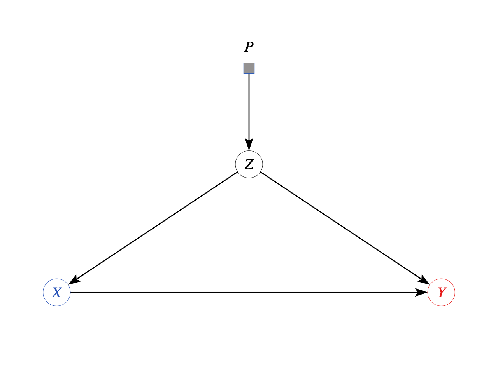
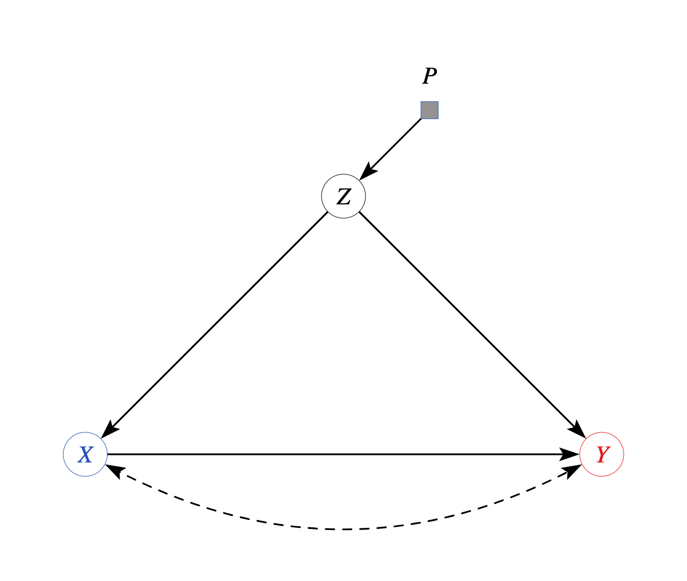
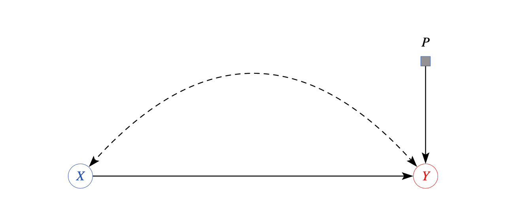
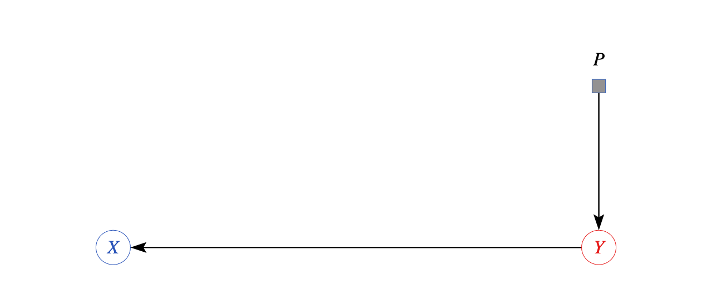
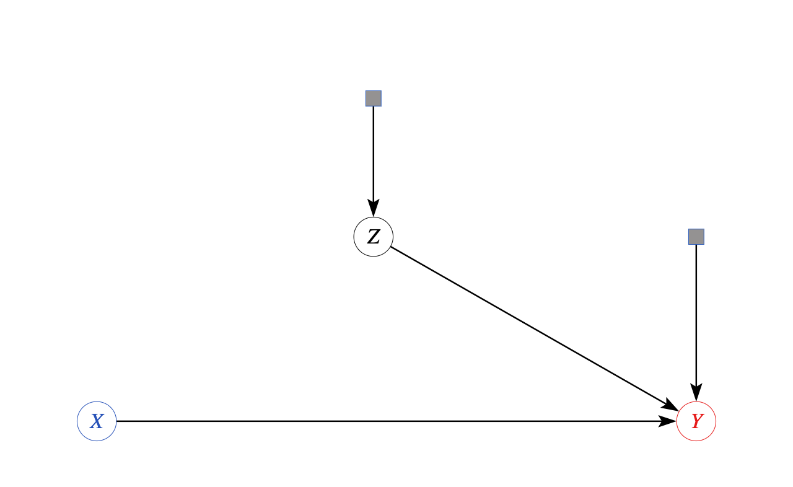
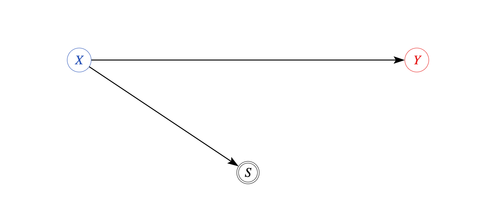
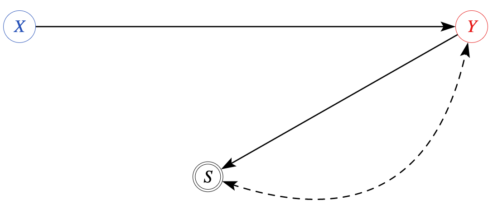
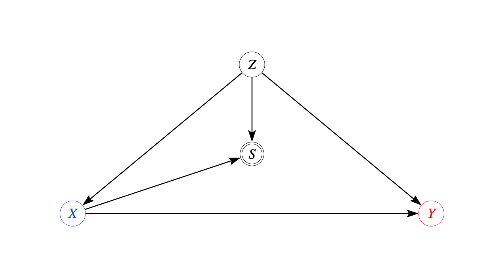
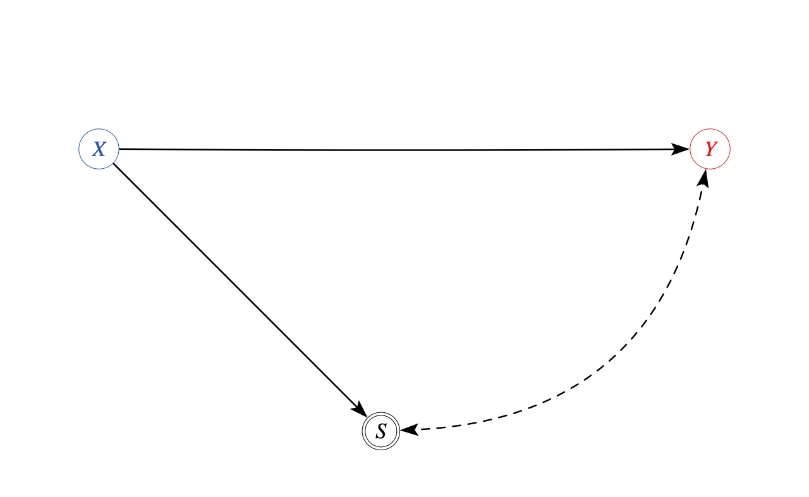

```{r,eval=FALSE,echo=FALSE}
- Motivation:
  - We use a causal inference method to calculate an effect or optimal policy
  - We then go and do the the same action, and results are not what we measured?
  - Happens all the time in prediction, decision problems
  - What went wrong?  Several possible things may have changed
- Generalization: extrapolating effects from sample to population (respectively, new sample from same distribution)
  - Generalization inequality: uniform bound. 
- "Distribution Shift": extrapolating from one distribution to another distribution
  - For causal effect, care about *external validity*: extrapolating from data described by one causal model to data described by another
- Huge set of possible changes
  - Sample selection: model both process of relationships between variables and also process by which observations chosen for your data set
- Generalize structural causal model
  - Selection nodes: variable that determines whether a particular sample gets observed
- More general framework: data fusion @hunermund2019causal, @bareinboim2016causal  
  - Combination of multiple data sets
- Example selection processes
- Selection based on treatment, $P(Y|X)$, $P(Y|do(X))$ backdoor formula with selection (bareinboim pearl 2014, earlier?)
  - conditional on $Z$ $X$, $Y$ d-separated from $S$
  - Estimation: selection adjustment formula, Multilevel Regression and post-stratification, double robust (@bia2021double)
- Selection based on outcome/confounded with outcome "Case control studies"
  - Not nonparametrically identified
  - Examples: Loss to followup, censoring by death, wages by employment status, etc
- Solutions under stronger/different assumptions
  - "Anti-causal" "label shift" prediction setting. Goal is to predict $Y$ from $X$, but actually $Y$ causes $X$ (Lipton papers) 
    - (Example: diagnosis: diseases cause symptoms, but want to predict based on latter, in setting where disease prevalence shifts.)
  - "Rare disease" assumption: $P(Y|X)\approx 0$ either way: may approximate relative risk
- Heckit-style (@heckman1979sample) approach to problem: assume $X$ always observable, $Y$ sometimes observable 
  - Take trick from IV case and restrict attention to subpopulation, also add assumptions
  - @lee2009training / @semenova2021generalized bounds: restrict to "always takers", add monotonicity: still only get bounds
  - Related to "Principal stratification" idea
  - Heckman selection: add functional form assumptions: linear, gaussian, homogeneous, independent, etc
  - "Effect of Prayer on God's Attitude Towards Mankind" (@heckman2010effect) don't need *any* outcome data at all if willing to assume all that
  - Get rid of Gaussianity, linearity, keep homogeneity: control function approach
  - Get rid of homogeneity: get effect for S=1
- Misc estimation issues with Combination of multiple data sets?
- Applications: site/experiment selection bias, publication bias, metanalysis @meager2019understanding, new meager paper?
- Software: `causalweight`, Lee bound code?
```

  
## Going beyond the data you have

- Causal inference methods studied so far are about learning features of a model from data
  - Given model and data source, identify and estimate causal effect
- Usually want to apply these insights and policies beyond the study population
  - New people, new places, new times, new contexts
- Scenario of concern
  - We use a causal inference method to calculate an effect or optimal policy
  - We then go and do the same action outside of study context, and results are not what we measured
  - Happens all the time in prediction, decision problems
- Examples
  - You run a behavioral experiment in lab, find a strong result, and then another lab does the same experiment and finds nothing
  - You test a program in an RCT in one province, and then other provinces or the federal government implements it too, with different results
  - You find a pricing factor that generates substantial excess returns in backtests, start a hedge fund, and immediately underperform the market 
- What went wrong?  Several possible things may have changed 
  - Your new setting may be identical *in distribution* to the old one, but your estimate may not reflect properties of that distribution
    - This is the problem of **generalization**
  - Your new setting may have different attributes describable by changes in (parts of) distribution and causal model
    - This is the problem of **external validity** or **transportation** of causal effects
  - The process via which you observed the data may have led to systematic differences in observed sampling distribution and population distribution
    - This is the problem of **sample selection**
- For each problem, will provide a brief overview of formal characterizations of the problem and proposed strategies to mitigate or resolve the issue
  
## Generalization

- The most straightforwardly statistical issue to handle when taking results beyond a single study
  - Extrapolating effects from sample to population, or respectively, a new sample from same distribution
- If taking statistical decision theory perspective, performance of estimator or policy $\widehat{x}()$ is measured by *risk* $R_{\theta}(\widehat{x})=E_{p_\theta}[\ell(\widehat{x}())]$ 
  - Expectation of loss with respect to (unknown) distribution $p_{\theta}$ of new samples from population
- *Empirical risk* approximation uses expectation of (an estimate of) loss with respect to sample distribution $\widehat{R}(\widehat{x})=\frac{1}{n}\sum_{i=1}^{n}\ell_i(\widehat{x}())$ 
  - Same samples used to estimate $\widehat{x}$ are used to evaluate it
- Empirical risk minimization operates on principle of minimizing this approximation error in sample, so empirical performance may not reflect population performance
  - Other extremum estimators may optimize proxies for this risk
- Difference between these two, $\widehat{R}(\widehat{x})-R_{\theta}(\widehat{x})$ is called the *generalization gap* 
- @hardtrecht2021 Ch 6 provides overview of modern machine learning perspective on quantitative bounds on generalization
- Basic ones start by bounding uniform error over class of methods $\mathcal{F}$ containing $\widehat{x}()$, $\underset{x\in\mathcal{F}}{\sup}|\widehat{R}(x)-R_{\theta}(x)|$
  - Bound either expectation or probability of deviation with respect to sampling distribution of data generating $\widehat{R}$: $\sup_{\theta}P_\theta(\underset{x\in\mathcal{F}}{\sup}|\widehat{R}(x)-R_{\theta}(x)|<\epsilon)\geq1-\delta$
  - Quantitative upper bound $\epsilon$ decreasing in sample size $n$ and increasing in (some measure of) complexity of class $\mathcal{F}$
- Implication is that searching over a large space of models, especially in small samples, may lead to overly optimistic view of quality of estimates
  - Restriction to small parametric models is one way to guarantee these conditions
- More modern generalization inequalities apply more fine control, based not only on set of models that might have been used, but also procedure/algorithm used to find them
  - Important for understanding complex procedures that nevertheless manage to do well, like neural networks, though uniform error measures sufficiently accurate for smaller problems

## Improving generalization

- Quantitative measures of generalization gap show that improving performance in new samples not always best served by improving performance in data at hand
- Instead, may be useful to adjust model or method to improve generalization even at cost of sample performance
- Methods designed for this purpose are referred to, broadly, as **regularization**
  - May restrict complexity by constraining model choice to smaller set or, equivalently by KKT, adding Lagrange multiplier to optimization problem
  - May specify algorithm which need not return exact global optimum
- May *measure* overfitting by calculating loss in held-out data set not used for estimate (or cross-validate, which uses multiple holdout sets)
  - If used to choose among procedures (eg fitting regularization parameters), need to analyze whole procedure jointly to measure bias in new data
- Target parameter of interest (unlike nuisance parameters) in causal models rarely of sufficient complexity to need more than uniform bounds which hold without regularization
  - @chernozhukov2018dml Double ML analysis requires estimand which is effectively parametric, avoiding need for regularization (condition 3.3)
  - See @mbakop2021model for regularization in policy optimization problem, and @foster2020orthogonal for general theory of regularized optimization over Neyman orthogonal criterion function 
- Nevertheless, *replication experiments*, which act as unbiased holdout sample, often show substantial difference from original estimated effects
  - Even occurs with intensive effort to avoid systematic differences across experimental sample and design 
- Simple reason: actual procedure used to produce estimate more complicated than model class used suggests
  - Error guarantees based on assumption that procedure is chosen, then data gathered, not the other way around
  - **Adaptive** data analysis, which sequentially updates queries in response to data, grows effective size of model space/number of tested hypotheses exponentially, even with a linear number of executed tests (@dwork2015preserving)
  - Real problem for method of plotting data, trying different functional forms and subsets, working until you make a "discovery"
- While many ingenious schemes exist for avoiding overfitting and adaptivity, if your data is big enough, holding out a fraction of it and keeping it locked away until rerun your code at time of publication is very simple and won't increase error by more than a constant factor...   


<!-- - Upshot is that while non-interactive analysis has generalization error lower bound in terms of complexity measure like VC dimension (@mohri2018foundations), with interactivity have a much tighter constraint, in terms of the (strictly larger) Littlestone dimension  -->
<!-- - Inequalities, complexity bounds -->
<!-- - Holdout set, cross-validation -->
<!-- - Regularization: trade off in sample vs out of sample fit -->

## External validity

- Professional incentives to justify validity of own findings as well as tendency to see patterns in noise (pareidolia) suggest strong tendency to misattribute failures of generalization to systematic differences
- Excuses I've heard which provoked some skepticism...
  - You just didn't have the skill to re-run laboratory protocol precisely
  - Of course this behavioral bias (originally claimed to be a universal feature of cognition) will show up in undergrads at institution A but not at institution B right next door, because their students have a different attitude
  - My factor really did generate alpha until other people found out about the strategy and traded it away
- But there *are* in fact measurable differences across settings where one might like to apply a finding
- To even evaluate whether such claims are plausible, need a framework for modeling and measuring these differences
- "Distribution Shift": case where data is drawn from one probability distribution and evaluation is in population with another probability distribution
- For causal effect, care about extrapolating from data described by one causal model $M$ to data described by another $M^*$
  - Differences in causal model parameters may induce differences in distribution of observed and/or counterfactual outcomes
- A functional of a causal model which takes the same value in both distributions is said to be **externally valid**
  - This allows systematic differences so long as the functional of interest does not depend on them
- Letting, e.g., $\theta=E[Y|do(X=x)]$ and $\theta^*=E^*[Y|do(X=x)]$ be parameter values in $M$ and $M^*$, respectively, if $\theta$ is identified in $M$ and $\theta=\theta^*$, estimate $\theta$ is externally valid
  - This is a weaker claim than $M=M^*$
- In this setting, difference in estimate from one population and outcome in another is equal to generalization error in former, since population value is the same in either distribution
- Examples
  - Experiment on freshman taking Psych 101 at US university will yield same ATE as same stimulus presented to professionals making business decisions if stimulus response is general feature of human behavior
  - Drug tested on medical volunteers screened for health status and known biologically relevant indicators will have same ATE as drug on other patients with same profile if drug mechanism depends on general features of human physiology
- Latter sounds more plausible than former, but both depend on structural causal knowledge of relevant populations and may or may not be true in different models


## Transportability

- External validity is a sufficient condition for not having to worry about systematic differences between estimates and applications
- It is also a very limited special case, requiring assumptions only slightly less stringent than independent sampling 
- If we know something about differences between models describing both populations, we may use that knowledge to modify our estimate to be applicable in the new setting.
- Goal is to come up with a formula which expresses $\theta^*$ in terms of quantities we know or can estimate from *both* populations
- This is the idea of **transportation** of causal effect estimates: effects identifiable from the pair are called **transportable**
  - Externally valid effects are "directly transportable"
- @pearl2014external formalize transportation problem in terms of a pair of structural causal models $(M,M^*)$ representing the *source* and *target* populations
- Source $M$ has structural functions $f_1,\ldots,f_p$ and error terms $(U_1,\ldots,U_p)\sim F_1,\ldots,F_p$
- Target $M^*$ has structural functions $f_1^*,\ldots,f_p^*$ and error terms $(U_1^*,\ldots,U_p^*)\sim F_1^*,\ldots,F_p^*$
- We may have observational and/or experimental data from the source distribution, as well as possibly some (incomplete) data from target distribution
  - I.e., we may have data from observational studies $P(\{Y_j\}_{j=1}^{p})$, experiments $P(\{Y_j\}:\ j\subseteq{1,\ldots,p}|do(\{Y_j\}_{j\in\mathcal{J}}))$ for $\mathcal{J}\subseteq\mathcal{K}\subseteq\{1...p\}$ variables for which we have experimental data in the source population, and observations $P^*(\{Y_j\}:\ j\subseteq{1,\ldots,p})$ in the target population
- Our goal is to identify and estimate some causal functional $\theta$ in the target distribution, eg $P^*(Y|do(X=x),Z)$
- If $\theta$ can be expressed uniquely in terms of observed components of source and target distributions, we say that it is transportable
- Applications
  - Rolling out a policy from one location to another, when we know differences in pool of eligible participants
  - Running recommender system updated with data from weekend to customers arriving on weekday
  
  
## Selection Diagrams

- When is an effect transportable? 
  - With a single population, we can use graphical criteria to figure out if effect is identifiable
  - Is there something similar for multiple populations?
- Yes: **selection diagrams**  
- What makes source population useful is that some components may be the same across populations, e.g. $f_j=f^*_j$, $F_k(U_k)=F^*_k(U_k)$  for some (sets of) variables $j,k$
- In case where no structure is shared between source and target, transportability just requires that the effect be identifiable in $M^*$
  - Can establish this by usual identification procedures (eg do-calculus, backdoor, etc in DAG for $M^*$)
- In case where structure is exactly the same, we have a single model and can establish identification using do-calculus in $M$
- Nontrivial case is when only some components $V_j$ differ in either structural function $f_j$ or error distribution $F_j$
- To mark differences we take the causal graph representing $M$ and add a special node $S_j$ called a **selection node**  pointing at each variable $j$ that differs
  - Typically mark these with a square instead of circle node 
  - Graph containing variables $\mathbf{V}$ and selection nodes $\mathbf{S}$ is a selection diagram $D$, representing all non-parametric structural information about model pair
- Utility of selection diagrams comes from following theorem, paraphrased from @bareinboimpearl2014completeness
  - $P^*(Y|do(X=x))$ is identifiable in any model inducing selection diagram $D$ if $P(Y|do(X),\mathbf{S})$ can be reduced using the rules of do-calculus to an expression in which $do$ operators involving subsets of $\mathcal{K}$ have no $S$ variables, or are observable in the target population
- This allows a purely algorithmic reduction by same rules usable for graphs in a single population
  - Identifiability can be checked and formula produced algorithmically: implemented in `causaleffect` R library or `causalfusion` web tool 


<!-- - Typical application:  -->
<!--   - Suppose $P(Y|do(X=x))\neq P^*(Y|do(X=x))$ but we can identify the ratio $\frac{P^*(Y|do(X=x))}{P(Y|do(X=x))}$ -->

## Example: Covariate shift

{width=40%}

- Suppose models describing $M$ and $M^*$ induce a selection diagram $D$ such that
  - $Z$ is "S-admissible": $Y$ is d-separated from $S$ given $Z$ in $D_{\bar{X}}$, graph where arrows into $X$ are deleted
  - $Z$ satisfies the backdoor criterion for the effect of $X$ on $Y$
- Then $P^*(Y|do(X=x),Z=z)=P(Y|X=x,Z=z)$ and $P^*(Y|do(X=x))=\int_zP(Y|X=x,Z=z)dP^*(Z=z)$ (@hunermund2019causal 5.5)
- Proof: $P^*(Y|do(X=x),Z=z)=P(Y|do(X=x),z,s)$ def of selection node
  - $=P(Y|do(X=x),z)$ since $(Y\perp S|Z)_{D_{\bar{X}}}$ and d-separation implies conditional independence
  - $=P(Y|X=x,z)$ by backdoor criterion 
  - Unconditional distribution follows by marginalization $P^*(Y|do(X=x))=\int_zP^*(Y|do(X=x),Z=z)dP^*(Z=z|do(X=x))$
  - and then $P^*(Z|do(X=x))=P^*(Z)$ since $Z$ non-descendant of $X$ (part of backdoor criterion)
- This reweighting formula is by far the most commonly used approach to adjust estimates between domains
  - Take regression estimates from source domain, then average according to covariate distribution from target domain
- Method commonly used but rarely given explicit justification
  - It works if covariates upstream of treatment are sole source of differences
  - Other formulas may be needed when differences are downstream of treatment
  
## Modified Example: Experiment to Observation  

{width=40%}

- Can replace backdoor part of above argument with any other identification method for $P(Y|do(X=x),z)$
- $Z$ is still "S-admissible": $Y$ is d-separated from $S$ given $Z$ in $D_{\bar{X}}$, graph where arrows into $X$ are deleted
- But now due to confounding, adjustment insufficient to measure causal effect: instead, $P(Y|do(X=x),z)$ can be measured directly by running an experiment
- Because target population differs only in observables $Z$, reweighting experimental effect estimates suffices
  - $P^*(Y|do(X=x))=\int_zP(Y|do(X=x),Z=z)dP^*(Z=z)$
- Mixing experiments in some populations, observations in others, can greatly expand scope of identifiable effects
- It is also possible to combine more than two populations
  - For a single target $M^*$ and many sources $M_1...M_j$, create selection diagrams for each with nodes for their differences relative to $M^*$
  - Each data source may contribute its own part of the identification formula


## Example: Label Shift

{width=40%}

- Case where there is no set $T$ such that $(Y\perp S|T)_{D_{\bar{X}}}$ is generally not nonparametrically identified
  - As in above diagram where outcome $Y$ is affected by selection node (@pearl2014external Fig 6(b), verifiable in causalfusion.net)
  - Causal effect is allowed to be completely different in target and source
  - Neither experiments in source population nor conditioning can help, since even conditionally effect may vary
- In setting where effects vary, not much we can do without additional information
- Online learning algorithms like Hedge (@freund1997decision) and modern variants (@hazan2019introduction) can attain low realized regret against arbitrary sequence of (bounded) outcomes with no distributional assumptions
  - But discarding any information about distributions at all, or even claim that there is a distribution, albeit a changing one, is extreme, and comes at a cost of only obtaining performance relative to baseline decisions which may be extremely bad
- More optimistically, may consider adding assumptions which resolve nonidentification or narrow uncertainty

## Anti-causal Label Shift

{width=40%}

- One approach to shifting outcome variable $Y$ with some traction in machine learning is to note that $P^{*}(Y|X)\neq P(Y|X)$ does not always arise from the setting in which X causes Y 
- It instead may be due to more tractable model in which $X\to Y$ arrow reversed to $Y\to X$ so $P(X|Y)$ stable: the *anti-causal* setting (@scholkopf2012causal)
  - This is same as shift in predictor or covariate setting, except that goal is not $P^*(X|do(Y=y))$
- Goal instead may be $P^*(Y|X)$: intent is to predict causes from effects, rather than effects from causes
  - E.g., a doctor may want to predict which disease $Y$ a patient has based on long list $X$ of symptoms caused by disease
- Over time, prevalence of disease may shift due to, e.g., new evolving variants, but symptoms for each disease are stable 
- With $P(Y|X)$ and $P^*(X)$, can estimate $P^*(Y|X)$ efficiently in anticausal setting (@lipton2018detecting)
- Not a solution to problem of shifting effects, but is a reminder that causal knowledge, not direction of regression equation, should drive interpretation and application

## Application: Metanalysis

- For any given policy, may have many sources of potentially-relevant evidence, such as studies from different contexts
- Practical example: @meager2019understanding studies effect of microcredit access on household outcomes across 7 RCTs in different countries
- Goal is to obtain measure of causal effect of policy applicable to new target setting
- If all studies are externally valid, can average effects to increase precision
- If effects are transportable due to differences only in predictors, can estimate outcome conditional on covariates, and then pool with weighting based on covariates
- More agnostic perspective allows for latent heterogeneity in effect size beyond that explained by covariates
  - Represent as selection node for outcome as well as covariates

{width=40%}

- Effects are not nonparametrically identifiable from a finite number of studies
- Bayesian perspective: effect across populations is drawn from a distribution
  - Even in absence of identification, Bayesian decision theory produces posterior distribution of effects 
- Add one more assumption: latent effect heterogeneity distribution across studies is *exchangeable*: 
  - Joint distribution of structural functions across studies $k$ is invariant to permutations
- Result is that as more studies are added, can learn the joint distribution and measure degree of selection
- Parametric model $P^{k}(Y_i|X_i,Z_i)= N([\mu_k(z_{ik})+\tau_k(z_{ik})X_{ik}],\sigma_{yk}^2)$ $(\mu_k,\tau_k)\sim N((\mu,\tau),V)$
  - If $V=0$, conditional effects do not vary and there is no outcome heterogeneity
  - Otherwise, it is measured by cross-study variability
- Traditional metanalysis formulas which construct a weighted average justifiable if source of differences is as modeled above
  - If program implementation differs, or studies include more than just RCTs, need more general transportation formulas
  
## Sample Selection

- Another source of differences between estimates and population occurs when data on some units or variables is missing
- In particular, if the observations which make it into the sample are not representative of the population, data distribution need not look like population, even if setting unchanged
- This is referred to as **sample selection** problem
- Not the same as *selection into treatment* that generates selection bias in observational studies, or cross-population differences indicated by selection nodes and diagrams
  - Terminology is incredibly confusing and inconsistent across and even within disciplines
  - If someone says "selection bias", ask them to write an equation or draw a diagram, because it may not be possible to figure out what they mean based on context
- Value of certain variables in system may determine chance that we observe a particular unit, or particular attributes of a unit
- This may be due to survey design
  - May deliberately sample more units in particular locations/groups/attribute classes to have more precise conditional estimates
  - May have non-response because only certain groups likely to answer phone/read a letter/answer an email or web poll/be at home when you knock on their door
- Multipart studies may obtain info for some parts but not others
  - Ask enough questions in a survey and some people will give up before the end
  - Need one survey pre-treatment to measure covariates and another to measure outcome, some people may disappear between waves of the survey: "loss to followup"
- Extent to which selection matters depends on model
  - In case it is unrelated to any variables in system, no different than having a smaller sample size
  - In other cases, results may not even definable, let alone estimable without accounting for it
- Reason that some variables missing may be strongly tied to structure of relationships
  - Can't observe wage for individuals who are not employed
  - Can't measure health outcome for patients who have died

## Modeling Sample Selection

- To account for relationship between presence of observations and causal process, treat selection into sample as variable along with features of the system
  - Denote by a sample selection indicator $S$ which equals $1$ if observation is included and 0 otherwise 
- A unique feature of a selection indicator is that because you only see the selected sample if $S=1$, observed distribution is conditional distribution given $S=1$
  - If selection only applies to certain variables $Y_j$, we see these conditional on $S=1$, but may see others unconditionally
- In SCM framework, represent by adding a node $S$ which may depend on other variables (often drawn with 2 circles)
  - $S$ has arrows going in, relating to determinants of sample selection, but not going out, because observation does not itself determine properties of system  
  - Note contrast with transportability analysis: "selection nodes" there have arrows going out but never in
- Nonparametric identification results follow from usual SCM analysis, with additional restriction that observed data must always condition on $S=1$
  - A (causal) parameter is nonparametrically identifiable given selection if its distribution can be turned into expression in terms of distribution of observables conditional on $S=1$
- Illustrate with simplest case: $S$ linked to no other variables, so conditional and unconditional distributions are identical
  - Can simply drop any variables with missing values: this is default behavior in many software libraries
  
{width=40%}
  
## Examples

- E.g.: Conditioning $P(Y|X,S=1)=P(Y|X)$ if and only if $Y$ d-separated from $S$ by $X$ (@bareinboim2014recovering Thm 1)
- Can ignore selection when outcome is conditionally unrelated, eg, if selection may be affected by treatment
  - Equivalent to having a different proportion of treated in experiment
  
{width=50%}  

- Cannot ignore sample selection determined by (or sharing common cause with) outcome: as if outcome distribution is changed

{width=40%} 

- You should be especially worried if nonresponse to outcome survey is plausibly due to difference in outcomes or variables that may affect them
  - People who benefit from program might decide based on new resources to leave
  - People who hated experience may decide not to come back

## Selection based on covariates

{width=40%} 

- Combining multiple data sources, some of which are subject to sample selection, can expand range of recoverable estimates   
- Setting where covariates determine presence in sample can be handled with some additional information
- $P(Y|do(X=x))$ identifiable if we know distribution of covariates in (unconditional) population
  - Maybe because covariates observed in baseline survey before units lost to follow-up
  - Maybe because we have additional source of population info, like a census or administrative data set
- Case encompassing above: *selection backdoor criterion* (@bareinboim2014recovering Thm 5). Suppose:
  - Covariates $Z$ have known/estimable distribution $P(Z)$
  - $Z$ satisfies (generalized) backdoor: $Z=Z^{+}\cup Z^{-}$ non-descendants and descendants of $X$ respectively, $Z^+$ blocks all backdoor paths from $X$ to $Y$ and $(Z^{-}\perp Y|X,Z^+)$
  - $(S\perp Y|X,Z)$ sample selection d-separated from $Y$ given $X$ and $Z$
- Then $P(Y|do(X=x))=\int_z P(y|X=x,z,S=1)dP(Z=z)$
- Again, have modified adjustment formula where weight distribution is from different setting than conditional distribution


## Estimation of selection adjustment

- $P(Y|do(X=x))=\int_z P(y|X=x,z,S=1)dP(Z=z)$ under selection backdoor
- As in adjustment case, need overlap condition lower bounding probability of $S=1,X=x$ given $Z$ in order for formula to be well-defined over whole distribution
- Reweighting selected distribution to population distribution is popular technique in survey sampling
  - Estimate conditional mean $\mu(x,1,Z)=P(y|X=x,S=1,Z)$ by regression, then average over $P(Z)$
  - "Multilevel Regression and Post-stratification" applies Bayesian regularized regression to account for weak overlap, then averages over $P(Z)$ 
- Alternately can apply inverse propensity lemma to get equivalent IPW formula
  - Estimates of treatment propensity $p_x(Z)=P(X=x|Z)$ and selection propensity $\pi(x,Z)=P(S=1|X=x,Z)$ applied to selected outcome
  - May have designed survey to have different probability of sampling some units, in which case selection propensity known
  - $\int_z P(y|X=x,z,S=1)dP(Z=z)=E_{P_z}[\frac{1\{X=x\}SY}{P(X=x,S=1|Z)}]=E_{P_z}[\frac{1\{X=x\}SY}{p_x(Z)\pi(x,Z)}]$
- Augmented IPW estimate follows same principles
  - $\psi_x=\frac{1\{X=x\}S[Y-\mu(x,1,Z)]}{p_x(Z)\pi(x,Z)}+\mu(x,1,Z)$ satisfies $E[\psi_x]=E[Y^x]$
  - It is doubly robust in sense that correct specification of either mean or both propensity scores gives valid estimate
  - Can fit with sample splitting by double ML estimate, per @bia2021double
- All 3 methods implemented in `causalweight` R library, including ML approach

  
## Outcome dependent sampling

{width=40%}

- Case where selection is not separable from outcome not generally identifiable under nonparametric assumptions
  - Motivating example: labor market program $X$ impacts wages $Y$, but workers with bad job prospects do not enter labor force and so wages are not observed 
- Various stronger assumptions may yield partial or full identification
- Classic Heckit-style (@heckman1979sample) approach to problem: assume $X$ always observable, $Y$ sometimes observable
  - Add functional form assumptions: all effects linear, Gaussian, homogeneous, with selection driven by probit latent index model
  - With full parametric assumptions obtain identification due to contrast of nonlinear form of selection equation and linear effect of treatment
- Later, Heckman noted that under full set of parametric assumptions, can estimate $P^*(Y|X)$ even from data with no information whatsoever on $Y$
  - Wrote "The Effect of Prayer on God's Attitude Towards Mankind" (@heckman2010effect) based on this insight
  - Either a major advance in quantitative theology, or a tongue-in-cheek reminder that functional form assumptions may be driving parametric measures of selection effects
  
## Alternate estimates in selection model  
  
- Take trick from IV case and restrict attention to subpopulation, also add assumptions
- @lee2009training: restrict to "always takers" and add monotonicity of selection equation to obtain bounds on effects
- Assume randomized treatment $X\in\{0,1\}$ leads to potential outcome $Y^1,Y^0$ and potential selection $S^1,S^0$, with causal consistency relating $X$ to $Y$ and $S$ respectively
  - See $(X,S,S\cdot Y)$, so $Y$ observed only if selected, but do see $X$ and $S$ unconditionally
- Under *independence* $X\perp(Y^1,Y^0,S^1,S^0)$ and *monotonicity* of selection $S^1\geq S^0$ (or flipped), know that treated always at least as likely to be included as untreated
- Can learn about effects for *always takers*: group with $S^1=S^0=1$: those who would be in sample regardless of treatment
- $E[Y^0|S^1=S^0=1]$ is point identified by $E[Y|S=1,X=0]$
  - Proof: $E[Y|S=1,X=0]=E[Y^0|S^0=1,X=0]$ by causal consistency
  - $=E[Y^0|S^0=1]$ by independence
  - $=E[Y^0|S^0=1,S^1=1]$ since $S^0=1\implies S^1=1$ by monotonicity
- Treated group has always takers and compliers, so $E[Y^1|S^1=S^0=1]$ upper and lower bounded by cases when always takers are highest and lowest outcomes among treated
- $p_0=P(S^1=S^0=1|X=1,S=1)=P(S^1=S^0=1|S^1=1)=P(S^0=1|S^1=1)=\frac{P(S=1|X=0)}{P(S=1|X=1)}$ by independence and consistency is fraction of always takers among treated
  - Last step by $P(S^0=1|S^1=1)P(S=1|X=1)=P(S^0=1|S^1=1,X=1)P(S^1=1|X=1)=$ $P(S^0=S^1=1|X=1)=P(S^0=S^1=1|X=0)=P(S=1|X=0)$
- Upper bound is $E[Y|Y\geq Q_{Y|S=1,X=1}(1-p_0), X=1,S=1]$, lower bound is $E[Y|Y\leq Q_{Y|S=1,X=1}(p_0), X=1,S=1]$ where $Q_{Y|S=1,X=1}$ is the quantile function of outcomes among the observed treated   
- @semenova2021generalized extends Lee bounds to case of conditional monotonicity given covariates $Z$, allowing double robust estimation and tighter bounds through averaging
- Alternate approaches use an instrument $W$ for selection, which affects $S$ but is not associated with and does not directly cause $Y$
  - With an excluded IV, @heckman1979sample does not rely exclusively on linearity, though still use monotonicity, homogeneity through Probit index assumption
  - Get rid of Gaussianity and linearity, keep homogeneity to arrive at control function IV approach
  - Getting rid of homogeneity an IV estimate possible for effect for subpopulation with $S=1$: estimators in @bia2021double in `causalweight` R library
  
## Final application: more metanalysis

- Basic metanalysis formulas account for differences in outcome, but not for process of how studies get chosen
- May have selection into sample based on attributes due to *site selection bias*
  - People run experiments in places where it's convenient, not necessarily those which have representative or transportable effects
  - Lots of studies of the US, some of a few select cities in developing world, but almost none outside established research hubs
- May have selection based on outcome if editors select on large, surprising, or otherwise interesting outcomes: "publication bias" (@andrews2019identification)
  - Or if researchers, anticipating such benefits, only send in work with large outcomes
  - Methods for correcting for this outcome based selection may be feasible in presence of non-selected sample of replication studies
  - May also have functional form beliefs about selection rule: discrete cutoff based on p-values


## Conclusions

- Estimates may differ from outcomes in population we care about
- Sampling variation and process of fitting may induce **generalization error** between estimate of effect and outcome in new data from same distribution
  - Measure by generalization bounds, and reduce by regularization and use of a holdout set
- Population distribution from which estimation is performed may differ from population distribution where policy should be implemented, resulting in lack of external validity
  - Describe using **selection diagrams**, which characterize when effects can be estimated using data from distinct distributions, either separately or in combination
- Sampling processes may systematically fail to observe certain some units due to some of their attributes, resulting in **sample selection bias**
  - Identify using sample selection nodes, leading to identification given selection on covariates or with additional functional form assumptions
- Individually and in combination, taking into account ways our sample differs from our goal can help produce more robust and applicable estimates of causal effects.  
  


## References
