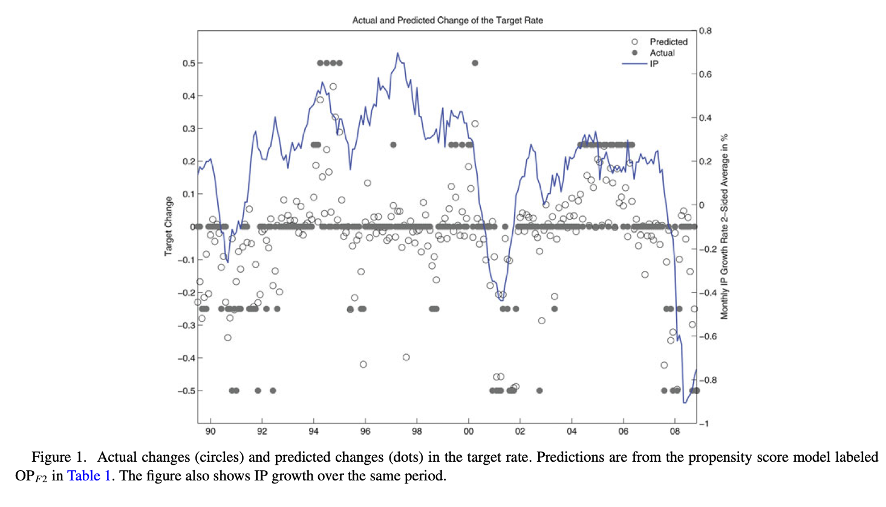
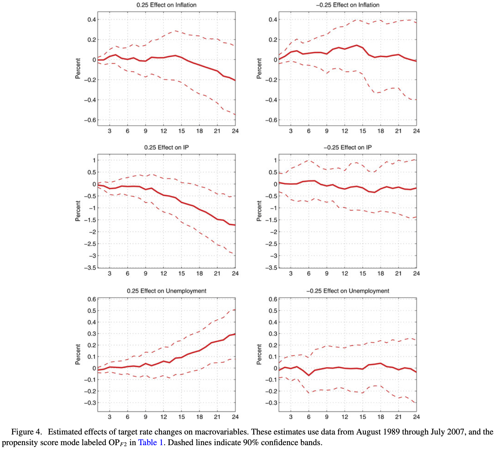

```{r,echo=FALSE,eval=FALSE}
# - Intro: what's special about time series
#   - Statistical aspects: history, dependence 
#   - Causal aspects: ordering, interference between time periods: sequential confounding
#     - distinction between causal and statistical dependence
#   - Applications: macro/finance have nonstandard causal features
# - Time series asymptotics facts
#   - stationarity: trends/changes/breaks/strong dependence
#   - ergodicity 
#   - CLT: mixing/weak dependence/ martingale difference sequences
#   - outside of stationary regime: finite sample theory or nonstandard limits
# - Causal estimands
#   - Potential outcomes @rambachan2021 
#     - Impulse responses, sequential responses
#     - What is a "shock"?
#   - Sequential backdoor criterion
#     - Sequential IPW, marginal structural models, sequential mean models
# - Estimators for response functions: (partially) parametric
#   - linearity: VARs, local projections, 
#   - time series IPW
#   - Extension: LP-IV
# - Estimators handling nonstationarity
#   - Warning: spurious regression
#   - detrending and transforms: tests, or just listen to @mccracken2016fred
#   - Mention existence of a thing called cointegration?
```
```{r,message=FALSE,warning=FALSE}
library(dagitty) #Library to create and analyze causal graphs
library(ggplot2) #Plotting
suppressWarnings(suppressMessages(library(ggdag))) #library to plot causal graphs
```

## Time Series Causal Inference

- Time series models describe data where samples are ordered in sequence
  - Quarterly macroeconomic aggregates like output and prices, monthly unemployment reports, a stock price every second, etc 
- The index $t$ for observations $\{O_t\}_{t=1}^{T}$ is not arbitrary, but reflects statistical and causal structure
- Time series inference attempts to use historical behavior of data to learn about its properties
- This data type adds additional purely statistical complications
  - Observations typically *dependent*, so one can't rely on results for independent samples
  - Dependence structure impacts estimation, inference
  - Even in the limit of infinite data, may not be able to learn probability distribution, making "identification" not always relevant
- Causal structure interacts with statistical structure, introducing additional challenges
  - Benefit of time ordering is that, barring time travel, causal order is restricted to be in direction of temporal order
  - Causal relationships between variables at different times may induce dependence, which may have different properties for observed and counterfactual variables
  - Estimation goal will often be to learn about these causal dependencies
- Today's class will cover limited range of topics
- Will restrict most attention to cases where either finite sample inference is possible or limited dependence allows use of results that are "close" to the iid setting
  - Inferential results under strong dependence require a somewhat different statistical machinery 
- Focus on acyclic models and causal estimands coming from a change in a single point in time
  - Cyclic models, with General Equilibrium interactions, and interventions to policies, require somewhat different modeling structure

## Example Applications

- Time series provide main source of data on outcomes where there may be no comparable units
  - Macroeconomic aggregates, market-level financial outcomes, geosciences, etc
- Source of information is instead historical behavior of same series
  - Comparison of macroeconomic policies in the 2010s to those in the 1930s, 40s, 50s
- Also useful for performing comparisons within a unit, if observed repeatedly
- Causal effects may be across variables at the same time, or across time
  - How does government spending affect future path of GDP?
  - How does a rate hike by the monetary authority affect output and prices?
- To obtain causal effects, will need some sources of variation in the policies which are random or "quasi-experimental"
- These may be historical accidents or idiosyncrasies not associated with other sources of variation
- As in cross-sectional case, helpful to have institutional and historical understanding of determinants of treatment
  - @ramey2016macroeconomic applications make use of detailed narrative record of fiscal and monetary policy-makers as well as statistical properties 


## Time Series Statistical Properties

- $\{O_t\}_{t=1}^{T}$ is modeled as a *stochastic process*: a sequence of random variables indexed by $t$
- For any $t$, we refer to $O_{t-1}$ as the *lag* of $O_t$, and $O^{t}=(O_t,O_{t-1},O_{t-2},...)$ as the *history* of $O_t$ up to time $t$, and let $O_{s:t}=\{O_j\}_{j=s}^{t}$ denote the subsequence between s and t
- Our goal will often be to extrapolate from past to future values; for this we may rely on **stationarity** 
  - A condition where historical patterns are assumed to be identical in distribution to patterns at other times.
- $\{O_t\}_{t=1}^{T}$ is (strictly) stationary if for any subsequence $\{O_{t_j}\}_{j=1}^{J}$ and any shift in time $h$, $P(\{O_{t_j}\}_{j=1}^{J})=P(\{O_{t_j-h}\}_{j=1}^{K})$ 
  - Only distance in time between two points affects distribution, not identity of time point
- Rules out trends up or down, shifts or breaks after which distribution changes, predictable seasonal changes, systematic changes in variability, etc
- Data may be stationary only after transformations to remove trends, seasons, breaks 
  - If $Y_t=ct+\tilde{Y}_t$ for stationary $\tilde{Y}_t$, subtracting $ct$ is called "detrending" and may turn growing series into stable one
- Stationarity will allow us to say something about full series from only part of it
  - Can take $P(O_t)$ $E[O_t]$, $P(O_t|O^t)$, etc as quantities which do not depend on $t$
- Often also assume causal structure is time-invariant: DAG relating $O_t$ and $O^{t-1}$ does not depend on $t$
  - Implies time-invariant conditional distributions, which are necessary but not sufficient for statistical stationarity
  - For causal estimands, which depend on observed and counterfactual outcomes, will rely on stationarity of both

## Dependence and Limit Theorems

- In order to estimate distributions, would help to have versions of law of large numbers and central limit theorem
  - These require stationarity, but also limits on *dependence*
- To see why, consider series which is $(0,0,0,\ldots,)$ w/ prob. 1/2, and $(1,1,1,\ldots,)$ w/ prob. 1/2
  - This is stationary, with $E[O_t]=0.5$, but for all $T$, $\frac{1}{T}\sum_{t=1}^{T}O_t$ is $0$ w/ prob. 1/2, and $1$ w/ prob. 1/2, and so is bounded away from the mean almost surely
- A stochastic process which satisfies a law of large numbers $\frac{1}{T}\sum_{t=1}^{T}O_t\overset{p}{\to}E[O_t]$ is said to be **ergodic**
- In order to perform inference one usually asks for a stronger condition, which ensures that dependence over time decays to 0
- Let $\mathcal{F}_{s}^{t}$ be the space of events (sigma algebra) generated by $O_{s:t}$, $s$ or $t$ possibly infinite
- $\alpha(j):=\sup\{|P(A\cap B)-P(A)P(B)|:A\in\mathcal{F}_{-\infty}^{t}, B\in\mathcal{F}_{t+j}^{\infty}\}$ is the **$\alpha$-mixing coefficient** of order $j$ 
  - Value not dependent on $t$ if sequence stationary
  - If $\alpha(j)\to 0$ as $j\to\infty$, $O_t$ is said to be **$\alpha$-mixing** (or *strong mixing*, but that also gets used for a slightly different, related concept)
- Idea: as points get further separated in time, they are closer and closer to independent. 
  - Different dependency measures yield slightly different but interrelated mixing conditions ($\beta,\rho,\phi$ etc mixing imply $\alpha$: see @bradley2005basic)
- For our purposes, useful result from mixing is that coefficients bound covariances across time and ensure validity of a central limit theorem 
- Primitive conditions implying ergodicity or mixing can be derived for many models of stochastic processes, but are by no means guaranteed
  - For linear process relationships, imposes restrictions on coefficients; for nonlinear case, on functional forms
  
## Inference For Time Series  

- Let $Y_t$ be stationary and ergodic, with $E[|Y_t|^{2r}]<\infty$ for $r>1$ and $\alpha-$mixing with $\sum_{k}k^{\frac{1}{r-1}}\alpha(k)<\infty$
- Then we have a Time Series Central limit theorem: $\frac{1}{\sqrt{T}}\sum_{t=1}^{T}(Y_t-E[Y_t])\overset{d}{\rightarrow}N(0,\Sigma)$
- Where $\Sigma$ is the **Long run Variance**: the limit of the variance of the sum, equal to $\Sigma=\sum_{h=-\infty}^{\infty}Cov(Y_t,Y_{t+h})=Var(Y_t)+2\sum_{h=1}^{\infty}Cov(Y_t,Y_{t+h})$
  - Above conditions from @doukhan1994functional, though many minor variants exist: need at minimum to ensure long run variance is finite
- To estimate long run variance, can use (possibly kernel weighted) sum of sample (auto-)covariances $\widehat{Var}(Y_t)+2\sum_{h=1}^Tk(\frac{h}{S})\widehat{Cov}(Y_t,Y_{t+h})$
  - @newey1987simple variance estimates use $k(u)=(1-|u|)1\{u\leq 1\}$ and are implemented in most statistical software
  - Rule of thumb choice $S=0.75 T^{1/3}$ ensures consistency under (stronger) moment and mixing conditions
- Large but too-rarely-applied literature notes that estimation in error in $\Sigma$ is substantial, which complicates use, e.g. in t-statistics
  - Corrections to critical values based on refined asymptotics and alternate estimators can yield more accurate inference: see @lazarus2018har for a recent overview 
- Alternate approaches to time series inference decompose the series into independent or conditionally independent components
- In the absence of stationarity and mixing, wide variety of limiting behaviors are possible
  - Well-studied case is integrated processes, whose *change* $Y_t-Y_{t-1}$ is stationary
  - Ubiquitous when working with asset prices, and anything linked to their levels, due (roughly) to the Fundamental Theorem of Asset Pricing
  - Deserves much more attention than I will give it, but a warning to use returns and not levels unless explicitly accounting for possible nonstationarity


## Point Interventions

- Goal is to measure the effect of a treatment variable $X_t$ at a point in time $t$ on an outcome variable $Y_{t+h}$ at some point $h\geq 0$ periods ahead
- Typically, one will want to measure effects as function of $h$ to trace out time path
  - Called the **Impulse Response Function** to the shock
- More than other topics we have studied, time series has focused on parametric, homogeneous, linear models, and much less is known about heterogeneous effects
  - Will see that allowing general forms quickly gives exponentially growing number of arguments, among other problems
- @rambachan2021 give definitions and sufficient identification conditions in terms of potential outcomes for some useful cases
  - Identification results do not assume stationarity, though it may help for estimation
  - Estimation will require simplifications, so I will afterwards describe estimators for these quantities in linear homogeneous case
- Assume: treatment process $\{X_t\}_{t=1}^{T}$ with $X_t\in\mathbb{R}^{d_x}$, outcomes $\{Y_t\}_{t=1}^{T}$ with $Y_t\in\mathbb{R}^{d_y}$ with potential outcomes $\{Y_t^{X_{1:T}=x_{1:T}}\}_{t=1}^{T}$ a function of the entire treatment path, satisfying:
  - **Non-anticipation**: Let $Y_t^{x_{1:t}}:=Y_t^{X_{1:T}=x_{1:t},x_{t+1:T}}=Y_t^{X_{1:T}=x_{1:t},x^\prime_{t+1:T}}$ for any $t$, $x_{t+1:T}, x^\prime_{t+1:T}$
  - **Causal consistency** $\{X_t,Y_t\}_{t=1}^{T}=\{X_t,Y_t^{X_{1:t}}\}_{t=1}^{T}$  
  - and **overlap** $0<P(X_t=x|X^{t-1},Y^{t-1})<1$ $\forall x$
- Define $Y_{t+h}^{(x_k)}=Y_t^{X_{1:t-1},(X_{1,t},\ldots,x_k,\ldots,X_{d_x,t}),X_{t+1:t+h}}$ the effect of setting the $k^{th}$ element of $X_t$ to $x_k$ on $Y_{t+h}$ but leaving other elements unchanged
  - One possible definition of IRF is $E[Y_{t+h}^{(x_k)}-Y_{t+h}^{(x_k^\prime)}]$: effect of changing just $x_{t,k}$
  


## Difference in Means Estimator

- A natural guess for an estimator of causal response is the difference in means estimate $E[Y_{t+h}|X_{k,t}=x_k]-E[Y_{t+h}|X_{k,t}=x_k^\prime]$  
- @rambachan2021 Thm 1 shows it equals $E[Y_{t+h}^{(x_k)}-Y_{t+h}^{(x_k^\prime)}]+\frac{Cov(Y_{t+h}^{(x_k)},1\{X_{k,t}=x_k\})}{E[1\{X_{k,t}=x_k\}]}-\frac{Cov(Y_{t+h}^{(x_k^\prime)},1\{X_{k,t}=x_k^\prime\})}{E[1\{X_{k,t}=x_k^\prime\}]}$  
- Interpretation: the average difference in means equals the causal effect plus a measure of selection bias
- **Proof** 
  - $E[Y_{t+h}1\{X_{k,t}=x_k\}]=E[Y^{(x_k)}_{t+h}1\{X_{k,t}=x_k\}]$ (Causal consistency  and no anticipation)
  - $=Cov(Y^{(x_k)}_{t+h},1\{X_{k,t}=x_k\})+E[Y^{(x_k)}_{t+h}]E[1\{X_{k,t}=x_k\}]$ (def of covariance)
  - Divide both sides by $E[1\{X_{k,t}=x_k\}]$ and apply inverse propensity lemma
  - $E[Y_{t+h}|X_{k,t}=x_k]= E[Y^{(x_k)}_{t+h}]+\frac{Cov(Y^{(x_k)}_{t+h},1\{X_{k,t}=x_k\})}{E[1\{X_{k,t}=x_k\}]}$ for $x_k$ or $x_k^\prime$
- To estimate IRF, need to account for treatment periods being associated with outcome

## Repeated experiments

```{r,message=FALSE,warning=FALSE,fig.height=3.4}
repexdag<-dagify(Y3~X3+Y2+X2+Y1+X1,Y2~X2+Y1+X1,Y1~X1) #create graph 
#Set position of nodes so they lie on a straight line
  coords<-list(x=c(X1 = 0, Y1 = 0, X2=1, Y2=1, X3=2, Y3=2),
               y=c(X1 = 1, Y1 = 0, X2=1, Y2=0, X3=1, Y3=0))
  coords_df<-coords2df(coords)
  coordinates(repexdag)<-coords2list(coords_df)
ggdag(repexdag, edge_type = "arc")+theme_dag_blank()+ggplot2::labs(title="X randomized in every time period") #Plot causal graph
```  
  
- **Corollary** to decomposition: If $X_{k,t}\perp(\{Y_{t+h}^{x_{1:t+h}}\  \forall x_{1:t+h}\},X_{1:t-1},(X_{1,t},\ldots,x_k,\ldots,X_{d_x,t}),X_{t+1:t+h})$
  - then $Cov(Y_{t+h}^{(x_k)},1\{X_{k,t}=x_k\})=Cov(Y_{t+h}^{(x_k^\prime)},1\{X_{k,t}=x_k^\prime\})=0$ 
  - and $E[Y_{t+h}|X_{k,t}=x_k]-E[Y_{t+h}|X_{k,t}=x_k^\prime]$ equals the IRF $E[Y_{t+h}^{(x_k)}-Y_{t+h}^{(x_k^\prime)}]$
- Independence of the treatment at time $t$ and the potential outcomes *as well as* the rest of the treatment process
  - Can verify that this is implied by DAG for repeated experiment structure above
- Absence of past *or future* interactions makes direct conditional mean estimation possible
- Variables $X_t$ with this property sometimes called *structural shocks*
  - Rarely observed directly, but sometimes used as building block to construct model of observed variables
  - If a shock can be isolated, it can be used to measure sequence of responses

## Generalized IRFs

- Consider **Generalized IRF** $GIRF_{k,t,h}(x_k,x_k^\prime|X^{t-1},Y^{t-1}):=E[Y_{t+h}|X_{k,t}=x_k,X^{t-1},Y^{t-1}]-E[Y_{t+h}|X_{k,t}=x_k^\prime,X^{t-1},Y^{t-1}]$
- By conditional version of above proof, it equals (@rambachan2021 Thm 4) $E[Y_{t+h}^{(x_k)}-Y_{t+h}^{(x_k^\prime)}|X^{t-1},Y^{t-1}]+\frac{Cov(Y_{t+h}^{(x_k)},1\{X_{k,t}=x_k\}|X^{t-1},Y^{t-1})}{E[1\{X_{k,t}=x_k\}|X^{t-1},Y^{t-1}]}-\frac{Cov(Y_{t+h}^{(x_k^\prime)},1\{X_{k,t}=x_k^\prime\}|X^{t-1},Y^{t-1})}{E[1\{X_{k,t}=x_k^\prime\}|X^{t-1},Y^{t-1}]}$
- **Corollary**: If $X_{k,t}\perp(\{Y_{t+h}^{x_{1:t}^{observed},x_{t:t+h}}\  \forall x_{t:t+h}\},(X_{1,t},\ldots,x_k,\ldots,X_{d_x,t}),X_{t+1:t+h})|X^{t-1},Y^{t-1}$, the generalized IRF is $E[Y_{t+h}^{(x_k)}-Y_{t+h}^{(x_k^\prime)}|X^{t-1},Y^{t-1}]$
- Its average equals the (unconditional) IRF $E[Y_{t+h}^{(x_k)}-Y_{t+h}^{(x_k^\prime)}]$
- Interpretation: If conditional on past, treatment is independent of potential outcomes and *future assignments*, adjustment estimator controlling for history measures causal effect
  - While slightly weaker than above, this condition will fail if assignments depend on past outcomes or decisions
  - It will hold in repeated experiment setting, where treatments are shocks
- Generalized IRF is a measure which allows heterogeneous and nonlinear effects of shocks
  - Compute in nonlinear structural dynamic models to summarize effects of shocks
  
  
## Sequential Conditional Random Assignment

```{r,message=FALSE,warning=FALSE,fig.height=3.4}
seqdag<-dagify(Y4~X4+Y3+X3+Y2+X2+Y1+X1,Y3~X3+Y2+X2+Y1+X1,Y2~X2+Y1+X1,Y1~X1,
                 X4~Y3+X3+Y2+X2+Y1+X1,X3~Y2+X2+Y1+X1, X2~Y1+X1) #create graph 
#Set position of nodes so they lie on a straight line
  coords<-list(x=c(X1 = 0, Y1 = 0, X2=1, Y2=1, X3=2, Y3=2, X4=3, Y4=3),
               y=c(X1 = 1, Y1 = 0, X2=1, Y2=0, X3=1, Y3=0, X4=1, Y4=0))
  coords_df<-coords2df(coords)
  coordinates(seqdag)<-coords2list(coords_df)
ggdag(seqdag, edge_type = "arc")+theme_dag_blank()+ggplot2::labs(title="X may depend on all past variables") #Plot causal graph

``` 

- Outside of (natural) experiments, treatment assignment generally depends on history of the system
  - In time series, this means dependence on history of both treatment and outcome values
- Causal effect of a change in $X_t$ includes changes in both outcomes and future assignments
- $Y_{t+h}|do(X_t=x)$ corresponds to $Y_{t+h}^{x_t}:=Y_{t+h}^{X_{1:t-1},x_t,X^{x_t}_{t+1:t+h}}$: contains impact of current treatment change, as well as of changes in $X_{t+j}^{X_t}$
- If this is object of interest and relevant history is observed, one can account for the assignment process by applying adjustment
- Assuming conditional ignorability  $\{Y_{t+h}^{x_t}\ \forall x_t\}\perp X_t|X^{t-1},Y^{t-1}$, $GIRF_{k,t,h}(x_k,x_k^\prime|X^{t-1},Y^{t-1})= E[Y_{t+h}^{x_t}-Y_{t+h}^{x_t^\prime}|X^{t-1},Y^{t-1}]$
  - Adding overlap, $E[GIRF_{k,t,h}(x_k,x_k^\prime|X^{t-1},Y^{t-1})]=E[Y_{t+h}^{x_k}-Y_{t+h}^{x_k^\prime}]$
  - Proof analogous to cross-sectional case
- Adjustment measures a form of IRF which contains outcome *and* policy responses to treatment
  - If monetary policy mistakes followed by subsequent reversals, measures effect of mistake and reversal on outcomes
 

## Verifying Conditional Random Assignment

- Helpful trick for verifying conditions: Single World Intervention Graphs or **SWIG** (@richardson2013single)
- Tool for verifying relationships between observed and potential outcomes by putting them on the same graph
- Idea: "do" operation represented by splitting node into observed and counterfactual outcome
  - Inward arrows point to observed half, outward from counterfactual half
  - Descendants of split node are counterfactuals
- Because graph obeys Markov property, d-separation guarantees conditional independence between observed and counterfactual outcomes
  - Can verify, eg $Y^x\perp X | Z$ by $(Y^x\perp X | Z)_G$
- Following SWIG shows that conditional random assignment holds in sequential setting  
   
```{r,message=FALSE,warning=FALSE,fig.height=3.3}
library(gridExtra) #Graph Display
splitgraphs<-list()
predag<-dagify(Y3~X3+Y2+X2+Y1+X1,Y2~X2+Y1+X1,Y1~X1,
                 X3~Y2+X2+Y1+X1, X2~Y1+X1) #create graph 
#Set position of nodes so they lie on a straight line
  coords<-list(x=c(X1 = 0, Y1 = 0, X2=1, Y2=1, X3=2, Y3=2),
               y=c(X1 = 1, Y1 = 0, X2=0.8, Y2=0.2, X3=1, Y3=0))
  coords_df<-coords2df(coords)
  coordinates(predag)<-coords2list(coords_df)
splitgraphs[[1]]<-ggdag(predag)+theme_dag_blank()+ggplot2::labs(title="DAG without intervention",subtitle="X may depend on all past variables") #Plot causal graph


swig<-dagify(Y3_x2~X3_x2+Y2_x2+x2+Y1+X1,Y2_x2~x2+Y1+X1,Y1~X1,
                 X3_x2~Y2_x2+x2+Y1+X1, X2~Y1+X1) #create graph 
#Set position of nodes so they lie on a straight line
  coords<-list(x=c(X1 = 0, Y1 = 0, X2=0.8, x2=1.2, Y2_x2=1, X3_x2=2, Y3_x2=2),
               y=c(X1 = 1, Y1 = 0, X2=0.8, x2=0.8, Y2_x2=0.2, X3_x2=1, Y3_x2=0))
  coords_df<-coords2df(coords)
  coordinates(swig)<-coords2list(coords_df)
splitgraphs[[2]]<-ggdag(swig)+theme_dag_blank()+ggplot2::labs(title="SWIG with intervention on X2",subtitle="X may depend on all past variables") #Plot causal graph

grid.arrange(grobs=splitgraphs,nrow=1,ncol=2) #Arrange In 2x2 grid
```  


```{r,class.source = 'fold-show'}
#Test that effect of X2 on Y2, Y3 identifiable by adjustment
dseparated(swig,c("Y3_x2","Y2_x2"),"X2",c("Y1","X1"))
```

## What needs to be controlled for? An aside on expectations

- Economic reasoning can help suggest causal links
- A forward-looking decision-maker who cares about the outcome will use *expectations* of future outcomes to determine actions
- Any *past* variable known to the decision-maker which predicts the outcome within the planning horizon can impact their predictions and so decisions
- This means it is hard to exclude any past observables from the adjustment set, particularly for widely reported macroeconomic and financial variables 
  - This is common justification for including entire past history as set of adjustment variables
  - It also means that sources of information that are *not* accounted for may act as confounders: treatment may be responding to news about developments affecting outcome, rather than outcome responding to treatment
  - Common to use info from asset prices (@kuttner2001monetary, @nakamura2018high), official forecasts, surveys, and media, as well as large databases of macroeconomic variables (@bernanke2005measuring), to account for these factors  
- The *rational expectations* modeling framework derives decision-maker expectations from the model-implied law of the data, and optimization describes the form of the impact of these expectations on decisions
- These assumptions may help suggest covariates and functional forms, but are *not needed* when applying non- or semi-parametric inference methods
  - Pure optimization as a model is also inconsistent with *overlap* unless decisions exhibit idiosyncratic variability due to e.g. mistakes, taste changes, or misperceptions


## Markovian Sequential Conditional Random Assignment

```{r,message=FALSE,warning=FALSE,fig.height=3.4}
markovdag<-dagify(Y4~X4+Y3+X3,Y3~X3+Y2+X2,Y2~X2+Y1+X1,Y1~X1,
                 X4~Y3+X3,X3~Y2+X2, X2~Y1+X1) #create graph 
#Set position of nodes so they lie on a straight line
  coords<-list(x=c(X1 = 0, Y1 = 0, X2=1, Y2=1, X3=2, Y3=2, X4=3, Y4=3),
               y=c(X1 = 1, Y1 = 0, X2=1, Y2=0, X3=1, Y3=0, X4=1, Y4=0))
  coords_df<-coords2df(coords)
  coordinates(markovdag)<-coords2list(coords_df)
ggdag(markovdag, edge_type = "arc")+theme_dag_blank()+ggplot2::labs(title="X and Y depend on immediate past only") #Plot causal graph
```

- As a common simplification, it is often assumed that causal structure is **recursive**
  - $(O_{t+1}\perp O^{t-1}|O_t)_{G}$ state variables in time $t$ d-separate future from past
  - This implies probability distribution is also (first order) Markov: $P(O_{t+1}|O^{t})=P(O_{t+1}|O_{t})$
- This simplifies analysis enormously, and is the basis for huge fraction of dynamic economic modeling (@ljungqvist2018recursive, @stokey1989recursive)
- Conditional ignorability can be truncated to $\{Y_{t+h}^{x_t}\ \forall x_t\}\perp X_t|X_{t-1},Y_{t-1}$ and $GIRF_{k,t,h}(x_k,x_k^\prime|X_{t-1},Y_{t-1})= E[Y_{t+h}^{x_t}-Y_{t+h}^{x_t^\prime}|X_{t-1},Y_{t-1}]$
  - Adding overlap, $E[GIRF_{k,t,h}(x_k,x_k^\prime|X_{t-1},Y_{t-1})]=E[Y_{t+h}^{x_k}-Y_{t+h}^{x_k^\prime}]$
- Restriction to one period dependence can be extended to $k$ periods by adjusting state space
  - Redefine $\tilde{O}_t=(O_t,O_{t-1},\ldots,O_{t-k})$, then conditional law of motion for first element is unchanged, and the lags shift up by 1 each period


## Estimation

- In case that probability of assignment known, can construct *unbiased* estimator with repeated random or conditionally random assignment by inverse propensity weighting
  - $E[\frac{1\{X_{t,k}=x_k\}}{P(X_{t,k}=x_k|X^{t-1},Y^{t-1})}Y_{t+h}]=E[Y_{t+h}|X_{t,k}=x_k,X^{t-1},Y^{t-1}]$
- Without stationarity, effects of time $t$ intervention need not be the same as those at other times, but you can aggregate to get a measure of sample average treatment effect
  - $\frac{1}{T-h}\sum_{t=1}^{T-h}\frac{1\{X_{t,k}=x_k\}}{P(X_{t,k}=x_k|X^{t-1},Y^{t-1})}Y_{t+h}$ is unbiased estimate of $\frac{1}{T-h}\sum_{t=1}^{T-h}E[Y_{t+h}|X_{t,k}=x_k,X^{t-1},Y^{t-1}]$
- With stationarity of $\{X_t,\{Y_t^{x_{1:t}}\ \forall x_{1:t}\}\}_{t=1}^{T}$, it is unbiased estimate of the population average treatment effect
- To get consistency and asymptotic normality, add ergodicity, strong mixing, and finite conditional variances of the summands
  - This is a slightly more delicate question than that of the time $t$ variables, because conditioning on the past induces additional dependence
  - In the finite order Markovian case, it goes through by bounding mixing of lagged variables
- In infinite order case, need additional limited *causal* dependence conditions: propensity can't depend too strongly on far past
  - Presence of $X_{t-k}$ in rule induces direct correlation with observation $k$ periods away, so need size of impact small to bound covariance  

## Modeling Assignment and Outcomes  
  
- In case where propensity score is unknown, it can be estimated, e.g. by probit/logit or other parametric model
  - @angrist2018semiparametric provide asymptotics under stationarity and mixing conditions
- Alternately, estimate difference in conditional means directly
  - Linear regression of $Y_{t+h}$ on $X_{t,k}$, possibly with controls is called a **Local projection** estimator 
  - @ramey2016macroeconomic gives background and applications
  - @rambachan2021 show that in absence of linearity or homogeneity, it estimates weighted average of treatment effects
- Nothing is stopping you from running the AIPW estimator, $\frac{1}{T-h}\sum_{t=1}^{T-h}(\widehat{E}[Y_{t+h}|x_{t,k},X^{t-1},Y^{t-1}]+\frac{1\{X_{t,k}=x_k\}}{\widehat{P}(X_{t,k}=x_k|X^{t-1},Y^{t-1})}(Y_{t+h}-\widehat{E}[Y_{t+h}|x_{t,k},X^{t-1},Y^{t-1}]))$ 
  - Literature on it in time series series setting appears sparse (@kato2021efficient, @waudbysmith2021doubly apply it in sequential settings, but not under weak dependent data setting relevant to observational time series)
  - Easy to verify it remains doubly robust in sense that identification formula holds given either correctly specified mean or propensity model
  - Cross-fitting for mixing time series can be done by splitting in blocks of ordered observations $O_{1:T/3},O_{T/3+1:2T/3},O_{2T/3+1:T}$, discarding the middle block, and using the 1st and 3rd and 3rd and 1st for nuisances and final estimates, respectively
  - Discarding the middle block ensures near-independence under mixing, at cost of losing samples: can tune block sizes more finely if faster mixing known or suspected
  
## Illustration: Monetary Policy Effects 

- @angrist2018semiparametric uses IPW to estimate effect of Fed Funds Rate on economic variables like Industrial Production (IP)
- Use Fed Funds Futures and past rates and aggregates to give incorporate market predictions into assignment rule
- Time series of propensity score and outcomes shows periods associated with *predicted* rise or fall in rates

{width=50%}

## @angrist2018semiparametric Results

- Resulting IRF estimates show asymmetric effects for rate increases and decreases, as IPW does not impose a functional form on the outcome model
  - Direction of effects is consistent with conventional wisdom, but greater impact of increases as opposed to decreases not measurable with linear methods

{width=40%}


  
## Linear Estimators: Local Projections and VARs

- **Local Projection**: linear regression of $Y_{t+h}$ on $X_t$ for each $h$, possibly with controls, is transparent way to estimate an IRF
- Earlier work, dating back to @sims1980macroeconomics took a different approach, based on modeling the full probability distribution
- A *Vector Autoregression* or **VAR** is a regression of each element of a vector $O_t=(O_{1,t},O_{2,t},...,O_{d_o,t})^{\prime}$ on its lagged values
  - $O_t=\sum_{p=1}^{P}A_pO_{t-p}+u_t$, where $A_p$ is a $d_o\times d_o$ matrix of coefficients and $u_t\in\mathbb{R}^{d_o}$ is a vector of possibly correlated error terms
  - Estimate equation by equation with OLS, jointly by GMM or MLE, or apply Bayesian method with priors
- If there is a contemporaneous relationship between variables in $O_t$, in addition to a (P-th order Markov) relationship to past values
  - Then structural equation representation of the model is $O_{j,t}=f(O_{-j,t},\{O_{t-p}\}_{p=1}^{P},e_{j,t})$ for each $j=1\ldots d_o$
  - Under linearity, the system can be written as $O_t=\sum_{p=0}^{P}B_pO_{t-p}+e_t$
- Moving $B_0O_t$ to the other side obtain the *Structural VAR* or **SVAR** representation of system $(I-B_0)O_t=\sum_{p=1}^{P}B_pO_{t-p}+e_t$
- Assuming *acyclic* contemporaneous relationships, there exists an ordering of the variables such that $B_0$ is lower triangular and $(I-B_0)$ invertible
  - $O_t=\sum_{p=1}^{P}(I-B_0)^{-1}B_pO_{t-p}+(I-B_0)^{-1}e_t$ so $A_p=(I-B_0)^{-1}B_p$
- If errors $e_{j,t}$ are mutually independent with variance $\sigma_j^2$, $Var(u_t)=(I-B_0)^{-1}\Sigma(I-B_0)^{\prime-1}$ for diagonal $(\Sigma)_{jj}=\sigma^2_{j}$
  - Since $(I-B_0)^{-1}$ triangular, can recover $(I-B_0)^{-1}\Sigma^{1/2}$ from **Cholesky** decomposition of $Var(u_t)$
  - Identifies full system up to magnitude of shock (can normalize to 1) if causal order known
- To obtain IRF to $e_j$, $IRF_0=(I-B_0)^{-1}\Sigma^{1/2}$ gives immediate impact, and $IRF_h=\sum_{s=1}^{\min(h,P)}A_sIRF_{h-s}$

## LP vs VAR IRFs


- Focus on effect of "shocks" rather than of variables has led to many proposals for identifying shocks other than the Cholesky ordering
  - Some of these can be derived from well-specified structural systems in which a shock is identified with a (possibly latent) variable
  - Others are ad-hoc, in which case the "shock" may not be definable in terms of effect of any particular variable
  - In my view, lack of transparency regarding structural meaning of identifying assumptions has been part of the reason for widespread skepticism of VAR results
- A local projection procedure that recovers the same immediate response as VAR with Cholesky ordering is linear regression of $O_{j,t}$ on $O_{k,t}$ for $O_k$ the time t ancestors of $O_j$, and $\{O_{t-p}\}_{p=1}^{P}$   
  - Difference is that coefficient is on $O_k$ instead of $e_k$, the structural error in $O_k$, but these are identical after multiplying the VAR impulse response by the residual standard error of the LP regression (@plagborg2021local Prop 1)
  - This makes clear that SVAR with Cholesky ordering is relying on backdoor adjustment formula using linear homogeneous mean modeling to estimate $E[Y_{t+h}^{x_k}-Y_{t+h}^{x_k}]$, and should be assessed in the same way
  - In particular, estimates need not be causally interpretable for all variables in a system or even in a single equation
- IRFs for later lags from VAR and LP differ in finite samples, since VAR extrapolates based on fixed lag coefficients
  - However, up to scale and estimation error, effect estimated is the same up to order of included lags, and identical if an unlimited number of lags included
- Choice between LP and VAR should be made based on statistical properties and interpretability (which will depend on audience)
  - @montiel2021local suggest LPs have desirable inference properties in case of high persistence
  - Simulations in @li2021local show either may dominate depending on setting


## Alternate Identification Approaches

- Sequential conditional random assignment permits estimators that generalize adjustment to dynamic settings
- In some cases, can instead apply instrumental variables approach
- If $W_t$ is an external instrument, $X_t$ is treatment and $Y_{t+h}$ is outcome, sequential versions of IV conditions can be shown to estimate a time series version of LATE (@rambachan2021)
  - Exogeneity and exclusion restriction require assignment independent of past and future instruments and treatments, and absence of direct impact on $Y_{t+s}$ for any $0\leq s\leq h$
- Estimation can be done by Local Projection IV estimate (@stock2018identification)
  - Replace OLS by 2SLS estimate of LP equation
  - Linear case is equivalent to ordering $W_t$ IV before $X_t$ and $Y_t$ in Cholesky VAR  (@plagborg2021local)
- VAR literature contains variety of other methods for estimating impact of a shock including restrictions based on presence or absence of long run impact of particular variables (@blanchard1989dynamic), restrictions on the sign of effects on certain variables (@uhlig2005effects), and others
  - Use of multiple outcomes is reminiscent of strategies based on negative control, but existing presentations for time series heavily rely on parametric forms


  
## Sequential Exposures

- One important limitation of analyses based on point exposures is that they describe responses only to temporary interventions
  - Change $X_t$ but leave $X_{t+h}$, $h>0$ unmodified, or at value determined by response to treatment
- In linear causal model case, intervention effects are additive, so effects of compound interventions can be recovered from summation of point effects
  - This "sequence space" perspective underlies methods for estimation (@plagborg2019bayesian), identification (@wolf2020missing, @wolf2021what), and computation (@auclert2021using, @boppart2018) in recursive linear(ized) macro models
- In general nonlinear case, sequence of treatments $do(X_t=x_0,X_{t+1}=x_1,X_{t+2}=x_2,\ldots,X_{t+k}=x_k)$ is referred to as a *treatment strategy*
  - Effects under any finite strategy are identified under sequential exchangeability $Y_{t+h}^{x_{t:t+k}}\perp X_{t+j} | Z^{t+j}, Y^{t+j-1},X^{t+j-1},$ for each $j$, independence given current controls $Z_{t+j}$ and history of other values $O^{t-1}$ (with overlap for each conditional probability)
- Possibility that treatment affects variables that need to be controlled for for future treatments means that one cannot simply condition on the full path of treatments and sequence of controls
- Estimators available include weighting by inverse of *product* of propensity scores $\Pi_{j=0}^{k}\frac{1}{P(X_{t+j}|Z_{t+j},O^{t+j-1})}$ (@hernan2020causal Ch 21)
- More generally, may want to measure effect of systematic change in *policy*: a *dynamic treatment regime* changes rule for assigning treatment conditionally on other variables
- Treatment Strategy estimators applicable in that situation as well
- For permanent changes in policy, economists may prefer to use estimates based on full structural dynamic model, which can account for all forms of feedback

## Conclusions

- Time Series structure results in causal and statistical dependence across observtions at different times
- Estimation and inference can be performed under stationarity and weak dependence
- Sequential analogues of random and conditionally random assignment processes allow estimation of *Impulse Response Functions*
- Implementation in the linear case can be done with Local Projections or VARs

  
  
## References
