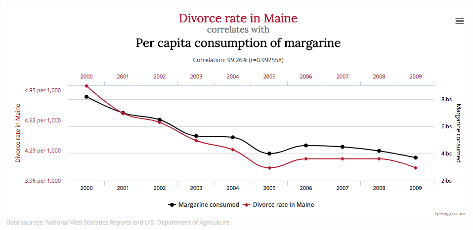
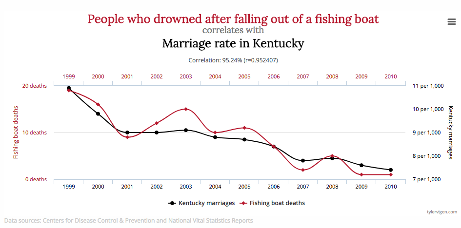
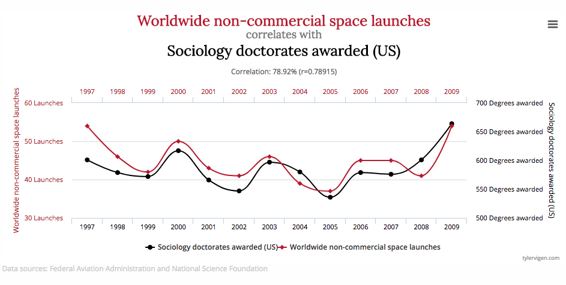

    
## Today

- Multivariate nonstationary time series
    - Spurious regression
    - Cointegration
- "An Introduction to Nonsense"
- or "How to lose money in the stock market"  
- Material based on Wooldridge Ch. 18

## Some Important Data Relationships (1)



## Some Important Data Relationships (2)



## Some Important Data Relationships (3)




## What's going on here?

- We know "correlation is not causation"
- Correlations may be found between variables even with no causal relationship
- Omitted variables can induce relationships between otherwise unconnected variables
- What's the omitted variable here? 
- Should we assume there is some hidden force relating sociologists and space exploration, and try to find it?
- Alternately, should we assume that these large correralations are just highly unlikely sampling variability?
- For both, probably not
  - Reason is related to features that make time series relationships different from cross sectional ones
- With time series, Correlation may not even reflect correlation!
- Sample properties can show strong relationships even for *independently* generated series


## Simulation (Code 1)

```{r, eval=FALSE}
tl<-100 #Length of simulated series
set.seed(74) #Initialize random number generator
e1<-ts(rnorm(tl)) #standard normal shocks
e2<-ts(rnorm(tl)) #additional independent standard normal
rho<-1 #AR parameter
yUR1<-numeric(tl-1)
yUR2<-numeric(tl-1)
for(s in 1:(tl-1)){
  #Random Walk initialized at 0
  yUR1[s+1]<-rho*yUR1[s]+e1[s]
  #Independently generated separate random walk
    yUR2[s+1]<-rho*yUR2[s]+e2[s]
}
```

## Simulation (Code 2)

```{r, eval=FALSE}
#Represent as same length time series
UR1<-ts(yUR1[1:tl-1])
UR2<-ts(yUR2[1:tl-1])
simulatedseries<-cbind(UR1,UR2)#Collect as Matrix
#Library for time series regression
library(dynlm)
#Regress indepent series
spuriousreg<-dynlm(formula=yUR1~yUR2,data=simulatedseries)
spursum<-summary(spuriousreg)
```
## Simulation (Code 3)

```{r, eval=FALSE}
#Plot
ts.plot(simulatedseries, gpars=
  list(main="Two Independent Simulated Random Walks", 
  ylab="Series value",lty=c(1,2),col=c("red","blue")))
  legend("bottomleft",bty="n",
  expression("Random Walk 1", "Random Walk 2"),
  lty=1:2,col=c("red","blue"))
text(60,2,"Coef= ") 
text(78,2,spursum$coef[2])
text(60,1,"t-value= ") 
text(78,1,spursum$coef[6])
text(60,0,"p-value= ") 
text(81,0,spursum$coef[8])
```

## Simulation: 2 independent random walks

```{r, echo=FALSE}
tl<-100 #Length of simulated series
set.seed(74) #Initialize random number generator for reproducibility
e1<-ts(rnorm(tl)) #standard normal shocks
e2<-ts(rnorm(tl)) #additional independent standard normal shocks
rho<-1 #AR parameter
yUR1<-numeric(tl-1)
yUR2<-numeric(tl-1)
for(s in 1:(tl-1)){
  #Random Walk initialized at 0
  yUR1[s+1]<-rho*yUR1[s]+e1[s]
  #Independently generated separate random walk
    yUR2[s+1]<-rho*yUR2[s]+e2[s]
}
#Represent as same length time series
UR1<-ts(yUR1[1:tl-1])
UR2<-ts(yUR2[1:tl-1])
#Collect as Matrix
simulatedseries<-cbind(UR1,UR2)
#Library for time series regression
suppressWarnings(suppressMessages(library(dynlm)))
#Regress indepent series
spuriousreg<-dynlm(formula=yUR1~yUR2,data=simulatedseries)
spursum<-summary(spuriousreg)
#Plot
ts.plot(simulatedseries,gpars=list(main="Two Independent Simulated Random Walks", ylab="Series value",lty=c(1,2),col=c("red","blue")))
legend("bottomleft",bty="n",expression("Random Walk 1", "Random Walk 2"),lty=1:2,col=c("red","blue"))
text(60,2,"Coef= ")
text(78,2,spursum$coef[2])
text(60,1,"t-value= ")
text(78,1,spursum$coef[6])
text(60,0,"p-value= ")
text(81,0,spursum$coef[8])
#text("Coef= "`spursum$coef[2]` "t-value= "`spursum$coef[6]`,"p-value= "`spursum$coef[8]')

```

## Explanation: Spurious Regression

- Failing to include trend if needed, or account for integration, creates bias in regression
    - Will get strong relationship (small p value, high $R^2$) if both series trending
    - Called "spurious" or "nonsense" correlation
- Two trending series regressed on each other will be correlated, even if no structural relationship
    - "Time" is omitted variable
    - Easy to see this with deterministic trend
    - Is just as much of a problem with stochastic trend
    
## Multiple integrated series

- If $X_t$ has unit root, and $Y_t$ is linear function of it, $Y_t$ must also have unit root
- If tests say $X_t$ has unit root, $Y_t$ doesn't, then level of $Y_t$ can't be linear function of level of $X_t$ 
    - But may be function of growth in $X$, or nonlinear function of level
- E.g., unemployment $\in [0,1]$ so bounded, can't be linear unit root per se
    - Farmer (2014) argues nonlinear function of it is unit root
- Want to know: is it possible to find a real relationship between multiple persistent series?

## Non-spurious relationships

- How do we think about relationships between nonstationary series?
- Consider $Y_t=Y_{t-1}+e_t$ and $X_t=X_{t-1}+u_t$ two series with unit roots
    - E.g., price of two different stocks
- If $u_t\perp e_t$ can learn this from regressing $\Delta Y_t=e_t$ on $\Delta X_t=u_t$
    - Coefficient will be 0
- If $u_t$ and $e_t$ correlated can run same regression and get nonzero coefficient
    - Growth of $X$ associated with growth of $Y$
- Unless correlation is perfect, due to unit root behavior, series will eventually drift arbitrarily far from each other
- Relationship between differences captures short run relationship only

    
## Cointegration

- Some series may instead have **long run** relationship
    - Even though levels nonstationary, levels remain closely related over time
- A model for such relationships is that the levels are related
    - $Y_t=\beta X_t +\epsilon_t$ but now $\epsilon_t$ is *stationary*
- If 2 (or more) series each have unit root, but linear combination of them, e.g. $Y_t-\beta X_t$ is stationary, the series are called **cointegrated**
- Example: price of shares of same stock traded on two different exchanges, say New York & Chicago
    - Price has unit root, but two prices should not differ for longer than it takes buy/sell orders to travel from NY to Chicago
- Metaphor: "A drunk walking their dog": drunk moves in random direction from position $X_t$ but holds dog on a leash at position $Y_t$
- Can't predict long run location of pair, but dog will stay within leash length of the drunk

## Testing for cointegration

- We would really like to use cointegration relationship: 
    - E.g., to know when to buy in NY and sell in Chicago
- This "pairs trading" idea is one way high frequency trading makes money
- Problem is, how to know if it's real or spurious? Even if no relationship, regression of $Y$ on $X$ will give significant $\beta$
- This is problem of **cointegration testing**
- Also want to estimate $\beta$ and use relationship for prediction
- If tests suggest $Y$ and $X$ have unit roots, should test for cointegration before including in a regression

## Lettau and Ludvigson: Code 1

```{r,eval=FALSE}
#Load data on c, a, y from Lettau's website
library(readr) #Library to read .csv files
#download data from Lettau's website
cay_current<-read_csv(
  "http://faculty.haas.berkeley.edu/
  lettau/data/cay_current.csv",
  skip=1)
#Rename c to remove space
cay_current$c<-cay_current$`c (pce)`
```

## Lettau and Ludvigson: Code 2

```{r,eval=FALSE}
#Test for unit roots in each series, 
# under null with possible drift and trend
library(tseries)
#Run Phillips-Perron tests for each series
c.pp<-pp.test(cay_current$c)
a.pp<-pp.test(cay_current$a)
y.pp<-pp.test(cay_current$y)
#Set as time series for use in commands
cc<-as.ts(cay_current$c)
aa<-as.ts(cay_current$a)
yy<-as.ts(cay_current$y)
```


## Macroeconomic Example: Lettau & Ludvigson (2004)

- Long run budget constraint suggests wealth and spending cannot diverge permanently
- If wealth has unit root and consumption does too, one should eventually return to the other
- L&L examine data on aggregate US consumption $c_t$, measure total wealth by financial wealth $a_t$ and labor income $y_t$
- Theory is that financial plus (present discounted) value of labor income make up total wealth, so these three series, if integrated, should be jointly cointegrated
- Long run relationship will measure "wealth effect" of *permanent* wealth changes on consumer spending

```{r,echo=FALSE}
#Load data on c, a, y from Lettau's website
library(readr) #Library to read .csv files
#download data from Lettau's website
#cay_current<-read_csv("http://faculty.haas.berkeley.edu/lettau/data/cay_current.csv",skip=1)
#Alternately, load data from saved file
suppressMessages(cay_current <- read_csv("Data/cay_current.csv", skip = 1))
#Rename c to remove space
cay_current$c<-cay_current$`c (pce)`

#Test for unit roots in each series, under null with possible drift and trend
suppressWarnings(suppressMessages(library(tseries)))
#Run Phillips-Perron tests for each series
c.pp<-pp.test(cay_current$c)
a.pp<-pp.test(cay_current$a)
y.pp<-pp.test(cay_current$y)
#Set as time series for use in commands
#From 1952Q1-2003Q1
cc<-as.ts(cay_current$c)
aa<-as.ts(cay_current$a)
yy<-as.ts(cay_current$y)
```

- Phillips Perron p-values for null of unit root with possible drift and trend are
    - c: `r c.pp$p.value` , a: `r a.pp$p.value`, y: `r y.pp$p.value`
- None of these rejects null of unit root    

## Cointegration tests

- Difference from cointegrated $Y_t=\beta X_t +\epsilon_t$ and spurious relationship is that $\epsilon_t$ is stationary if cointegrated
- So, if $Y$ and $X$ known to have unit roots (say, by tests) and $\beta$ known, just run unit root test on $\epsilon_t=Y_t-\beta X_t$
- Under $H_0$ relationship is spurious (and you should difference series), under $H_1$ they are cointegrated
- Use usual unit root tests (ADF, PP, etc) with appropriate corrections for trends, serial correlation, etc
- If $\beta$ not known, can replace by OLS estimate, run unit root test on $Y_t-\widehat{\beta}X_t$
- Since $\widehat{\beta}$ not consistent under $H_0$, critical values are weird, but software will calculate them for you
- Version using ADF statistic called **Engle-Granger** test, version with robust PP statistic called **Philips-Ouliaris** test
- All in **urca** (or **tseries**) library in R
- For more than 2 series, there can be more than one stationary cointegrating relationship
- Won't describe, but **Johansen test** can determine this

## Application: L&L data (Code)

```{r,eval=FALSE,results="asis"}
#Run OLS
caylm<-lm(cc~aa+yy)
library(stargazer)
stargazer(caylm,header=FALSE,type="html",
  no.space=TRUE,report="vc",omit.table.layout = "ns-=a")
```
```{r,eval=FALSE,results="asis"}
#Show whether residual appears to have unit root
cayresid<-as.ts(caylm$residuals)
autoregression<-dynlm(cayresid~L(cayresid))
stargazer(autoregression,header=FALSE,type="html",
    no.space=TRUE,report="vc",
    omit.table.layout = "ns-=a")
```

## Application: L&L data

- OLS regression of $c_t$ on $a_t$, $y_t$ shows series appear related, but want to be sure it's not spurious
```{r,echo=FALSE,results="asis"}
#Run OLS
caylm<-lm(cc~aa+yy)
suppressWarnings(suppressMessages(library(stargazer)))
stargazer(caylm,header=FALSE,type="html",no.space=TRUE,report="vc",omit.table.layout = "ns-=a")
```
- Regress residual on $L \text{ residual}$ to see if persistent
```{r,echo=FALSE,results="asis"}
#Show that residual does not appear to have unit root
cayresid<-as.ts(caylm$residuals)
autoregression<-dynlm(cayresid~L(cayresid))
stargazer(autoregression,header=FALSE,type="html",no.space=TRUE,report="vc",omit.table.layout = "ns-=a")
```


## Formal test of cointegration (Code)

```{r,eval=FALSE}
#Run Phillips-Ouliaris test on c,a,y
caytest<-po.test(data.frame(cc,aa,yy))
caytest
```

## Formal test of cointegration

- Apply Phillips-Ouliaris test
```{r,echo=FALSE}
#Run Phillips-Ouliaris test on c,a,y
suppressWarnings(caytest<-po.test(data.frame(cc,aa,yy)))
caytest
```
- Can't reject $H_0$ of unit root in residuals
    - Can't reject no cointegration
    - Might be spurious relationship
- L&L paper ran several other tests, showing cointegration, with slightly different sample

## Estimation under cointegration

- If $Y$, $X$ cointegrated, $Y_t=\beta X_t +\epsilon_t$ can estimate $\beta$
- OLS is consistent, converges fast (at rate $t$ instead of $\sqrt{t}$)
- But may be biased and non-normal, so other estimators preferred
- Book describes leads and lags (also called dynamic OLS or Stock Watson) estimator
- Regress $Y_t$ on $X_t$ and $\Delta X_t$ and leads and lags of $\Delta X_t$
- Result again converges fast, but now normal up to needing HAC standard errors

## Dynamic OLS estimates (Code)

```{r,eval=FALSE,results="asis"}
#Dynamic OLS with 4 leads and lags
dynOLS<-dynlm(cc~aa+yy+L(diff(aa),-4:4)+L(diff(yy),-4:4))
library(lmtest)
library(sandwich)
dynresults<-coeftest(dynOLS,vcovHAC) #HAC errors
stargazer(dynresults,header=FALSE,type="html",
    keep=c(1,2,21), no.space=TRUE,
    omit.table.layout = "ns-=a")
```

## Dynamic OLS estimates of cointegrating coefficients

- Assuming cointegration tests hadn't failed, could estimate by
- Regress $c_t$ on $y_t$, $a_t$ and 4 leads and lags of $\Delta y_t$, $\Delta x_t$
- Using HAC standard errors t-stats are asymptotically normal
```{r,echo=FALSE,results="asis"}
dynOLS<-dynlm(cc~aa+yy+L(diff(aa),-4:4)+L(diff(yy),-4:4))
suppressWarnings(suppressMessages(library(lmtest)))
suppressWarnings(suppressMessages(library(sandwich)))
dynresults<-coeftest(dynOLS,vcovHAC)
stargazer(dynresults,header=FALSE,type="html",keep=c(1,2,21), no.space=TRUE,omit.table.layout = "ns-=a")
```

## Combining long run and short run relationships

- Since $Y_t-\beta X_t$ stationary, can be used in OLS as a predictor
- Replacing with $Y_t-\widehat{\beta} X_t$ from above method fine since $\widehat{\beta}$ converges faster than OLS
- One use is **error correction model** (**ECM**)
- Predict $\Delta Y_t$ using cointegrating residual and other stationary predictors such as lags of $\Delta X_t$ and $\Delta Y_t$  
- $\Delta Y_t = \pi_0+\pi_1 (Y_{t-1}-\widehat{\beta}X_{t-1}) +\pi_2 \Delta X_t + \pi_3 \Delta Y_{t-1} +\pi_4 \Delta X_{t-1}+\ldots+u_t$ 
- $\pi_1$ measures how fast $Y$ moves back to long run equilibrium
- Estimate above by OLS: everything stationary, so fine up to usual concerns about HAC SEs
- For stocks, might be large: return in milliseconds. For macroeconomic variables, may be small, takes several years
- Can estimate also $\beta$ and error correction coefficients jointly by Johansen procedure: a form of nonlinear MLE

## Error correction model using L&L residuals (Code)


```{r,eval=FALSE,results="asis"}
#Calculate cointegrating residual from 
#   dynamic OLS estimated coefficients
cay<-cc-dynOLS$coefficients[2]*aa
      -dynOLS$coefficients[3]*yy
      -dynOLS$coefficients[1]
#Run error correction regression
ecm<-dynlm(d(aa)~L(cay)+L(d(aa))+L(d(cc))+L(d(yy)))
#Calculate HAC standard errors
ecmresults<-coeftest(ecm,vcovHAC)
#Display Results
stargazer(ecmresults,header=FALSE,type="html", 
    no.space=TRUE,omit.table.layout = "ns-=a")
```


## Error correction model using L&L residuals

- If a variable is cointegrated, then deviations from trend revert back
- Including (actually) cointegrating residual can lead to better forecasts
- Try to predict $\Delta a_t$ using lags and $c_{t-1}-b_0-b_1a_{t-1}-b_2y_{t-1}$

```{r,echo=FALSE,results="asis"}
#Calculate cointegrating residual from dynamic OLS estimated coefficients
cay<-cc-dynOLS$coefficients[2]*aa-dynOLS$coefficients[3]*yy-dynOLS$coefficients[1]
#Run error correction regression
ecm<-dynlm(d(aa)~L(cay)+L(d(aa))+L(d(cc))+L(d(yy)))
#Calculate HAC standard errors
ecmresults<-coeftest(ecm,vcovHAC)
#Display Results
stargazer(ecmresults,header=FALSE,type="html", no.space=TRUE,omit.table.layout = "ns-=a")
```

## Conclusions

- Regressions using persistent time series can cause appearance of strong relationships even if absent
- Spurious correlations due to (possibly stochastic) time trends in each series
- If series are persistent, can test whether relationship spurious by seeing if residuals are persistent
- If not, series may be *cointegrated*: sharing a common stochastic trend
    - Signature is that linear combination of nonstationary series is stationary
- Cointegration relationship can be tested for, and estimated when it exists


