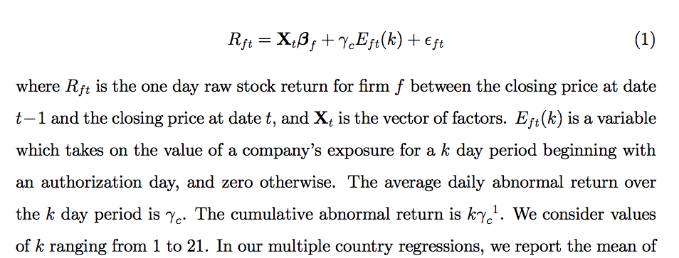
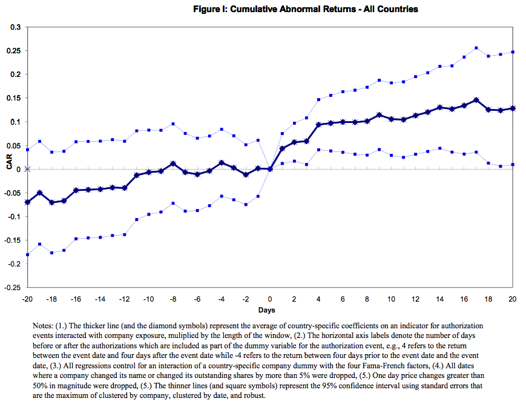

## Today

- Conclude Instrumental Variables
    - Simultaneous Equations
    - Measurement error
    
## Instrumental Variables: Model and Estimator

- Interested in coefficients of linear model $Y_{1i}=X_i^{\prime}\beta+u_i$
$$=\beta_0+\beta_1Y_{2i} + \beta_2Y_{3i} + \ldots + \beta_{\ell}Y_{\ell i} + \beta_{\ell+1}Z_{1i} + ... + \beta_{k+\ell}Z_{ki} + u_{i}$$ 
- But regressors are *endogenous*
$$E[Y_{-1i}u_i]\neq 0$$
- Solution: Use instrumental variables $Z_j$ $j=0\ldots m>k+1$ that are
    - Exogenous $E[Z_{ij}u_i]=0\ \forall j=0\ldots m$
    - Relevant: no exact linear relationships among variables in $\hat{X}$
- Apply Two Stage Least Squares (2SLS) estimator
    - (1) Regress $X$ on $Z$ to get predicted $\hat{X}$
    - (2) Regress $Y$ on $\hat{X}$ to get $\hat{\beta}^{2SLS}$
    
    
## Sources of endogeneity: Why Use 2SLS?

$$E[Y_{-1i}u_i]\neq 0$$

- One reason (Last Week): Omitted Variables
- Another: Simultaneity
    - Causality runs in "wrong" direction
    - $Y_2$ causes $Y_1$, but $Y_1$ also causes $Y_2$
    - Graph representing relationship is *not* acyclic
- Economic equilibria: system of variables mutually determined
    - Ex. 1: Supply and demand
    - Ex. 2:  Game theory

## Simultaneous equations systems (Code)
```{r, eval=FALSE}
library(dagitty) #Library to create causal graphs
library(ggdag) #library to plot causal graphs
simeqgraph<-dagify(Y1~Y2+Z1,Y2~Y1+Z2) #create graph
#Set position of nodes 
  coords<-list(x=c(Y2 = 1, Y1 = 0, Z1=-1, Z2=2),
               y=c(Y2 = 0, Y1 = 0, Z1=0,Z2=0)) 
  coords_df<-coords2df(coords)
  coordinates(simeqgraph)<-coords2list(coords_df)
#Plot causal graph
ggdag(simeqgraph)+theme_dag_blank()+
  labs(title="Simultaneous System with Instruments") 
```  


## Simultaneous equations systems

- Represent by system of structural equations
$$Y_1=\beta_{11}Y_2+\beta_{12}Z_1+u_{1}$$
$$Y_2=\beta_{21}Y_1+\beta_{22}Z_2+u_{2}$$

```{r, echo=FALSE, fig.height=2.5}
library(dagitty) #Library to create and analyze causal graphs
suppressWarnings(suppressMessages(library(ggdag))) #library to plot causal graphs
simeqgraph<-dagify(Y1~Y2+Z1,Y2~Y1+Z2) #create graph
#Set position of nodes 
  coords<-list(x=c(Y2 = 1, Y1 = 0, Z1=-1, Z2=2),y=c(Y2 = 0, Y1 = 0, Z1=0,Z2=0)) 
  coords_df<-coords2df(coords)
  coordinates(simeqgraph)<-coords2list(coords_df)
ggdag(simeqgraph)+theme_dag_blank()+labs(title="Simultaneous System with Instruments") #Plot causal graph
```  

- E.g. Supply and demand
    - $Y_1$ is price, $Y_2$ is quantity
    - Equation 1 is supply curve
        - As quantity sold increases, ask a higher price
    - Equation 2 is demand curve
        - As price goes up, demand less quantity
    - $Z_1$ are forces shifting supply curve: e.g., price of inputs
    - $Z_2$ are forces shifting demand curve: e.g. prices of substitutes
    - $u_1,u_2$ are unobserved supply/demand shifters


## Simultaneity Bias

- Substitute equation 1 in equation 2
$$Y_2=\beta_{21}(\beta_{11}Y_2+\beta_{12}Z_1+u_{1})+\beta_{22}Z_2+u_{2}$$
- Solve for **reduced form** for $Y_2$ in terms of $Z$
$$Y_2=\frac{1}{1-\beta_{21}\beta_{11}}(\beta_{21}\beta_{12}Z_1+\beta_{22}Z_2+\beta_{21}u_{1}+u_{2})$$
- Valid if $\beta_{21}\beta_{11}\neq 1$
- Now consider estimating equation 1 by OLS

$$Y_1=\beta_{11}Y_2+\beta_{12}Z_1+u_{1}$$

- $Y_2$ contains $u_1$ and so is correlated with $u_1$

## Handling simultaneity bias

- Similar to omitted variables
    - Unobserved demand shifts directly affect quantity and also price
- Difference is that simultaneity means any term which shifts demand will affect quantity sold in addition to price, 
    - Control strategy not possible even if all variables observed
    - If there is any variation  in $u_1$ at all, it will be correlated with $Y_2$
- But we CAN isolate variation due only to supply shifts $Z_2$ 
    - Estimate by 2SLS with $Z_2$ as excluded instrument 
    - Assumes $Z_2$ *only* affects supply and not demand

## General simultaneous systems

- Can have a system with $\ell$ equations and $\ell$ endogenous variables
$$Y_1=\beta_{11}Y_2+\ldots+\beta_{1\ell}Y_{\ell}+Z_1^\prime\beta_{1\ell+1}+u_{1}$$
$$Y_2=\beta_{21}Y_1+\beta_{22}Y_3+\ldots+\beta_{2\ell}Y_{\ell}+Z_2^\prime\beta_{2\ell+1}+u_{2}$$
$$\ldots$$
$$Y_{\ell}=\beta_{\ell 1}Y_1 + \beta_{\ell 2}Y_2 +\ldots+ \beta_{\ell\ell}Y_{\ell-1}
+Z_{\ell}^\prime\beta_{\ell \ell+1} +u_{\ell}$$

- Represent full set of causal relationships between $(Y_1,\ldots,Y_\ell)$ and also effect of exogenous variables $Z$ not determined inside the system
- $Z_1^\prime$ through $Z_{\ell}^\prime$ may be vectors containing shared elements if one variable affects multiple variables


## Reduced form in simultaneous equation models

- **Reduced form** 
    - All $Y$ variables as functions of only $Z$ variables 
    - Exists under some restrictions on coefficients
- Need a unique solution to this system of equations
    - E.g., supply and demand curves must touch exactly once
    - Otherwise model of data not well defined
- If supply and demand curves exactly overlap, price and quantity could take multiple values
    - Need more info to describe system
- If model complete and well defined, can calculate probability law of variables inside the system in terms of external, or exogenous, disturbances to system

## Estimation of simultaneous equations models

- Can  estimate one equation in system by 2SLS estimation 
    - If reduced form exists and 
    - There are terms $Z$ that enter into other equations but *not* directly into this one
- Need at least as many excluded $Z$ terms as included endogenous variables $Y$ to estimate any one equation consistently
- May only be able to estimate some equations in system
- Execute in R equation by equation using **ivreg**
- Command to do all at once is **systemfit** in **systemfit** library
<!-- - If all equations estimable, there is a weighted estimator, like GLS, that estimates all equations, called 3SLS (**method="3SLS"** option in systemfit) -->
<!-- - Like GLS, more efficient in homoskedastic, well-specified case, but otherwise not -->

## Measurement Error
- One more source of endogeneity
- $X^{*}$ is assigned randomly, but we don't observe it directly
- Instead observe noisy proxy $X=X^{*}+\epsilon$
    - $\epsilon\perp X^{*}$ is nonsystematic error in measurement process
    - Maybe survey taker sometimes writes numbers slightly off
    - Maybe tool used to measure sometimes picks up unrelated noise
- We care about coefficient of $Y=\beta_0+\beta_1X^{*} + e$
- How bad is it to estimate instead regression of $Y$ on $X$?

## Measurement-error bias

- OLS Estimate is $$\beta_{OLS}=\frac{Cov(X,Y)}{Var(X)}$$
- True object of interest is $$\beta=\frac{Cov(X^*,Y)}{Var(X^*)}$$
$$\beta_{OLS}=\frac{Cov(X^{*}+\epsilon,Y)}{Var(X^{*}+\epsilon)}$$
$$=\frac{Cov(X^{*},Y)+Cov(\epsilon,Y)}{Var(X^{*})+Var(\epsilon)}$$
- By randomness of error, $Cov(\epsilon,Y)=0$
$$=\frac{Cov(X^{*},Y)}{Var(X^{*})+Var(\epsilon)}$$
- $\left|\beta_{OLS}\right|<\left|\beta\right|$
- Magnitude smaller since divided by larger number

## Intuition
- **Attenuation bias**
- Measurement error makes OLS estimate smaller than true effect
- Limiting case: $X$ is pure noise: no information about $X^{*}$ at all
    - Then $Y$ is unrelated to $X$
    - Coefficient becomes 0
- Equivalent to a form of endogeneity
- $Y= \beta_0 +\beta_1 X^{*} + e = \beta_0 + \beta_1 (X-\epsilon) + e = \beta_0 + \beta_1 X-\beta_1\epsilon + e = \beta_0 + \beta_1 X+u$
- Here $u=e-\beta_1\epsilon$, $E[Xu]=E[X^{*} +\epsilon,e-\beta_1\epsilon]=-\beta_1 E[\epsilon^2]\neq 0$


## Solving Measurement error bias

- If we have an IV correlated with $X^*$ but uncorrelated with the measurement error in it, we can estimate effect by IV
- Special case: 2 noisy measurements: $X_1=X^{*}+ \epsilon_1$, $X_2=X^{*}+\epsilon_2$ $\epsilon_1\perp\epsilon_2$
- $Cov(X_1,X_2)=Var(X^{*})\neq 0$ and $Cov(X_2,Y-X_1\beta_1)=0$, since measurement errors are independent
- Example: if survey-takers sometimes misrecord a response, survey same households twice, use one survey as IV for other
- Compare alternate strategy 
    - Take 2 noisy measurements and average
    - Variance of measurement error decreases, but doesn't disappear
        - OLS *still* inconsistent
    - Unlike IV which gives estimate which gives consistent estimator even if error variance large
    
## Instrumental Variables: Overview

- Endogeneity causes bias in OLS estimates of linear model
    - Omitted variables
    - Simultaneity
    - Measurement Error
- IV estimator handles all issues
- Instrument $Z$ *must* be exogenous and relevant
    - Exclusion: no direct effect of (some) $Z$ on $Y_1$
    - $Z$ correlated with endogenous regressor $Y_{-1}$
    
    
    
<!-- ## New Topic  -->

<!-- **Panel Data** -->


<!-- ## Adding group structure to data -->

<!-- - Up until now, we've assumed our data is drawn from a *random sample* -->
<!--     - $(Y_i,X_i)$ independent and identically distributed -->
<!-- - In some types of data, this may not reflect the sampling process -->
<!-- - Our sample can consist of *groups* of related observations -->
<!-- - Call this structure **panel** or **longitudinal** **data** -->

<!-- ## Example Panel Data Sets -->

<!-- - Individual or firm surveys visitng same respondents repeatedly -->
<!--     - Panel Study of Income Dynamics -->
<!--     - Longitudinal Business Database -->
<!-- - States, counties, or country characteristics over time -->
<!-- - Stock or financial asset prices and characteristics over time -->
<!--     - CRSP, Compustat -->
<!-- - Household surveys  -->
<!--     - Can be grouped over time, also different members of same household -->

<!-- ## Panel Structure -->

<!-- - In each example, observations within a group share characteristics -->
<!-- - If I ask "What is your favorite color?" then ask again 5 minutes later, answer unlikely to change very much -->
<!-- - Difficulty: can't treat "you" and "you 5 minutes ago" as independent samples -->
<!--     - "You" and "you 5 minutes ago" share many unobserved characteristics -->
<!-- - Advantage: can use differences **within** a group to learn about only those characteristics that *do* differ -->

<!-- ## Answering Questions with Panel Data -->

<!-- - Effect of treatment on outcome, allowing treatment to vary within and between groups -->
<!--     - Effect of state-level policy on employment or growth -->
<!--     - Effect of firm announcements on stock prices -->
<!--     - Effect of tax policy on individual outcomes and welfare -->

<!-- ## Notation -->

<!-- - Observations in panel data indexed by 2 or more indices -->
<!--     - one for unit/group: $i=1\ldots n$ -->
<!--     - one for observation within unit: $t=1\ldots T$ -->
<!-- - Each unit $X_{i}=(X_{i,1},\ldots,X_{i,t},\ldots,X_{i,T})$ -->
<!-- - $X_{i,t}$ may itself be a vector of characteristics -->
<!--     - e.g. $(Income_{i,t}, age_{i,t}, \text{credit score}_{i,t}, \text{favorite color}_{i,t})$ -->
<!-- - May be represented on computer as list of $N=n*T$ observations, one for each index $i$ and $t$ (e.g. "unit" and "time") -->
<!-- - Or in special panel data format with $T$ observations in each group -->
<!--     - Structure **pdata.frame** in library **plm** in R -->


<!-- ## Event Studies -->

<!-- - Idea: compare outcomes within a unit before and after treatment -->
<!-- - So long as there are no systematic changes over time except for treatment, difference can be interpreted as causal -->
<!-- - $Y_{i,2}$ be outcome after treatment, $Y_{i,1}$ outcome before -->
<!-- - $\frac{1}{n}\sum_{i=1}^{n}(Y_{i,2}-Y_{i,1})$ estimates average effect -->
<!-- - Example: price of stock immediately before and after earnings announcement -->
<!-- - Equivalent to $\beta$ in regression -->
<!-- $$Y_{i,t}=\beta_0+\beta*After_{t}+u_{i,t}$$ -->
<!--     - $After_{t}$ treatment is 1 if t=2, 0 if t=1 -->

<!-- ## Unobserved Effects Model -->

<!-- - Model outcome as $Y_{i,t}=\beta_0+\beta*After_{t} + a_i + u_{i,t}$ -->
<!--     - $u_{i,t}$ is nonsystematic variation in outcome  -->
<!--     - $E[u_{i,t}After_{t}]=0$ means no unobserved factors changing over time on average -->
<!--     - $a_i$ is unit-specific characteristics that don't change over time -->
<!--     - $a_i$ called a **fixed effect** or **unobserved effect** -->
<!--     - Accounts for any possible covariates so long as they are fixed over time -->
<!-- - Obtain $\frac{1}{n}\sum_{i=1}^{n}(Y_{i,2}-Y_{i,1})=\beta+\frac{1}{n}\sum_{i=1}^{n}(u_{i,2}-u_{i,1})$ -->
<!-- - Unbiased and consistent estimator of $\beta$ -->

<!-- ## When to trust event studies -->

<!-- - Event Study methodology takes care of selection on characteristics that *don't* change with time -->
<!-- - Doesn't take care of things that do  -->
<!--     - Need there to be no other systematic changes at same time -->
<!-- - Effectively need *conditionally* random assignment given $a_i$ -->
<!-- - Often reasonable with financial data: $t=2,t=1$ are in very short window right before and after:  -->
<!--     - No news aside from treatment (firm announces its earnings, stock is split, Fed announces new monetary policy) in very short window -->
<!-- - Can become unreasonable if any systematic changes over time   -->

<!-- ## Extensions  -->

<!-- - Can account for observed differences between treatment and control periods by including observed unit-specific controls $X_{i,t}$ -->
<!-- - Can also look at effect over multiple periods -->
<!--     - Instead of just before and after, have $d\tau_t$, dummy variable equal to 1 if $t=\tau$, 0 otherwise -->
<!--     - Called a **time dummy** or **time fixed effect** -->
<!-- - Run regression  -->
<!-- $$Y_{i,t}=\beta_0+\sum_{\tau=2}^{T}\beta_{\tau} d\tau_t + X_{i,t}^{\prime}\gamma+u_{i,t}$$ -->

<!-- - If event occurs at $t=2$, $\beta_{\tau}$ is effect at time $\tau$ -->
<!-- - Can also include multiple periods before event with more time dummies -->

<!-- ## Example: "Coups, Corporations, and Classified Information" -->

<!-- - Dube, Kaplan, Naidu (Quarterly Journal of Economics 2011) look at returns of stocks of politically connected firms in countries before and after day CIA secretly authorizes coup d'etat in that country -->
<!-- - If no insider trading, and no important news released on day decision made, stock prices should be unaffected -->
<!-- - If systematic effect exists, suggest CIA insiders trading off of knowlege of coup plan -->
<!-- - Control for known observed factors predicting stock returns -->
<!-- - Event study means don't need to worry that politically connected stocks different: just different on the day of coup authorization -->

<!-- ## Specification -->

<!--  -->

<!-- ## Results -->

<!--  -->


