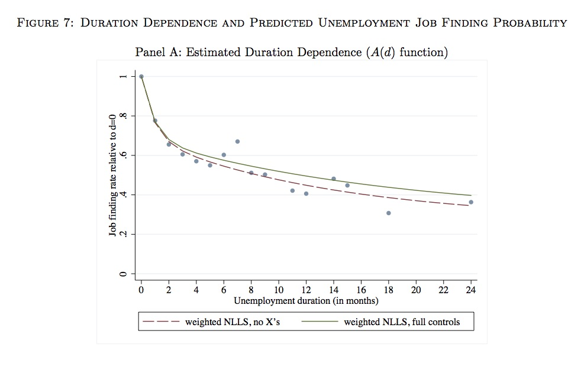
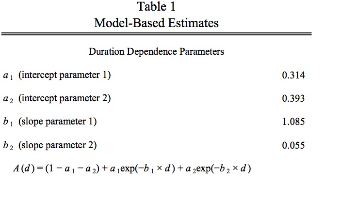

    
## Today

- More about nonlinear regression
- Inference for nonlinear models

## Nonlinear Models - Derivation

- Given a model generating implications for the distribution of $Y$ and $X$, depending on parameters $\theta$, can build an estimator

- Empirical Risk Minimization
    - Choose parameters to minimize prediction mistakes
- Method of moments
    - Choose parameters so sample averages match expectations implied by the model 
- Maximum likelihood
    - Choose parameters to maximize probability of the observed data 
    
## Nonlinear Models - Calculation

- With OLS, all of above methods could be accomplished by solving a system of linear equations
    - Produced an explicit formula
- For nonlinear models, solve system of nonlinear equations
    - No explicit formula, but computer can find solution
    - Write down likelihood, or empirical risk as function of parameters
    - Optimize that function numerically
    
## Optimization Issues

- Use standard optimization algorithms 
    - (Stochastic) Gradient descent, Newton's Method, BFGS, Nelder-Mead, simulated annealing, etc
- We can now find an estimator for just about any model we can write down
- Computer has to be able to find the solution
    - Means there has to *be* a solution: 
        - Might not be if model is **misspecified**
    - Also an issue if there's more than just one
        - **lack of identification**
- Rule of thumb: if computer can't find a solution, maybe something wrong with the model you wrote down    

## Nonlinear Least Squares
- Model: Nonlinear Regression

$$Y=f(X,\theta_0)+u$$
$$\theta_0\in\Theta$$
$$E[u|X]=0$$

- Just like linear regression model but $X^\prime\beta$ now $f(X,\theta)$
- Estimator: Nonlinear Least Squares
$$\widehat{\theta}=\underset{\theta\in\Theta}{\arg\min}\frac{1}{n}\sum_{i=1}^{n}[(Y_i-f(X_i,\theta))^2]$$

- Minimizes empirical squared error loss
- Maximizes likelihood if $u\sim N(0,\sigma^2)$
- Solves moment equations implied by $E[Y-f(X,\theta)|X]=0$

## Empirical Example: Kroft et al (2014)

- Effect of unemployment duration $(d)$ on rate of job finding
- Model by sum of exponentials $A(d)=(1-a_1-a_2)+a_1exp(-b_1d)+a_2exp(-b_2d)$
- Probability of re-employment goes down fast (exponentially) early after losing job, then declines more slowly
- NLLS estimates speed of decline and also where it levels off
- Nonlinearity also keeps expectation between 0 and 1

## Results: Graph




## Results: Table



## Consistency in Nonlinear Models

- Model says our true parameter $\theta_0$ solves
$$\theta_0=\underset{\theta\in\Theta}{\arg\min}Q(\theta)$$
- Estimate it by analogy using
$$\widehat{\theta}=\underset{\theta\in\Theta}{\arg\min}\widehat{Q}(\theta)$$

- $\widehat{\theta}\overset{p}{\rightarrow}\theta_0$ so long as we have following conditions
- **Identification**: $\theta_0$ strictly minimizes $Q(\theta)$
    - Our model gives us the best prediction only when we have the right parameter values
- **Uniform convergence** of $\widehat{Q}(\theta)$ to $Q(\theta)$
    - Replacing the expectations with sample averages doesn't cause big approximation errors in the system

-  Minizing sample loss $\approx$ minimizing population loss, which gives the true parameter    

## Consistency of Nonlinear Least Squares

- Identification holds if $$f(X,\theta_0)\neq f(X,\theta)$$ with positive probability for any $\theta\in\Theta$ other than $\theta_0$
- Implies $Q(\theta_0)=E[(Y-f(X,\theta_0))^2]\neq Q(\theta) = E[(Y-f(X,\theta))^2]$
    - Nonlinear version of no multicollinearity condition
    - Rules out, e.g. $f(X,\theta_a,\theta_b)=(\theta_a*\theta_b)X$ 
    - Since $f(X,\theta_a,\theta_b)=f(X,k*\theta_a,\theta_b/k)$
- Uniform convergence $\underset{\theta\in\Theta}{\sup}|\widehat{Q}(\theta)-Q(\theta)|\overset{p}{\rightarrow}0$
$$\underset{\theta\in\Theta}{\sup}|\frac{1}{n}\sum_{i=1}^{n}(Y_i-f(X_i,\theta))^2-E[(Y-f(X,\theta))^2]|\overset{p}{\rightarrow}0$$
- Sample mean square error close to population mean square error with high probability
- Holds by (uniform version of) law of large numbers 


## Asymptotic distribution theory: Intuition

- Consistency means that at least in large samples, we are likely to be close to the truth
- Since we are near the truth, we can look at behavior in a small neighborhood
- Twice differentiability means that in a small neighborhood, our criterion function is locally quadratic
- After a Taylor expansion, the system of FOCs defining the solution is (locally) linear
- Remainder terms proportional to distance from truth, and so disappear, by consistency
- We can then use same limit theory we did for linear model

## Asymptotic Distribution: Assumptions

1. Consistency $\widehat{\theta}\overset{p}{\rightarrow}\theta_0$
2. Twice Differentiability: $\frac{\partial}{\partial\theta}Q(\theta)$ and $\frac{\partial^2}{\partial\theta^2}Q(\theta)$ exist, are bounded
- Optimality of $\theta_0$ means first order conditions hold
    - $\frac{\partial}{\partial\theta}Q(\theta_0)=0$
- Optimality of $\widehat{\theta}$ means first order conditions hold also
    - $\frac{\partial}{\partial\theta}\widehat{Q}(\widehat{\theta})=0$
- Above + CLT imply next condition: 
3. Sample first derivative asymptotically normal with limit mean 0   
$$\sqrt{n}\frac{\partial}{\partial\theta}\widehat{Q}(\theta_0)\overset{d}{\rightarrow}N(0,\Sigma_Q)$$ 
4. Sample second derivative converges to population second derivative
$$\frac{\partial^2}{\partial\theta^2}\widehat{Q}(\widehat{\theta})\overset{p}{\rightarrow}\frac{\partial^2}{\partial\theta^2}Q(\theta)$$

## Meaning for NLLS

- Derivatives are 
$$\frac{\partial}{\partial\theta}Q(\theta)=2E[(Y-f(X,\theta))\frac{\partial}{\partial\theta}f(X,\theta)]$$
$$\frac{\partial^2}{\partial\theta^2}Q(\theta)=2E[(Y-f(X,\theta))\frac{\partial^2}{\partial\theta^2}f(X,\theta)-(\frac{\partial}{\partial\theta}f(X,\theta))^{\prime}(\frac{\partial}{\partial\theta}f(X,\theta))]$$
- For $\frac{\partial}{\partial\theta}\widehat{Q}(\theta)$ and $\frac{\partial^2}{\partial\theta^2}\widehat{Q}(\widehat{\theta})$, replace expectations by sample means
- Convergence of $\frac{\partial^2}{\partial\theta^2}\widehat{Q}(\widehat{\theta})$ follows by (Uniform) law of large numbers, plus consistency of $\widehat{\theta}$ and continuity of $\frac{\partial}{\partial\theta}Q(\theta)$
- Convergence of $\sqrt{n}\frac{\partial}{\partial\theta}\widehat{Q}(\theta)$ follows by CLT

## Asymptotic Distribution: Derivations

- Derive for case where $\theta$ one dimensional
- Vector case essentialy the same, but more notation
- Taylor expand $\frac{\partial}{\partial\theta}\widehat{Q}(\widehat{\theta})$ around $\theta_0$
$$0=\frac{\partial}{\partial\theta}\widehat{Q}(\widehat{\theta})=\frac{\partial}{\partial\theta}\widehat{Q}(\theta_0)+\frac{\partial^2}{\partial\theta^2}\widehat{Q}(\bar{\theta})(\widehat{\theta}-\theta_0)$$
- where $\bar{\theta}$ is between $\widehat{\theta}$ and $\theta_0$ by  mean value theorem
- Solve for $\widehat{\theta}-\theta_0$
$$(\widehat{\theta}-\theta_0)=-(\frac{\partial^2}{\partial\theta^2}\widehat{Q}(\bar{\theta}))^{-1}\frac{\partial}{\partial\theta}\widehat{Q}(\theta_0)$$
- Standardize and apply CLT to get
$$\sqrt{n}(\widehat{\theta}-\theta_0)\overset{d}{\rightarrow}N(0,\Sigma)$$
$$\Sigma=(\frac{\partial^2}{\partial\theta^2}Q(\theta_0))^{-1}\Sigma_Q(\frac{\partial^2}{\partial\theta^2}Q(\theta_0))^{-1}$$
- Looks ugly, but it's just sandwich formula from before


## Nonlinear Least Squares Assumptions

- (NLS1) Nonlinear model $Y=f(X,\theta_0)+u$ for some $\theta_0\in\Theta$
- (NLS2) Random sampling $(Y_i,X_i)$ drawn iid from above nonlinear model
- (NLS3) (i): Identification: $f(X,\theta_0)\neq f(X,\theta)$ with positive probability for any $\theta\in\Theta$
    -  (ii): Uniformity: $\underset{\theta\in\Theta}{\sup}|\frac{1}{n}\sum_{i=1}^{n}(y_i-f(X_i,\theta))^2-E[(y_i-f(X_i,\theta))^2]| \overset{p}{\rightarrow}0$ 
    - (iii): $\Theta$ finite dimensional, closed, and bounded, and $f(x,\theta)$ continuous in $\theta$ (implies (ii))
- (NLS4) Exogeneity $E[u|X]=0$ 
    - or (NLS4') $E[u\frac{\partial}{\partial\theta}f(x,\theta_0)]=0$
- (NLS5) (i): Differentiability: $f(X,\theta)$ twice continuously differentiable in $\theta$ with bounded derivatives
    - (ii): Homoskedasticity: $E[u_i^2|X]=\sigma^2$
- (NLS6) $u\sim N(0,\sigma^2)$

## NLLS results

- NLLS consistent under (NLS1-4)
- Can weaken (NLS4) to (NLS4') to get convergence to best nonlinear predictor in class $f(X,\theta),\theta\in\Theta$
    - Even if CEF not in that class
    - Exactly as in OLS case. Again, need robust standard errors.
- Asymptotic normality follows under (NLS1)-(NLS4'),(NLS5)(i)
- Formula is application of general nonlinear estimator sandwich formula
    - Derived next slide
- Homoskedasticity (NLS1-5) sometimes assumed by software packages, gives non-robust standard error formula
- Normal errors (NLS1-6) imply efficiency: NLS gives estimate with smallest possible asymptotic variance 
- No real finite sample results
    - Depends strongly on form of $f(X,\theta)$
- Taylor expansion based distribution theory really relies on $\widehat{\theta}$ being close to right: otherwise it may be bad approximation

## Nonlinear Least Squares: Distribution

$$\Sigma=(\frac{\partial^2}{\partial\theta^2}Q(\theta_0))^{-1}\Sigma_Q(\frac{\partial^2}{\partial\theta^2}Q(\theta_0))^{-1}$$
$$\Sigma_Q=4E[u^2(\frac{\partial}{\partial\theta}f(X,\theta_0))^\prime(\frac{\partial}{\partial\theta}f(X,\theta_0))]$$
$$\frac{\partial^2}{\partial\theta^2}Q(\theta)=2E[(Y-f(X,\theta_0))\frac{\partial^2}{\partial\theta^2}f(X,\theta_0)-(\frac{\partial}{\partial\theta}f(X,\theta_0))^{\prime}(\frac{\partial}{\partial\theta}f(X,\theta_0))]$$

- In linear case, this is exactly sandwich formula
    - First derivative just equals $X$
    - Second derivative equals 0
- Can get sample version by replacing $E$ by sample means
- Exact formula not so important since computer will calculate derivatives for you
- But good to know asymptotic variance will look like this for any nonlinear estimator


## Testing

- With given asymptotic distribution, can construct tests and confidence intervals in the usual way
- Approximate $\Sigma$ by replacing expectations by sample averages
    - $\widehat{\Sigma}$ can be used in place of $\Sigma$ in test statistics, exactly as in linear case
- Test single parameters with a t-test

$$\frac{\widehat{\theta}_j-\theta_{0,j}}{\widehat{\Sigma}_{jj}/\sqrt{n}}\overset{d}{\rightarrow}N(0,1)$$

- Test multiple parameters with a Wald test
    - Weighted sum of squares of deviation of $k$ parameters from $H_0$ converges to $\chi^2_k$

<!-- $$(\widehat{\theta}-\theta_0)^{\prime}(\widehat{\Sigma}/n)^{-1}(\widehat{\theta}-\theta_0)\overset{d}{\rightarrow}\chi^2_k$$ -->


## Simulation Example

```{r}
# Generate some data from a nonlinear model
a0<-2
b0<-0.5
x<-5*runif(50)
y<-a0*exp(b0*x)+rnorm(50) #Include normal noise
#Estimate correctly specified model
#Start minimization going downhill from some 
#reasonable guess for parameter values
model<-nls(formula=y~a*exp(b*x), start=list(a=1,b=1))
#Display results including inference
nls.summary<-summary(model)
```

## Results (code)
```{r, eval=FALSE}
(nls.summary)
```

## Results
```{r, echo=FALSE}
(nls.summary)
```


## Summary

- Nonlinear regression can be used when regression function comes from nonlinear class
- Parameters can be estimated by minimizing sum of squared errors numerically
- Limit distribution in nonlinear models can be done by Taylor expanding criterion function around true parameter
- Estimate approximately normal, so build tests and confidence intervals in usual way, using estimated asymptotic variance


## Next time

- Nonlinear regression requires knowing the form of the nonlinearity
    - Useful if form comes from knowledge of the situation
- Next time: what if we don't know form of f?
    - Can still estimate it, given lots of data
    - Nonparametric regression

