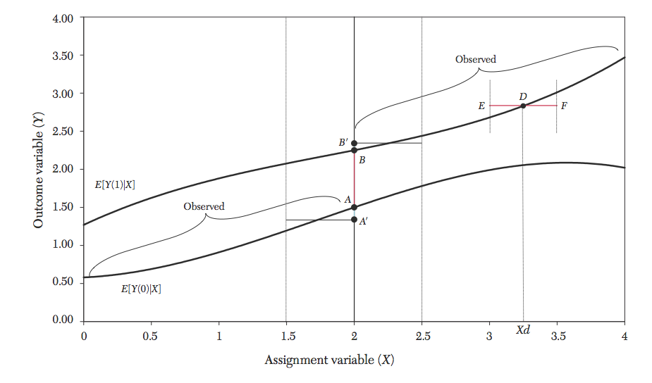
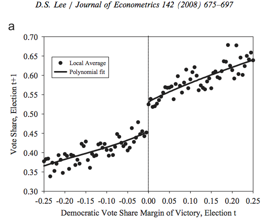

## Today

- Regression Discontinuity
    - One more tool for learning about causal effects
    - Example of a **design**: like experiment or IV
    - A situation in which data produced in a way which allows learning causal effect
    - See Angrist and Pischke Ch 4
- Method to learn from this data 
    - Extends event study idea to case where treatment determined by variable other than time
    - Works well with nonparametric regression
    
## Regression Discontinuity: Situation

- Interested in causal effect of a binary (Yes/No) treatment variable $D$ on outcome $Y$
- E.g. effect of politician winning one election on chance of winning next election
    - Called "incumbency advantage" in poli sci
- Don't have random assignment
    - Can't just compare treated and nontreated units
- Sometimes have treatment assigned by a deterministic rule
    - Variable $X$, called **running variable** or **assignment variable**, determines treatment
    - Units with $X\geq c$ get treatment $D=1$
    - Units with $X<c$ don't $D=0$
        - $D=1\{X\geq c\}$
    - Candidate who gets >50% of votes win election, <50% lose
    
## Problem

- Running variable $X$ may have direct effect on outcome 
- Or be correlated with other variable having direct effect
    - E.g. candidates who win election probably different from those who lose in lots of ways that make them likely to win next election too
- $X$ also deterministically related to treatment, 
    - Conditioning on $X$ not quite what we want to do


## Solution 

- Use fact that assignment rule is discontinuous at $c$
- Direct effect of $X$ likely to be continuous
    - Politicians who get 49.9% of vote probably not much different from those who got 50.1%
    - But big change in treatment
        - 50.1% means win, 49.9% means lose
- So compare units just on left and right side of $c$
- So long as no other things jump at $c$, any discontinuous change in $Y$ exactly at $c$ must be due to $D$
- $X$ is not randomly assigned, but whether $X$ is just below or above $c$ is effectively random

## Regression Discontinuity Estimate

- Estimate is difference in means "just above" and "just below" c
$$\tau^{RD}:=\underset{e\searrow 0}{\lim}E[Y|X=c+e]-\underset{e\searrow 0}{\lim}E[Y|X=c-e]$$
- Estimates average treatment effect when $X$ is at $c$
   - $\tau^{RD}=E[Y^1-Y^0|X=c]$ in potential outcomes notation 
   - So long as $E[Y^1|X]$ and $E[Y^0|X]$ continuous
      - No jumps in anything *except* treatment at $c$
- Interpretation: weighted average treatment effect at $c$ with weighting proportional to probability $X_i=c$
    - E.g., effect of just winning election for legislators likely to be in close race

## Visual Proof (Lee and Lemieux 2008, Fig 2)



## Examples of Discontinuities

- Lee (2008): effect of winning last election on winning next
    - Discontinuity at 50% vote share
- Effect of admission to a school on education outcomes
   - Students who score above certain number admitted into school, below that number not
- Effect of legal access to alcohol on health
    - Illegal if age<21, legal if age>=21
- Many welfare programs given only to those with income below a threshold 

## Regression Discontinuity: Simple Estimate

- Model effect of $D$ and $X$ on $Y$ by a regression
$$ Y = b_0+\tau D + \beta_1X + u$$
- Since $D=1(X>c)$, this is same as 
$$ Y = b_0+\tau 1(X>c) + \beta_1X + u$$
- Accounts for effect of $X$, if linear and $D$ additive
- Very restrictive form 
    - May have interaction of $X$ with treatment
$$Y = b_0+\tau D + \beta_1(X-c) + \beta_2 D(X-c)+ u$$    
    - Different slope above and below c
- Nonlinearity of effect of $X$
    - Can add polynomials in $X$, interacted with $D$
- Need a correct model of effect of $X$ and $D$
- OLS regression provides estimate of jump in $Y$ at threshold from $\hat{\tau}$ size of jump at $c$

## When does it work?

- Need whether $X$ is above or below value to be "effectively" random
- Need well-specified control for effects of $X$
    - If effect of X nonlinear, could mistake for effect of treatment
- No jumps in other covariates at $c$ 
    - They can change, but density has to be continuous
    - Candidates who get 50.1% of vote only slightly more skilled politicians than those who get 49.9%
- No *discontinuous* effect of treatment assignment on $X$
    - Test score example: people study harder to get higher score
    - This is fine, so long as people with score $c-0.01$ and score $c+0.01$ studied basically the same amount
    - Not fine if passing associated with big jump in studying
        - People with $c+0.01$ studied, $c-0.01$ didn't
    - Concern in welfare case: people accept jobs earning cap - 1 cent to also get benefits

## Empirical Example: Vote Share in Congressional Elections



## Accounting for underlying trend

- As graphic for proof makes clear, don't know anything about shape of causal effects away from jump point
- Really only want Conditional Expectation Function at this point
- Linear regression provides this *if* correctly specified
- Otherwise biased, from trying to fit points far away from jump
- **Solution**
    - Nonparametric Regression!
- Run linear regression only in narrow neighborhood to the left and to the right of $c$
- Almost the same as estimate from last class
    - Due to discontinuity, window should only contain data on left or data on right, not both 

## Local Linear Estimate

$$(\hat{\beta}^{-}_0(x),\hat{\beta}{-}_1(x))=\underset{(\beta_0,\beta_1)}{\arg\min}\sum_{i=1}^{n}1\{X_i<c\}K(\frac{X_i-x}{h})(Y_i-\beta_0-\beta_1(X_i-x))^2$$

$$(\hat{\beta}^{+}_0(x),\hat{\beta}{+}_1(x))=\underset{(\beta_0,\beta_1)}{\arg\min}\sum_{i=1}^{n}1\{X_i\geq c\}K(\frac{X_i-x}{h})(Y_i-\beta_0-\beta_1(X_i-x))^2$$

$$\hat{\tau}^{RD}=\hat{\beta}^{+}_0(c)-\hat{\beta}^{-}_0(c)$$

- Difference in local linear estimates at point
- Local linear tends to work better than local constant at boundary
    - Accounts for slope up or down at the point
<!-- - Can also do local polynomial: quadratic, cubic within region -->

## Choosing a Bandwidth: Considerations

- Since we care about function only at point of discontinuity, optimize error at this point instead of average error over all points
- Small $h$ lowers bias, big $h$ lowers variance
- MSE optimal rate still gives $h=cn^{-1/5}$ for some $c$
- Can estimate optimal $c$
    - Imbens & Kalyanaraman give procedure, implemented by default in most RD software
    - Or use CV on local error
    - R libraries **rdd**, **rdestimate**, or **rdrobust**
- In practice: try a bunch of bandwidths, report all results

## Lee Data w/ OLS, different slope on each side: 11.8% incumbency advantage (Code)
```{r,eval=FALSE}
#Load RD package containing Lee (2008) incumbency data 
library(rddtools)
data(house) #Lee data
# Specify x, y, and cutpoint = 0 Dem-Rep vote share
house_rdd<-rdd_data(y=house$y,x=house$x,cutpoint=0)
# Run OLS RD estimate, linear 
# with different slope on each side
reg_para <- rdd_reg_lm(rdd_object=house_rdd)
plot(reg_para,xlab="Dem-Rep Vote Share, t", 
     ylab="Dem-Rep Vote Share, t+1", 
     main="Parametric RD")
```

## Lee Data w/ OLS, different slope on each side: 11.8% incumbency advantage
```{r,results="hide",echo=FALSE}
#Load RD package containing Lee (2008) incumbency data 
suppressWarnings(suppressMessages(library(rddtools)))
data(house) #Lee data
# Specify x, y, and cutpoint = 0 Dem-Rep vote share
house_rdd<-rdd_data(y=house$y,x=house$x,cutpoint=0)
# Run OLS RD estimate, linear with different slope on each side
reg_para <- rdd_reg_lm(rdd_object=house_rdd)
```
```{r,echo=FALSE}
plot(reg_para,xlab="Dem-Rep Vote Share, t", ylab="Dem-Rep Vote Share, t+1", main="Parametric RD")
```

## Lee Data Local Linear, IK BW=0.29, 8.0% incumbency advantage (Code)
```{r,eval=FALSE}
#Estimate MSE- optimal bandwidth on Lee 
# data by Imbens-Kalyanaraman procedure
LEEbw<-rdd_bw_ik(house_rdd)
# Run local linear RD estimate, 
# linear with different slope on each side
LEEnp<-rdd_reg_np(rdd_object=house_rdd,bw=LEEbw)
plot(LEEnp,xlab="Dem-Rep Vote Share, t", 
     ylab="Dem-Rep Vote Share, t+1", 
     main="Nonparametric RD")
```

## Lee Data Local Linear, IK BW=0.29, 8.0% incumbency advantage
```{r,results="hide",echo=FALSE}
#Estimate MSE- optimal bandwidth on Lee data by Imbens-Kalyanaraman procedure
LEEbw<-rdd_bw_ik(house_rdd)
# Run local linear RD estimate, linear with different slope on each side
LEEnp<-rdd_reg_np(rdd_object=house_rdd,bw=LEEbw)
```
```{r,echo=FALSE}
plot(LEEnp,xlab="Dem-Rep Vote Share, t", ylab="Dem-Rep Vote Share, t+1", main="Nonparametric RD")
```

## Confidence intervals and hypothesis tests

- If estimated by OLS, use standard formulas
    - Doesn't account for bias if specification wrong
- If estimated locally by nonparametric regression, formulas exist
    - Scale SEs by $\sqrt{nh}$, not $\sqrt{n}$, so intervals wider
- When functional form of regression not exact, bias exists even in large samples
- Confidence intervels centered on $\hat{\tau}^{RD}$ not centered on truth
- 2 solutions
- **Undersmoothing**: Choose bandwidth smaller than optimal
    - Bias small enough to be ignored when building (wider) confidence intervals
    - Coverage/size still won't be exact, but error no bigger than usual from using CLT for normal approx
- Or use some formula robust to bias: see library **rdrobust**

## "Fuzzy" Regression Discontinuity

- RD provides "essentially" random assignment of a treatment
- Sometimes above and below cutoff units only treated with some probability
- Instead of $D=1\{X\geq c\}$ have $Pr(D=1|X\geq c)>Pr(D=1|X< c)$
- Sharp jump in probability, but not perfect assignment
- E.g. Test score > c gives admission to school 
    - But not everyone chooses to accept
- Formally identical to Instrumental Variables
    - Discontinuity in $X$ acts as instrument for $D$

## Fuzzy RDD as Instrumental Variables Estimate

- Recall Univariate IV: $\tau^{IV}=\frac{\rho}{\phi}$
   - Reduced form $\rho$ causal effect of instrument on outcome $Y$
   - First stage $\phi$ causal effect of instrument on treatment $D$
- Both can be estimated by RD
$$\tau^{Fuzzy}=\frac{\underset{e\searrow 0}{\lim}E[Y|X=c+e]-\underset{e\searrow 0}{\lim}E[Y|X=c-e]}{\underset{e\searrow 0}{\lim}E[D|X=c+e]-\underset{e\searrow 0}{\lim}E[D|X=c-e]}$$
- Use OLS or local linear RD estimator for both
- Since direct effects continuous, jump near $c$ exogenous
- Relevance holds if jump increases probability of treatment $D$
- Can interpret as LATE if monotonicity holds
    - Nobody induced to *not* take treatment by being *over* threshhold

## Extensions

- Regression kink design
    - *Slope* changes suddenly, instead of level
    - If slope of $Y$ changes at same point, attribute to kink
- Multivariate regression discontinuity
    - Sudden change is function of multiple variables
    - E.g., at the border of a state, law changes suddenly
    - Estimate change in level at border
- Adding controls
    - Like with experiments, RD has regression representation
    - If variables not correlated with jump in running variable, *not* needed to find causal effect
    - Might get more precise estimates

## Ensuring assumptions hold

- Big requirement is that nothing else jumps at $c$
- Can we test this? Yes, for some observable variables
    - (Obviously can't test for jumps in **unobservables**)
- Issue if some individuals choose $X$ to be just on one side
- Problem if those individuals not identical on other characteristics affecting outcome
- Not a problem if choice has smooth noise, so some randomly end up on either side
- Density of $X$ should not jump at $c$
- Moreover, density of any observable covariates $W$ also should not change at $X=c$

## Density Estimation (Code)
```{r, eval=FALSE}
#Run McCrary test 
# Estimates density left and right of cutoff
# null is no difference in density
LEEtest<-dens_test(LEEnp,plot=FALSE)
pvalue<-LEEtest[2] #get p value 
#Run McCrary test and display plot
dens_test(LEEnp)
```

## Density Estimation

- Estimate density locally by **kernel density estimator**
- For each $x$, use proportion of $X_i$'s in $h$ neighborhood of $x$
$$\hat{f}(x)=\frac{1}{n_x}\sum_{i=1}^{n}1(x-\frac{h}{2}<X_i<x+\frac{h}{2})$$
- Compare **Histogram** 
    - Uses proportion over *fixed*, not rolling neighborhood
- Use jump in density of $X$ at c as test for manipulation
    - McCrary test: if jump at cutoff, reject exogeneity
    - Implemented in all RD packages
- Also test density of other covariates when $X$ just above/below
- Lee (2008) study looks fine on density difference
```{r, echo=FALSE, results="hide"}
#Run McCrary test 
# Estimates density left and right of cutoff
# null is no difference in density
LEEtest<-dens_test(LEEnp,plot=FALSE)
pvalue<-LEEtest[2] #get p value 
```
    - Cannot reject density same on left/right (p=`r pvalue`)    
- But does poorly on covariate balance
    - Winners and losers in close races very different
    - If race is close, put in a lot of effort to win

## Lee Data: Density Above and Below Cutoff
```{r, echo=FALSE, results="hide"}
#Run McCrary test
# Estimates density left and right of cutoff
# null is no difference in density
dens_test(LEEnp)
```


## Summary

- Sometimes a treatment is assigned when a variable just passes a boundary
- Near this point, assignment effectively random 
    - And can test to make sure
- Can use difference in outcome just above and just below boundary to estimate causal effect
- Use nonparametric (local) regression to focus just on this boundary area


## Next Time

- Maximum Likelihood and Discrete Choice Estimation
- See Wooldridge Ch 17.1


