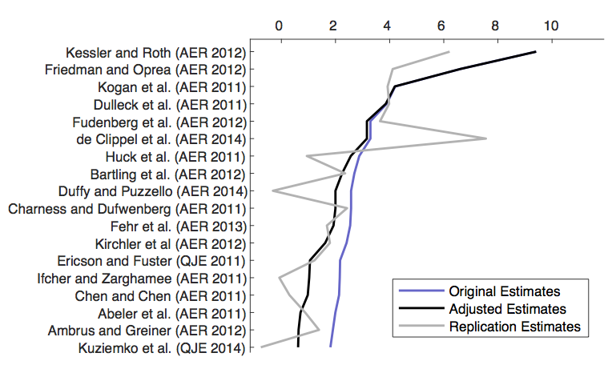

## Today

- Replication
    - What it's for 
    - How to do it
    - Advice for projects
- Material today to help provide context for replication projects
- More generally, describes what you should worry about when assessing (or performing!) empirical research

## Replication Project

- Final project is a partial replication and critical analysis of recent study from major economics journal
- Synthesizes and extends course objective skills
    - Evaluate and estimate causal effects
    - Understand and interpret applications of econometric methods, including how to interpret under different assumptions
    - Account for structure and properties of economic data (e.g. panel structure) when using these methods
    - Implement using statistical programming
- In addition to practice with econometrics, replication is a way to ensure integrity of scientific results

## Practical Issues

- You are replicating papers which have provided data, code, detailed summaries, help files: use them all
- Code is hardest
    - I **guarantee** something confusing will come up in Stata code
- Translation guide, web search, and emailing/visiting me for help are reasonable approaches
- More generally, think about expressed purpose of analysis 
    - Should be able to figure it out from paper even without looking at code
- Purpose is not just translating code
    - Interpreting and evaluating results
    - Performing scientific service of replication
- I have every reason to believe studies are high quality
    - But this need not be taken on faith
    - You can use your knowledge to evaluate

## Types of Replication and their objectives

- Narrowest kind: run and check the author's own code
    - Does it produce the claimed results?
    - Reinhart & Rogoff (2010): Excel coding error found by grad student majorly reduces size of claimed correlation, with major policy implications
- Independent replication (same data): goal of this project
    - Reproduce, evaluate, and extend published analysis of original data set
    - Does equivalent method produce same results?
    - Does data appear to satisfy assumptions needed for the methods used?
    - Do resonable alternative methods support claimed results?
- Independent replication (new data)
    - Assesses methods of data collection, variability of estimate
    - Can rely on same protocol, or assess conclusions using new (hopefully improved) method
    - Latter becomes essentially a new study
    
<!-- beyond scope of this course, but you might do in senior projects/independent research -->

## Questions to ask about an empirical paper

- What question is it asking?
    - Usually "What is the effect of X on Y"
- What data is being used?
    - Are they actually measures of X and Y claimed?
    - "coercion", "performance", "connections", "wages" need to be defined, measured
    - Answer specific to context
- What method is it using to answer the question?
    - A statistical method is a function applied to data
- What do we need to assume about the world for this method on this data to answer the question?
    - Are those assumptions consistent with what we do know about situation?
    - If not, what does the number tell us?
- How trustworthy is the result?
    - Account for sampling variability, model error, and researcher mistakes

## How to critique an empirical paper

- Important:
    - Ensure methods implemented correctly and without error
- Even more important
    - Ensure that data and methods reliably answer the question
- Method and model evaluated jointly
- Context of data collection and measurement, prior knowledge of the world can be used to assess assumptions
    - "Random sample" assumption depends on how data collected
    - Exogeneity: do we know $X$ independent of $e$? Maybe, if $X$ specifically assigned that way. 
- Some, but not all assumptions, can be verified or rejected based on data, given other assumptions
    - Does the conditional expectation function take the form we claim? Check by comparing to nonlinear or nonparametric estimates
    - Does the causal graph take the form we claim? Can test for *some* of the independence relationships between observables implied by graph.
    
## Constructive Critique

- Systematically evaluate the assumptions used
    - Test those which can be tested
    - For those not testable, assess whether measurements taken in given context should have desired properties
- Given believable assumptions, can assess method
    - Is it consistent? Unbiased? Distributed according to known distribution? Efficient?
    - Estimation and inference should be based on properties procedure has in this situation
- Suggest other methods with better properties given assumptions one believes are satisfied

## "The Credibility Revolution in Empirical Economics"

- Formerly, content of assumptions not taken seriously
- Much of economics involved regressions on observational data, (or sometimes IV) with controls chosen by data availablity and introspection
- Analysis simply assumed that specification is correct
- Recently, willingness to trust results based on models decreased
- Instead, look to situations in which design ensures assumptions are satisfied (e.g. (natural) experiments)
- When above not feasible, strong push to use methods based on weaker assumptions
    - Inference and estimates which allow broader set of or misspecified functional forms, unobserved heterogeneity, dependence across data points, etc

## Attaining Credible Results

- Methods discussed in this class provide guide to when causal effects can be identified, consistently, unbiasedly, and/or efficiently estimated
- Experiments, Control, Diff-in-Diff and Fixed Effects methods, IV, Regression Discontinuity all *take advantage of* knowledge of design to allow estimation and inference of effects
    - These methods can be run and produce a number even when design conditions not satisfied
    - When applied in situations where model assumptions are satisfied, consistency and other desirable properties follow
    - Easier to do when assumptions are weaker, hence variety of forms of robustness
- Usually requires gathering new data by experiment, or finding unique situations where methods can be applied

## Testing credibility assumptions

- "Credible" designs of kind focused on by Angrist and Pischke designed to act like experiments, at least in part of population
- Nice aspect of methods based on full randomization is that implications are strong: independence from unobservables (untestable) AND observables (testable)
- Covariate balance tests measure the latter
    - Is treatment independent of *observables*?
- Extends to other "quasiexperimental" methods with minor modifications
    - Control: conditional on controls, other (d-separated) observables should be independent of treatment
    - IV: is instrument independent of observables not being used as endogenous/exogenous regressors
    - RD: are observables *near the cutoff* independent of treatment?
    - Diff-in-Diff: "parallel trends": treatment should be independent of *slope* of time trend
- Nothing can directly tell us about things we don't observe (without further assumptions), but these can be reassuring

## Validating other assumptions

- Randomness is key design issue, but many estimators need more than this for validity
    - Especially true to accurately quantify uncertainty
- Correct specification is a major one
    - Need right form of conditional expectation
- Requires including right variables, using right functional forms
- Common sense often suggest nonlinear forms
    - E.g., discrete outcomes can't be linear function of unbounded continuous variable
- When common sense not enough, use flexible, or even nonparametric methods
- Functional form misspecification, heteroskedasticity, and dependent data all require nonstandard inference
    - Use heteroskedacity robust, clustered, and/or serial correlation robust inference whenever needed 
    
## Instrumental variables issues

- IV needs both exogeneity and relevance
- Without strong first stage, estimate unreliable
- Used to resolve endogeneity issues with OLS, at cost of less precise inference (bigger SEs)
- Alwyn Young (2017) looks at sample of IV regressions from recent econ journals 
    - Over 90% either have weak first stage or are not significantly different from OLS at 1% level
- Finding instruments which improve estimates substantially not easy
    - May be reliable tool mainly in random experiments with some but limited noncompliance
    - In these cases, since few noncompliers, IV often fairly close to OLS (called "ITT" or intent to treat estimate) anyway

    
## The "Replication Crisis"

- Recently, even fields which rely mainly on experimental data have begun worrying about reliability of results
- Independent efforts to replicate prominent results show large fraction of effects substantially exagerated
    - Esp. in psychology, increasingly medicine: econ next?
- Fault appears to be in difference between statistical theory and practical application thereof
- Theory of estimation and inference says results accurate "with high probability"
    - Probability is over possible realizations of data
    - Works if you decide on a procedure, then observe data
    - If direction reversed, no guarantees
    
## Sources of nonreplicability of "credible" research

- Sampling error!
    - These are estimates, which come with (often large) CIs
- Model error and mistakes (or, potentially, fraud) can happen
- Worse, common data practices can bias usual inference
- Researchers have "degrees of freedom" in analysis
    - Choose procedures to obtain significant results
    - Could be by trying many tests and then reporting only the "interesting" ones
    - Including different covariates/interactions, using different test statistics or estimators, etc
    - Or through less overt "adaptive" analysis: e.g., plot data, see interesting pattern, run test for that pattern
- Publication/Publicity bias
    - Even if researcher committed, public may not see full analysis
    - Insignificant findings may not be published
        - or not reported or emphasized

## Implications of Replication Issues

- Estimates with high variability are often far from the truth
- Combined with processes which emphasize or promote large and surprising results, will disproportianately see results which are larger in magnitude, even when effects are small
- New data will often find insignificant or smaller effects than initial estimate
- A replication on the same data using the same techniques should find the same results
- If authors chose technique (functional form, estimator) based on data to find large results, a replication based on other techniques will likely show smaller results
- Exactly what is found in medicine, psychology, economics
    - Effects get "smaller" over time
    
## Illustration: New Data Replication of Economics Lab Experiments

- t-statistics on new data markedly smaller than originals, though less pronounced than similar studies in psych, medicine
    

## Attaining Replicable Results

- Report all analyses performed
- If needing to control size, specify form of analysis before exploring data
- Use procedures which take into account all choices made in the analysis
- Use efficient procedures, with low probability of finding wildly wrong results just from sampling variation
- Replicate your work, or have others do so for you
    - Re-run experiment to see if form of findings holds up
- If not feasible to run experiment again, keep a "hold-out sample"
    - Subset of data you don't look at until after analysis is complete
    - Valid results should be visible in this sample
    
## Reporting of results

- Most discussion in this class proceeded as if you have a single effect to estimate, and will use one procedure only
- No empirical paper consists of just one estimate
- Many choices in your analysis can matter
    - Covariates, functional forms
    - Bandwidth or other tuning parameters
    - Subset of data used
    - Estimator used, if multiple choices available 
        - FD vs FE, Logit v Probit, etc
- If you tried multiple approaches when looking at data, report all of them
    - This is why the papers you were given have long appendices

## Take seriously your basic statistical training!

- Tests have probability of Type I and Type II error
- This is calculated for independent realizations of data
- Needs to correspond to analysis actually done 
    - If you look at multiple variables, use a multivariate test!
    - F, Wald, etc
- Estimator properties (bias, consistency, distribution) describe how estimator should perform applied to hypothetical data set
- Once data known, it's a number, not a variable
    
## Sampling variation matters

- Variance of estimates decreases with sample size
- Can't get precise estimate with small # of observations
- *Effective* sample size matters
    - Some estimates need much more data 
- IV: essentially estimates effect only using "compliers"
    - Small subset of population, especially if first stage weak
- RD: estimates effect only using samples near cutoff
- Nonparametric (kernel) regression: use only data near a point
    - Like having **nh** samples instead of **n**
- Panel data: Accounting for unobserved effects (eg by FE or FD) reduces effective sample size from $nT$ to $n(T-1)$
    - Clustering SEs by group cuts effective sample size to $n$
    - Alternative clustering assumptions can substantially affect precision
    
<!-- - Time series: Samples are correlated, information coming from distinct historical periods -->
<!--     - Use Long Run Variance instead of variance -->
<!--     - E.g., for AR(1), LR variance multiplied by $\frac{1}{1-\rho}$ -->

## Implications

- These implications do not mean estimators shouldn't be used
    - Using observational data, amount of information that can be reliably used to find causal effects much less than full sample
    - Goal of these techniques is to extract that information
- Highly variable estimates do mean low precision, vulnerability to sampling error
- "Misuse" still a concern: can perform many analyses until something interesting found
    - Maybe less than in some sciences, where many experiments can be done cheaply
    - Have to find situation with RD, IV, etc
    - Still vulnerable to many user choices: controls, bandwidth, etc
- Suggests these studies, to extent possible, need replication too
    - Even if new data not feasible to collect, should compare and evaluate techniques
    
##  Next classes

- Time series
    - One more kind of dependent data
    - Wooldridge Ch 10, 11, 12
    - Useful if you will work with macroeconomic or financial data

    
    
    
    

