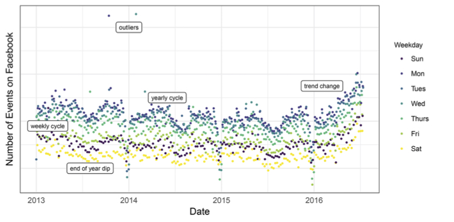
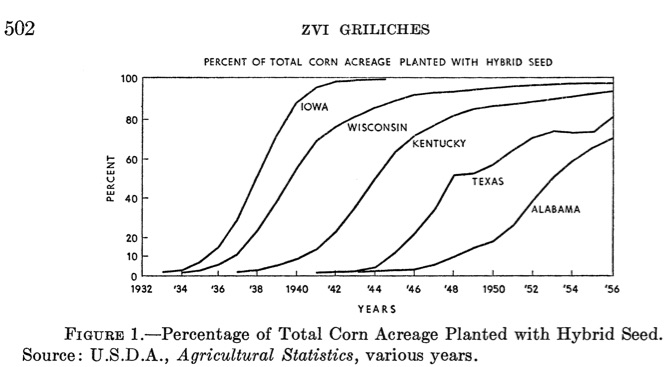

## Outline

- Additive components models
    - Seasonality
    - Trends
    - Cycle
- Motivation and Application
    - Web forecasting
    - Additive models at Facebook
    
<!-- - Additive components models -->
<!-- - Application: Web traffic forecasting at Facebook -->
<!-- - Seasonality -->
<!--     - Indicators -->
<!--     - Periodic functions -->
<!--     - Holidays -->
<!-- - Trends -->
<!--     - Linear/polynomial -->
<!--     - "Flexible"  -->
<!--         - Smoothing splines (smooth.spline) -->
<!--         - Local weighted averages (STL?) -->
<!--     - Stochastic -->
<!--     - Breaks -->
<!-- - Perils of trend extrapolation -->
<!-- - Relationship between components -->
<!-- - Cyclic components -->
<!--     - Predictors -->
<!--     - Stochastic models -->
<!-- - Estimation -->
<!--     - MAP -->
<!--     - MCMC -->
<!-- - Additive models of predictors -->
<!--     - GAMs (mgcv, gam, application in brms) -->

    
## Probability models for forecasting

- Data sequence $\mathcal{Y}_{T+h}=\{y_t\}_{t=1}^{T+h}$
- Features described by a **probability model** $\{p(\mathcal{Y}_{T+h},\theta):\ \theta\in\Theta\}$
- Probability approach uses information on these features to build a forecast
    - Given $\theta$, forecast distribution given by **conditional likelihood** $p(y_{T+h}|\mathcal{Y}_T,\theta)$
- With Bayesian approach, information about $\theta$ encoded in **posterior** $\pi(\theta|\mathcal{Y}_T):=\frac{p(\mathcal{Y}_T|\theta)\pi(\theta)}{\int_{\Theta}p(\mathcal{Y}_T|\theta)\pi(\theta)d\theta}$
    - Use **prior** $\pi(\theta)$ to express weight on different features
    - Forecast distribution given by **posterior predictive distribution** $p(y_{T+h}|\mathcal{Y}_T)=\int_{\Theta}p(y_{T+h}|\mathcal{Y}_T,\theta)\pi(\theta|\mathcal{Y}_T)d\theta$
- For probability approach, model must describe data sufficiently well that conditional likelihood encodes *all* relevant information about future from past  
- Requires encoding detailed information about data properties in $\theta$
- Goal today: introduce one class of probability models that can be used for this

## Additive Components Models

- Simple but flexible model way to build a probability model describing different features of a series
- Build model out of simple **components**, each of which describes one aspect of data
    - Trend, Seasonality, Cycle, or others as needed: breaks, external predictors, etc
- Each component may itself be built of smaller subcomponents
    - Seasonality may have annual, monthly, daily components, etc
- Each observation $y_t$ is **sum** of the several components 
    - $y_t=\sum_{j=1}^{J}\theta_j(t)$
    - A **multiplicative components model** is an additive components model of $\log y_t$    
- Each component $\theta_j(t)$ is a sequence, a function of time $t$
    - It may be **fixed**: dependent only on time 
    - Or it may be **random**: itself described by a probability model
    - Each component may have parameters which describe size or shape of that feature
- Mix and match components to model very different types of data
- By recovering components separately, can interpret movements of series

## Application: Web Forecasting at Facebook

- Large internet companies like Facebook have cost and revenue streams that depend on usage of their services 
- Need to anticipate traffic on large number of sites, which may exhibit diverse patterns, at daily or higher frequency, with usually a few years of data at most
- Have large internal data science team which may need to quickly adapt forecasts to new or different products and communicate them across the company
- Approach: developed forecasting tool, **Prophet** (`library(prophet)` in R)
- Allows simply building additive models which exhibit common features of daily web traffic data
- Built on Stan, contains 
    - Likelihoods for several common additive components
    - Adjustable priors with defaults corresponding to reasonable values for commonly seen web series
    - Options for fast MAP fit or slow MCMC if full uncertainty estimates needed

## Example Web Series, with Features Labeled

- Goal is to forecast series like these (number of Facebook events created per day)
    - Series exhibits features which should be accounted for in a model



## Seasonal Components

- Most unprocessed economic series have (fairly) regular variation at fixed frequencies
    - Day of the week, month or quarter of the year, etc
- A **seasonal component** describes this regular seasonal variation
- Simplest form: for series with $P$ observations per year, use a constant for each frequency
    - $s(t):=\sum_{p=1}^{P}a_p1\{t\mod P=p\}$
    - E.g., for monthly data $P=12$, add $a_1$ in January, $a_2$ in February. For daily data $P\approx365$, $a_1$ for January 1st, $a_2$ for January 2nd
    - Educational sites visted more during school year, leisure sites more outside of it
- If each period has regular subperiods, can also fit to regular subperiods  
    - $s_2(t)=\sum_{l=1}^{7}b_l1\{day(t)=l\}$ can model a "weekly" effect, with a value for each day of the week
        - Some sites mostly visited on weekdays, others on weekends, etc
    - $s_3(t)=\sum_{h=1}^{24}c_h1\{hour(t)=l\}$ can model a "daily" effect, with a value for each time within a day
        - Web traffic larger while people awake, more at certain hours of the day, etc
- Add subcomponents together $s_1(t)+s_2(t)+s_3(t)+\ldots$ to model regular variation correponding to particular periods  
- For any future date, forecast from seasonal component is that regular pattern will continue
    
## Fitting Seasonal Components

- Size of each period-level effect is a parameter that must be fit from data
- Can have difficulty fitting if length $T$ of series short and frequency $P$ large
    - With 3 years of data, only have 3 observations of a particular (month/quarter/date)
    - Especially with daily data, have huge number of parameters and not much data for each
    - For statistical approach, may have substantial overfitting, for Bayesian approach, forecast may be driven mostly by choice of prior
- A solution: share information across frequencies
    - Idea is that seasonal patterns may be smooth: March 5 and March 6 effects maybe not identical, but probably close
- Implementation: Model $s_j(t)$ as sum of $N$ **Fourier Components**: Sines and Cosines
    - $s(t)=\sum_{n=1}^{N}\left(a_n\cos(\frac{2\pi nt}{P})+b_n\sin(\frac{2\pi nt}{P})\right)$, with $(a_n,b_n)\overset{iid}{\sim}N(0,\sigma^2)$ prior
    - Let $N<<P$ to use only smoothly changing low frequency components: Prophet uses $N=10$ for yearly, $N=3$ for weekly by default
- Alternately, can use prior alone to achieve similar smoothing effect
    - Allow coefficients of neighboring periods $a_p$, $a_{p+1}$ to have correlated prior, like Multivariate Gaussian
        - $a_p\sim N(0,\sigma^2)$ for each $p$, $Cov(a_p, a_{p+s})=M\exp(-\theta s^2)$ for each $s$
        - Hyperparameters $(M,\theta)$ determine how far apart sharing is done, acting like $N$ in Fourier approach
    - Due to correlation, high value one day will increase posterior of high value of nearby ones

## Holidays

- Sometimes have particular periods $(D_1,\ldots,D_L)$, like holidays, which are important for series 
- These can be regularly spaced, like Christmas in Gregorian calendar, which is always 12/25
- Or they can be irregularly spaced, like Eid-al-Fitr or Superbowl Sunday
    - Either determined by alternate calendar or fixed but non-regular procedure
- If behavior of series likely to differ in these periods, include in another component
    - $h(t)=\sum_{l=1}^{L}\kappa_l 1\{t\in D_l\}$ (with, e.g., independent normal prior on each $\kappa_l$)
- If irregularly spaced, holiday effect accounts for features specifically due to timing of particular event
- Even if regularly spaced, useful when seasonal trend is smooth to allow spike distinct from smooth variation
- If seasonal effect already includes a day effect, regular holidays redundant
    - "December 25th effect" and "Christmas Effect" both give identical explanation
    - Not a problem for predictions, since identical, but can't measure components separately
        - If a prior is used, assignment to each determined only by prior 
- Can supply list of holidays relevant to own application, or use common list, as built into Prophet

## Trend Components

- To match long run growth or change, need component which matches this pattern
- Regularity across observations is needed because one does not have multiple observations at each level
- One solution: use a parametric trend with known pattern
- Linear trend $g(t)=ct$ for some $c$ if increasing at same rate $c$ over time
    - Can use polynomial trend $g(t)=c_1+c_2t+c_3t^2+\ldots$ to allow growth to be smoothly varying with time
- Use data and theory to construct trend which allows extrapolating into future
    - A linear trend will grow into the future at the same rate always without stopping
    - A quadratic trend will have growth rate increasing (or decreasing) at the same rate into the future forever
- High order polynomial trends can be dangerous, especially for long-term forecasts
    - Fit uses high order part to match up and down patterns in current data, but this is also main determinant of far future prediction
    - Fine if this link is desired (or forecast is short term), otherwise use caution
    
## Logistic Curves and Product Forecasting

- May be better to forecast trend with long-term properties matching theory
    - Many series are definitionally or logically bounded, because number of users cannot exceed population
    - Trend may exhibit fast or increasing growth in early periods, but must level off over time 
- Simple **logistic curve** exhibits these features
    - $g(t)=\frac{C}{1+\exp(-k(t-m))}$ where $C$ is maximum capacity, $k$ is growth rate, and $m$ determines when growth starts
- Commonly used in modeling how new products get adopted since Griliches (1957) on Hybrid Corn
- Can choose between linear or logistic trend in Prophet with `growth='logistic'` or `growth='linear'`



## Technology adoption typically shows logistic shape

```{r,message=FALSE,warning=FALSE}
library(prophet) #Additive components
library(fpp2) #Forecasting, etc
library(ggplot2) #Plotting
library(dplyr) #Data manipulation

techadopt<-read.csv("Data/technology-adoption-by-households-in-the-united-states.csv")
colnames(techadopt)<-c("Entity","Code","Year","Adoption")


entitytokeep<-c("Computer","Ebook reader","Electric power","Landline","Microwave","Radio",
                "Automobile","Colour TV","Household refrigerator","Social media usage",
                "Tablet")
techseries<-filter_at(techadopt,"Entity",any_vars(. %in% entitytokeep))


ggplot(data=techseries,aes(x=Year,y=Adoption,color=Entity))+geom_line()+
  ggtitle("Technology Adoption in the United States",
          subtitle="Source: OurWorldinData.org")+ylab("Adoption Rate")
```

## Breaks and Changepoints

- Many series exhibit large and sudden discrete changes in the process
    - A site or product redesign may result in rapid growth or immediate stagnation or decline
    - Media attention may spark sudden burst of activity
- These can be modeled as a change in the parameters of the *trend* process
    - Have $S$ changes at times $\{s_j\}_{j=1}^J$ where parameter changes by $\delta_j$
- May have **breaks**: discontinuous jump in trend
- Or **changes**: level stays the same but new slope or rate afterwards
    - May involve simultaneous parameter adjustments to preserve continuity
- Fixed vs random modeling of changepoints affects forecasts substantially
    - Fixed: Times $s_j$ and sizes $\delta_j$ are parameters of trend process
        - Once estimated, future forecast uses final value of trend to extrapolate
    - Random: Changes $\delta_j$ drawn from a process, and future trend may also change
- Example process: Every period, $\delta_j=0$ w.p. $\alpha$ , $\delta_j\sim \text{Laplace}(0,\tau)$ w.p. $1-\alpha$
    - Parameter $\alpha$ determines frequency of changes, $\tau$ determines size: priors over both adjust how close trend sticks to linear or logistic curve
    - 0 mean changes means center of forecast uses latest value of trend, but uncertainty increases over time
    
    
## Flexible Trends

- Many aggregate or financial economic series exhibit slow long term movements hard to describe by simple shape
- May want to allow trend component $g(t)$ to take form of smooth curve one might draw through the series
    - Such a component is called a **smoother**, **filter**, or **nonparametric regression**
- Many slightly different ways to define a smooth trend
    - Try to find a function $g(t)$ in some smooth but not necessarily finite class of functions 
- Example: Let $g(t)$ be twice differentiable function of $T$ with bounded $\int g^{\prime\prime}(t)^2 dt$
    - Penalized risk minimizer is a **smoothing spline**: piecewise cubic polynomial: `smooth.spline` in R
        - Called a Hodrick-Prescott (HP) filter when used for time
    - Can also just build trend as sum of piecewise cubic spline functions    
- Can also use estimate based simple locally-weighted average of points $\widehat{x}(t)=\sum_{h=-k}^{k}\theta_{h}x_{t-h}$ 
    - Different families of weights can describe variety of properties of trend
    - R command `stl` implements additive model with seasonal component + cyclical + trend based on smoother of this form called "Loess"
    
    
## Problems with Trend Extrapolation

- Forecasting with flexible trends causes major problems
    - If trend component is fixed, local procedure does not produce estimates of future $g(t)$
    - A prior over future trend values can be used, but value not updated by data (unless correlated priors used)   
- Different smoothers may produce extrapolations numerically, but outside of data range may be erratic
- Weighted average type smoothers weight fewer and fewer points, using only part of weighting process
    - For filters where $\theta_{h}\neq 0$ for $h>0$, future data needed to produce accurate trend estimates
    - Result is that trend estimates worst for end of series and extrapolations: exactly what's needed for forecasts
- Spline smoothers outside of data range rely on last cubic polynomial
    - Effectively are using cubic trend based on last few data points to extrapolate
    - Boundary conditions can be used to dictate exact behavior outside range
- Probability models of smooth trend can yield more principled forecasts
    - Allow predicting future values based on flexible model
    - **Stochastic trend** models commonly used in finance: defer to later classes
        
## Cyclical Component

- A complete model needs some way of accounting for remaining variation with no regular seasonal or trend pattern
    - Cyclical component $\epsilon(t)$ effectively just residual: "whatever is left"
- Useful to model cyclical component as random: only know average properties
- Simplest cyclic model: **white noise** $\epsilon(t)$ iid mean 0 
    - Reasonable when other components account for systematic patterns
- Distribution determines how other components are fit  
    - If $\epsilon_t\sim N(0,\sigma^2)$, other components describe mean of process, and MAP estimate minimizes square loss
    - If $\epsilon_t\sim \text{Laplace}(0,\tau)$, other components describe median of process, and MAP estimate minimizes absolute loss
- Occasionally, see huge values unrelated to any known pattern or data point: **outliers**
- Tail properties of noise determine frequency and magnitude of outliers
    - Distributions with thicker tails allow for more outliers, which are given less weight in estimating other components
    - **Cauchy**, **Student's t**, or **Laplace**, in decreasing order of tail thickness can be used
    - `prophet` uses normal, and suggests just manually removing outliers from data

## Extending Cyclical Component

- Often series displays non-trivial behavior after trend, seasonal, holiday, etc components removed
- Rediduals may display complicated but irregular patterns like autocorrelation, heteroskedasticity, etc
- In these cases, may use a non-white noise probability model for cycle $\epsilon(t)$
- With time dependent parts gone, may be reasonable to use stationary model
- Many available
    - We have seen regression and autoregression models, based on external series or past values
    - Mentioned Autoregressive Conditional Heteroskedasticity (ARCH) models for time-varying variance
    - More to come in future classes
    
## Putting the Components Together

- Full model just adds up seasonal, holiday, trend and cyclical components
    - $y_t=s(t,\theta_{s})+h(t,\theta_{h})+g(t,\theta_{g})+\epsilon(t)$
- Consider case where *only* cyclical component is random, with likelihood $\Pi_{t=1}^{T}p(\epsilon_t,\theta_{\epsilon})$
    - Model likelihood is then $\Pi_{t=1}^{T}p(y_t-s(t,\theta_{s})-h(t,\theta_{h})-g(t,\theta_{g}),\theta_{\epsilon})$  
- With priors over parameters, can fit this likelihood by MAP or MCMC
    - For prophet model, MAP is penalized least squares, so very fast
- In case where $\epsilon_{t}$ has conditional likelihood $p(\epsilon_{t}|\epsilon_{t-1},\ldots)$, can use past residuals to get conditional likelihood    
- If more than one additive component is random, likelihood takes more complicated form
    - Formula may involve integrals, and so require additional integration methods: need to distinguish one random component from another
    - Models of this form called "state space models": defer to later
- Once fit, forecasts are same as any other probability model
    - Center of conditional likelihood is $s(T+h,\theta_{s})+h(T+h,\theta_{h})+g(T+h,\theta_{g})$
        - So $s(T+h,\widehat{\theta}^{MAP}_{s})+h(T+h,\widehat{\theta}^{MAP}_{h})+g(T+h,\widehat{\theta}^{MAP}_{g})$ is MAP point forecast
    - Forecast interval is interval of conditional likelihood around this
    - If performing full Bayesian forecast, integrate conditional likelihood over posterior to get uncertainty   
 
## Example Implementation: Predicting Wikipedia Page Traffic

- As an example, apply additive components model to daily web traffic data
- Obtain views of Wikipedia page for "Autoregressive Integrated Moving Average" from library `pageviews`
- Use `prophet` library to obtain fit of additive components model
    - For full model details, see Taylor and Letham (2018) or library documentation
- Assumes linear trend with 25 changes in slope, taken as parameters with estimated location
    - Laplace(0,0.05) prior on size of each change: presumes mostly tiny, but some large
- Model yearly seasonality by 20 sine and cosine terms, weekly with 7 (unrestricted)
    - Priors $N(0,10)$, $N(0,3)$ for coefficients on yearly and weekly terms 
- Add US Federal holidays to account for holiday patterns
    - $N(0,10)$ prior on coefficients
- Model is fit by MAP (penalized optimization)  
- Forecast from conditional likelihood, using probability model allowing for future trend changes
    

```{r,message=FALSE,warning=FALSE}
library(pageviews) #Obtain data on Wikipedia Page Views at Daily Frequency

#Download Pageview Statistics for Wikipedia Article "Autoregressive Integrated Moving Average"
arima_pageviews<-article_pageviews(article = "Autoregressive integrated moving average",
                                   start="2012100100",end="2019100100")
#Arrange into Data Frame with proper formatting for Prophet package
df<-data.frame(as.Date(arima_pageviews$date),arima_pageviews$views)
#Prophet requires date and series names to be "ds" and "y", respectively
colnames(df)<-c("ds","y") 

#Initialize model, setting number of Fourier terms for yearly and weekly seasonality
prophetmodel<-prophet(yearly.seasonality = 20, weekly.seasonality = 7) 
prophetmodel<-add_country_holidays(prophetmodel, country_name = 'US') #Add list of commonly observed US Holidays
prophetmodel<-fit.prophet(prophetmodel,df) #Fit default prophet model by MAP
#Predict up to one year into the future
future <- make_future_dataframe(prophetmodel, periods = 365)

prophetforecast <- predict(prophetmodel, future)

#Analyze prediction residuals
presids<-df$y-prophetforecast$yhat[1:length(df$y)]

```

## Additive Components of Page Views Model

```{r}
prophet_plot_components(prophetmodel,prophetforecast)
```

## Model Fit and Forecast

```{r}
plot(prophetmodel,prophetforecast,uncertainty = TRUE)+add_changepoints_to_plot(prophetmodel)+
  ggtitle("Additive Components Fit and Forecast of Views for Wikipedia ARIMA Page",
            subtitle="MAP Fit of `Prophet' Model, Trend and Large Changepoints Marked")+
  ylab("Pageviews")+xlab("Date")
```

```{r,eval=FALSE}
#Can fit same model by MCMC, for comparison
#Warning: Extremely slow to run, over an hour at these settings on a laptop
prophetMCMC<-prophet(yearly.seasonality = 20, weekly.seasonality = 7,mcmc.samples=1000,uncertainty.samples=500) 
prophetMCMC<-add_country_holidays(prophetMCMC, country_name = 'US') #Add list of commonly observed US Holidays
prophetMCMC<-fit.prophet(prophetMCMC,df) #Fit prophet model by MCMC
```
## Interpretation

- This series is typical of Wikipedia traffic series for academic concepts
    - Strong day of week effects, with traffic plummeting on weekends
    - Holiday effects strongly negative
    - Reduced interest in summer and especially over Winter break period
- Trend grew somewhat over time, then flattened out or declined
- Forecasts predict details of patterns even 1 year out
    - Within-week and across-season variation as large or larger than total long run movements
    - Capturing these patterns of primary importance when working with series like this
    - Additive model does good job at this, even though completely ignoring any patterns in cyclical variation
- Uncertainty intervals, based on conditional likelihood only, stay similar width over time
    - IID cyclical model implies constant interval width: trend uncertainty makes this grow slightly
- ACF of residuals demonstrates serial correlation, weekly patterns, suggesting that iid model and weekly model could be improved
    - May need model of weekly component which changes over time
    
## Residual Autocorrelation Function from Additive Model

```{r}
ggAcf(presids)+ggtitle("Autocorrelation Function of Residuals from Additive Components Model")
```


## Conclusions

- Additive models particularly useful for series with strong time-dependent features
    - Account for **nonstationary** features of data
- Seasonal effects can be modeled at different overlapping frequencies, and smoothed to share information
- Trends should reflect long-term growth patterns using knowledge of reasonable outcomes
    - Understand the out-of-sample behavior implied by chosen model
- Change points and holiday effects can be accounted for to adapt to unusual behavior
- White Noise cyclic terms mainly determine loss function for other parts
    - But time series probability models can account for systematic patterns
    - Stationary cyclical dynamics can be quite complicated, and may require substantial additional modeling 
- Next class: submit and discuss Forecast Reports!    
    

## References

Zvi Griliches. “Hybrid Corn: An Exploration in the Economics of Technological Change.” *Econometrica* Vol. 25. No. 4, 1957, pp. 501–522.

Hannah Ritchie and Max Roser (2019) - "Technology Adoption". Published online at OurWorldInData.org. (https://ourworldindata.org/technology-adoption)

Sean J. Taylor & Benjamin Letham. (2018) "Forecasting at Scale" *The American Statistician* Vol 72. Issue 1, pp. 37-45.


