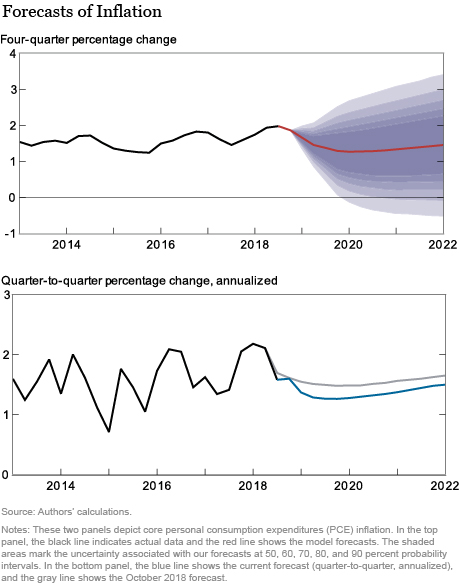
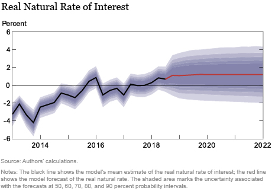

## Outline

- State Space Models
- Linear State Space Models
    - Components of state space models
- Exponential Smoothing    
- Applications
    - Inflation Forecasting
    - DSGE

    <!-- - Trends, seasonality -->
    <!-- - ARMA -->
    <!-- - Regression -->


## State Space Models

- State Space Models are a particular class of hidden variable models
    - Structure makes them easier to use, but still flexible enough to describe wide variety of patterns
- State equation: $x_{t}\sim f_t(x|x_{t-1})$ 
    - Each period, latent process evolves randomly from conditional distribution $f_t$ that only depends on current state
- Observation equation $y_{t}\sim g_t(y|x_t)$
    - Data you see drawn from conditional distribution $g_t$ that depends only on current state
- Use state to describe all the things going on over time and how they change, observation to describe how what you observe is related to it
- Distributions $\{f_t(),g_t()\}_{t=1}^{T}$ (and sometimes initial state $x_0$) are parameters of model
    - Different specifications allow for wide variety of dynamic behaviors
    - In discrete case, called a **Hidden Markov Model**, otherwise a **state space model**
- Sequence $\mathcal{X}_T=\{x_t\}_{t=1}^{T}$ are random variables but aren't seen
    - In Bayesian approach, can treat them like parameters, which are also random
    
      <!-- TODO: Equations, diagram --> 
      
## Inference and Likelihood

- Likelihood of the data $\ell(\mathcal{Y}_{T})$ given by $\int\int\ldots\int\Pi_{t=1}^{T} g_{t}(y_{t}|x_{t})f_t(x_{t}|x_{t-1})\Pi_{t=1}^{T}dx_{t}$
- So, likelihood based methods like MLE, MAP, or full Bayes require computing T-dimensional integral
- Fortunately, procedure can be split up into computing conditional likelihoods by process known as **filtering** 
1. Begin with $p_{t-1}(x_{t-1}|\mathcal{Y}_{t-1})$ (at $t=1$, this is $p(x_0)$)
2. Predict next period $x$: $p_t(x_{t}|\mathcal{Y}_{t-1})=\int f_{t}(x_t|x_{t-1})p_{t-1}(x_{t-1}|\mathcal{Y}_{t-1})dx_{t-1}$    
3. Construct conditional likelihood: $\ell(y_{t}|\mathcal{Y}_{T-1})= \int g_t(y_t|x_t)p_t(x_{t}|\mathcal{Y}_{t-1})dx_t$
4. Use Bayes rule to predict $x_t$: $p(x_t|\mathcal{Y}_t)=\frac{g_t(y_t|x_t)p_t(x_{t}|\mathcal{Y}_{t-1})}{\ell(y_{t}|\mathcal{Y}_{T-1})}$
5. Go back to 1
- From this procedure, obtain conditional likelihood for inference and prediction
    - Also get sequence of filtered distributions $p(x_{t}|\mathcal{Y}_{t})$ which give best guess of state as of time $t$ 
- Now only one integral per step: still a challenge, but more feasible: approximate integrals sequentially
- For discrete data case (HMM) steps have known closed form
- Linear gaussian case also has explicit steps: **Kalman Filter**


<!-- - For fixed sequences $\{f_t(),g_t()\}_{t=1}^{T}$, cannot know $x_t$ exactly, but do have probability model for it -->
<!--     - Can apply Bayesian approach to learn about it -->
<!-- - $\ell(y_1)=\int f_1(y_1|x_1)g_1(x_1|x_0) dx_1$  -->
<!-- - $p(x_1|y_1)\propto f_1(y_1|x_1)g_1(x_1)$ Update by Bayes rule -->
<!-- - $p(x_2|y_1)=\int g_2(x_2|x_1)p(x_1|y_1) dx_1$ Integrate to get next period state -->
<!-- - $\ell(y_2|y_1)=\int f_2(y_2|x_2)p(x_2|y_1) dx_1$ Integrate to get conditional likelihood -->


## Linear State Space Model

- By far most common subclass of state space models assumes linear equations and normal shocks
    - Mostly for computational reasons, but can do a lot with just this
- Observation Equation
    - $y_t=a_{t}x_t+b_{t}u_t$
    - $u_t\overset{iid}{\sim}N(0,\Sigma_u)$
    - Describes how **observed variables** $y_t$ are determined by **latent variables** $x_t$
- State Equation    
    - $x_{t}=c_{t}x_{t-1}+d_{t}e_t$
    - $e_t\overset{iid}{\sim}N(0,\Sigma_e)$    
    - Describes how latent variables change over time
- Invented to predict rocket trajectories, used for sending people to the moon in 1960s 
- Example: **local level model** $y_t=x_t+u_t$ $x_{t}=x_{t-1}+e_t$
    - Latent state is random walk, describing stochastic trend, observable contains both this trend and a noise component
    - Data behaves like random walk (has unit root), but noise data beyond most recent observation needed to uncover state

## Dynamic Regression Model

- Many models can be written in state space form by clever choice of state and parameters
- Can include **regression model** by letting state be the coefficient and coefficient be the data
    - Observations $\{y_t\}_{t=1}^{T}$ and predictor  $\{a_t\}_{t=1}^{T}=\{z_t\}_{t=1}^{T}$
    - Model is  $y_t=z_t\beta+u_t$ 
- Here, state $x_t$ is coefficient $\beta$
    - Since constant over time $\beta_{t}=\beta_{t-1}+0*e_t$, with intitial value $\beta_0=\beta$
- This leads to simple extension: **dynamic regression model** where coefficient varies over time
    - $y_t=z_t\beta_t+u_t$
    - $\beta_{t}=\beta_{t-1}+e_t$ 
    - Allows predictor $z_t$ to have smoothly evolving effect over time
- Can also allow more general process for $\beta_t$
    - $(\beta_{t}-b)=\phi(\beta_{t-1}-b)+e_t$
    - Allows coefficient to vary around long run mean $b$

## Multivariate Linear State Space Model

- Let $y_{t}\in\mathbb{R}^n$, $x_t\in\mathbb{R}^m$ be multiple observations, multiple states
    - Use this to represent many components of series
- **Observation Equation** $y_{i,t}=\sum_{j=1}^{n}a_{i,j,t}x_{j,t}+\sum_{k=1}^{m}b_{i,k,t}u_{i,t}$ for $i=1\ldots m$
    - $\{u_{i,t}\}_{i=1}^{m}$ jointly $N(0,\Sigma_u)$ with $\Sigma_{u}$ the covariance across shocks
    - Vector representation $y_t=Ax_t+Bu_t$
- **State Equation** $x_{j,t}=\sum_{k=1}^{n}c_{j,k,t}x_{k,t-1}+\sum_{l=1}^{m}d_{j,l,t}e_{l,t}$ for $j=1\ldots n$
    - $\{e_{j,t}\}_{j=1}^{n}$ jointly $N(0,\Sigma_e)$ with $\Sigma_{e}$ the covariance across shocks
    - Vector representation $x_{t}=Cx_{t-1}+De_t$
- Any set of univariate state equations can be combined additively to make a multivariate state space model
    - State equations are the same, observation equation now $y_t=\sum_{j=1}^n a_{i,j}x_{j,t}$
    - Allows building model out of many components, each of which describes some aspect of model
    - Additive components model is special case, but now can have many random components as well

## Building blocks of multivariate state space models

- The following components are possible options that can be included in such a model
- Deterministic trend, seasonality, and holiday components exactly as in additive model
    - Represent values parameters which depend on time
- Linear regression with any set of predictors $z_t$
    - Can extend to case where coefficients vary over time also
- ARIMA models
    - Any ARIMA model has a state space representation
    - This is in fact how likelihood for ARIMA models built in standard commands
- Time varying drift
    - $\mu_{t}=\mu_{t-1}+\delta_{t-1}+e_{1t}$, $(\delta_t-D)=\phi (\delta_{t-1}-D)+e_{2t}$
    - Allows local level model to drift upwards or downwards at rate "close to" D
- Seasonality 
    - Can allow seasonal components to change over time

## State Space Representation of ARMA models

- Standard representation has observation depending only on current state
    - And state depending on only most recent past state
- Can incorporate longer history by adding states which "store" previous values
- AR(p) model $y_t=\sum_{j=1}^{p}b_jy_{t-j}+\epsilon_t$
- Let state be $x_{t}=[y_t,y_{t-1},\ldots,y_{t-p+1}]^\prime$, $e_t=[\epsilon_t,0,\ldots,0]$
- Observation equation is $y_t=x_{1,t}$ 0 coefficient on all states except current
- State equations for $x_t$
    - First is $x_{1,t}=\sum_{j=1}^{p}b_jx_{j,t-1}+\epsilon_t$
    - Each subsequent one is just $x_{j,t}=x_{j-1,t-1}$ for $j=2\ldots p$
- State stores lagged values, and update to next position ensures $y_{t-j}$ today becomes $y_{t-j-1}$ tomorrow
- ARMA(p,q) process representation uses similar trick, with more complicated formulas
- Likewise for seasonality: Assume seasonal components sum to 0 on average
    - $s_{1,t}=-\sum_{j=2}^{m}s_{j,t}+e_t$ is first state equation
    - Add $s_{j,t}=s_{j-1,t-1}$ for $j=2\ldots m$ so seasons rotate on cycle of length $m$

## Estimation of Linear State Space Models

- With linar gaussian models, each update step in filtering procedure has known formula
- Each conditional density $p_t(x_{t}|\mathcal{Y}_{t})$ is Gaussian, so update formulas reduce to finding new means and covariances
    - Kalman filter formulas are several lines of computationally straightforward matrix algebra
- If observation and state equation *known*, filter produces conditional likelihood $\ell(y_{t+1}|\mathcal{Y}_T)$ to use for forecasting
- If parameters $\theta$ determining $A(\theta)$, $B(\theta)$, $C(\theta)$, $D(\theta)$ unknown, filter gives likelihood at each $\theta$
- Maximum likelihood: at each $\theta$, run Kalman filter to produce likelihood, iterating over parameters to find maximizer
    - Under usual stationarity and weak dependence, usually chooses $\widehat{\theta}$ near optimum if $T$ large
    - Like with MA special case, identifiability issues may make solution non-unique, or approximation less precise
- Bayesian case is standard: Given prior $\pi(\theta)$, posterior $\propto\ell(\mathcal{Y}_T|\theta)\pi(\theta)$  
    - Run Kalman filter inside MCMC sampler to calculate likelihood at each point
    - Posterior predictive density $p(y_{t+1}|\mathcal{Y}_T)$ generated by integrating conditional likelihood over posterior
    - Common to choose gaussian priors over coefficients as in other linear models for tractability
- In $R$, library `dlm` executes Kalman filter and MLE for arbitrary model, many functions use special cases    
- Library `bsts` from Google Data Science provides convenient interface for Bayesian case
    - Common components built in, reasonable default priors, and fast samplers

## Exponential Smoothing

- Exponential smoothing models are particularly simple class of state space models
- State innovation $e_t$ and observation innovation $u_t$ are the same (equivalently, perfectly correlated)
    - Allows closed form forecast rule and simple likelihood formula
- Many varieties correspond to different components in rule
- **Simple Exponential Smoothing** $y_t=\ell_{t-1}+\epsilon_t$ $\ell_t=\ell_{t-1}+\alpha\epsilon_t$
    - Like local level model, but dependent shocks give exact updates
- Additive (damped) trend method: $y_t=\ell_{t-1}+\phi b_{t-1}+\epsilon_t$, $\ell_t=\ell_{t-1}+\phi b_{t-1}+\alpha\epsilon_t$, $b_{t}=\phi b_{t-1}+\beta\epsilon_t$
    - Adds drift $b_t$ to account for trends, with size moving according to AR(1) model
- Seasonal component: $y_t=\ell_{t-1}+s_{t-m}+\epsilon_t$  $s_t=s_{t-m}+\gamma\epsilon_t$, $\ell_t=\ell_{t-1}+\alpha\epsilon_t$
    - Adds seasonal component (with moving size) to account for frequency $m$ repetitions
- Can also combine seasonal with trend, or change additive to multiplicative
- **ets()** command estimates by MLE, choosing components by AICc if not specified
- ets is default method in **forecast()** command
    - Flexible enough to capture persistence, seasonality, trends, with few parameters: reasonable choice for short series with not much data

## Filtering vs Smoothing

- State space models particularly valuable for their interpretability
    - Allow decomposing data into multiple components with known structure
- While not needed for general forecasting, can be useful to recover values of $x_t$    
- Due to presence of multiple components, exact value cannot be known, but can construct a posterior distribution
- Recovering $p(\mathcal{X}_T|\mathcal{Y}_T)$ is called **smoothing**
- Contrasts with **filtering**, which produces $p(x_t|\mathcal{Y}_t)$ using only past, and not also future data
    - Future observations provide additional information regarding current state
- Smoothing generally computationally complicated, but simple formulas in linear Gaussian case
- Common to present smoothed components as interpretable summary of different parts of series
    - Since only obtain density of $x_t$, not exact value, present means and intervals
    
## Example: State Space Decomposition

- Take Consumer Price Index Inflation as an example for decomposition
    - Exhibits large persistent spikes in 1970s which might be hard to capture with stationary ARMA component
- Exponential smoothing can be used to proide simple decomposition
    - AICc suggests to choose model with additive damped trend (and no seasonality, as series deseasonalized)
    - Unlike generic state space models, because only one shock, can recover components exactly rather than perform smoothing
- Based on this, build less restricted linear state space model and apply Bayesian estimate using BSTS
    - Start with "semilocal linear trend" component: exactly ETS model but observation, trend, and drift shocks are independent normal
    - Normal prior on slope parameters, inverse gamma on variances
- Fed Funds Rate, primary interest rate set by monetary policy, exhibits similar patterns to inflation series 
    - Add a dynamic regression component: $\beta_tFFR_t$ with $\beta_t=\beta_{t-1}+e_{t}$
    - Reflects possibly changing relationship between policy and outcomes
    - With multiple random components, get time series of posterior distributions
    

```{r,message=FALSE,warning=FALSE,}
library(fredr) #FRED Data
library(fpp2) # Forecasting tools
library(bsts) #Bayesian State Space Models
library(gridExtra) #Graph Display

fredr_set_key("8782f247febb41f291821950cf9118b6") #Key I obtained for this class

#One Year Percent Change in Consumer Price Index for All Urban Consumers
INFLATION<-fredr(series_id = "CPIAUCSL",units="pc1") 

#Fed Funds Rate
FEDFUNDS<-fredr(series_id = "FEDFUNDS") 
fedfunds<-ts(FEDFUNDS$value,frequency=12,start=c(1954,7),names="FFR")

inflation1<-ts(INFLATION$value,frequency=12,start=c(1947,1),names="CPI")
#Truncate to same window as Fed Funds Rate
inflation<-window(inflation1,start=c(1954,7))

#monetarydata<-as.ts(data.frame(inflation,fedfunds),frequency=12,start=c(1954,7))

# Estimate Exponential Smoothing Model of Inflation
# Choose components by AICc, estimate parameters by maximum likelihood
inflETSmodel<-ets(inflation)

#Construct 6 month forecast

inflETSfcst<-forecast(inflETSmodel,h=6)
```

## Exponential Smoothing Component Decomposition: $y_t$, $\ell_t$, $b_t$

```{r,message=FALSE,warning=FALSE}
#Plot components and variance decomposition
autoplot(inflETSmodel)

# Build a Bayesian State Space Model of Inflation

#Start by adding components to specification object

ss<-AddSemilocalLinearTrend(
     state.specification = list(), #Initialize with empty list
     y=inflation) #Use data to define scale of prior

ss<-AddDynamicRegression(state.specification=ss,
                         inflation~fedfunds)

# Set number of MCMC draws, and number to discard as "burn in" in analysis
niter<-1000
burnins<-500
  
#Construct model posterior by MCMC sampling
model <- bsts(inflation, state.specification = ss, niter = niter)

coefdraw<-matrix(nrow=niter,ncol=length(fedfunds))
for (i in 1:niter){
  coefdraw[i,]<-model$dynamic.regression.coefficients[i,1,]
}

#Remove first 500 draws as burnin
coefdraws<-coefdraw[(burnins+1):niter,]

# Make forecast under contingency that fed funds rate stays constant for next 6 months
cffr<-last(fedfunds)
newffr<-c(cffr,cffr,cffr,cffr,cffr,cffr)

newdata<-data.frame(newffr)
colnames(newdata)<-c("fedfunds")


#Construct posterior predictive distribution by sampling
pred <- predict(model, newdata=newdata,
                horizon = 6, burn = burnins)

```

## BSTS Filtered Decomposition into Components

```{r,message=FALSE,warning=FALSE}
#Time series of posterior distributions for trend and dynamic regression components
PlotBstsComponents(model)
```

## BSTS Filtered Coefficients
```{r}
#Time series of Coefficient posterior distributions
PlotDynamicDistribution(coefdraws) 
```


## Results and Interpretation

- Huge uncertainty in trend component, with most driven by FFR until recently
- Then inflation more stable and link to FFR much weaker
    - Coincides with Zero Lower Bound period where interest rate constrained?
- Forecast with regression requires forecasting predictors
    - Either use lagged predictors or supplement with additional forecasts  
- Here, construct conditional forecasts given Fed Funds Rate stays constant
    - Produces conditional posterior predictive distribution
- Point forecasts similar across models, but uncertainty intervals much wider for full state space model
    - Reflects uncertainty in multiple components added together

## BSTS vs ETS Forecasts

```{r}
#ETS
autoplot(inflETSfcst)
#BSTS
plot(pred)
```


## Application: Macroeconomic Forecasting with DSGE Models

- Central banks value models which permit both forecasting and interpretation
- State space models with Bayesian priors over equations provide reasonable forecast performance
    - Due to flexibility to capture data features but substantial regularization from priors
- Also provide interpretability since components can be backed out by smoothing
- Most central banks now use version where parameterization of model based on economic theory 
- "Dynamic Stochastic General Equilibrium" (**DSGE**) model solves system of economic equilibrium equations to form a state space model
    - Priors over economic parameters used to put priors over coefficients
    - Introduced at European Central Bank by Smets & Wouters (2003)
- Forecast performance similar to BVARs, but policymakers find it useful to see which shocks responsible for outcome
    - Answers entirely dependent on structure of model, so substantial economic intuition needed to interpret
- Following figure an example: NY Fed DSGE's latest (Jan 2019) inflation forecasts
    - Along with estimate of a latent variable they call "natural rate of interest", that policymakers care about but is not directly observed  
    - Comes from multivariate stae space model with many components corresponding to macroeconomic relationships
    

## Jan 2019 NY Fed DSGE Forecasts and Estimated State

  


## Conclusions

- State Space Models are structured way to build model from many probabilistic and deterministic components
- Construction of likelihood requires filtering, which is easiest in Linear Gaussian case
- Kalman Filter approach encompasses models which can account for many structural components, additional predictors
- Can use smoothing to construct posterior distribution of components and interpret movements in series
    
## References

- Michael Cai, Marco Del Negro, Ethan Matlin, and Reca Sarfati. "[The New York Fed DSGE Model Forecast—January 2019](https://libertystreeteconomics.newyorkfed.org/2019/02/the-new-york-fed-dsge-model-forecastjanuary-2019.html#more)" (2/8/2019)  
- E. E. Holmes, M. D. Scheuerell, and E. J. Ward "[Applied Time Series Analysis for Fisheries and Environmental Sciences](https://nwfsc-timeseries.github.io/atsa-labs/)"  
    - Text on state space modeling in environmental science, with R libraries for MLE and Bayesian estimation
- Frank Smets and Raf Wouters. "An estimated dynamic stochastic general equilibrium model of the euro area." Journal of the European economic association 1, no. 5 (2003): 1123-1175.  
    - First Bayesian DSGE in use by a central bank
- Case studies of state space models for forecasting with BSTS library
    - Kim Larsen "[Sorry ARIMA, but I’m Going Bayesian](https://multithreaded.stitchfix.com/blog/2016/04/21/forget-arima/)" (2016)
        - Stitchfix (online retailer)
    - Steven Scott "[Fitting Bayesian structural time series with the bsts R package](http://www.unofficialgoogledatascience.com/2017/07/fitting-bayesian-structural-time-series.html)" (2017)
        - Google Data Science


