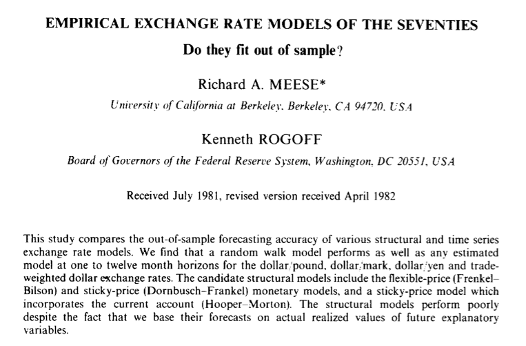

    
## Exchange Rate Forecasting 

- Influential early forecasting study: Meese and Rogoff (1983)
- Context: huge change in US exchange rate policy from fixed to floating rates in 1970s
    - Theory not well developed at the time
- Economic and business planning require good guesses of future exchange rate
    - Future appreciation raises value of foreign assets and sales, depreciation lowers them 
- Meese and Rogoff contribution: a forecasting "horse race"
    - Take one problem (exchange rates), apply many methods
    - Compare performance (MSE, MAE)
    - Learn about what works
    
    

## Exchange Rate Series

```{r,message=FALSE,warning=FALSE}
suppressPackageStartupMessages(library(fpp2)) 
library(fredr) #Access FRED, the Federal Reserve Economic Data
#To access data by API, using R rather than going to the website and downloading
#You need to request a key: you can do so at https://research.stlouisfed.org/docs/api/api_key.html
fredr_set_key("8782f247febb41f291821950cf9118b6") #Key I obtained for this class
```
```{r,message=FALSE,warning=FALSE} 
#Get 1970s data
#Let's get the (main) series for the Yen-Dollar Exchange rate
EXJPUS<-fredr(series_id = "EXJPUS",observation_end=as.Date("1982-01-04")) 
#You can also download this series at https://fred.stlouisfed.org/series/DEXJPUS
#Let's get the (main) series for the Dollar-Pound Exchange rate
EXUSUK<-fredr(series_id = "EXUSUK",observation_end=as.Date("1982-01-04"))
#Let's get the (main) series for the German Deutschmark-Dollar Exchange rate
EXGEUS<-fredr(series_id = "EXGEUS",observation_end=as.Date("1982-01-04"))
#convert to time series and normalize so 1971-1 value is 1
ukus<-ts(EXUSUK$value[1]/EXUSUK$value,start=c(1971,1),frequency=12)
jpus<-ts(EXJPUS$value/EXJPUS$value[1],start=c(1971,1),frequency=12)
geus<-ts(EXGEUS$value/EXGEUS$value[1],start=c(1971,1),frequency=12)

autoplot(ukus, series="Pound (U.K.)")+autolayer(jpus,series="Yen (Japan)")+autolayer(geus,series="Deutschmark (Germany)")+
      labs(x="Date",y="Units/Dollar", title="Dollar Exchange Rates in the 1970s",
      subtitle="Monthly From 1971 to 1982, Index Starting at 1 in January 1971")+
      guides(colour=guide_legend(title="Currencies"))
```

    
## The Statistical Approach

- Build a probability **model** of the time series
- Find a way to **estimate** the "true" parameters
- Construct forecast from estimated model


## The Statistical Machine Learning approach

- Choose a class of forecast **methods** $\mathcal{F}$
    - Called "hypotheses" in Machine Learning
- Find a way to pick the best performing method
- Construct a forecast by applying the chosen method

- Looks extremely similar to above
    - Can be thought of as a generalization
    - Difference 1: Data assumed to come from wider class of models
    - Difference 2: Hypothesis class not restricted to same parameterization as models
    
- Today: Focus on shared features, using machine learning notation    


## Statistical Learning

- How does one pick the "best" method $f\in\mathcal{F}$
- Goal is to minimize **risk**
$$R_{p}(f)=E_{p}[\ell(y_{t+h},f(\mathcal{Y}_T))]$$
- Question is, risk with respect to which distribution $p$?
- Assumption: there exists a "true" distribution $p\in\mathcal{P}$ from which sequence is drawn
- Statistical Learning goal: For any distribution $p$ in some class $\mathcal{P}$
    - Find rule $\widehat{f}$ that gives small **Excess risk** over **Oracle Risk** $\underset{f\in\mathcal{F}}{\min}R_p(f)$
- Letting $f^{*}=\underset{f\in\mathcal{F}}{\arg\min}R_p(f)$, we want a rule that gives small value of
$$R_p(\widehat{f})-R_p(f^{*})$$
- This says, *for any* distribution, want to perform well *on average*, *relative to* the best-in-class
 

## Empirical Risk

- Problem: We don't know the "true" risk because we don't know $p$
- Attempted solution: approximate it using data
- Standard approximation: **Empirical Risk**
$$\widehat{R}(f)=\frac{1}{T-h}\sum_{t=1}^{T-h}\ell(y_{t+h},f(\mathcal{Y}_t))$$
- This is now something we can calculate

## Empirical Risk Minimization

- If we knew the true risk, could find best procedure easily
    - Minimize $R_{p}(f)$ over class $\mathcal{F}$
- So, why not try to minimize empirical risk
$$\widehat{f}^{ERM}=\underset{f\in\mathcal{F}}{\arg\min}\frac{1}{T-h}\sum_{t=1}^{T-h}\ell(y_{t+h},f(\mathcal{Y}_t))$$
- Forecasting rule: apply the **Empirical Risk Minimizer** (ERM) to the data
$$f(\mathcal{Y}_T)=\widehat{f}^{ERM}(\mathcal{Y}_T)$$
- Is this a good idea?
    - Can evaluate using decision theoretic criteria
    - In particular, based on excess risk over oracle $R_p(\widehat{f})-R_p(f^{*})$ $\forall p\in\mathcal{P}$
- Answer depends on $\mathcal{P},\mathcal{F}$
    - Can provide conditions under which answer is: yes, it's pretty good 

## Applying Empirical Risk Minimization

- ERM principle is standard way to turn parameterized family of forecasting rules into a single rule: e.g.
    - Let $\ell(y,\widehat{y})=(y-\hat{y})^2$ square loss
    - Let $\mathcal{F}=\Theta:=\{\theta:\ \theta\in\mathbb{R}\}$ the constant forecast rules
    - ERM principle says to choose 
$$\widehat{\theta}^{ERM}=\underset{\theta\in\Theta}{\arg\min}\frac{1}{T-h}\sum_{t=1}^{T-h}(y_{t+h}-\theta)^2$$
- Solving optimization problem, obtain result
$$\widehat{\theta}^{ERM}=\frac{1}{T-h}\sum_{t=1}^{T-h}y_{t+h}$$
- This gives (up to a sample shift) the mean forecast rule!
    - Went from infinite class of forecast rules to single, intuitive one
- Many forecast functions implement ERM for parameter selection
    - **Arima** command implements ERM for autoregression (AR(p)) forecast rule, h=1, and square loss
    
    <!-- - **lm** command implements ERM for regression forecast and square loss -->

## Applications to exchange rate data

- Forecast exchange rates with AR(p) and mean forecasts, selecting parameters by minimizing empirical square loss

```{r}
#Mean forecasts
gemeanf<-forecast(meanf(geus))
jpmeanf<-forecast(meanf(jpus))
ukmeanf<-forecast(meanf(ukus))
#AR(2) forecasts
geARf<-forecast(Arima(geus,order=c(2,0,0)))
jpARf<-forecast(Arima(jpus,order=c(2,0,0)))
ukARf<-forecast(Arima(ukus,order=c(2,0,0)))
```
```{r}
#Plot results
autoplot(ukmeanf,PI=FALSE,series="U.K. Mean")+autolayer(jpmeanf,PI=FALSE,series="Japan Mean")+autolayer(gemeanf,PI=FALSE,series="Germany Mean")+
  autolayer(ukARf, PI=FALSE, series="U.K. AR(2)")+autolayer(jpARf,PI=FALSE,series="Japan AR(2)")+autolayer(geARf,PI=FALSE,series="Germany AR(2)")+
  autolayer(ukus, series="Pound (U.K.)")+autolayer(jpus,series="Yen (Japan)")+autolayer(geus,series="Deutschmark (Germany)")+
      labs(x="Date",y="Units/Dollar", title="Dollar Exchange Rates in the 1970s and ERM forecasts",
      subtitle="Monthly From 1971 to 1982, Index Starting at 1 in January 1971, with Forecasts")+
      guides(colour=guide_legend(title="Currency & Forecast Method"))
```


## In-sample and out of sample error

- For any procedure $\widehat{f}$ we apply, we care about the true risk $R_p(\widehat{f})=E[\ell(y_{t+h},\widehat{f}(\mathcal{Y}_t))]$
    - This is never observable when distribution $p$ not known
    - Instead, only have the empirical risk $\widehat{R}(\widehat{f})=\frac{1}{T-h}\sum_{t=1}^{T-h}[\ell(y_{t+h},\widehat{f}(\mathcal{Y}_t))]$
- How good a measure is this? A trivial decomposition
$$R_p(\widehat{f})= \stackrel{\text{Empirical Risk}}{\widehat{R}(\widehat{f})}+\stackrel{\text{Generalization Error}}{(R_p(\widehat{f})-\widehat{R}(\widehat{f}))}$$
- Quality of forecast is sum of two components
    - How well that forecasting method performed in the past
    - How much past performance differs from future results
- First component is minimized by ERM
    - Do as well as possible in class $\mathcal{F}$ on this component
    - Bigger set $\mathcal{F}$ always improves this
- Second component not knowable in practice
    - But if we can somehow ensure it is small, procedure will do nearly as well in the future
    - Conversely, if it is large, good observed performance not meaningful: method is said to **overfit**

## Controlling overfitting

- How do we get small generalization error?
    - Ex ante bounds: prove that procedure $\widehat{f}$ has small generalization error
    - This will depend on class $\mathcal{P}$ of distributions and details of procedure: for ERM, class $\mathcal{F}$ of hypotheses
- Simple upper bound on generalization error $R_p(\widehat{f})-\widehat{R}(\widehat{f})$ 
- Error of $\widehat{f}$  can be no worse than Uniform Error: maximum error of any $f\in\mathcal{F}$
$$(R_p(\widehat{f})-\widehat{R}(\widehat{f}))\leq \underset{f\in\mathcal{F}}{\sup}\left|\widehat{R}(f)-R_p(f)\right|$$
- Overfitting bounded when Empirical Risk is good approximation of true risk **uniformly** over $\mathcal{F}$ for any $p\in\mathcal{P}$
- Easy to see that uniform error is *increasing* in size of $\mathcal{F}$
    - More overfitting possible when choosing from many models
- ERM principle has tradeoff when choosing model $\mathcal{F}$
    - Larger or more complicated class improves in sample fit, but increases overfitting
- To quantify this, need bounds on uniform error
    - Can be shown for certain classes of distributions and models


## Alternate viewpoint: Excess Risk

- Decomposition of risk into empirical risk and generalization error provides bounds which depend on data observed
    - May be good or bad for different realizations: can't tell us what class to choose ex ante
- Quantity we can control with ERM is excess risk relative to an oracle
    - Perform (nearly) as well as best model in class, for any distribution $p\in \mathcal{P}$
$$R_p(\widehat{f}^{ERM})-R_p(f^{*})$$
- Decomposes into
$$\stackrel{\text{Generalization Error}}{(R_p(\widehat{f}^{ERM})-\widehat{R}(\widehat{f}^{ERM}))}+\stackrel{\text{Oracle Approximation Error}}{(\widehat{R}(\widehat{f}^{ERM})-R_p(f^{*}))}$$ 
$$\leq(R_p(\widehat{f}^{ERM})-\widehat{R}(\widehat{f}^{ERM}))+(\widehat{R}(f^{*})-R_p(f^{*}))$$
- Upper bound because $\widehat{f}^{ERM}$ gives smaller empirical risk than any other rule, even the one giving smallest true risk
$$\leq2\underset{f\in\mathcal{F}}{\sup}\left|\widehat{R}(f)-R_p(f)\right|$$
- Relative risk of ERM is guaranteed to be small whenever uniform error is small for any $p\in\mathcal{P}$

<!-- ## Analysis -->

<!-- - Goal: $\forall{p}\in\mathcal{P}$ $\underset{f\in\mathcal{F}}{\inf}E_{p}[\ell(y_{t+h},f(\mathcal{Y}_T))]$ -->

<!-- - Generalization Problem: Sample mean is not "true" mean -->

<!-- Claim:  -->
<!-- $$\underset{p\in\mathcal{P}}{\sup}\underset{f\in\mathcal{F}}{\sup}\left|\frac{1}{T-h}\sum_{t=1}^{T-h}\ell(y_{t+h},f(\mathcal{Y}_t))-E_{p}[\ell(y_{t+h},f(\mathcal{Y}_T))]\right|\to  0$$ -->


<!-- ## Fundamental Theorem of Machine Learning -->

<!-- - Total Error = Training Error + Generalization Error -->

<!-- $$R_p^*(\mathcal{F})=\underset{f\in\mathcal{F}}{\min}E_p\ell(y_{t+h},f(\mathcal{Y}_t))=$$ -->
<!-- $$\frac{1}{T-h}\sum_{t=1}^{T-h}\ell(y_{t+h},\widehat{f}(\mathcal{Y}_t)) +(\frac{1}{T-h}\sum_{t=1}^{T-h}\ell(y_{t+h},\widehat{f}(\mathcal{Y}_t))-E_{p}[\ell(y_{t+h},f^*(\mathcal{Y}_T))])$$ -->


## When is uniform error small?

- If $\underset{f\in\mathcal{F}}{\sup}\left|\widehat{R}(f)-R_p(f)\right|$ is small $\forall p\in\mathcal{P}$, ERM has small excess risk and small generalization error
- Uniform bound can be guaranteed to be true under certain conditions on $\mathcal{P}$ and $\mathcal{F}$
    - Here, "small" means bounded above by something that goes to 0 as amount of data increases
    - May not actually be small without long history of observations
- The future is "like" the past
    - **Stationarity**
- Averages are close to expectations
    - **Ergodicity**
- Closeness is true for any $f$ we pick
    - **Uniformity** (or limited **Complexity**)

    <!-- - When oracle risk $R_p(f^{*})$ does not depend on $p$, excess risk bound also gives minimax risk bound -->
    <!-- - Ex: when perfect forecast rule exists, $R_p(f^{*})=0$ for all $p$ -->

## Stationarity 

- Stationarity is a feature of probability distributions over sequences $\{y_t\}_{t=-\infty}^{\infty}$
- It gives one formalization of idea that "future is like the past"
    - Need something like this idea to claim that past data tells us about future data
- Take any set of time periods $\mathcal{T}\subset \mathbb{N}$, ie $\mathcal{T}=\{3,5,6,300,301,10000,\ldots\}$
- Then the joint distribution of $\{y_t\}_{t\in\mathcal{T}}$ is the same as the joint distribution of $\{y_{t+h}\}_{t\in\mathcal{T}}$ for any $h\in\mathbb{N}$
    - A shift forward or backwards in time leaves the *distribution* unchanged
    - *In distribution*, parts of sequence in future will look like parts of sequence in past
    - Implies mean, variance, covariance, etc unaffected by time shift
- Distributions over sequences which are stationary have similar patterns regardless of current date
- Need not have similar patterns conditional on data
    - $y_{t}$ may be correlated with $y_{t+2}$, so *conditional on* $y_t$, mean of $y_{t+2}$ different
    - But correlation should be same as between $y_{t+60}$ and $y_{t+62}$
- Rules out many commonly observed patterns
    - Seasonality, trends, and many other cases to be discussed later

## Approximating the Mean

- Sample average is used to approximate mean of (functions of) time series
- Want $\frac{1}{T}\sum_{t=1}^{T}g(y_t)-E_p g(y_t)$ "small", in some sense, when $T$ is big
- For this to be reasonable, need stationarity (and finite mean)
    - Mean $E_p g(y_t)$ exists, independently of time $t$
- Also need that observed values in reasonable size finite sample not tend to be too far above or below
- Know one class of distributions where this is true: $p$ is independent and identically distributed
    - Then have **Law of Large Numbers**
    - $\forall p$ iid with finite mean, for all $c>0$ $p(\left|\frac{1}{T}\sum_{t=1}^{T}g(y_t)-E_p g(y_t)\right|>c)\to 0$ as $T\to\infty$


## Weak Dependence and Ergodicity

- Don't need actual independence for law of large numbers 
    - Just that sequence of large values likely to be balanced out by subsequent series of small values
- Sufficient condition: **weak dependence**
    - As time between observations gets longer, relationship gets weaker
    - Today and tomorrow may be highly correlated, but today and 10 years from now "close to" independent
- A distribution $p$ over sequences is said to be **ergodic** if law of large numbers holds: for all $c>0$
$$p(\left|\frac{1}{T}\sum_{t=1}^{T}g(y_t)-E_p g(y_t)\right|>c)\to 0\text{ as }T\to\infty$$
- For any $p$ in class $\mathcal{P}$ of stationary and ergodic distributions, sample average is eventually close to mean 
    - For long enough series of observations
- Sufficient conditions for ergodicity are fast enough decay of certain measures of dependence
    - Autocorrelation function decreasing rapidly to 0 is characteristic of distributions where approximation error is small

## Evaluating Weak Dependence

- How far sample mean is from population mean controlled by dependence
- Variance: $E_p[y_t^2]-E_p[y_t]^2$ measures how far a variable deviates from mean
- Variance of sample mean $\frac{1}{T}\sum_{t=1}^{T}z_t=\frac{1}{T^2}\sum_{t=1}^{T}\sum_{h=1}^{T}Cov(y_t,y_{t+h})$
    - Equals sum of autocovariances, which are approximated by ACF
    - If small, sample mean and population mean close
    - If large or unbounded, sample mean may be arbitrarily far away
- Rules of thumb 
    - If ACF falls to 0 exponentially fast, approximation is close
    - If ACF goes to 0 but (polynomially) slowly, approximation works but need much more data
    - If ACF decay looks like straight line, stationarity likely fails: approximation bad no matter how much data you have
- Consider distributions $\mathcal{P}$ where for any bounded $f,g$, $Corr(f(y_{t}),g(y_{t+h}))<\rho(h)$ for some function $\rho(h)\to0$
    - These are called $\rho$-mixing: Autocorrelation Function goes to 0
    - Can replace correlation with other measures to get other types of mixing
    - Ensures sufficient closeness for uniform bounds to work
    - See Yu (1994) for rigorous statements
    

## Model Size and Uniform Error

- Under ergodicity, empirical risk well approximates risk for a single function
    - At least for big enough sample size $T$
- We need more: good approximation uniformly over functions in $\mathcal{F}$
- Consider 2 functions $f_1,f_2$ with identical true risk $R^*$
- For each, empirical risk approximates true risk $\widehat{R}(f_1)\approx R^{*}$, $\widehat{R}(f_2)\approx R^{*}$
- By random chance variation, one will be larger than the other
- So $\max\{\hat{R}(f_1),\hat{R}(f_2)\}-R^*$ will be bigger of the two single approximation errors
- Now suppose $\mathcal{F}$ has many functions, all with identical true risk
    - Then maximizer will be larger still
- Uniform error over class $\mathcal{F}$ must increase with size of $\mathcal{F}$

## A cautionary tale for overfitting

- Let $\mathcal{F}$ be all polynomials of order $T-h$ in $y_{t}$
    - Can make forecast rule hit every point exactly in sample
    - In sample empirical risk $\underset{f\in\mathcal{F}}{\min}\frac{1}{T-h}\sum_{t=1}^{T-h}\ell(y_{t+h},f(y_{t}))$ is 0
- Now suppose true distribution is white noise and loss is quadratic
    - IID Mean 0
    - Risk minimizing forecast is trivial forecast
- $\widehat{f}^{ERM}$ will be an $T-h$ polynomial with crazy coefficients and 0 in sample risk
- On any new samples, performance will be worse than trivial forecast


## Controlling Uniform Error: Theory

- Many beautiful mathematical results exist giving upper bounds on uniform error for different classes $\mathcal{P}$, $\mathcal{F}$
- Form of these bounds (eg Yu (1994), Mohri et al (2012)) is: for any $p\in\mathcal{P}$ with probability at least $1-\delta$,
$$\underset{f\in\mathcal{F}}{\sup}\left|\frac{1}{T}\sum_{t=1}^{T}f(y_{t})-E_p f(y_t)\right|\leq b(\delta,T,complexity(\mathcal{F}), dependence(\mathcal{P}))$$
- For any distribution over sequences with some properties, uniform error over a class $\mathcal{F}$ of sample average can be bounded with high probability by some function 
- Bound goes to 0 as $T\to\infty$, so for large enough sample, probability of large uniform error disappears
- Bound increasing in some measure of size or *complexity* of $\mathcal{F}$
    - For finite set, this is number of possible choices
    - For models with continuous parameters (eg $\theta_0,\theta_1$) other measures, like number of parameters, can be used
- Bound increasing in measure of how strong dependence is between samples
    - If iid or nearly so, error decreases with T
    - If observations highly correlated, so events 5 years apart are related, need much longer time to get same approximation

<!-- - See Bin Yu (1994) for a complete example with dependent data, continuous models, Mohri, Rostamizadeh, & Talwalkar (2012) Thm 2.2 for simplest proof: iid data, finite hypotheses -->

<!-- ## Stronger conditions and results -->


<!-- - Set of ergodic distributions large and hard to characterize -->
<!-- - Weak dependence easier to describe -->
<!--     - A measure of relationship between $y_{t},y_{t+h}$ has bound going to 0 -->
<!--     - E.g. $Corr(y_{t},y_{t+h})\to 0$ as $h\to\infty$ -->
<!-- - Consider distributions $\mathcal{P}$ where for any functions $f,g$, $Corr(f(y_{t}),g(y_{t+h}))<\rho(h)$ for some function $\rho(h)\to0$ -->
<!--     - These are called $\rho$-mixing: Autocorrelation Function goes to 0 -->
<!--     - Can replace correlation with other measures to get other types of mixing -->
<!-- - Can strengthen ergodic theorem to explicitly quantify bound -->
<!-- - For any $p\in\mathcal{P}$ stationary distributions with sufficiently fast mixing, for any bounded $g$ -->
<!-- $$p(\left|\frac{1}{T}\sum_{t=1}^{T}g(y_t)-E_p g(y_t)\right|>c)<b(c,T)\to0$$ -->
<!-- - In words: for *any* distribution in class, we have *uniform* bound on probability of large approximation error -->
<!--     - c.f. (Bin Yu (1994)) -->


<!-- ## Uniform convergence -->

<!-- - Above "concentration" result says that for bounded losses, empirical risk of a *single* forecast rule approximates true risk -->
<!-- - We need approximation bound for any $f\in\mathcal{F}$ to be good -->
<!-- - True if $\forall p\in\mathcal{P}$ $\underset{f\in\mathcal{F}}{\sup} p(\left|\frac{1}{T}\sum_{t=1}^{T-h}f(y_{t+h})-E_p f(\mathcal{Y}_t)\right|>c)\to0$ -->
<!-- - If $\mathcal{F}$ finite, with $\left|\mathcal{F}\right|$ elements, can apply **Union Bound** -->
<!--     - $P({\cup}_{i} A_i)\leq \sum_{i}P(A_i)$ -->
<!--     - Probability that at least one event $A_i$ happens is less than sum of probabilities of each $A_i$ -->
<!-- - Obtain -->

<!-- $$ p(\underset{f\in\mathcal{F}}{\sup}\left|\frac{1}{T}\sum_{t=1}^{T-h}f(y_{t+h})-E_p f(\mathcal{Y}_t)\right|>c)\leq \sum_{f\in\mathcal{F}}p(\left|\frac{1}{T}\sum_{t=1}^{T-h}f(y_{t+h})-E_p f(\mathcal{Y}_t)\right|>c)$$ -->
<!-- $$\leq \left|\mathcal{F}\right| b(c,T)$$ -->
<!-- - Can find $c$ which sets $\left|\mathcal{F}\right| b(c,T)=\delta$ for any small $\delta$ -->
<!-- - Result: For any $p\in\mathcal{P}$, with probability $1-\delta$, excess risk bounded by a function $c(\left|\mathcal{F}\right|,T)$ -->
<!-- - $c(\left|\mathcal{F}\right|,T)$ decreases to 0 as $T$ grows, and increases in $\left|\mathcal{F}\right|$ -->
<!--     - For any fixed set of models, ERM will eventually have small excess risk with high probability -->
<!--     - Risk bound increases in number of models to choose from -->


## Controlling Generalization Error: Practical Advice

- I did not provide precise statement or proof of generalization error bound theorems
    - Usually statement is very complicated, and provable bounds very loose
- Takeaway: overfitting of ERM is small when
    - Distribution is stationary and correlations over time go to 0 quickly
    - Model size not too large: small number of choices, or few parameters
    - Sample size is large: for small model classes and fast enough decay, generalization error bounded by constant times $\frac{1}{\sqrt{T}}$
- ERM does fine in these situations
    - Excess risk $R_p(\widehat{f}^{ERM})-R_p(f^{*})$ and generalization error $R_p(\widehat{f})-\widehat{R}(\widehat{f})$ are small
- Can do poorly if models chosen from are very complicated, data is strongly dependent or samples are small, or stationarity fails
- In those cases, good in sample performance may still give bad out of sample performance in future predictions

## Generalization Error Control: Alternatives

- One more way to learn about generalization error $R_p(\widehat{f})-\widehat{R}(\widehat{f})$
- Instead of an upper bound, produce an estimate
    - $\widehat{R}(\widehat{f})$ is known, so just need to estimate $R_p(\widehat{f})$ 
- If we have good estimate of generalization error, can be confident that an estimator with low empirical risk + estimated generalization error will perform well
- How to estimate $R_p(\widehat{f})$?  
- $\widehat{R}(\widehat{f})$ is an okay estimate if you already know generalization error is negligible
    - But, especially for ERM, is extremely likely to be an underestimate
    - When same data used for estimating risk and choosing model, model depends on error in risk estimate
    - Produces trivial generalization error estimate


## Validation in practice 

- Better choice: Use independent sequence $\{\tilde{y}_s\}_{s=1}^{S}$ with same distribution as $\{y_t\}_{t=1}^T$, called a test set
- Estimate risk by empirical test set risk $\frac{1}{S}\sum_{s=1}^{S}\ell(y_{s+h},\widehat{f}(\mathcal{Y}_s))$
- Since $\widehat{f}$ independent of test set, if distribution stationary and ergodic, can bound approximation error by LLN
    - Don't need uniform bounds since only have one function
- Problem: Unless data known to be iid, can't obtain such a test set
- Alternative 1: Blocking
    - Split sample into 3 time ordered subsets: Training set, middle, and Test set
    - Run ERM on training set, estimate risk on test set, discard the middle
    - If data stationary and weakly dependent and middle set large, test set close to independent of training
    - Requires discarding data, making sample sizes small
- Alternative 2: forecasting from a rolling origin (time series Cross Validation)
    - Perform ERM on first $t$ and estimate loss from point $t+h$ each time
    - Doesn't use test data for optimization at any given time point
    - Many ERM iterations required, and not independent since overlapping, so analysis difficult

## Meese and Rogoff, Results

- Meese and Rogoff looked at large collection of hypothesis classes for forecasting 1970s exchange rate data
    - Mostly multivariate models with form and variables inspired by 1970s economic theory
    - Variety of parameter selection procedures, but mostly Empirical Risk Minimization
- Training set is 1971-1978, test set is 1978-81 (no middle block)
- Loss functions are MAE, RMSE
- Conclusions
    - Big complicated models produced by economists do very badly
    - Best performer is naive (random walk) forecast: $\widehat{y}_{t+h}=y_t$
    - Random walk forecast performs even better than AR forecast, even though random walk is special case of AR forecast 

## What does this tell us?

- What do ERM principles say about good classes of forecasting methods?
- Model should be simple, to reduce overfitting error
    - Economic models have more parameters, whose values may fit to noise and reduce accuracy
    - Fact that AR model (with parameter to choose) does worse than special case of AR model can only be due to overfitting
- For ERM to produce good estimate, data should be stationary and weak dependent
    - Does this apply to exchange rates? We can look at their autocorrelation functions
    - Linear or slower decay occurs when series is trending or otherwise nonstationary
    - See this in all series, suggesting caution about this assumption
- Approximation error should decrease in length $T$ of the sample time series
    - 8 years of data is moderate amount for monthly series
    - But amount error decreases with time depends on strength of dependence
    - If strong, like ACF shows, need much longer series to reduce error same amount

## ACF of US Dollar Japanese Yen Exchange Rate in 1970s

```{r}
ggAcf(jpus)+
  labs(title="Autocorrelation Function of USD-JPY Exchange Rate",subtitle = "Linear rate of decline is characteristic of nonstationary series")
```  

## Interpretation of Results

- Many economists interpreted study as saying that random walk is best economic model of exchange rates
    - Models based on other variables do not help forecast movements 
- High persistence of series is what you would expect to see from a random walk
    - More on this in a later class
- But other models also have many features that make ERM forecast display large error
    - This is true regardless of whether models are "true" in sense of providing better probability model of the data
    - Forecasting and estimation are separate tasks
- If goal is to forecast, simplicity is a virtue!


## References 

- Richard Meese and Kenneth Rogoff. "Empirical Exchange Rate Models of the Seventies. Do they Fit out of Sample?" Journal of International Economics 14 (1983) pp. 3-24
- Mehryar Mohri, Afshin Rostamizadeh, and Ameet Talwalkar. "Foundations of Machine Learning" MIT Press 2012
    - Textbook treatment of statistical learning
- Mehryar Mohri and Afshin Rostamizadeh "Rademacher Complexity Bounds for Non-I.I.D. Processes" Advances in Neural Information Processing Systems (NIPS 2008). pp 1097-1104, Vancouver, Canada, 2009. MIT Press.
    - Extension of textbook statistical learning results to time series data
- Bin Yu. "Rates of Convergence for Empirical Processes of Stationary Mixing Sequences" The Annals of Probability, Vol. 22, No. 1 (Jan., 1994), pp. 94-116
    - Foundational paper on when ERM works for time series data


