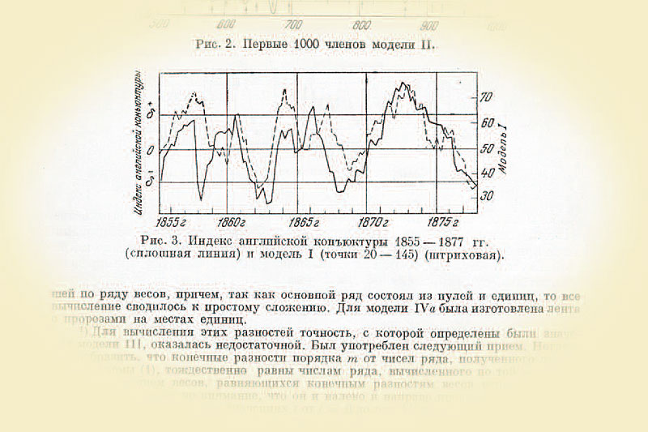

## Outline

- Moving Average Probability Model
    - Properties
    - Relation to Autoregression
- Extensions 
    - ARIMA model
    - Seasonal ARIMA Model
- Multivariate Models
- Application: Macro Forecasting

<!-- - Review: Autoregression Probability Model -->
<!-- - Review: Integration and Unit Roots -->
<!-- - Combined Selection Process -->
<!--     - Box Jenkins Approach -->
<!--     - Auto.arima -->
<!-- - Bayesian ARIMA -->
<!--     - Priors on AR and MA coefs -->
<!--     - Equivalence: ACF, Spectral Density, IRF priors -->
<!--         - Invertibility? -->
<!--     - Priors for Model Selection     -->
<!-- - Seasonal ARIMA -->
<!--     - Compare to other seasonality approaches -->
<!-- - Appplication: TBD (Slutsky?) -->
<!--     - Apply tests, ACF and PACF plots, etc (Box-Jenkins) -->
<!--     - Apply auto.Arima -->
<!--     - Apply Bayesian approach (Follow Stan Manual) -->
    
## Probability Models and Hidden Variables 

- With additive and autoregressive models, series is sum of many fixed components and one residual or error term
    - $y_t=s(t)+h(t)+g(t)+\sum_{j=1}^{p}b_jy_{t-j}+\epsilon_t$
- Given past data $\mathcal{Y}_{t-1}$, all randomness in predicted distribution comes from $\epsilon_t$ 
- This is convenient for producing a predictor and writing down a likelihood
    - If $\epsilon_t\sim f(x)$, conditional likelihood of observation $t$ is $\ell(y_t|\mathcal{Y}_{t-1})=f(y_t-s(t)-h(t)-g(t)-\sum_{j=1}^{p}b_jy_{t-j})$
- Interpretation is that all predictive information is encoded in additive terms
- In principle, there can be *multiple* sources of variation in $y_t$ which are not seen
    - "Hidden", or **latent** variables, which may evolve over time, may affect $y_t$
- For forecasting, we don't care about the hidden variables themselves: don't need to figure out what they are
    - But they can create detectable patterns in the series we do care about
- Allowing for hidden variables can allow simple way to account for these patterns
    - But also create challenges due to indirect and complicated relationship between model and predictor
- The **Moving Average** (MA) Model is one of the most popular and useful hidden variables models    


## The Moving Average Model: Origin

- Russian economist Eugen Slutsky investigated how regular economic patterns could arise from pure randomness
    - He took a long string of random numbers from the lottery, and took the average of the first 10
    - Then he shifted the window over by 1, taking an average of the 2nd through 11th numbers
    - He repeated this through the full string, producing a sequence of overlapping averages, a **moving average**
- In this process, he produced a sequence that looked remarkably like the fluctuations observed in economic series
- He theorized that such a mechanism, where sequences of purely random shocks are combined to produce a single number, might describe the origins of economic cycles
- Today, *moving average* refers to a process generated by overlapping weighted combinations of random variables




## The Moving Average Model
    
- Consider a sequence of mean 0 uncorrelated **shocks** $e_t$ $t=1\ldots T$ which are *not* observed
    - $E[e_t]=0$, $E[e_te_{t-h}]=0$ for all t, for all $h\neq0$
- The observed data is still $\{y_t\}_{t=1}^T$
- The **Moving Average** Model (of order q) says that $y_t$ is a weighted sum of present and past shocks
    - For all $t$, $y_t=e_t+\sum_{j=1}^{q}\theta_{j}e_{t-j}$
- Coefficients $\theta=\{\theta_j\}_{j=1}^{q}$ determine relationship between observations over time  
- In lag polynomial notation, let $\theta(L)=1+\sum_{j=1}^{q}\theta_jL^j$, then $y_t=\theta(L)e_t$
- To produce a full likelihood, strengthen assumption to $e_t\overset{iid}{\sim}f()$, usually $N(0,\sigma_e^2)$
- Compare to the **Autoregression** model: $y_t$ is a weighted sum of a present shock and past *observations*
    - For all $t$, $y_t=e_t+\sum_{j=1}^{q}b_{j}y_{t-j}$
    - Lag polynomial representation $b(L)y_t=e_t$ has lags on the left side instead of the right
    
## Properties 

- The appeal of the MA model comes from the fact that although $e_t$ never directly seen, the properties of the data are characterized explicitly by the model
- In particular, the Autocovariance function is determined by parameters $\theta$
- $\gamma(h):=Cov(y_{t},y_{t-h})=Cov(e_t+\sum_{j=1}^{q}\theta_{j}e_{t-j},e_{t-h}+\sum_{j=1}^{q}\theta_{j}e_{t-j-h})$ $=\sigma_e^2\sum_{j=0}^{q}\sum_{k=0}^q\theta_{j}\theta_{k}\delta_{k=h+j}$
    - In words, covariances are determined by the moving average components shared between times
- Consider, e.g. MA(1), $y_t=e_t+\theta_1e_{t-1}$
    - $\gamma(0)=Var(y_t)=\sigma_e^2(1+\theta_1^2)$, $\gamma(1)=Cov(y_t,y_{t-1})=\sigma_e^2\theta_1$, $\gamma(j)=0$, for all $j\geq 2$
- Last property, that autocovariance function drops to 0 at $q+1$, is true for any $MA(q)$
    - Beyond the window of length q, the moving averages do not overlap, and observations are uncorrelated
- MA(q) model allows modeling short term correlations up to length $q$ horizon: predicted mean goes to 0 in finite time
- By allowing long enough $q$, can, with many coefficients, describe very general patterns of relationships
- As an MA model is linear, like AR model, does not allow for general patterns of higher-order properties like conditional variance, skewness etc 


## Challenge: Identifiability

- Difficulty of models with latent variables is that one cannot learn about the $e_t$ directly, but only their properties
- With two or more random components determining one observation, might not be able to distinguish which one was the source of any change
    - This is called an **identification** problem in econometrics
- Consider MA(1) processes $y_t=e_t+\frac{1}{2}e_{t-1}$, $e_t\overset{iid}{\sim}N(0,\sigma_{e}^2)$ and $y_t=u_t+2u_{t-1}$, $u_t\overset{iid}{\sim}N(0,\frac{\sigma_{e}^2}{4})$
- We see ACF of first is $\gamma(0)=\frac{5}{4}\sigma_e^2$, $\gamma(1)=\frac{\sigma_e^2}{2}$
    - ACF of second process is exactly the same, so by normality, distribution is also exactly the same
- This is an example of a general phenomenon: factorizing $\theta(L)=\Pi_{j=1}^{q}(1+t_jL)$ with inverse roots $t_j$, there is an equivalent representation $\widetilde{\theta}(L)=\Pi_{j=1}^{q}(1+\frac{1}{t_j}L^j)$ with flipped roots and a different $\sigma^2_e$
- Does this make a difference? Not for forecasting: properties of series the same either way
    - Can simply restrict interest to a representation with all roots inside the unit circle, for Bayesian or statistical approach
- General lesson is that when building model out of unobserved parts, might not be able to learn all about them

## Relationship to Autoregression Model

- Properties of MA model can be seen by repeated substitution
    - Consider MA(1) $y_t=e_t+\theta_1e_{t-1}$ rearrange as $e_t=y_{t}-\theta_1e_{t-1}$
- Can substitute in past values $e_{t-1}$ into this formula repeatedly
    - $e_t=y_{t}-\theta_1(y_{t-1}-\theta_1e_{t-2})=y_{t}-\theta_1y_{t-1}+\theta^2_1e_{t-2}$
    - $=y_{t}-\theta_1y_{t-1}+\theta^2_1(y_{t-2}-\theta_1e_{t-3})=y_{t}-\theta_1y_{t-1}+\theta^2_1y_{t-2}-\theta^3_1e_{t-3}=\ldots$
- Continuing indefinitely, have, in lag polynomial notation, $(1-\sum_{j=1}^{\infty}(-\theta_1)^jL^j)y_t=e_t$
    - This is exactly an (infinite order) autoregression model
- This equivalence holds in general: a finite order MA model is an infinite order AR model
- Intuition: because $e_t$ never seen exactly, must use all past information in $\mathcal{Y}_t$ to predict it
- Observable implication: PACF will decay to 0 smoothly, rather than dropping off like AR
- Equivalence also holds in reverse: a finite order AR model is an infinite order MA model
    - Repeatedly substituting, AR(1) $y_t=b_1y_{t-1}+e_t$ becomes $y_t=e_t+\sum_{j=1}^{\infty}b^j_1e_{t-j}$
- Can use either, but one representation may be much less complex

## Estimation

- Because the shocks are not observed, likelihood formula for MA model surprisingly complicated
    - In general, no closed form formula exists for conditional likelihood
- Reason is that $y_t$ and $y_{t-1}$ both depend on $e_{t-1}$, but to know what part of $y_{t-1}$ comes from $e_{t-1}$ need to know what comes from $e_{t-2}$, which affects $y_{t-2}$ which requires... etc
- A variety of solutions exist which nevertheless allow valid estimates
- Likelihood can be constructed by *recursive* algorithm, step by step
    - Requires conditioning each period, which requires using Bayes rule, which requires integration
    - But if $e_t\sim N(0,\sigma_e^2)$, there is a fast and exact recursive algorithm
- Typical approach: use likelihood from normal case even if you don't think distribution is normal
    - This is called a **quasi-** or **pseudo-**likelihood, and $\theta$ can be estimated by maximizing it: this is default method in R in `arima` command
    - Or use penalized estimation, or do Bayesian inference with it
- Alternative 1: Choose parameters $\widehat{\theta}$ to match estimated ACF to model-implied ACF
    - Utilizes fact that only covariances are modeled by process, doesn't need normality
- Alternative 2: Convert to infinite AR form and estimate by least squares, truncating at some finite order
    - Not exact, but since decay usually exponential, truncated part is close to negligible and prediction becomes very easy: just use AR formulas

<!-- - Acts as way to get very high order AR, but with coefficients depending on small # of parameters -->

## Combinations: ARMA models

- To efficiently match all features of correlation patterns, can also use *both* AR and MA
- An Autoregressive Moving Average Model of Orders p and q or **ARMA(p,q)** model has form, for all t,
$$y_{t}=\sum_{j=1}^{p}b_jy_{t-j}+e_{t}+\sum_{k=1}^{q}\theta_{k}e_{t-k}$$
    - Where $e_t$ is still a mean 0 white noise sequence
- In lag polynomial notation $(1-\sum_{j=1}^{q}b_jL^j)y_t=(1+\sum_{j=1}^{q}\theta_jL^j)e_t$
- By same equivalency results, an ARMA model is equivalent to an infinite AR model or an infinite MA model
    - Can denote infinite MA representation as $y_t=\psi(L)e_t:=\frac{\theta(L)}{b(L)}e_t$
    - ARMA model allows finite representation for very general patterns
- Estimation again usually by normal (quasi-)likelihood, with recursive algorithm    
- In addition to invertibility condition for MA roots, have one more equivalency
    - If factorizations of $b(L)$ and $\theta(L)$ share a root, can factor out from both sides and get model with exact same predictions
    - Not a problem for prediction: just present in factorized form
    - Estimation can behave weirdly when roots are "close" (worse approximation, etc)

## ARIMA models

- Condition for stationarity or an ARMA model is that the AR part satisfy conditions for stationarity of AR model
    - All roots of lag polynomial $b(x)=(1-\sum_{j=1}^{q}b_jL^j)$ are outside the unit circle
- In the case of d unit roots, differencing $y_t$ d times can restore stationarity 
- If $\Delta^d y_t$ is an ARMA(p,q) process, $y_t$ is called an **ARIMA(p,d,q)** process
- ARIMA model allows long run random trend, plus very general short run patterns
- Exactly the same unit root tests as in AR case apply: run Phillips-Perron, KPSS, or ADF to determine d
- `auto.arima` executes following steps
    - Test $y_t$ for unit roots by KPSS test, differencing if found to be nonstationary, repeating until stationarity
    - Represent ARMA (quasi)likelihood by recursive algorithm at different orders $(p,q)$
    - Use AICc to choose orders, then estimate $b,\theta$ by maximizing (quasi)likelihood
- This takes statistical approach to prediction: looks for best model of data
    - Performs well for mean forecasting over models close to ARIMA class
- Bayesian approach requires priors over all AR and MA coefficients   
    - Often use infinite AR representation for simplicity: use priors to discipline large number of coefficients

## Seasonal Models

- Use ARIMA around around trend model to account for deterministic growth, seasonality, etc
- Can also extend model to add *non-deterministic* seasonal patterns
- For a series of frequency $m$, may have particular relationships across intervals of length $m$ or regular subsets
- Can create seasonal versions of ARIMA models by allowing relationships across $m$ lags
- Useful for modeling commonly seen spikes in ACF at seasonal intervals
    - Eg. strong December sales one year may be followed by strong December sales next year, on average 
- Seasonal AR(1) is $y_t=B_1y_{t-m}+e_t$, seasonal MA(1) is $y_t=e_t+\Theta_1e_{t-m}$, seasonal first difference is $y_t-y_{t-m}$
- Can combine and extnd to higher orders to create Seasonal ARIMA (P,D,Q) 
    - $(1-\sum_{j=1}^{P}B_jL^{mj})(1-L^m)^Dy_t=(1+\sum_{k=1}^{Q}\Theta_jL^{mj})e_t$
- Can add on top of standard ARIMA to match seasonal and cyclical patterns by multiplying lag polynomials
    - Seasonal ARIMA(p,d,q)(P,D,Q) takes form $(1-\sum_{n=1}^{p}b_nL^{n})(1-\sum_{j=1}^{P}B_jL^{mj})(1-L)^d(1-L^m)^Dy_t=(1+\sum_{k=1}^{q}\Theta_jL^{j})(1+\sum_{k=1}^{Q}\Theta_jL^{mj})e_t$
- Estimation similar to standard ARIMA: test for integration order, use quasi-maximum likelihood to fit coefficients
    - Seasonal components permitted by default in `auto.arima`: can exclude if series known to be deseasonalized

## Application Continued: Macroeconomic Forecasts

- Let's take the 7 series from last class forecasting exercise, following Litterman (1986)
    - GNP Growth, Inflation, Unemployment, M1 Money Stock, Private Fixed Investment, Commercial Paper Interest Rates, and Inventory Growth quarterly from 1971-2020Q1
- Choose level of differencing using tests, then compare (by AICc) AR only, MA only, and ARMA choices for each series 
    - Implement by `auto.arima` with restrictions to AR order p or MA order q
- Series restricted to AR or MA only appear to need more parameters than if allowed to use both
    - Unrestricted model for inflation is ARIMA(0,1,1), but if forced to MA(0), select AR(4): need many AR coefficients to approximate MA property
    - Unemployment has reverse: choose ARIMA(1,1,0), but need MA(3) to match if AR order restricted to 0 
- Resulting forecasts of most series similar across specifications due to rapid mean reversion   
    - MA reverts to mean (or trend if series integrated or trending) in finite time, AR reverts over infinite time, but distance decays exponentially fast
    - Difference can be more substantial if mean reversion slow, with AR near but not at unit root

```{r, message=FALSE, warning=FALSE}
#Libraries
library(fredr) # Data from FRED API
library(fpp2) #Forecasting and Plotting tools
library(vars) #Vector Autoregressions
library(knitr) #Use knitr to make tables
library(kableExtra) #Extra options for tables
library(dplyr) #Data Manipulation
library(tseries) #Time series functions including stationarity tests
library(gridExtra)  #Graph Display

# Package "BMR" for BVAR estimation is not on CRAN, but is instead maintained by an individual 
# It must be installed directly from the Github repo: uncomment the following code to do so

# library(devtools) #Library to allow downloading packages from Github
# install_github("kthohr/BMR")
# library(BMR) #Bayesian Macroeconometrics in R

# Note that if running this code on Kaggle, internet access must be enabled to download and install the package
# If installed locally, there may be difficulties due to differences in your local environment (in particular, versions of C++)
# For this reason, relying local installation is not recommended unless you have a spare afternoon to dig through help files

#An alternative, similar library, is BVAR: it is on CRAN
library(BVAR) #Bayesian Vector Autoregressions

##Obtain and transform NIPA Data (cf Lecture 08)

fredr_set_key("8782f247febb41f291821950cf9118b6") #Key I obtained for this class

## Load Series: Series choices and names as in Litterman (1986)

RGNP<-fredr(series_id = "GNPC96",
           observation_start = as.Date("1971-04-01"),
           observation_end = as.Date("2020-01-01"),
           vintage_dates = as.Date("2021-03-29"),
           units="cch") #Real Gross National Product, log change

INFLA<-fredr(series_id = "GNPDEF",
           observation_start = as.Date("1971-04-01"),
           observation_end = as.Date("2020-01-01"),
           vintage_dates = as.Date("2021-03-29"),
           units="cch") #GNP Deflator, log change

UNEMP<-fredr(series_id = "UNRATE",
           observation_start = as.Date("1971-04-01"),
           observation_end = as.Date("2020-01-01"),
           vintage_dates = as.Date("2021-03-29"),
           frequency="q") #Unemployment Rate, quarterly

M1<-fredr(series_id = "M1SL",
           observation_start = as.Date("1971-04-01"),
           observation_end = as.Date("2020-01-01"),
           vintage_dates = as.Date("2021-03-29"),
           frequency="q",
           units="log") #Log M1 Money Stock, quarterly

INVEST<-fredr(series_id = "GPDI",
           observation_start = as.Date("1971-04-01"),
           observation_end = as.Date("2020-01-01"),
           vintage_dates = as.Date("2021-03-29"),
           units="log") #Log Gross Domestic Private Investment

# The 4-6 month commercial paper rate series used in Litterman (1986) has been discontinued: 
# For sample continuity, we merge the series for 3 month commercial paper rates from 1971-1997 with the 3 month non-financial commercial paper rate series
# This series also has last start date, so it dictates start date for series

CPRATE1<-fredr(series_id = "WCP3M",
           observation_start = as.Date("1971-04-01"),
           observation_end = as.Date("1996-10-01"),
           vintage_dates = as.Date("2021-03-29"),
           frequency="q") #3 Month commercial paper rate, quarterly, 1971-1997

CPRATE2<-fredr(series_id = "CPN3M",
           observation_start = as.Date("1997-01-01"),
           observation_end = as.Date("2020-01-01"),
           vintage_dates = as.Date("2021-03-29"),
           frequency="q") #3 Month AA nonfinancial commercial paper rate, quarterly, 1997-2018

CPRATE<-full_join(CPRATE1,CPRATE2) #Merge 2 series to create continuous 3 month commercial paper rate series from 1971-2018

CBI<-fredr(series_id = "CBI",
           observation_start = as.Date("1971-04-01"),
           observation_end = as.Date("2020-01-01"),
           vintage_dates = as.Date("2021-03-29")) #Change in Private Inventories

#Format the series as quarterly time series objects, starting at the first date
rgnp<-ts(RGNP$value,frequency = 4,start=c(1971,2),names="Real Gross National Product") 
infla<-ts(INFLA$value,frequency = 4,start=c(1971,2),names="Inflation")
unemp<-ts(UNEMP$value,frequency = 4,start=c(1971,2),names="Unemployment")
m1<-ts(M1$value,frequency = 4,start=c(1971,2),names="Money Stock")
invest<-ts(INVEST$value,frequency = 4,start=c(1971,2),names="Private Investment")
cprate<-ts(CPRATE$value,frequency = 4,start=c(1971,2),names="Commercial Paper Rate")
cbi<-ts(CBI$value,frequency = 4,start=c(1971,2),names="Change in Inventories")


#Express as a data frame
macrodata<-data.frame(rgnp,infla,unemp,m1,invest,cprate,cbi)

nlags<-6 # Number of lags to use
nseries<-length(macrodata[1,]) #Number of series used

Series<-c("Real GNP Growth","Inflation","Unemployment","Money Stock","Private Investment","Commercial Paper Rate","Change in Inventories")
```
```{r,warning=FALSE,message=FALSE}
#Use auto.arima to choose AR order after KPSS test without trend
#Do this also for MA, and for ARMA
ARIstatmodels<-list()
IMAstatmodels<-list()
ARIMAstatmodels<-list()
Integrationorder<-list()
ARorder<-list()
MAorder<-list()
ARorder2<-list()
MAorder2<-list()


for (i in 1:nseries){
  ARIstatmodels[[i]]<-auto.arima(macrodata[,i],max.q=0,seasonal=FALSE) #Apply auto.arima set to (nonseasonal) ARI only
  IMAstatmodels[[i]]<-auto.arima(macrodata[,i],max.p=0,seasonal=FALSE) #Apply auto.arima set to (nonseasonal) IMA only
  ARIMAstatmodels[[i]]<-auto.arima(macrodata[,i],seasonal=FALSE) #Apply auto.arima set to (nonseasonal) ARIMA
  Integrationorder[i]<-ARIMAstatmodels[[i]]$arma[6] #Integration order chosen (uses KPSS Test)
  ARorder[i]<-ARIstatmodels[[i]]$arma[1] #AR order chosen in AR only (uses AICc)
  MAorder[i]<-IMAstatmodels[[i]]$arma[2] #MA order chosen in MA only (uses AICc)
  ARorder2[i]<-ARIMAstatmodels[[i]]$arma[1] #AR order chosen in ARMA (uses AICc)
  MAorder2[i]<-ARIMAstatmodels[[i]]$arma[2] #MA order chosen in ARMA (uses AICc)
  
}
```

## Estimated AR, MA, and ARMA orders for Macro Series

```{r,warning=FALSE,message=FALSE}
armamodels<-data.frame(as.numeric(Integrationorder),as.numeric(ARorder),
                       as.numeric(MAorder),as.numeric(ARorder2),as.numeric(MAorder2))

rownames(armamodels)<-Series

colnames(armamodels)<-c("d","p (AR only)","q (MA only)","p (ARMA)","q (ARMA)")

armamodels %>%
kable(caption="Autoregression, Moving Average, and ARMA Models") %>%
  kable_styling(bootstrap_options = "striped")
```

## Forecasts from ARI, IMA, and ARIMA

```{r,warning=FALSE,message=FALSE}
#Construct Forecasts of Each Series by Univariate ARI, IMA, ARIMA models, with 95% confidence intervals
ARIfcsts<-list()
ARIMAfcsts<-list()
IMAfcsts<-list()
for (i in 1:nseries) {
  ARIfcsts[[i]]<-forecast::forecast(ARIstatmodels[[i]],h=20,level=95)
  ARIMAfcsts[[i]]<-forecast::forecast(ARIMAstatmodels[[i]],h=20,level=95)
  IMAfcsts[[i]]<-forecast::forecast(IMAstatmodels[[i]],h=20,level=95)
}

forecastplots<-list()
for (i in 1:nseries){
pastwindow<-window(macrodata[,i],start=c(2000,1))  
#Plot all forecasts
forecastplots[[i]]<-autoplot(pastwindow)+
  autolayer(ARIMAfcsts[[i]],alpha=0.4,series="ARIMA")+
  autolayer(ARIfcsts[[i]],alpha=0.4,series="ARI")+
  autolayer(IMAfcsts[[i]],alpha=0.4,series="IMA")+
  labs(x="Date",y=colnames(macrodata)[i],title=Series[i])
}

grid.arrange(grobs=forecastplots,nrow=4,ncol=2)
```

## Real GNP Growth: Series, ACF, PACF, Estimated ARMA(1,1) Roots

```{r,message=FALSE,warning=FALSE}
rgnpplots<-list()

rgnpplots[[1]]<-autoplot(rgnp)+labs(x="Date",y="Percent Growth",title="Real GNP Growth")
rgnpplots[[2]]<-ggAcf(rgnp)+labs(title="Autocorrelation Function")
rgnpplots[[3]]<-ggPacf(rgnp)+labs(title="Partial Autocorrelation Function")
rgnpplots[[4]]<-autoplot(ARIMAstatmodels[[1]])
grid.arrange(grobs=rgnpplots,nrow=2,ncol=2)
```

## Exercise: House Prices

- Try comparing ARI, ARIMA, and SARIMA models using hose price data in a [Kaggle notebook](https://www.kaggle.com/davidchilders/why-sarima)

## The Multivariate Case

- Vector Autoregression (VAR), Vector Moving Average (VMA), and Vector ARMA (VARMA) models similar to 1 variable case, but with more coefficients
- Vector Autoregression much more commonly used than VMA or VARMA cases, so discuss only this
    - By equivalence relationships, can represent all as infinite order VAR 
- While not exactly identical, for long enough order $P$, VAR forecast close to that of VMA
    - VMA(Q) forecast reverts to mean exactly after $Q$ periods, stationary VAR gets close exponentially fast
- Use long lags to improve fit, tight (e.g., Minnesota) priors to prevent overfitting


<!-- - With $m$ variables, $y_t=(y_{1,t},\ldots,y_{m,t})\in\mathbb{R}^m$ -->
<!-- - For all $t=p+1\ldots T$, $i=1\ldots m$, the VAR(p) model is -->
<!-- $y_{i,t}=b_{i,0}+\sum_{k=1}^{m}\sum_{j=1}^{p}b_{i,jk}y_{k,t-j}+\epsilon_{k,t}$ -->
<!-- - Where for all t, k, j, $h\neq0$, $E[\epsilon_{k,t}]=0$, $E[\epsilon_{k,t}\epsilon_{j,t+h}]=0$  -->
<!-- - Collecting coefficients in matrices, can write as $y_t=B_0+\sum_{j=1}^{p}B_jy_{t-j}+\epsilon_t$ -->
<!-- - Typical to assume $\epsilon_t\overset{iid}{\sim} N(0,\Sigma_\epsilon)$, where $\Sigma_\epsilon\in\mathbb{R}^{m\times m}$ gives present covariance -->
<!-- - (log) Likelihood again takes (multivariate) normal form: weighted least squares -->
<!-- - Stationarity conditions analogous to m=1 case: roots (of particular polynomial) inside unit circle -->
<!--     - `roots` in library `vars` can display -->
    
    
<!-- - To construct likelihood, need to also assume distribution for $\epsilon_t$ -->
<!--     - Most common is $\epsilon_t\overset{iid}{\sim}N(0,\sigma^2)$, $Pr(\epsilon<m)=\Phi(\frac{m}{\sigma})=\int_{-\infty}^{\frac{m}{\sigma}}\frac{1}{\sqrt{2\pi}}\exp(\frac{-x^2}{2})dx$ -->
<!-- - Likelihood is $\Pi_{t=k+1}^{T}\frac{1}{\sigma}\phi(\frac{y_t-b_0-\sum_{j=1}^{p}b_jy_{t-j}}{\sigma})$ -->
<!-- - Log Likelihood is $-\frac{T}{2}\log2\pi\sigma^2+\frac{1}{2\sigma^2}\sum_{t=k+1}^{T}(y_t-b_0-\sum_{j=1}^{p}b_jy_{t-j})^2$ -->
<!-- - Parameters $\theta=(\{b_j\}_{j=0}^{k},\sigma^2)\in \Theta\subseteq \mathbb{R}^{k+1}\times\mathbb{R}_{+}$ -->
<!-- - Interpretation: value today depends linearly on last $p$ periods, up to unpredictable noise -->
    
<!-- ## Multivariate VAR Priors -->

<!-- - Can construct multivariate version of normal-gamma priors for VARs which is also conjugate -->
<!-- - Multivariate normal $N(\mu_B,\Sigma_B)$ prior on $B_j$, $j=1\ldots p$ with covariances $\Sigma_B$ -->
<!--     - With $m$ variables, $p$ lags, have $m(p+1)$ coefficients, so $(mp+m)^2$ prior parameters to choose just here -->
<!-- - **Inverse Wishart** distribution $W(\Psi,\nu)$ on $\Sigma_\epsilon$ multivariate version of Gamma distribution -->
<!--     - $\Psi\in\mathcal{R}^{m\times m}$ is prior guess of $\Sigma_\epsilon$, $\nu\in\mathbb{R}$ sets concentration  -->
<!-- - Minnesota priors due to Doan, Litterman, Sims (1984), at FRB Minneapolis can help simplify choices -->
<!-- - Goal is to express typical properties of macroeconomic series for business cycle forecasting  -->
<!-- - Prior mean for $b_{i,1i}=1$, all other coefs 0 (equivalently, $B_1=I_m$ identity matrix)  -->
<!--     - Each series centered on random walk in just itself, with lags and cross-equation effects 0 -->
<!-- - Variances $\sigma^2_{\epsilon,i}$ $i=1\ldots m$ in $\Sigma_\epsilon$ estimated by sample variance of residuals from 1 dimensional AR(p)          -->
<!-- - All prior covariances across coefficients set to 0: independent normal guesses for each     -->
<!--     - Variances are $\Sigma_{b_{i,jk}}=$ $H_1/h(j)$ for own lags $H_2\sigma^2_{\epsilon,i}/(h(j)\sigma^2_{\epsilon,k})$ for $i,jk$ coefficient, $H_3\sigma^2_{\epsilon,i}$ for constant -->
<!--     - Parameters $H_1,H_2,H_3$ set tightness of prior around own lags, cross-variable effects, and constants, respectively -->
  
<!-- - Each $b_{0,i}$ has own large variance, covariances 0 -->
<!-- - Own lags $b_{i,ji}$ have prior variance $\frac{\sigma_1}{h(j)}$ -->
<!--     - Set scale representing tightness, then variance decreases with lag order -->
<!-- - Cross equation lags have prior variance $\frac{\sigma_2}{h(j)}$ -->
<!--     - Set scale representing possible cross-variable effects, then variance decreases with lag order -->


## Application: Litterman (1986) Macroeconomic Forecasts

- Minnesota priors developed for macro forecasting applications at the Federal Reserve
    - Alternative to large, complicated and somewhat untrustworthy explicitly economic models used at the time
    - Allows many variables to enter in unrestricted way, but minimizes overfitting due to priors
- Litterman went on to be chief economist at Goldman Sachs, and method spread to private sector
- Example from Litterman (1986): BVAR with Minnesota priors over 7 variables from before 
- 10 lags in each variable, with a constant
- Fix prior parameter $\alpha=2$ and set $\psi$ scale by empirical Bayes as variance of AR residuals
- Set prior variance of $\beta_0$ be $1e7$: essentially unrestricted scale
- Estimate $\lambda$ "hierarchically": put a prior on it  
    - $\sim$ Gamma with mean 0.2, sd 0.4: posterior $mean\approx0.23$, $sd\approx 0.03$ 
- Implement using `bv_minnesota` function in `BVAR` library 
- Forecasts and corresponding intervals appear reasonable despite that some series (M1, Investment) are clearly trending


## Forecasts from ARIMA (Red) and BVAR (Blue)

```{r}
#Label observations with dates
rownames(macrodata)<-M1$date

#Set priors: use hierarchical approach, with default scales, to account for uncertainty
#Note that defaults are for series in levels, while some here are growth rates
mn <- bv_minnesota(lambda = bv_lambda(mode = 0.2, sd = 0.4, min = 0.0001, max = 5),
                   alpha = bv_alpha(mode = 2), 
                   var = 1e07)

#Ghost samples to set priors on initial conditions: 
# SOC shifts towards independent unit roots
# SUR shifts toward shared unit root
# Hierarchical approach allows strength to be determined by data
#soc <- bv_soc(mode = 1, sd = 1, min = 1e-04, max = 50)
#sur <- bv_sur(mode = 1, sd = 1, min = 1e-04, max = 50)

priors <- bv_priors(hyper = c("lambda"), #Choose lambda by hierarchical method, leave others fixed at preset
                    mn = mn) #Set Minnesota prior as defined above

#Add options soc = soc, sur = sur to set initial observations priors
# For this data, hierarchical estimation sets fairly smal values for these, and resulting forecasts are about the same 
# except with slightly narrower intervals for far future forecasts

#Set up MCMC parameters: use default initialization except that scaling is adjusted automatically in burnin
#If this is not enough, may need to adjust manually: check diagnostics
mh <- bv_metropolis(adjust_acc = TRUE, acc_lower = 0.25, acc_upper = 0.45)
# Usually automatic adjustment will work okay so long as burnin and n_draws both long enough
```
```{r,message=FALSE,warning=FALSE}
set.seed(42) #Fix random numbers for reproducibility
#Do the actual fitting.
run <- bvar(macrodata, 
            lags = 10, 
            n_draw = 25000, n_burn = 10000, #Run 25000 draws, discard first 10000 to get 15000 samples
            n_thin = 1, #Don't discard intermediate draws
            priors = priors, #Use above priors
            mh = mh, #Use MCMC sampler settings defined above
            verbose = FALSE) #Report sampler progress?
```
```{r}
#Sample from posterior predictive distribution 
predict(run) <- predict(run, horizon = 20, conf_bands = c(0.05, 0.16))

## Can plot using following commands, but I will use ggplot for compatibility with forecast libraries
#plot(predict(run),area=TRUE,t_back = 190)

## With library(BVARverse) also have plotting option
#bv_ggplot(predict(run),t_back = 190)
```
```{r, eval=FALSE}
#Alternative approach: BMR library
# Available at https://www.kthohr.com/bmr.html
#Uses slightly different formulation of and notation for Minnesota prior
#There are some useful options available in this library, 
# but it is not on CRAN and is not compatible with Kaggle's backend, so not run by default

#Convert to a data frame
bvarmacrodata <- data.matrix(macrodata) 

#Set up Minnesota-prior BVAR object, and sample from posterior by MCMC
# See https://www.kthohr.com/bmr_docs_vars_bvarm.html for syntax documentation: manual is out of date
bvar_obj <- new(bvarm)

#Construct BVAR with nlags lags and a constant
bvar_obj$build(data_endog=bvarmacrodata,cons_term=TRUE,p=nlags)

#Set random walk prior mean for all variables
coef_prior=c(1,1,1,1,1,1,1) 
# Set prior parameters (1,0.2,1) with harmonic decay
bvar_obj$prior(coef_prior=coef_prior,var_type=1,decay_type=1,HP_1=1,HP_2=0.2,HP_3=1,HP_4=2)

#Sample from BVAR with 10000 draws of Gibbs Sampler
bvar_obj$gibbs(10000)

#Construct BVAR Forecasts
bvarfcst<-BMR::forecast(bvar_obj,periods=20,shocks=TRUE,plot=FALSE,varnames=colnames(macrodata),percentiles=c(.05,.50,.95),
    use_mean=FALSE,back_data=0,save=FALSE,height=13,width=11)

#Warning: command is incredibly slow if plot=TRUE is on, fast otherwise
# Appears to be issue with plotting code in BMR package, which slows down plotting to visualize
# With too many lags and series, have to wait through hundreds of forced pauses
```
```{r}
# ADD VAR and ARIMA forecasts to plot

forecastseriesplots<-list()

#Plot ARIMA model forecast along with BVAR forecasts, plus respective 95% intervals
#Commented out alternative prior method
for (i in 1:nseries){
  BVAR<-ts(run$fcast$quants[3,,i],start=c(2020,2),frequency=4,names=Series[i]) #Mean
  lcband<-ts(run$fcast$quants[1,,i],start=c(2020,2),frequency=4,names=Series[i]) #5% Lower confidence band
  ucband<-ts(run$fcast$quants[5,,i],start=c(2020,2),frequency=4,names=Series[i]) #95% Upper confidence band
  fdate<-time(lcband) #Extract date so geom_ribbon() knows what x value is
  bands<-data.frame(fdate,lcband,ucband) #Collect in data frame
  pastwindow<-window(macrodata[,i],start=c(2000,1))
forecastseriesplots[[i]]<-autoplot(pastwindow)+
  autolayer(ARIMAfcsts[[i]],series="ARIMA",alpha=0.4)+autolayer(BVAR,series="BVAR",color="blue")+
  geom_line(aes(x=fdate,y=ucband),data=bands,color="blue",alpha=0.4)+
  geom_line(aes(x=fdate,y=lcband),data=bands,color="blue",alpha=0.4)+
  labs(x="Date",y=colnames(macrodata)[i],title=Series[i])
}

grid.arrange(grobs=forecastseriesplots,nrow=4,ncol=2)
```


## Interpretation

- Point forecasts differ somewhat, but within respective uncertainty intervals
    - Note: Bayesian predictive intervals are not confidence intervals and vice versa
    - Predictive intervals give best average-case prediction of distribution given data over the model
    - Confidence intervals construct region containing data 95% of the time, if model specification true
    - BVAR intervals wider for persistent series: account for, e.g., uncertainty over whether to difference
- BVAR uses longer lags and prior centered at unit root to account for persistent dynamics
    - Order of AR lags must be longer both to account for integration and for possibility of MA dynamics
    - Prior over higher lags reduces variability of estimates, reduces overfitting by regularization
- Test-based approach attempts to detect unit roots and difference them out, then find best stationary AR model
    - Model selection by AICc acts against overfitting, but leaves remaining coefficients unrestricted

## Conclusions

- Latent variable models like moving averages can be used to concisely describe data features
    - Since not seen, representations are not unique
    - AR and MA equivalent, but one may be much more efficient, taking finite rather than infinite order
- Latent models can be combined with models of observables like autoregressions (with or without integration) to extend descriptive capability
- Multivariate case results in many more parameters, especially if using high order VAR
    - But Bayesian approach allows imposing discipline using priors

    
## References

- Thomas Doan, Robert Litterman  & Christopher Sims "Forecasting and conditional projection using realistic prior distributions" Econometric Reviews Vol 3. No 1 (1984)
    - Introduced the Minnesota prior 
- Robert B. Litterman, "Forecasting with Bayesian Vector Autoregressions: Five Years of Experience" Journal of Business & Economic Statistics, Vol. 4, No. 1 (Jan., 1986), pp. 25-38
- Joe Mahon & Phil Davies "The Meaning of Slutsky" *The Region* December 2009 (https://www.minneapolisfed.org/publications/the-region/the-meaning-of-slutsky)
    - History of Eugen Slutsky and the "shocks" approach to modeling economic data 
- Keith O'Hara, "Bayesian Macroeconometrics in R" (2015) (https://www.kthohr.com/bmr.html)
    - Library for Bayesian VARs and related models    

