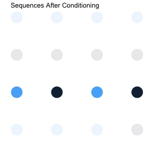

## Plans

- Formalize problem of forecasting using **decision theory**
- A way to *analyze* decision-making processes
    - Tells us what a good forecasting rule looks like
    - Not just quality of result, but quality of method producing results
    - May or may not tell us how to find such a good rule
- Decision theory is not just one theory
    - Many value judgments required
    - Application depends on context
    - Gives us a formal language to describe problem features that should affect decision
- Today
    - Outline setup, 
    - Talk about a few ways to think about what is a good decision
- Future
    - Apply these criteria to introduce different types of "good" forecasting rules according to different criteria and context


## Decision Theory: Setup

- Choose a forecasting rule
$$f:\otimes_{t=1}^{T}\mathrm{Y}\to\mathrm{Y}$$
-  Observe sequence of data 
$$\mathcal{Y}_T=\{y_t\}_{t=1}^{T}\in \otimes_{t=1}^{T} \mathrm{Y}$$
- Apply forecasting rule to obtain predicted value
$$\widehat{y}_{T+h}=f(\mathcal{Y}_T)$$
- Observe realized value $y_{T+h}$
- Evaluate by loss function 
$$\ell(.,.): \mathrm{Y}\times\mathrm{Y}\to\mathbb{R}^+$$ 
- Loss is $$\ell(y_{T+h},\widehat{y}_{T+h})$$

## Decision Theory: Goals

- Goal of decision theory is to choose a decision rule $f$ that leads to small loss
- "Solution": Pick the rule that gives the correct answer
    - $f^{*}(\mathcal{Y}_T)=y_{T+h}$ solves $\underset{f}{\arg\min\ } \ell(y_{T+h},f(\mathcal{Y}_T))$
- If such a rule exists and you know what it is, great
    - Usually, neither is true!
    
## Sequences

- Consider space of possible **sequences** $\mathcal{Y}_{T+h}=\{y_t\}_{t=1}^{T+h}\in \otimes_{t=1}^{T+h} \mathrm{Y}$
- $\otimes_{t=1}^{T+h} \mathrm{Y}$ contains any possible outcomes for results
- Example: forecast if stock market will go up or down tomorrow, based on past moves up or down
- Then $\mathrm{Y}=\{\text{up, down}\}$, and if T=3, h=1, possibilities are
    - {up, up, up, up} 
    - {down, down, down, down}
    - {up, down, up, down}
    - {up, up, up, down} 
    - etc (12 more)
- Considering all possibilities, try to find a rule that has small loss over the different sequences 
- Issue: with many possible sequences, different rules will have different loss on each
- Possible solutions: one or more of
    - Decide which sequences are "more important"
    - Change the goal of the problem

## Sequences

```{r,warning=FALSE,message=FALSE}
t<-c(1,2,3,4)
y1<-c(0.75,0.75,0.75,0.75)
y2<-c(0.5,0.5,0.5,0.5)
y3<-c(0.25,0.25,0.25,0.25)
y4<-c(0,0,0,0)
# y5<-c(-0.25,-0.25,-0.25,-0.25)
# y6<-c(-0.5,-0.5,-0.5,-0.5)
# y7<-c(-0.75,-0.75,-0.75,-0.75)
# y8<-c(-1,-1,-1,-1)
seq1<-c(1,1,1,1)
seq2<-c(0,0,0,0)
seq3<-c(1,0,1,0)
seq4<-c(1,1,1,0)
# seq5<-c(0,1,1,1)
# seq6<-c(0,1,1,0)
# seq7<-c(0,1,0,1)
# seq8<-c(0,1,0,0)
dframe<-data.frame(t,y1,y2,y3,y4,seq1,seq2,seq3,seq4)
library(ggplot2)
ggplot(data=dframe,mapping=aes(x=t))+
  geom_point(aes(y=y1,color=seq1),size=10)+
  geom_point(aes(y=y2,color=seq2),size=10)+
  geom_point(aes(y=y3,color=seq3),size=10)+
  geom_point(aes(y=y4,color=seq4),size=10)+
  theme(panel.background = element_blank(), axis.text = element_blank(),
        axis.ticks = element_blank(),legend.position = "none")+
  labs(x=" ", y=" ",title="Example Sequences")
```

## Preview of approaches

- Different decision theoretic philosophies approach tradeoffs in different ways
- Average vs worst case
    - Can try to do reasonably well in any situation, even the worst
    - Can try to do well over many situations, with different priority given to each
        - Have different degrees of of prioritizing
- Absolute vs relative
    - Can use a criterion which judges forecast only by its own loss
    - Can instead try to do well relative to some benchmark (which may do better or worse depending on the situation)
- Average case approaches can fail badly in cases they assign low weight to
- Worst case methods will never do terribly, but may never do particularly well either
- Absolute criteria try to do okay in any situation
- Relative criteria are allowed to perform badly in "hard" cases, must do well in easy cases

## A Crude Classification of Philosophies

```{r,warning=FALSE,message=FALSE}
library(knitr)
library(kableExtra)
text_tbl <- data.frame(
  Criteria = c("Absolute Criterion", "Relative Criterion"),
  Worst.Case = c(
    "Adversarial Prediction", 
    "Online Learning "
    ),
  Average.Average.Case = c(
    "Bayesianism",
    " Bayesian Regret* " 
    ),
  Worst.Average.Case = c(
    "Minimax Theory",
    "Statistical Learning" 
    )  
)

kable(text_tbl) %>%
  kable_styling(full_width = F) %>%
  column_spec(1,border_right = T) %>%
  column_spec(2) %>%
  add_header_above(c(" " = 2, "Average Case" = 2))
```

<!--               | Subtype            | Absolute Criterion       |  Relative Criterion  -->
<!-- --------------|--------------------|--------------------------|------------------------------- -->
<!-- Average Case  | Average Average    | Bayesianism              | (?) -->
<!-- Average Case  | Worst Case Average | Minimax Theory           | Statistical Learning -->
<!-- Worst Case    |  ...               | Adversarial Prediction   | Online Learning -->

*rarely used, so will not be covered


## Average case analysis: probability

- One way to quantify "more important" is to give a weighting to each sequence
- Most commonly, this is done by means of **probability**
    - Roughly, a set of nonnegative weights that sum to 1
- Probability assigns to each subset $A:=\{\omega\in \Omega: \omega\in A\}$ of a (discrete) set $\Omega$ a number $p(A)$ such that
    - $0\leq p(A) \leq 1$
    - $p(\Omega)=1$
    - If $A_1,A_2,\ldots$ are disjoint sets in $\Omega$, $p(\cup_{j}A_j)=\sum_j p(A_j)$
- For continuous case, probability defined by a *density* $p()$ which integrates to 1      
- For forecasting, the set over which we define a probability is the *set of sequences* $\otimes_{t=1}^{T+h}\mathrm{Y}$
- Once a probability is defined, a sequence is a **random variable**
    - A function of the event $\omega$
- E.g. might give weights $(1/4,1/4,1/4,1/4)$ to sequences
    - $\{1,1,1,1\}$, $\{0,0,0,0\}$, $\{1,0,1,0\}$, $\{1,1,1,0\}$
    - Any two events have combined probability 1/2, any three $3/4$, etc


## Expected values and Risk


- We consider sequences with higher weight $p$ more important to worry about 
- Typical application is to calculate **expected value** (with respect to $p$) of some function of the sequence
$$E_p[g(\mathcal{Y}_{T+h})]:=\sum_{\omega\in\Omega} p(\omega)g(\mathcal{Y}_{T+h}(\omega))$$
- For continuous case, use integral 
$$E_p[g(\mathcal{Y}_{T+h})]:=\int_{\omega\in\Omega} g(\mathcal{Y}_{T+h}(\omega))p(\omega)d\omega$$
- Most important expectation is expectation of loss function, called the **risk**
$$R_p(f):=E_p[\ell(y_{T+h},f(\mathcal{Y}_T))]$$
- *Given a distribution*, we can now compare forecast methods based on a single number
    - Smaller risk means smaller loss, *on average*
    
## Average-Case decision-making

- Choosing a rule which is low risk tells us that our guess will do well across possible sequences
- Weights tell us about subjective importance of different sequences
- High probability sequences considered "more likely"
    - One interpretation: given a large number of observed sequences, fraction $p(A)$ will be in set $A$
    - In general, do not actually observe many sequences, so this is purely theoretical
- You may not do well in every case, but you do relatively well in cases that are "more common"
- Risk, with distribution $p$, allows us to define a best possible outcome, called the **Bayes Risk**
$$R_p^{*}:=\underset{f:\otimes_{t=1}^{T}\mathrm{Y}\to\mathrm{Y}}{\inf}R_p(f)$$
- If a minimizer exists, it is called the **Bayes Forecast**

## Bayes forecasts

- When Bayes forecast exists, defined as average-case optimal forecast
    - $f_p^*(.):=\underset{f:\otimes_{t=1}^{T}\mathrm{Y}\to\mathrm{Y}}{\arg\min}E_p\ell(y_{T+h},f(\mathcal{Y}_T))$
- Analysis can be simplified using **conditional probability**
    - For any two events $A,B$,  $p(B|A):=\frac{p(B\cap A)}{p(A)}$
    - Conditional densities $p(y|x):=\frac{p(y,x)}{p(x)}$
- Can decompose multivariate expectation as average of **conditional expectation**
    - $E_p[g(x,y)]=\int\int g(x,y)p(y|x)p(x)dydx=E_{p(x)}[E_{p(y|x)}[g(x,y)|x]]$
- Applying to risk, and considering $h=1$ for simplicity 
    - $f_p^*(.):=\underset{f:\otimes_{t=1}^{T}\mathrm{Y}\to\mathrm{Y}}{\arg\min}\int\int\ell(y_{T+1},f(\mathcal{Y}_T))p(y_{T+1}|\mathcal{Y}_T)p(\mathcal{Y}_T)dy_{T+1}d\mathcal{Y}_T$
    - $=\int\underset{f:\otimes_{t=1}^{T}\mathrm{Y}\to\mathrm{Y}}{\arg\min}[\int\ell(y_{T+1},f(\mathcal{Y}_T))p(y_{T+1}|\mathcal{Y}_T)dy_{T+1}]p(\mathcal{Y}_T)d\mathcal{Y}_T$
- So $f_p^*(\mathcal{Y}_T)=\underset{f:\otimes_{t=1}^{T}\mathrm{Y}\to\mathrm{Y}}{\arg\min}[\int\ell(y_{T+1},f(\mathcal{Y}_T))p(y_{T+1}|\mathcal{Y}_T)dy_{T+1}]$
    - Bayes forecast minimizes **conditional risk**: conditional expectation of loss given observed data
    
## Application: Sequences

- Go back to ${up,down}$ prediction problem 
- Sequences $\{1,1,1,1\}$, $\{0,0,0,0\}$, $\{1,0,1,0\}$,$\{1,1,1,0\}$ w/ prob $(1/4,1/4,1/4,1/4)$
- Let loss function be 0-1 loss: $\ell(y,\widehat{y})=1\{y\neq\widehat{y}\}$
- Suppose we observe $\mathcal{Y}_T=\{1,0,1\}$
    - Then $p(y_{T+1}=0|\mathcal{Y}_T)=\frac{p(1,0,1,0)}{p(1,0,1,0)+p(1,0,1,1)}=\frac{1/4}{1/4+0}=1$ 
    - $p(y_{T+1}=1|\mathcal{Y}_T)=\frac{p(1,0,1,1)}{p(1,0,1,0)+p(1,0,1,1)}=\frac{0}{1/4+0}=0$
```{r}    
ggplot(data=dframe,mapping=aes(x=t))+
  geom_point(aes(y=y1,color=seq1),size=10,alpha=0.1)+
  geom_point(aes(y=y2,color=seq2),size=10,alpha=0.1)+
  geom_point(aes(y=y3,color=seq3),size=10)+
  geom_point(aes(y=y4,color=seq4),size=10,alpha=0.1)+
  theme(panel.background = element_blank(), axis.text = element_blank(),
        axis.ticks = element_blank(),legend.position = "none")+
  labs(x=" ", y=" ",title="Sequences After Conditioning") 
```    
<!--  -->

## Sequence Example, ctd 

- Conditional Risk is $1\times \ell(0,f(\mathcal{Y}_T))+0\times \ell(1,f(\mathcal{Y}_T))=\ell(0,f(\mathcal{Y}_T))=1\{0\neq f(\mathcal{Y}_T)\}$
- Minimize by setting $f_p^*(\mathcal{Y}_T)=0$
- Similarly, for $\mathcal{Y}_T=\{0,0,0\}$, $f_p^*(\mathcal{Y}_T)=0$
- Observing $\mathcal{Y}_T=\{1,1,1\}$, conditional risk is $\frac{1}{2}\times 1\{0\neq f(\mathcal{Y}_T)\}+\frac{1}{2}\times 1\{1\neq f(\mathcal{Y}_T)\}$
    - Since multiple outcomes given equal weight, any prediction $f_p^*(\mathcal{Y}_T)\in\{0,1\}$ is optimal
```{r}    
ggplot(data=dframe,mapping=aes(x=t))+
  geom_point(aes(y=y1,color=seq1),size=10,alpha=0.7)+
  geom_point(aes(y=y2,color=seq2),size=10,alpha=0.1)+
  geom_point(aes(y=y3,color=seq3),size=10,alpha=0.1)+
  geom_point(aes(y=y4,color=seq4),size=10,alpha=0.7)+
  theme(panel.background = element_blank(), axis.text = element_blank(),
        axis.ticks = element_blank(),legend.position = "none")+
  labs(x=" ", y=" ",title="Sequences After Conditioning") 
```
<!--   -->

- For outcomes with probability 0, like $\{0,1,0\}$, again any prediction is optimal: changing it has no effect on risk

## Worst case analysis of sequences

- To express extreme agnosticism, can try to find methods that work for all sequences, rather than on average over a distribution on sequences
- One potentially desirable goal would be to find a rule which performs well for all sequences in $\otimes_{t=1}^{T+h} \mathrm{Y}$
- That is, consider **worst case loss** over all sequences of decision rule $f$
$$L^{\max}(f)=\underset{\mathcal{Y}_{T+h}\in\otimes_{t=1}^{T+h} \mathrm{Y}}{\sup}\ell(y_{T+h},f(\mathcal{Y}_T))$$
- This criterion then tells you loss of a "best" rule
$$L^{\min\max}=\underset{f}{\inf}\underset{\mathcal{Y}_{T+h}\in\otimes_{t=1}^{T+h} \mathrm{Y}}{\sup}\ell(y_{T+h},f(\mathcal{Y}_T))$$
- In words, this says: pick a rule that has the best worst case outcome over any sequence
- This can be wildly pessimistic
    - Does well in sequences where loss might be high, but may do quite poorly in sequences where loss may be low  
- Also may not define rule uniquely

## Adversarial Decision-Making 

- There are ways to consider worse cases than even the worst sequence
- May have an outcome that responds to decision rule chosen, in a way which is **adversarial**
    - The sequence adjusts to make outcome as bad as possible.
- This kind of analysis might make sense if outcome decided by malicious adversary
    - A competitor (in business, politics, or games) wants you to do poorly
    - Indeed, it comes from **game theory**, where this is the situation
- Standard in game theory to work with slightly modified spaces of rules: **randomized strategies**
    - Choose random rule, and allow adversary to respond only to distribution
    - Goal is to minimize expected loss, over own distribution choice $\widehat{y}_{T+h}\sim \widehat{p}_{T+h}()$ 
    - Adversary also allowed to randomize $y_{T+h}\sim q_{T+h}$
$$L^{Adversarial}= \underset{\widehat{p}_{T+h}()}{\inf}\underset{q_{T+h}}{\sup}E_{\widehat{p}_{T+h}(),q_{T+h}}\ell(y_{T+h},\widehat{y}_{T+h})$$ 
- In this setting, randomized algorithms can help by restricting the ability to respond of the adversary 

<!-- - Might try to represent this loss as -->
<!-- $$L^{MaxMin}=\underset{y_{T+h}\in\mathrm{Y}}{\sup}\underset{\widehat{y}_{T+h}\in\mathrm{Y}}{\inf}\ell(y_{T+h},\widehat{y}_{T+h})$$ -->
    
## Example: Sequences

- Let loss function be 0-1 loss: $\ell(y,\widehat{y})=1\{y\neq\widehat{y}\}$
- If all possible length 4 $\{0,1\}$ sequences are in set considered, for any rule, always possible that next outcome is other outcome
- $L^{\min\max}=1$ 
    - Cannot prevent mistakes in at least some cases
- $L^{Adversarial}=\frac{1}{2}$ 
    - By guessing at random, any strategy of adversary will give wrong guess 1/2 the time
    - But cannot do better than guessing at random

## Online Learning and Regret Minimization

- Worst case and adversarial analysis do not let you take advantage of particular features of sequence
    - Usually obtain trivial results
- Want good *relative* performance over sequences
    - Attempt to do better on some sequences while allowing doing worse on others
- Asks for **regret** of learning rule
    - Given set $\mathcal{F}$ of comparison rules $f():\otimes_{t=1}^{T}\mathrm{Y}\to\mathrm{Y}$
    - Want rule which does not much worse than the rule in that set which is best ex post, after sequence is observed
    - Usually compare over full sequence, where rule is updated each period
$$Regret(\{f_t\}_{t=1}^{T})=\sum_{t=1}^{T}\ell(y_{t},f_t(\mathcal{Y}_{t-1}))-\underset{f\in\mathcal{F}}{\inf}\sum_{t=1}^{T}\ell(y_{t},f(\mathcal{Y}_{t-1}))$$
    
## Applying Online Learning

- Usual goal is to minimize maximum regret over any possible sequence $\{y_t\}_{t=1}^{T}$
    - Rules $f_t$ are allowed to adapt to the sequence, and in some cases, be randomized
- Sequence may be allowed to adapt to (distribution) of rules
- Best possible result is
    - $\underset{f_T\sim p}{\inf}\underset{y_T\sim q}{\sup}\ldots\underset{f_T\sim p}{\inf}\underset{y_T\sim q}{\sup}Regret(\{f_t\}_{t=1}^{T})$
- Smaller comparator class makes low regret easier, but allows worse absolute performance
- Could find good rule by solving long sequence of optimization problems
- In practice, some very simple rules are used, and shown to work well


## Refining the average case approach: Probability Models

- Given a distribution $p$, Bayes forecast tells us exactly what to do to get low risk
- Problem: Where does $p$ that we are averaging over come from?
    - Need background knowledge on which outcomes are likely
- Can we relax this requirement? 
- One way: allow the probability distribution to be unknown
- Allow a *family* of probability distributions
    - $\{p(\mathcal{Y}_{T+h},\theta)\}_{\theta\in\Theta}$
- Call such a family a (probability) **model**
- Different values of $\theta$ can correspond to different features of sequence
    - E.g., higher or lower values, trend, seasonality, variance and autocovariance, etc can be more or less likely
- With many probability distributions $p_{\theta}$, have not one but many risk functions
    - $R_{p_{\theta}}(f):=\int \ell(y_{T+h},f(\mathcal{Y}_T))p(\mathcal{Y}_{T+h},\theta)d\mathcal{Y}_{T+h}$
- Now different forecast rules will have risk which depends on $\theta$

## Example Probability Models

- Any distribution over sequences can be part of a probability model
- Most general model: Set of all probability distributions
    - Seems very flexible, but will be too large for most things we want to do with a model
- Alternative: all probability distributions that factorize 
    - $\Theta=\{p: p(\mathcal{Y}_{T+h})=\Pi_{t=1}^{T+h}p(y_t)\}$
    - Such distributions are called iid - independent and identically distributed
    - Almost every stats and ML class you take looks only at these
    - In time series, called "White Noise": uninteresting model
- Simple non-iid model: Normal-AR(1) Model
    - Let $\phi(x)=\frac{1}{\sqrt{2\pi}}\exp(-\frac{1}{2}x^2)$ be standard normal density
    - $p(\mathcal{Y}_{T+h},\theta)=\phi(y_1)\cdot\Pi_{t=2}^{T+h}\phi(y_t-\theta y_{t-1})$
    - Recursively, $y_{t}=\theta y_{t-1}+e_t$, $e_t\overset{iid}{\sim} N(0,1)$ 
- Will introduce many more models later in class
    - Many related to simple forecasting rules we have covered
    

## Working with probability models

- How can we assess forecasts with many distributions? 
    - No longer a single fixed standard
- Need some way of evaluation across distributions    
- Things to consider
    - Set of rules
    - Set of risk functions
    - Combination of different risk functions
- Different choices generate different approaches
    - Minimax Theory
    - Statistical Learning Theory
    - Bayesianism

## Minimax Theory

- Suppose we have a model class we think is useful
- But want to remain completely agnostic on which model in class is worthwhile
- Can evaluate forecast rule $f$ by **Maximum Risk**
$$\underset{\theta\in\Theta}\max R_{p_{\theta}}(f)$$
- A decision rule which performs well according to this criterion gives good performance on average for any distribution in a class  
- Gives a single measure of quality, which *averages* over sequences according to a distribution
    - But considers the worst case distribution when doing so
    

## Applying Minimax Theory

- With a single measure of quality, easy to define a "best" result: the **Minimax risk**
$$R^{\text{Minimax}}=\underset{f:\otimes_{t=1}^{T}\mathrm{Y}\to\mathrm{Y}}{\inf}\underset{\theta\in\Theta}{\sup} R_{p_{\theta}}(f)$$
- Size of set $\{p_{\theta}\}_{\theta\in\Theta}$ determines tradeoff
    - Large set of models implies good performance in more situations
    - Small set of models improves performance within that set, since don't have to worry about as many models
- In principle, could perform optimization and find minimizer
    - In practice, hard to find, but common to come up with reasonable looking rule and show it comes close to minimizing
    
## Statistical Learning

- Typical frequentist estimation tries to find methods which work well for all distributions in a class
- Sometimes helpful to compare predictions to best possible in some class $\mathcal{F}$
    - So-called "oracle predictor"
    - $R_{p}^{\text{Oracle}}=\underset{f\in \mathcal{F}}{\inf}E_{p}\ell(y_{t+h},f(\mathcal{Y}_T))$ is best risk achievable with p *known* 
- Goal is to find a procedure which does nearly as well as the oracle, even when p isn't known
- Worst case relative risk of $f$ is 
$$\underset{{\theta}\in\Theta}{\sup}(E_{p_{\theta}}\ell(y_{t+h},f(\mathcal{Y}_T))-R_{p_{\theta}}^{\text{Oracle}})$$

## Appplying Statistical Learning

- Relative risk criterion allows for bad performance in hard cases where oracle also fails
- Contrast to minimax risk
    - Asks for good performance in these cases, which may degrade performance in easier cases
- Smaller set $\mathcal{F}$ allows for better relative performance
    - But allows for worse absolute performance
- Larger set $\Theta$ makes method more robust to different model features
    - In ML, often allow all iid distributions
    - Can extend result to larger classes to accommodate time series
        - But smaller than all distributions over sequences 
- Again, could simply optimize directly to find a good rule
    - In practice, pick simple method and prove it comes close     

    
## Average case over distributions

- Again consider case where we have a probability model $\{p(\mathcal{Y}_{T+h},\theta)\}_{\theta\in\Theta}$
- Minimax risk may be too pessimistic: assigns a lot of weight to "bad" distributions
- Instead may prefer to average over distibutions in model
- Average over distributions must be with respect to some distribution $\pi(\theta)$
    - $\pi(\theta)$ is called a **prior distribution**
- Average risk of a rule $f$ is then $R_{\pi}(f)=E_{\pi}[R_{p_{\theta}}(f)]$ 
    - $=\int[\int \ell(y_{T+h},f(\mathcal{Y}_T))p(\mathcal{Y}_{T+h},\theta)d\mathcal{Y}_{T+h}]\pi(\theta)d\theta$ 
- Applying Fubini's theorem (saying you can change order of integrands)
    - $=\int \ell(y_{T+h},f(\mathcal{Y}_T))[\int p(\mathcal{Y}_{T+h},\theta)\pi(\theta)d\theta]d\mathcal{Y}_{T+h}$
- In other words, averaging case over models just gives you back average case over sequences
    - Distribution now $\int p(\mathcal{Y}_{T+h},\theta)\pi(\theta)d\theta$
    - Optimal risk is still the Bayes Risk, optimal forecast still the Bayes forecast
- Choosing a prior and computing the Bayes forecast will be subject of future classes on Bayesian methods
    - Sneak Preview: It will involve calculating a whole lot of integrals
    

<!-- ## Bayes Rule -->

<!--  -->

<!-- - You may recall Bayes Rule from an elementary probability class -->
<!-- - Using definition of conditional distributions -->
<!-- $$p(x,y)=p(x|y)p(y)=p(y|x)p(x)$$ -->
<!-- - Divide through by p(x) to get **Bayes Rule** -->
<!-- $$p(y|x)=\frac{p(x|y)p(y)}{p(x)}$$     -->
<!-- - How does Bayes Rule relate to the Bayes Forecast? -->
<!-- - Let $x$ be observations, $y=\theta$ be parameters -->
<!--     - A probability model defines family distributions $p(x|\theta)$ called the **likelihood** -->
<!--     - **Prior** $\pi(\theta)$ gives weight attached to each model -->
<!--     - $p(x)=\int p(y|theta)\pi(theta)d\theta$ distribution of data known from above two -->
<!-- - Rule gives us a way to get a conditional distribution for parameters given observed data  -->
<!--     - $p(\theta|x)$ is the **posterior** distribution -->
<!--     - Describes *conditional* weights to be given to different distributions -->


<!-- ## Obtaining Bayes Forecast from Bayes Rule -->

<!-- - Go back to $h=1$ case again for simplicity -->

<!-- - Distribution $\int p(\mathcal{Y}_{T+1},\theta)\pi(\theta)d\theta$ factorizes as -->
<!-- $$\int p(y_{T+1}|\mathcal{Y}_{T},\theta)p(\mathcal{Y}_T|\theta)\pi(\theta)d\theta$$ -->
<!-- $$=\int p(y_{T+1}|\mathcal{Y}_{T},\theta)p(\theta|\mathcal{Y}_T)p(\mathcal{Y}_T)d\theta$$ -->
<!-- - Using  -->
<!-- $$p(\theta,\mathcal{Y}_T)=p(\theta|\mathcal{Y}_T)p(\mathcal{Y}_T)=p(\mathcal{Y}_T|\theta)\pi(\theta)$$     -->
<!-- - Resulting in risk -->
<!-- $$=\int[\int \ell(y_{T+1},f(\mathcal{Y}_T))[\int p(y_{T+1}|\mathcal{Y}_{T},\theta)p(\theta|\mathcal{Y}_T)d\theta]dy_{T+1}p(\mathcal{Y}_T)]d\mathcal{Y}_{T}$$ -->
<!-- - Giving conditional risk -->
<!-- $$\int \ell(y_{T+1},f(\mathcal{Y}_T))[\int p(y_{T+1}|\mathcal{Y}_{T},\theta)p(\theta|\mathcal{Y}_T)d\theta]dy_{T+1}$$ -->

<!-- - Conclusion: To calculate risk, average over $\int p(y_{T+1}|\mathcal{Y}_{T},\theta)p(\theta|\mathcal{Y}_T)d\theta$ -->
<!-- - This is called **posterior predictive distribution** -->
<!--     - $p(\theta|\mathcal{Y}_T)$ is posterior: Calculate by Bayes Rule -->
<!--     - $p(y_{T+1}|\mathcal{Y}_{T},\theta)$ is conditional forecast distribution: often has a simple or closed form formula -->
<!-- - Optimal forecast conditional on data $\mathcal{Y}_T$ now involves picking single number     -->


<!-- ## Rules -->

<!-- ## Probability -->

<!-- ## Models -->

<!-- ## Risk -->

<!-- ## Uniform vs Average -->

<!-- ## Uniform over models vs uniform over sequences -->

<!-- ## Average over models vs average over sequences -->

<!-- ## Online Learning -->

<!-- - Uniform over sequences -->
<!-- - Impossibility -->
<!-- - Regret -->

<!-- ## Statistical learning -->

<!-- - Uniform over models, average over sequences -->

<!-- ## Bayesian Learning -->

<!-- - Average over models, average over sequences -->

<!-- ## Mix and match -->

<!-- - M-complete -->
<!-- - M-closed -->
<!-- - M-open -->

## Criteria vs method

- All of above are ways of evaluating what a "good" forecast is
- Any forecasting method can be evaluated in these ways
    - Once choices are made: loss function, models/hypotheses, distributions
- Sometimes, criterion tells you enough to find a "best" method
    - Once chosen, just apply the best method
- Other times, apply method which is "good enough"

## Future Classes: Forecasting theory

- Given a method + a criterion, show method does well by criterion
- Huge complicated area with a lot of math
- Class will contain many examples of methods + results
- Not systematic
    - Grab bag of things that seem to work well 
    - Plus some justifications of when, why, how
- Start with "classical" statistical approach  

