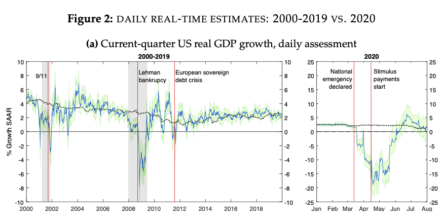
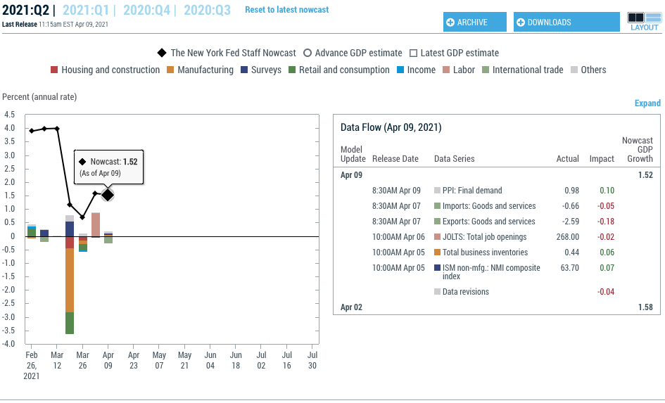

## Outline 

- Dimensionality Reduction
- Factor Models
- Dynamic Factor Models
- Nowcasting
    
## High Dimensional Data

- For most economic and many business forecasting tasks, a lot of *potentially* relevant information is available
    - FRED has over 500,000 economic time series
    - An individual business may have hundreds or thousands of product lines, establishments, workers, etc
- Majority of techniques we have looked at either only use the series whose forecast we are targeting
    - Or add a small set of carefully chosen predictors, chosen based on knowledge of economic or business process
- Can we do better by using more of the data available to us?
    - It seems like the extra information should help: even if only slightly related, forecast should improve
- Especially with up-to-date data: have variables more recent than last observation   
- But handling many predictors also creates big problems for existing methods
    - Adding predictors adds noise, increasing overfitting
    - If many or most predictors don't help much, adding them could just make predictions worse
    - With as many series as values of outcome, can always get a perfect fit even if all predictors pure nonsense
- Can we find a way to get benefits from the extra information in a reliable way?
    - Today: Some classic approaches
    
## Setup

- Goal is to forecast $y_{T+1}$ using available data, including past values $\mathcal{Y}_{T}=\{y_t\}_{t=1}^{T}$
- Also have access to $N$ additional variables each period, $X_t=(x_{1,t},x_{2,t},\ldots,x_{N,t})^{\prime}\in\mathbb{R}^{N}$
    - $X=(X_1^{\prime},X_2^{\prime},\ldots,X_T^{\prime})\in\mathbb{R}^{T\times N}$ collects all the data into an array
- $N$ may be large: comparable to or bigger than $T$
    - Any approach which uses all series in $X_t$ without restrictions to predict $y_{t+h}$ likely to overfit badly
    - This is without even getting into also using past values of $X_t$
- Goal is to come up with forecast procedures $\widehat{f}$ and classes of forecasting rules $\mathcal{F}(X)$ which ensure good performance
    - Balance Risk $R^{*}_p(\mathcal{F})=\underset{f\in\mathcal{F}(X)}{\inf}E_p\ell(y_{T+h},f(X_{T}))$ and overfitting $\frac{1}{T-h}\sum_{t=1}^{T-h}\ell(y_{t+h},\widehat{f}(X_t))-R^{*}_p(\mathcal{F})$
    - Alternately, construct probability model over $(y_t,X_t)$ which provides accurate description of entire system
    
## Dimensionality Reduction

- The most classical approach to the problem of working with high-dimensional data is **dimensionality reduction**
- Idea: although $N$ large, most information in $X$ can be compressed into a summary which has a much smaller dimension
- Instead of working with $X_t\in\mathbb{R}^{N}$ work with $F_t=(f_{1,t},f_{2,t},\ldots,f_{d,t})\in\mathbb{R}^d$ 
    - $d$ can be much smaller than $N$
- $F_t$ is calculated from $X$, and replaces it in forecasting procedure 
    - Make forecasts using $(\mathcal{Y}_T,F)$, rather than $(\mathcal{Y}_T,X)$
- Choose $F_t$ so it is a reasonable number of dimensions and contains the relevant info in $X$ 
    - Preserve information gain from using large set of series
    - Avoid complexity and overfitting from overly complicated models
    
## Dimensionality Reduction Approaches 

- 2 ways of finding a summary $F_t\in\mathbb{R}^d$
- **Unsupervised Dimensionality Reduction**: $F_t$ calculated *only* using information in $X$
    - Reflects some intrinsic structure in the predictors, which are related in a way which makes info beyond summary redundant
- Example: Sample average: $F_t=\frac{1}{N}\sum_{i=1}^{N}x_{i,t}$ 
    - Use if all series are basically redundant copies of the same information, with differences not relevant
    - E.g., instead of including 6 different measures of money supply, take average of all of them
- **Supervised Dimensionality Reduction**: Use information in $\mathcal{Y}_T$ and $X$ to determine $F_t$
    - $X$ may have a lot going on, but only a bit of that info is related to $y$
- Example: Lasso. Regress $y_{t}$ on $X_{t}$ with L1 penalty on coefficients
    - Sets to 0 many or most coefficients: predictor is combination of only a small subset of columns of $X$
- Both approaches popular and effective in economics
    - Unsupervised case useful when **intrinsic dimension** of $X$ is low: knowing only $F_t$, one could get an accurate guess of $X_t$
        - No point in including full set of predictors since you could recover it from smaller set anyway
    - Supervised case useful when $X$ might not have simple structure, but parts that are related to $y$ do    

    
## Factor Models: Static Case

- Unsupervised approach to get $d$ factors $F_t=\{f_{j,t}\}_{j=1}^{d}$, which predict $\{X_{i,t}\}_{i=1}^{N}$ where $N>>d$
- Want to minimize squared error loss of predictions using some *linear* combination of $d$ factors
- Find coefficients $\Lambda$, called *loadings* and factors $F$ which give best prediction
    - $V(\Lambda,F)=\frac{1}{NT}\sum_{i=1}^{N}\sum_{t=1}^{T}(x_{i,t}-\sum_{j=1}^{d}\lambda_{i,j}f_{j,t})^2$
    - Equivalent to log likelihood in model $X_t=\Lambda F_t+e_t$, $\{e_{i,t}\}_{i=1}^{N}\overset{iid}{\sim}N(0,\sigma_e^2)$
- Trick is that although neither $\Lambda$ nor $F$ is known, we can estimate *both together* by minimizing $V(\Lambda,F)$ jointly
    - $(\widehat{\Lambda},\widehat{F})\in\underset{\Lambda\in\mathbb{R}^{N\times d},F\in\mathbb{R}^{d\times T}}{\arg\min}V(\Lambda,F)$
- Combination of factors and loadings in $d$ dimensions minimizing MSE is not uniquely determined  
    - Many possible $F$ and $\Lambda$ could all give exactly the same predictions
    - E.g., divide $f_3$ by 2 and multiply $\lambda_3$ by $2$ and predictions are the same
    - General Case: $(\Lambda R^{-1})(RF)$ for any $d\times d$ *rotation matrix* R defines a valid factor decomposition 
- For prediction purposes, we rarely care which factor is which, so long as we are predicting with all of them
    - Can choose an arbitrary minimizer, then *rotate* (pick $R$) to find any others if needed

    
## Standard Estimator: Principal Components Analysis

- A convenient normalization is to assume loadings $\lambda_j$ are uncorrelated with each other and have norm $1$
    - Typically order them from most to least variance explained
    - Factor estimates found in this way are called **principal components** of $X$
- Factor decomposition with this normalization is called **Principal Components Analysis** or **PCA**    
- The principal components are linear combinations of the observations, chosen in such a way that the *largest* possible amount of (remaining) variation in the data is explained by each
- Let $\widehat{\lambda}_1=\underset{\lambda\in\mathbb{R}^{N}:\left\Vert\lambda\right\Vert=1}{\arg\max}\lambda^{\prime}X^\prime X\lambda$: then $\widehat{f}_1=X\widehat{\lambda}_1$ is the first principal component of data $X$
    - $\widehat{f}_1$ is the norm 1 linear combination of $x_{i}$'s with maximum variance
- Each subsequent principal component is defined analogously, except maximizing the proportion explained of the *residual* variance after previous ones have been removed
    - If you have done linear algebra: $\widehat{\lambda}$ are the **eigenvectors** of $X^{\prime}X$, the covariance matrix of data
    - $\widehat{Var}(\widehat{f}_{j})$, the variance which is maximized by the choice, is the corresponding **eigenvalue**
- Principal Components Analysis (PCA) solution mostly useful because easily computed, due to linear algebra connections
- If for interpretation purposes another normalization is preferred, can achieve it by **rotation** of the PCA solution

## Choosing the number of components

- To see how number of factors affects prediction, use graphical measure called a **scree plot**
- It plots the number of factors against the maximum fraction of variance explained by adding one more factor
    - Technical definition for linear algebra fans only: it plots the **eigenvalues** of the covariance matrix, in order
- If model is well described by a few factors, scree plot will flatten off after those factors
- Can also treat problem like model selection, and choose a number using an **information criterion**
- Bai and Ng (2002) suggested $IC^{\text{Bai-Ng}}(d)=\ln (V(\widehat{\lambda},\widehat{F})) +dg(N,T)$
    - $g(N,T)$ is some function of N and T, e.g. $\frac{N+T}{NT}\ln(\frac{NT}{N+T})$
- Choosing d to minimize $IC^{\text{Bai-Ng}}(d)$ selects a set of factors which provide good performance without overfitting   

```{r,message=FALSE,warning=FALSE}
library(dplyr) #Data Manipulation
library(ggplot2)
library(fbi) #Tools specifically for working with FRED-MD and FRED-QD data

#Load Current FRED-MD Series, as downloaded from https://research.stlouisfed.org/econ/mccracken/fred-databases/
# Described in McCracken and Ng (2014) http://www.columbia.edu/~sn2294/papers/freddata.pdf
# For detrending, use "fbi" library, available by running commands
#library(devtools)
#devtools::install_github("cykbennie/fbi")

#Series of 748 observations of 129 macroeconomic indicators
currentMD<-read.csv("Data/fredmdcurrent.csv")


#PCA without detrending: not recommended, components pick up trends
#Drop date column, so result contains only data
fmd<-dplyr::select(currentMD,-one_of("sasdate"))
#Turn into time series
fredmdts<-ts(fmd,frequency=12,start=c(1959,1))
#Take PCA of Scaled Series
mdPCA<-prcomp(~.,data=fmd,na.action=na.exclude,scale=TRUE)
#Compute statistics
mdPCAinfo<-summary(mdPCA)

#PCA with detrending: uses differencing, log differencing, double differencing etc as needed
fmdtransformed<-fbi::fredmd(file="Data/fredmdcurrent.csv",transform = TRUE)
#Drop date column, so result contains only data
fmddt<-fmdtransformed[,2:129]
#Take PCA of Scaled Series
dtPCA<-prcomp(~.,data=fmddt,na.action=na.exclude,scale=TRUE)
#Compute statistics
dtPCAinfo<-summary(dtPCA)
```

```{r,eval=FALSE}
#Alternate PCA Approaches in R

?prcomp #Default PCA in stats library
?princomp #As above, but with slightly different scaling; former is recommended for numerical accuracy reasons

?screeplot #Use to investigate magnitude of components

# Syntax example:

pc.cr <- princomp(USArrests, cor = TRUE)
screeplot(pc.cr)

#Nonlinear dimension reduction tools
library(Rtsne) #Library for t-SNE: 2d representation, for visualization
library(diffusionMap) #Diffusion Maps: nonlinear low dimensional representation from distance matrices (rather than covariance matrices between points) (cf adapreg for) regression on diffusion map components
library(kernlab) #Contains kernel PCA (and spectral clustering)

#To investigate
#install.packages("bayesdfa") #Bayesian dynamic factor models! Great, but want frequentist ones too
#install.packages("nowcasting") #Dynamic factor models for nowcasting!
#install.packages("tsfa") #Time Series factor models

```

## Example: Principal Components Decomposition

- Use FRED-MD (McCracken & Ng 2014) Database of macro indicators available on FRED
    - 128 Macroeconomic series, 748 observations to Feb 2021
    - Transform each to ensure stationarity according to recommended transforms
- Take PCA of (normalized to mean 0 variance 1) series using `prcomp` command (`princomp` also can be used)
- First principal component accounts for `r 100*dtPCAinfo$importance[3,1]` percent of variability in observations
- First 2 account for  `r 100*dtPCAinfo$importance[3,2]`, 3 for `r 100*dtPCAinfo$importance[3,3]`, etc
- Over 2/3 accounted for in first 15: can go from 128 data series to 15 dimensions, and lose little variation in data
    - The vector of principal components can replace the full 128-dimensional observation $x_t$
- Factor *loadings* or *rotations* are vector of weights placed on each of the 128 series to produce each principal component     


## 2 Dimensional PCA Approximation of Data Set

```{r,message=FALSE,warning=FALSE}
#You can use default biplot(dtPCA) to get a version of this, including arrows displaying loadings, but it is too busy to read
# cf https://stackoverflow.com/questions/6578355/plotting-pca-biplot-with-ggplot2

## Plot PCA of series without detrending
# data <- data.frame(obsnames=row.names(mdPCA$x), mdPCA$x)
# plot <- ggplot(data, aes_string(x="PC1", y="PC2")) + geom_text(alpha=.4, size=3, aes(label=obsnames))+
#         ggtitle("First 2 Principal Components of Macro Series",subtitle="Data Labels are Time Period")
# plot

# Plot PCA of detrended series
data2 <- data.frame(obsnames=row.names(dtPCA$x), dtPCA$x)
plot2 <- ggplot(data2, aes_string(x="PC1", y="PC2")) + geom_text(alpha=.4, size=3, aes(label=obsnames))+
        ggtitle("First 2 Principal Components of Detrended Macro Series",subtitle="Data Labels are Time Period")
plot2

```

## Alternatives: Nonlinear Methods and Sparsity

- Most common dimensionality reduction approaches and corresponding predictions are linear
    - $X_t$ defined in terms of linear function of unknown components $F_t$
- It is completely possible to allow a **nonlinear** representation instead
    - Can have $X_t\approx T(F_t,\theta)$ for some nonlinear $T()$, with parameters learned from data
- Finding a good nonlinear transformation can be difficult, as not all cases preserve structure of data
- Case allowing for general nonlinearities called "manifold learning"
    - Variety of approaches exist: diffusion maps (`diffusionMap` in R), isomap, LLE, kernel PCA, etc
    - **Autoencoders** use neural network functions as map: recently most popular method    
- All used in similar way to PCA, to extract low-dimensional set of features to use for visualization and prediction
- Alternative approach is to just pick small subset of series: **sparse** representation
    - Problem is that you may not know which series best describe $X_t$ and/or $y_t$
        - More useful if sparsity pattern learned in supervised approach 
    - If all series highly correlated, as in macroeconomics, sparse representation may be worse than factor representation at same $d$


## Factor Models: Dynamic Case

- Factor model approach useful for getting current summary of $X_t$
- To leverage this for forecasting, use **Dynamic Factor Model**, which uses past factors to predict future ones
- X still depends on factors, and factors $F_t$ follow vector autoregression
    - $X_t=\Lambda F_t+e_t$, $F_{t}=AF_{t-1}+u_t$
- Format is exactly that of of a state space model, with $d$-dimensional state, $N$ dimensional observations
- If we assume $e_{i,t}\overset{iid}{\sim} N(0,\sigma^2_e)$, $u_{j,t}\overset{iid}{\sim} N(0,\sigma^2_u)$, can estimate and predict using Kalman Filter
    - Estimate like any other state space model, and predict using filtered estimates $\widehat{F}_{T}$ of factors
    - Use likelihood for Bayesian version with priors on coefficients, eg R library `bayesdfa`
- Can allow additional lags of factors in model, or including standard state space components like trends, seasons, etc
- Would it help to predict $X_t$ using lags of $F_{t-j}$, i.e. $X_t=B(L) F_t+e_t$ for some lag polynomial?
    - It turns out, not needed: if lags matter for $X_t$, they show up as extra factors
    - But, in this case, dimension of shocks $u_t$ may be smaller than dimension $d$ of factors, so allow for this in model

## Two Step Estimation of Dynamic Factor Model

- An easier and more robust method exploits fact that $X$ still has factor structure
    - Step 1: Use PCA on $X$ to obtain $\{\widehat{F}_t\}_{t=1}^{T}$ in $X_t=\Lambda F_t+e_t$
    - Step 2: Estimate VAR in $\widehat{F}_T$ to obtain $A$ in $\widehat{F}_{t}=A\widehat{F}_{t-1}+u_t$
- Usefulness of this method is that PCA gives good predictions even if $X_t$ doesn't have exact factor structure
    - $e_t$ can have some remaining correlations between series even after $\Lambda F_t$ taken out
    - Can also have $e_{i,t}$ autocorrelated, reflecting predictability not captured by $F_t$
- Extra error introduced due to fact that factors estimated, but *if* $N,T$ both large, this is small
- Do need stationarity, weak dependence for good estimates, as usual for ERM
    - Since needed for **all** series in $X_t$, be careful to difference or detrend each before estimation
- In practice, extra robustness often results in better performance than Bayesian estimate based on exact factor structure
- Bayesian approach useful if $T$ or $N$ not super big, so factors estimated imprecisely
    - Also can handle nonstationary factors, if form of nonstationarity specified correctly 

    
## Factor-Augmented Regression

- To predict series $y_{t+h}$ which may not be in $X$ using dynamic factors, simply include $\widehat{F}_t$ as predictors
    - Estimate $\widehat{F}_t$ by PCA, which is appropriate in static or dynamic case
- Use predictor class $\mathcal{F}=\{f(\widehat{F},\beta)=\beta_0+\sum_{j=1}^{d}f_j\beta_{j}:\ \beta\in\mathbb{R}^{d+1}\}$ inside ERM or other estimator
- Like standard ERM with minor caveat that predictors no longer given but first estimated using the data
- Properties are similar, in terms of risk: under stationarity, weak dependence, etc, risk converges to oracle risk
- Can also add $\widehat{F}_t$ along with a set of other, carefully chosen predictors in a **Factor Augmented VAR** (FAVAR)
    - Allows using additional  idiosyncratic info in small set of series, along with correlated info in others, to predict outcome of interest
- Extremely popular in policy circles
    - Jim Stock, one of developers of Dynamic Factor Model, was head of Council of Economic Advisors
    - FAVAR developed by group including former Fed Chair Ben Bernanke 
        - Used to analyze interaction of monetary policy, inflation, and employment, which Fed is mandated to take into account
        - Allows incorporating huge amount of other series used by Fed

```{r,message=FALSE,warning=FALSE}

## Code to Fit Bayesian factor models
# Run this on your own time, as it is too slow to run each time I compile the file

#library(bayesdfa) #Bayesian Factor Models

# library(fredr) #Data Source
# fredr_set_key("8782f247febb41f291821950cf9118b6") #Key I obtained for this class
# 
# serieslist<-c("GS1M","GS3M","GS6M","GS1","GS2","GS3","GS5","GS7","GS10","GS20","GS30")
# 
# treasuryyields<-list()
# for (i in 1:length(serieslist)){
#   
#   val<-fredr(series=serieslist[i])
#   
#   treasuryyields[[i]]<-ts(val$value,frequency=12,names=serieslist[i],names=serieslist[i])
# }

# options(mc.cores = parallel::detectCores()) #Use parallel computing when running MCMC

# #Collect all Group 6 Variables: These are financial series
# finseries<-data.frame(currentMD$FEDFUNDS,currentMD$CP3Mx,currentMD$TB3MS,currentMD$TB6MS, currentMD$GS1,currentMD$GS5,currentMD$GS10, currentMD$AAA,currentMD$BAA,currentMD$COMPAPFFx,currentMD$TB3SMFFM,currentMD$TB6SMFFM,
#                       currentMD$T1YFFM,currentMD$T5YFFM,currentMD$T10YFFM,currentMD$AAAFFM,
#                       currentMD$BAAFFM,currentMD$TWEXAFEGSMTHx,currentMD$EXSZUSx,
#                       currentMD$EXJPUSx,currentMD$EXUSUKx,currentMD$EXCAUSx)
# 
# finpca<-prcomp(~.,data=finseries,na.action=na.exclude,scale=TRUE)

### Warning: With Data Size this large, following command does not appear feasible on a laptop
## Command works fine on small data sets, but not on this one
## #Fit Bayesian Dynamic Factor Model using "bayesdfa"
## dynfactormodel<- fit_dfa(
##   y = t(finseries), num_trends = 3, zscore = TRUE,
##   iter = 2000, chains = 4, thin = 1
## )

# ## Alternate approach: try 1 factor model of just small set of interest series 
# # This is also very slow, but at least feasible. Total estimation takes 76 minutes on a 4-core laptop.
# fins1<-data.frame(currentMD$FEDFUNDS, currentMD$GS1,currentMD$GS5,currentMD$GS10)
# # Bayesian 1 factor model, 4 normalized series, with random walk assumed for factor dynamics 
# dynfactormodel<- fit_dfa(
#   y = t(fins1), num_trends = 1, zscore = TRUE,
#   iter = 2000, chains = 4, thin = 1
# )
# #Select a rotation of factors (irrelevant with 1, but this also computes summary stats)
# rt<-rotate_trends(dynfactormodel) 
# #Plot factor over time
# plot_trends(rt)
# #Plot predictions for each series
# plot_fitted(dynfactormodel)
# #Plot posterior estimates of factor loadings
# plot_loadings(rt)

```

## Exercise: GDP forecasting with a FAVAR

- Try out FAVAR based forecasting yourself in a [Kaggle notebook](https://www.kaggle.com/davidchilders/gdp-forecasting-with-favars)

## Nowcasting 

- A common problem when using many data series is that not all are available at the same time
- Some may be at different frequencies: e.g., quarterly, annual, monthly
    - Even within a month, some may come out earlier or later in month 
- Result is that current period information is incomplete, containing some series but not others
- Goal of **Nowcasting** is to use this incomplete info to predict a missing or external series
    - E.g., use monthly releases to predict quarterly GDP
- Good nowcasts can be achieved using slight variant of dynamic factor model
    - $x_{i,t}=\sum_{j=1}^d \lambda_{i,j} f_{j,t}+u_t$ if $i$ observed in period $t$, otherwise it disappears
    - Factors still follow VAR $F_t=AF_{t-1}+e_{t}$
- Kalman filter allows inferring $\widehat{F}_{t}$ even with missing data
    - Get good estimate of current factors with whatever data is available
    - Can "fill in" what a series would have been using current guess of factors plus known factor loadings

## Nowcasting: One Approach

- "2 step procedure" due to Giannone, Reichlin, Small (2008), originators of procedure
1. Estimate parameters of dynamic factor model
    - (a) Estimate $d$ factors $F_t$ from series by PCA on $X_t$
    - (b) Aggregate monthly series up to quarterly data, and estimate loadings of $y_{t}$ on factors by Least Squares 
        - $\widehat{\beta}=\underset{\beta}{\arg\min}\sum_{k=1}^{T/3}(y_{k}-\sum_{j=1}^{d}\beta_j\widehat{f}_{j,3k})^2$
    - (c) Estimate VAR in $F_t$, $F_t=AF_{t-1}+e_{t}$ by OLS using PCA factors
2. Predict current factors using Kalman filter and use in forecast     
    - (a) Run Kalman filter from dynamic factor model to get predicted factors $\widehat{F}_{t}$ given current observations
    - (b) Predict $\widehat{y}_{k}=\widehat{F}_{t}\widehat{\beta}$
- Apply to set of monthly US economic indicators (1982-2007) from Giannone et. al. for predicting quarterly GDP
    - Implemented in `nowcasting` library
    - Select $d$ by Bai-Ng Criterion, estimate model by above
    
```{r,warning=FALSE,message=FALSE}
library(nowcasting)
#Example syntax for nowasting based on quarterly factor model as in Giannone, Reichlin, Small (2011)


# Old Syntax: manually aggregate 
# #Use Stock-Watson US GDP and indicators data
# gdp <- month2qtr(x = USGDP$base[,"RGDPGR"])
# # Extract Real GDP Growth from data
# gdp_position <- which(colnames(USGDP$base) == "RGDPGR")
# #Aggregate monthly up to quarterly data
# capture.output(base <- Bpanel(base = USGDP$base[,-gdp_position],trans = USGDP$legend$Transformation[-gdp_position],aggregate = TRUE),file="/dev/null")

#New syntax (automatically aggregates)
data(USGDP)
gdp_position <- which(colnames(USGDP$base) == "RGDPGR")
base <- Bpanel(base = USGDP$base[,-gdp_position],
               trans = USGDP$legend$Transformation[-gdp_position],
               aggregate = TRUE)
usdata <- cbind(USGDP$base[,"RGDPGR"], base)
colnames(usdata) <- c("RGDPGR", colnames(base))
frequency <- c(4, rep(12, ncol(usdata) -1))
```

## Diagnostics: Find order of factor model by Bai-Ng Criterion

```{r,warning=FALSE,message=FALSE}
#Diagnostics 1: Select number of Factors by Bai-Ng Information Criterion
factorselect<-ICfactors(base)
#Diagnostics 2: Select number of lags and shocks by another info criterion
shockselect<-ICshocks(base,r=factorselect$r_star)
```

## Results: Nowcast

```{r,warning=FALSE,message=FALSE}
#Run 2 step nowcasting, with optimal # of factors, lags, and error terms

#Old Syntax
#now2sq <- nowcast(y = gdp, x = base, r = factorselect$r_star, p = shockselect$p, q = shockselect$q_star, method = '2sq')

#New Syntax
now2s <- nowcast(formula = RGDPGR ~ ., data = usdata, r = factorselect$r_star, p = shockselect$p, q = shockselect$q_star,
          method = '2s', frequency = frequency)

#Plot results
nowcast.plot(now2s,type="fcst")
```

## Results: Factor Estimates

```{r,warning=FALSE,message=FALSE}
#Plot results
nowcast.plot(now2s,type="factors")

#Additional Displays, Not Shown

##Fraction of variance Explained by each factor
#nowcast.plot(now2sq,type="eigenvalues")
## Display factor loadings of each series on Factor 1
#nowcast.plot(now2sq,type="eigenvectors")

```


## Application: Fulcrum Nowcast

- Fulcrum asset management uses Bayesian Dynamic Factor Model due to Juan Antolín-Díaz et al
    - Nowcasts and forecasts reported monthly in Financial Times
- Bayesian state space model with unit roots, seasonality, heavy tailed errors and time-varying variance
    - Additional features improve uncertainty forecasts, account for correlation properties of data
    
    

## NY Fed Nowcast

- The New York Fed maintains weekly GDP Nowcast: <https://www.newyorkfed.org/research/policy/nowcast>
    - Uses dynamic factor model as above, estimated by maximum likelihood and Kalman filter
    - Useful source for understanding impacts of recent economic news
- Many economic statistics appear with a lag, so can still be a bit slow
    - But some, like finanical markets and surveys, incorporate current opinion and expectations
    - Provides information from non-economic news indirectly
    
     
    
        
    

## Conclusions

- Many economic forecasting problems have more predictors available than can be incorporated in existing methods
- Simple solution is to reduce dimensionality of data by producing small set of combinations that contain most info
- Factor models use linear combinations, and can be estimated by Principal Components Analysis
    - Don't take separate factors themselves as anything meaningful: only their combinations are determined by data
- Forecast using this information by adding factors as predictors or treating as a latent state
    - Dynamic Factor Model is special case of a linear state space model with fewer states than observables
- Factor models are currently dominant approach in applied macroeconomic forecasting
- Also useful for combining data at *mixed frequency* to "nowcast" series not yet updated 


## References

- Jushan Bai and Serena Ng (2002) "Determining the Number of Factors in Approximate Factor Models" *Econometrica* Volume 70, No.1, pp 191-221.
- Ben Bernanke, Jean Boivin, Piotr Eliasz (2005) "Measuring the Effects of Monetary Policy: A Factor-Augmented Vector Autoregressive (FAVAR) Approach" *The Quarterly Journal of Economics*, Volume 120, Issue 1, February, pp 387–422.
    - Introduced FAVARs
- Brandyn Bok, Daniele Caratelli, Domenico Giannone, Argia Sbordone, and Andrea Tambalotti (2017) "[Macroeconomic Nowcasting and Forecasting with Big Data](https://www.newyorkfed.org/medialibrary/media/research/staff_reports/sr830.pdf)"  *Federal Reserve Bank of New York Staff Reports*, no. 830  
    - Describes methods for NY Fed Nowcast 
- Juan Antolín-Díaz, Thomas Drechsel and Ivan Petrella (2021) "Advances in Nowcasting Economic Activity: Secular Trends, Large Shocks, and New Data"
    - Updated version of model behind Fulcrum/Financial Times nowcasts
- Domenico Giannone, Lucrezia Reichlin, David Small (2008) "Nowcasting: The real-time informational content of macroeconomic data" *Journal of Monetary Economics* 55 pp 665-676.
- Michael McCracken and Serena Ng (2014) "FRED-MD: A Monthly Database for Macroeconomic Research"
- James Stock and Mark Watson (2002) "Forecasting Using Principal Components From a Large Number of Predictors" *Journal of the American Statistical Association* December, Vol 97, No 460
    - Describes factor-augmented regression forecasting
    
