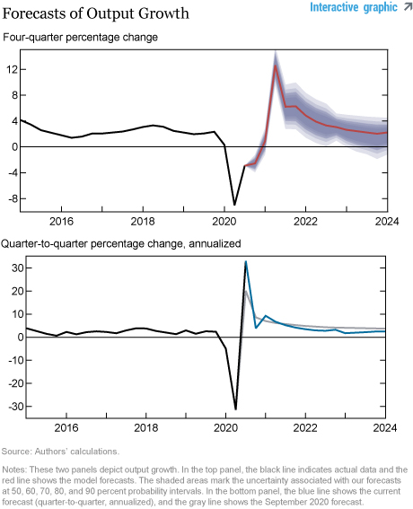
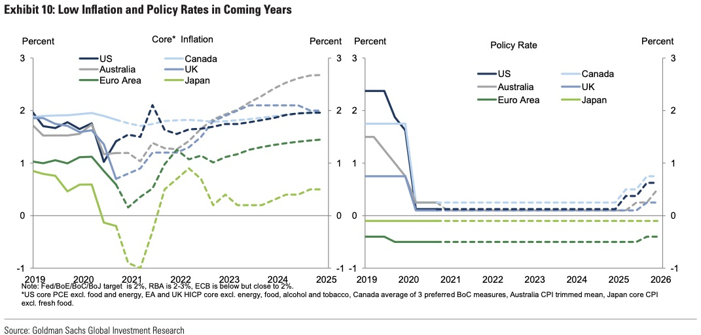

## The need for forecasts

- Planning ahead is a key component of prudent decision making 
- Businesses and governments make investments and strategic decisions whose value will depend on the situation they face in the future.
    - A firm which acquires too much inventory relative to sales will have spent extra on product which does not sell 
    - A firm which acquires too little leaves profits on the table. 
- An investor who buys when the price will go down will lose money, as will one who sells when the price will go up. 
- A government agency which makes preparations for one event may find itself flatfooted if a different event happens instead. 
- A college student who chooses one major, in anticipation of plentiful and remunerative employment opportunities, may end up rewarded or deeply disappointed after graduation depending on whether those opportunities indeed arise. 

## Making Forecasts

- In all these situations, and many more, it is crucial to have a good guess of what will happen in the future 
- Of course, most of the time, one cannot know the future with certainty 
- The world, and our understanding of it, is subject to change, in ways both gradual and sudden 
- What can be done in this situation is to use, to the best of our ability, whatever limited knowledge and understanding we do have of the situation, along with principled reasoning, to make the best guesses we can. 
- The task of forecasting is to formalize this process, devising reliable methods to come up with high quality guesses that can be used as an aid to planning and decision making. 

## Making Forecasts

- There is no one perfect and universally applicable way to predict the future, 
- We will introduce *some* of the principles by which forecasts can be produced and evaluated 
- Focus on ideas and methods applicable to economic and business decisions
    - More specifically, on those which actually have been and continue to be applied in these situations 
- Case studies drawn from the forecasting practices of businesses and governments 
- Applications
    - Technology, finance, marketing and sales, macroeconomics. 
- Discussion will be (fairly) quantitative
- Concentrate on numerical quantities observed repeatedly over time
    - Company or unit level outcomes 
    - Prices in financial and other markets
    - Macro- and micro-economic data observed over time 


## Forecasting

- Modern forecasting practice draws from a variety of disciplines
    - Statistics, econometrics, machine learning, optimization 
- Forecasting has distinctive goals, methods, and origins. 
- Focus will not be on the "prediction" setting of machine learning
    - One observes many units of the same kind of object (customers, documents, photographs, etc) 
    - Goal is to determine some information about unobserved units by using the information about the observed units. 
- Also different from statistical or econometric Time Series analysis 
    - Seeks to learn about properties of data observed over time. 
- Ideas and tools from these areas will be extensively discussed and applied 
    - But due to distintictive goals and methods, many results from these other fields not applicable

## Forecasting Methods and Applications

{height=600px}

- The Ancient Greeks would consult the Oracle to hear predictions about future events. 
- While the goal of learning about the future is long held, forecasting methods have changed substantially over 2500 years.

## Real World Forecasting Examples

- To motivate and illustrate the methods and models that will be discussed, we will look at a variety of applications where forecasting methods have been applied. 
- Different applications have unique features which motivate particular approaches, but at the same time illustrate principles that can be applied in other cases. 

## Exchange Rates

- Any firm or financial institution which transacts internationally may be exposed to financial losses due to changes in exchange rates, and national and international economic policy makers keep close track of these series.  
- Forecasting these changes has proven to be a particularly difficult problem, illustrating many of the peculiar challenges of forecasting economic data.

```{r,message=FALSE,warning=FALSE}
library(ggplot2)
library(fredr) #Access FRED, the Federal Reserve Economic Data
#To access data by API, using R rather than going to the website and downloading
#You need to request a key: you can do so at https://research.stlouisfed.org/docs/api/api_key.html
fredr_set_key("8782f247febb41f291821950cf9118b6") #Key I obtained for this class
```    
```{r, echo=FALSE}   
#Let's get the (main) series for the Yen-Dollar Exchange rate
DEXJPUS<-fredr(series_id = "DEXJPUS",observation_end=as.Date("1982-01-04")) #Get 1970s data
#You can also download this series at https://fred.stlouisfed.org/series/DEXJPUS
pplt<-ggplot(data=DEXJPUS,mapping=aes(x=date,y=value)) #Plot the data!
pplt+geom_line()+
  labs(x="Date",y="Japanese Yen to One U.S. Dollar",
       title="Japan / U.S. Foreign Exchange Rate",
       subtitle="Daily From 01-04-1973 to 01-04-1983")
```
    
## Product Sales 

- Amazon sells hundreds of thousands of products in dozens of categories, and employs a team to forecast sales, using both product-specific and shared information.

{height=300px}

[Source: Salinas et. al. (2017)](http://arxiv.org/abs/1704.04110)
    
## Macroeconomic Forecasting for Policy

- The Federal Reserve Bank of New York contributes to decision-making in and execution of monetary policy. 
- Researchers there employ a variety of models, incorporating economic theory, statistical principles, and individual judgment, to produce staff forecasts of inflation, output, and other macroeconomic variables relevant to monetary policy.

 

[Source: Chen et al (2020), Liberty Street Economics](https://libertystreeteconomics.newyorkfed.org/2020/12/the-new-york-fed-dsge-model-forecastdecember-2020.html)  
    
## Macroeconomic Forecasting for Finance

- Investment banks like Goldman Sachs employ large teams of economic and financial experts to follow and predict the global economic situation to guide investment opportunities for themselves and their clients.
- Reliably forecasting multiple macroeconomic series is one part of this task, and one to which a former Goldman Sachs Chief Economist made important contributions.
- Output Forecasts from BVAR model and commercial forecasters 1982. [Litterman (1986)](https://amstat.tandfonline.com/doi/abs/10.1080/07350015.1986.10509491)

{height=270px}

- Goldman Sachs Economic Outlook Report Inflation and Interest Forecast, Nov 2020 [Hatzius et al (2020)](https://www.goldmansachs.com/insights/pages/gs-research/macro-outlook-2021/report.pdf)   
{height=270px}

    
## Web Activity

- Major internet companies like Facebook have both cost and revenue streams closely tied to patterns of traffic to their websites, which are monitored and forecast continuously 
- The scale and frequency of the data have led to unique challenges and solutions from their internal forecasting team.

    

[Source: Taylor & Letham (2018)](https://www.tandfonline.com/doi/full/10.1080/00031305.2017.1380080)
    
## Ad Auctions

- Google derives most of its revenue from advertising sales on keywords, sold by auction. 
- This process involves using billions of different characteristics to predict the value of diverse advertisements to contribute to an automated system that generates and applies predictions in real time in an automated fashion without direct human intervention. 
- The methods used for this task, also applied by firms like Microsoft and Yahoo, involve innovations not only in the implementation but in the foundational principles of how and why to perform forecasting.
    
 

[Source: McMahan et al (2013)](https://dl.acm.org/doi/pdf/10.1145/2487575.2488200)
    
## Monthly Unemployment Releases

- The first Friday of every month, the Bureau of Labor Statistics releases the Employment Situation Report, containing the latest survey data on payrolls and unemployment rates.
- Due to its frequency and economic importance, this is the most tracked regular economic data release
- Policy makers and market participants spend considerable effort to forecast the outcomes, which can move asset returns and policy decisions. 

```{r}
#Let's get the (main) series UNRATE for the unemployment rate.
UNRATE<-fredr(series_id = "UNRATE",vintage_dates =as.Date("2021-2-2"))
#The jobs series has FRED ID "PAYEMS", for "Payroll Employment Survey", as the numbers are calculated by a survey of employers
#The Employment Situation Report reports growth, so report units as change from last month
PAYEMS<-fredr(series_id = "PAYEMS",units="chg")
#You can also download this series at https://fred.stlouisfed.org/series/PAYEMS
#You can also download this series at https://fred.stlouisfed.org/series/UNRATE
plt<-ggplot(data=UNRATE,mapping=aes(x=date,y=value)) #Plot the data!
plt+geom_line()+
  labs(x="Date",y="Unemployment Rate",
       title="U3 Unemployment Rate",
       subtitle="Monthly From 1948")
pplt<-ggplot(data=PAYEMS[2:984,],mapping=aes(x=date,y=value),vintage_dates=as.Date("2021-2-2")) #Plot the data!
pplt+geom_line()+
  labs(x="Date",y="Thousands of Persons",
       title="Nonfarm Payrolls Growth",
       subtitle="Monthly From 1939")
```

## Forecast Competition

- At the Council of Economic Advisers, which advises the president on economic policy and releases official executive statements regarding economic conditions, staff had a monthly pool to see who could produce the most accurate forecasts. 
- In this tradition, this class involves a forecasting competition for these series, where you will apply your knowledge of forecasting principles to compete in an internal forecasting competition to produce the most accurate monthly forecasts.

## For next class

- Take a look at the [textbook](https://otexts.com/fpp2/) Chapters 1 and 2
- Sign up for an account at <https://www.kaggle.com>
- Come prepared to use your browser to work interactively
    - We will be exploring R, Kaggle, and working with data and graphics!