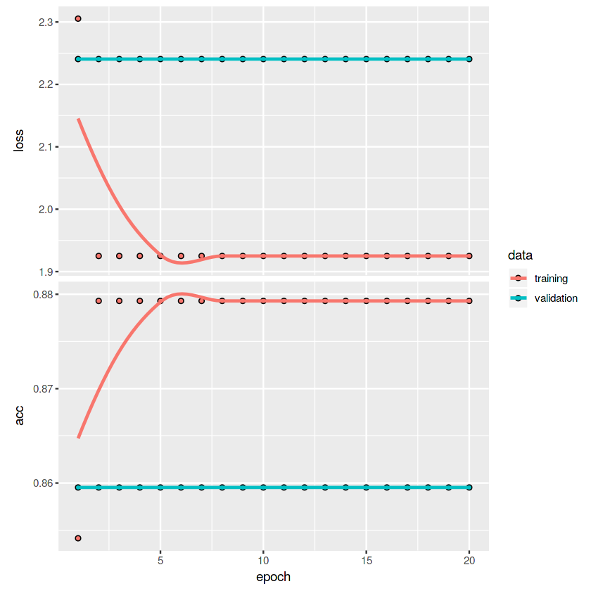
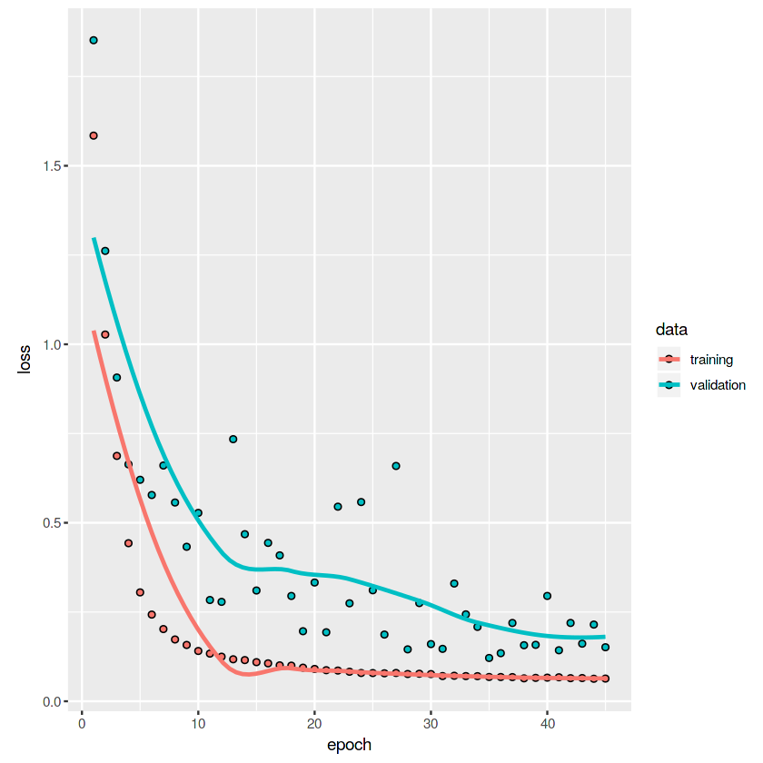

## Outline

- Neural Networks
- Feedforward Networks
- Training
- Regularization
- New Archictectures: Convolutional, Recurrent
- Applications and Evaluation

<!-- - Neural Networks -->
<!-- - Feedforward -->
<!--     - Neural AR -->
<!-- - Training -->
<!--     - Backprop -->
<!--     - SGD/Adagrad/etc -->
<!-- - Regularization -->
<!--     - Early Stopping -->
<!--     - Dropout     -->
<!-- - Sequence Data   -->
<!--     - Recurrent Neural Networks -->
<!--     - LSTM/GRU -->
<!-- - Applications -->
<!--     - Amazon/Walmart/etc -->
    
## Neural Networks

- Machine learning methods designed to use high-dimensional data to produce nonlinear prediction rules with good out-of-sample prediction accuracy
- Allows companies and researchers with large, messy data sets, possibly containing nontraditional data like images, text, and audio, and no idea where to start on building a model, to produce good forecasts
- [Movie studio](https://cloud.google.com/blog/products/ai-machine-learning/how-20th-century-fox-uses-ml-to-predict-a-movie-audience) wants to know if people will buy tickets to latest blockbuster
    - Why not use the script and the [video from the trailer](https://arxiv.org/abs/1810.08189) as input to prediction?
- Multinational retailer, like [Amazon](https://arxiv.org/abs/1709.07638v1) or [Walmart](https://arxiv.org/abs/1901.04028) wants to predict sales  for each of 100s of 1000s of products
    - Why not incorporate data from all products into forecasts?
- More than any other type of method, approach which made this practical is **neural networks**, or **deep learning**
    - A class of prediction rules with good performance in large data applications
- Basic ideas are quite old (McCulloch & Pitts 1943, Rosenblatt 1958), but massive resurgence in recent years    
    
## What is a Neural Network?

- Given data $\mathcal{Z}_T=\{y_t,X_t\}_{t=1}^{T}$,  $X_t\in\mathbf{X}\subseteq\mathbb{R}^{N}$, $y_t\in\mathbf{Y}$ want forecast rule $f:\ \mathbf{X}\to\mathbf{Y}$
- A neural network is a class $\mathcal{F}(\Theta)=\{f(,\theta):\ \mathbf{X}\to\mathbf{Y},\ \theta\in\Theta\}$ of nonlinear functions produced by **iterated composition** of many simple nonlinear functions called **neurons**
- Single "neuron": takes a $K\times 1$ vector $X$ to scalar
$$f_{j}(b_{0,j}+b_{1,j}x_1+b_{2,j}x_2+\ldots+b_{K,j}x_k)$$
    - Include a constant $b_{0,j}$ (the **bias**) along with $K$ coefficients on the inputs, called **weights**
- $f_j(u)$ is a fixed nonlinear function, e.g. $\max(u,0)$ ("**relu**") or $\tanh(u)$ or $\frac{\exp(u)}{1+\exp(u)}$ ("**sigmoid**"")
- Example: with sigmoid nonlinearity, a single neuron is exactly function fit by a logistic regression
- A **layer** is a *vector* of $J$ neurons, applied to same inputs but with different coefficients: $F^{(1)}(X)=\{f_j(X)\}_{j=1}^{J}$
    - Parameters of a layer are the $J\times K+1$ coefficients $b$ of the individual neurons
- Can take $J$ dimensional output of one layer as input vector to another layer, repeatedly
    - $Y=F^{(L)}(... F^{(2)}( F^{(1)}(X))))$
- Result is a **deep neural network**, and fitting such a model is called **deep learning**

## Fitting a Neural Network

- Given a set of inputs, a neural network is just a class of functions $\mathcal{F}(\Theta)$
- We know plenty of things we can do given such a class, some data and a forecasting problem
- Empirical Risk Minimization: find $\widehat{f}(x)=f(x,\widehat{\theta})$, $\widehat{\theta}=\underset{\theta\in\Theta}{\arg\min}\frac{1}{T}\sum_{t=1}^{T}\ell(y_t,f(x_t,\theta))$
- Results for Empirical Risk Minimization apply just as well to this class
    - If data is stationary and weak dependent and model class not too complex, excess risk is small
- Here, "not too complex" can be expressed in terms of number $L$ of layers and number of neurons in each
    - With many parameters, may need large data size to get good performance
- Indeed, forecasting performance of **Neural AR models** (where $X_t$ contains lags of $y_t$) historically not great
    - Adds a lot of parameters, creating overfitting, especially in low data applications
    - **NARX** models, where $X_t$ contains lags of $y_t$ *and* other variables, not much better
- As usual, can use penalized risk minimization to help protect against overfitting
- Use as mean function in probability model with prior over parameters for Bayesian Neural Networks
- Methods well known by 1990s, but interest faded until recently, with good performance by modified versions  
    
## Modern Neural Networks: What's New?  

- Modern deep learning fad kicked off by Krizhevsky et al (2012), showing unprecedented accuracy with image data
- Many changes from early models: why is performance so much better? 
- **Bigger Data** 
    - With more observations, overfitting problem reduced while prediction improvement from nonlinearity remains 
    - Advantage of more complicated model like very deep neural network increases with data
- **Architecture** 
    - Basic formula above is a *Fully Connected* **Feedforward Neural Network**, the simplest kind.
    - Modern approach uses modified forms like **Convolutional** and **Recurrent** Networks
- **Training** 
    - As with trees, for big enough networks, finding exact minimizer with off-the-shelf optimization methods rarely feasible
    - Instead use methods like **Stochastic Gradient Descent** (SGD) and variants, which provide speed and out-of-sample accuracy gains
    - Using **backpropagation** algorithm and Graphics Processing Units, now faster than other methods on huge data 
- **Regularization** 
    - In addition to standard L1/L2 penalization, methods like **dropout**, **early stopping**, and SGD itself improve generalization 


## Training by Stochastic Gradient Descent

- Want to approximately minimize $\widehat{R}(\theta)=\frac{1}{T}\sum_{t=1}^{T}\ell(y_t,f(x_t,\theta))$ over class of neural networks
- Start with $\theta^{(0)}$ random (on scale of normalized data), **learning rate** $\eta$, and **minibatch size** $B$
    - Each step $k$, randomly draw $B$ data points $\{(y_s,x_s)\}_{s=1}^{B}$ without replacement and update parameters
        - $\theta^{(k+1)}=\theta^{(k)}-\eta\frac{1}{B}\sum_{s=1}^{B}\nabla_{f}\ell(y_s,f(x_s,\theta^{(k)}))\nabla_{\theta}f(x_s,\theta^{(k)})$
    - Continue update steps until all of data set used, 1 **epoch**, then start again, possibly with smaller $\eta$, and stop after preset number of epochs
- Using $B$ random data points gives unbiased but noisy estimate of derivative, which is enough to go towards minimum
    - Unlike computing exact derivative, don't have to go through whole giant data set each step: 100s of times faster
- Algorithm same as Online Gradient Descent in random order, but objective not convex, so no exact guarantees
    - Randomness seems to help prevent getting stuck in **local minima**, not true minimum but all local directions point up
- **Backpropagation**: when calculating gradient $\nabla_{\theta}f(x_s,\theta^{(k)})$, have to apply chain rule through compositions of layers
    - Way faster to compute from output (1 dimension) back to input (N-d) since components used multiple times
- Speed advantages make working with huge data ($T>10^{7}$) huge parameter size (millions) possible
    - Still very slow: use fast Graphics Processing Unit (GPU) chips, and wait for hours or days
- Common to use adaptive variants that scale learning rate automatically, like **Adagrad**, **Adam**, or **RMSProp**

## Regularization

- Even with fairly big data, neural networks prone to overfit, so regularization needed
    - Choose hyperparameters like number/size of layers, L1/L2 penalty, etc by checking accuracy in **validation set**
- With SGD-like training, number of epochs can be chosen to trade off fit and performance
    - Usually see on plot that *validation* error decreases for early epochs, then levels off or increases
    - Can regularize by **early stopping**: don't train all the way until empirical risk minimized
    - This can be shown to act a lot like L2 penalty, but has obvious speed advantage since you don't have to wait
- Another popular regularization strategy, to apply at each layer, is **dropout** (Srivastava et al 2014)
    - Within each minibatch, multiply neurons in a layer by indpendent $0-1$ Bernoulli(p) random variables
    - Acts as if fraction $(1-p)$ of neurons disappeared, so others must update to give good fit without them
    - Use all neurons, scaled by $p$ for prediction (to keep average output size same as in training)
- Many other tricks are used, set based on validation performance
- Result can be good test performance with as many or more parameters as data points
- In fact, SGD alone also acts like regularizer in this *overparameterized* case
    - Of the many minima, seems to select one with better generalization (Zhang et al 2017) 


```{r,message=FALSE,warning=FALSE}
# Load libraries for Neural Networks and Deep learning
# These require installing and accessing Python and several libraries, which can be a major headache
# If not installed, and you don't want to spend several hours at the command line fixing things
# Try running this code in Kaggle environment instead: everything there is preinstalled

library(keras) #Simple syntax for fitting Neural Networks 
library(tensorflow) #Programming language and tools for neural networks: what is going on behind the simple Keras code
library(reticulate) #Access to Python, which is language Tensorflow is written in 
# Yes, we are going 3 layers of languages deep, from R to Keras to Tensorflow to Python, to run this code


# Plan: *show* Keras code in line for each step: intialize, write models (feedforward, then recurrent, then maybe recurrent with dropout), train, display results.
```


## Recurrent Networks

- **Recurrent Neural Networks** (RNNs) are specifically designed to take **sequence data** as input
    - Uses ordering of the data by using output of function as input into same function, along with next observation in sequence
    - Applying recurrent unit repeatedly transforms sequence of inputs arbitrary length into output sequence of same length
- Can think of RNN as like a state space model, with deterministic state transition
    - Given input sequence $\{z_{t}\}_{t=1}^{T}\in\underset{t}{\otimes}\mathbb{R}^K$ and initial state $s_0$ repeatedly iterate $s_{t+1}=f(s_t,z_t,\theta)$
- Way to take a sequence as input, produce ordered sequence of states $\{s_t\}_{t=1}^{T}$ as output
- Can use vector of these transformations, with different coefficients, to produce a recurrent **layer**
- Can use several recurrent layers to produce deep recurrent network
- Specific nonlinear function $f(s_t,z_t,\theta)$ can be basic neuron $f_j(b_0+W_1^{\prime}z_t+W_2^{\prime}s_t)$, or more complicated object
    - Popular choices are **Long Short Term Memory** (LSTM) unit or **Gated Recurrent Unit** (GRU)
- Use final output of repeated iterates $s_{T+1}$ as forecast or input to next non-recurrent layer
- RNNs accomodate variable-length inputs, can take into account long-term dependences, and work with input like text
- Performance very good with LSTM or GRU with enough data and regularization (cf Karpathy 2015)

## Convolutional Networks

- **Convolutional Neural Networks** (CNNs) encode ordered structure in data by restricting coefficients
- Instead of arbitrary coefficients over entire input space, each *convolutional layer* applies small number of coefficients repeatedly to overlapping subsets of inputs, called **patches**, before applying nonlinearity to each output
- For 1d input, eg time series, a patch of length $k$ is simply an ordered set of observations $(y_{t},y_{t-1},\ldots,y_{t-k})$
- A **filter** is a set of coefficients $(b_{1},b_{2},\ldots,b_{k})$ multiplying each patch $t=k+1,\ldots,T$ in order
    - E.g. a filter $(b_1=1,b_2=-1)$ performs differencing: output is $\{\Delta y_t\}_{t=2}^{T}$
- Convolutional layer applies a *vector* of filters to input, then applies nonlinearity, with output an array of series
- Output of a convolutional layer can be passed to another convolutional layer, or a dense or recurrent layer
- Often pass to a **pooling layer**, which takes ordered blocks of entries and passes block to a single output
    - **Max pooling** takes max of entries in block, **Average pooling** takes average, etc
- Filters are **time invariant**, capturing features of series which are same regardless of point in time
    - Also use fewer parameters than dense layer in doing so
- 2d convolutions apply filters to 2d patches of images, preserving location-shift invariance
    - Major component of good performance in image processing applications
- Typical CNN has several convolutional and pooling layers, then passed into dense layers before prediction 

## Software and Code

- Neural network modeling requires specifying a lot of aspects, including choice of layers and nodes, nonlinearities, architectures, optimization methods, etc
- Fitting a neural network requires running optimization algorithms which take as input complicated derivative formulas
- Complication means deep learning mainly uses specialized programming languages designed to do all these things
    - Especially automatic derivative computation and use of GPU to speed up operations
- Many options, pros and cons of which are source of debates: choose best for your application
    - Tensorflow, Torch, MXNet, Theano, CNTK, Keras, etc
- Here, will show code examples via R interface to Keras (Chollet 2018)
    - Simple interface allowing "high level" descriptions of structure, rather than building from scratch
    - In background, runs "low level" language like Tensorflow, which specifies functions, calculates gradients, etc
- Low level languages allow setting many nonstandard options, but are much more work for simple methods

## Applications

- Use neural networks of different types described here for applications from last 2 classes
    - [Mortgage loan approval prediction](https://www.kaggle.com/davidchilders/mortgage-loan-approval-prediction-in-r-keras/) from data set of applicants and characteristics
    - [Prediction of a macro time series](https://www.kaggle.com/davidchilders/time-series-prediction-in-r-keras/) (industrial production) using FredMD database of 129 monthly predictors 
- The former is a task using independent, unstructured data: try dense feedforward networks and regularized versions
- The latter is a sequence task, so try feedforward case but also recurrent and convolutional approaches
- Display here, but, for speed and memory, all code and analysis hosted on Kaggle notebooks
- Data fairly small, and even with regularization performance not great in either application
    - Can't really rule out that all methods outperformed by simpler approaches
    
## A Fully Connected Network for Loan Approval Prediction    

```{r, eval=FALSE}
library(keras)
ffmodel<- keras_model_sequential() %>%
    layer_dense(units=32,activation="relu",input_shape=c(59)) %>%
    layer_dense(units=32,activation="relu") %>%
    layer_dense(units=1,activation="sigmoid")
```

- This network has 59 input variables, all passed to 32 neurons with different coefficients with a nonlinear transform
- Then these 32 neuron outputs are passed as inputs into 32 more neurons, with same nonlinear transform
- These then have coefficients on them that enter into a logistic transformation
    - Compare logistic regression: would take the inputs and have linear coefficients on them
    - We learn a complicated nonlinear transfomation of all inputs **along with** logit coefficients
    
## Training the model

```{r, eval=FALSE}
ffmodel %>% compile(
    optimizer = "rmsprop",
    loss="binary_crossentropy",
    metrics=c("accuracy")
)
```

- Binary crossentropy loss is just log likelihood of binary output. 
- Minimize sequentially by RMSprop, a modified variant of Stochastic Gradient Descent
- Compute percent correctly guessed in validation set

```{r, eval=FALSE}
ffhistory <- ffmodel %>% fit(
    x = trainfeat, y = y_train,
    epochs=20, batch_size=10,
    validation_data=list(valfeat,y_val)
)
```

- Use 10 samples of training data at a time, going over whole data set in this way 20 times
- Compute results on validation data

## Results



## Regularized Models Can Improve on Default

- Model with dropout

```{r,eval=FALSE}
ffmodel5<- keras_model_sequential() %>% 
    layer_dense(units=30,activation="relu",input_shape=c(59)) %>%
    layer_dropout(rate=0.5) %>% #50% chance of dropping each neuron in each batch
    layer_dense(units=30,activation="relu") %>%
    layer_dropout(rate=0.5) %>% #Add dropout again
    layer_dense(units=1,activation="sigmoid")
```

- Model with L1 Penalty

```{r,eval=FALSE}
ffmodel6<- keras_model_sequential() %>%
    layer_dense(units=64, kernel_regularizer = regularizer_l1(0.001),
                activation="relu",input_shape=c(59)) %>%
    layer_dense(units=64,kernel_regularizer = regularizer_l1(0.001),
                activation="relu") %>%
    layer_dense(units=1,activation="sigmoid")
```

- L1 Penalty seems to improve the most in this example: promotes sparsity of weights

## A Recurrent Model

- Apply to predicting industrial production from many other time series
    - Each LSTM unit takes in all series and current state, updates state vector, and then state and next observation go into LSTM unit
    - Do this with 32 different parameter configurations, spitting out 32 final states for each prediction
    - Then put coefficients on each for prediction
- Use dropout on input units, and "recurrent dropout"
    - Applies same Bernoulli to output of recurrent nodes in each time step    
    
```{r,eval=FALSE}
recmodellstm <- keras_model_sequential() %>%
    layer_lstm(units = 32, dropout=0.2, recurrent_dropout=0.2,
              input_shape = list(NULL, dim(data)[[-1]])) %>%
    layer_dense(units = 1)
```

- For training, feed pairs of current output and series lagged by $h$ as input
- SGD can be used, but derivative requires chain rule repeatedly through recurrent unit at each time step
    - "Backprop through time"

## A Mixed Convolutional and Recurrent model

- To outperform auto.arima on just the outcome series on this data set, needed complicated model
- Start with convolutional layers, to learn filters capturing patterns, including dealing with obvious trend 
    - Filters are length 5, then layer pooled to max of every 3 units
- After 2 such pairs of layers, pass to a recurrent layer, a GRU, to encode sequential ordering
- Use dropout and L1 penalization in every layer to account for huge number of parameters

```{r, eval=FALSE}
crmodel2<-keras_model_sequential() %>%
    layer_conv_1d(filters=32, kernel_size=5, kernel_regularizer = regularizer_l1(0.001), activation="relu",
                 input_shape = list(NULL, dim(data)[[-1]])) %>%
    layer_max_pooling_1d(pool_size=3) %>%
    layer_conv_1d(filters = 32, kernel_size = 5, kernel_regularizer = regularizer_l1(0.001),
                  activation = "relu") %>%
    layer_gru(units = 32, kernel_regularizer = regularizer_l1(0.001), dropout = 0.1, recurrent_dropout = 0.5) %>%
    layer_dense(units = 1)
```

- Final MSE 0.1385 versus 0.1586 for auto.arima on validation set

## Mean Squared Error Results, Convnet with Recurrent Layer



## Interpreting the Applications

- For time series prediction, plain ARIMA handily beats NARX and simple RNN with either GRU or LSTM nodes, even with regularization
- Starting with a convolutional layer helped, if also well-regularized
    - Need CNN to capture patterns, RNN to capture ordering of those patterns
- On non-time series mortgage loan prediction, with many choices, loss is fine, but much more work than random forests
- In general, neural network methods are highly labor intensive
    - Search for appropriate tuning, hope that randomness in training doesn't produce unreliable predictions
- These applications are typical sample sizes for traditional economic or business applications, but small by neural network standards
- May be a better tool with genuine "big data"
    - Very large scale businesses find a lot of uses for it, not so smuch small ones
    - Amazon, Walmart, AirBnB, Google, Facebook, all use methods internally


## Conclusions

- Neural networks are class of nonlinear prediction rules produced by iterated composition of linear and nonlinear functions
- Can estimate predictions by minimizing empirical risk, but need specialized method to approximately minimize
    - Iterative methods like Stochastic Gradient Descent push sample loss down bit by bit using part of the data at a time
- Can regularize neural networks to minimize overfitting, by penalization, dropout, or early stopping
- Recurrent networks allow predictions from sequence data in way that acts like nonlinear state space model
- Convolutional networks encode invariances to shifts along the ordering of data, allowing detection of patterns wherever or whenever they show up
- Modern methods have good performance on very large data sets and complicated but structured applications like text, audio, and images
    - May do worse than simple methods on small or moderate size data, without substantial search for good specifications


## References

- François Chollet with J.J. Allaire (2018) "Deep Learning with R" Manning Publications
    - Guide to using Keras in R. See also "Deep Learning with Python" for Keras in Python
- Andrej Karpathy (2015) "[The Unreasonable Effectiveness of Recurrent Neural Networks](http://karpathy.github.io/2015/05/21/rnn-effectiveness/)"    
- Alex Krizhevsky, Ilya Sutskever, & Geoff Hinton (2012) "ImageNet Classification with Deep Convolutional
Neural Networks"  *Advances in Neural Information Processing Systems*
- Warren McCulloch & Walter Pitts (1943) "A logical calculus of the ideas immanent in nervous activity" *The Bulletin of Mathematical Biophysics* December, Volume 5, Issue 4, pp 115–133 
- Frank Rosenblatt (1958) "The perceptron: a probabilistic model for information storage and organization in the brain" *Psychological Review* Vol. 65, No. 6 pp 386-408
- N. Srivastava, G. Hinton, A. Krizhevsky, I. Sutskever, & R. Salakhutdinov (2014) "Dropout: A Simple Way to Prevent Neural Networks from
Overfitting" *Journal of Machine Learning Research* Vol 15 pp 1929-1958  
- C. Zhang, S. Bengio, M. Hardt, B. Recht, & O. Vinyals (2017) "Understanding deep learning requires rethinking generalization" *ICLR*
    
<!-- - Krizhevsky: Application of convolutional network to images, whose performance gains restarted interest in deep learning -->
<!-- - McCulloch & Pitts: Introduced neural networks --> 
<!-- - Rosenblatt: First description of how to train a (special case of a) neural network -->    